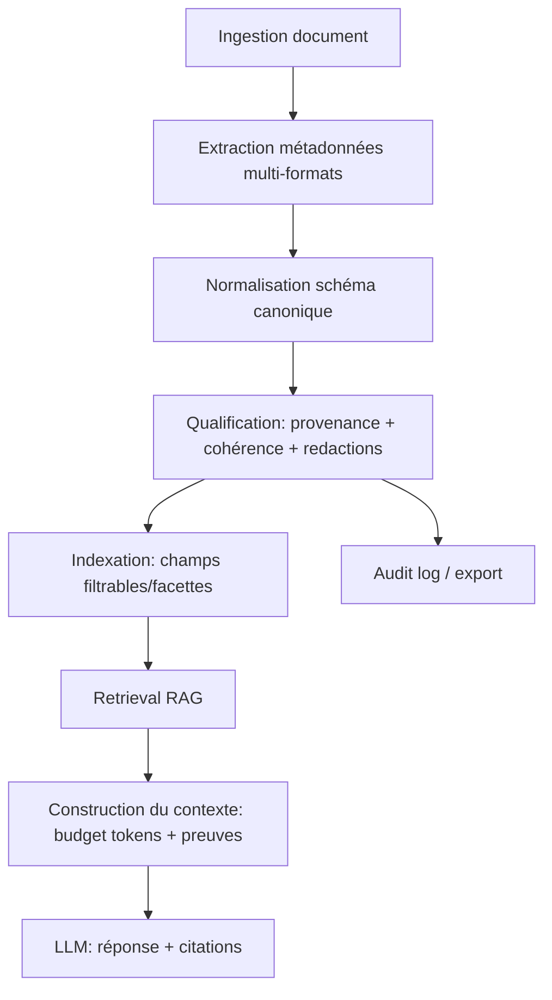
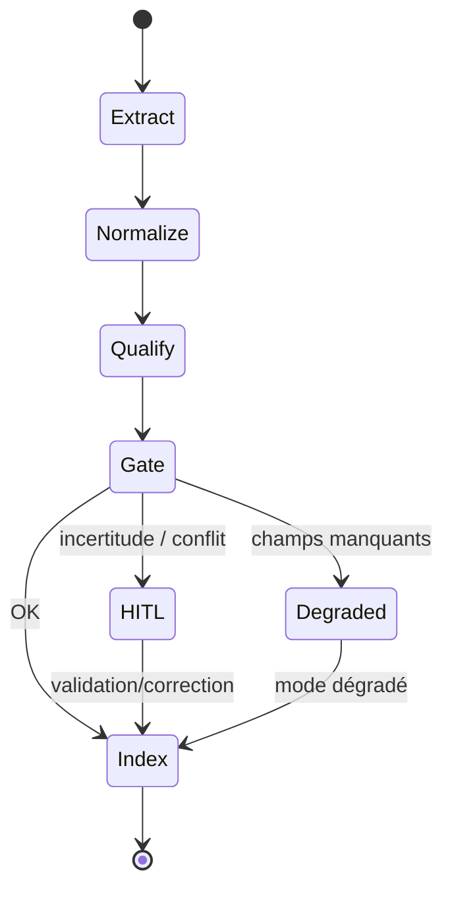

# 0) Titre

## Note de synthèse — *Document Metadata Management*

### Innovation : métadonnées exploitables pour pipelines RAG et de raisonnement (process + produit)

## 1) Résumé exécutif (10–15 lignes)

Dans des contextes industriels critiques (production IA, industrie régulée, documentation technique), les pipelines de **Retrieval‑Augmented Generation (RAG)** doivent retrouver des preuves fiables dans des corpus hétérogènes (PDF, bureautique, HTML, données structurées). Or, sans **métadonnées** (données décrivant les documents et leurs contenus), la récupération est moins pertinente, moins gouvernable, et plus coûteuse : filtrage impossible par langue/version, déduplication fragile, budgets de contexte mal maîtrisés, et auditabilité faible.

L’innovation **Document Metadata Management** consiste à produire des **métadonnées normalisées, traçables et directement exploitables** par les composants de RAG et de raisonnement : indexation, filtrage, récupération hybride, fusion/reclassement, construction du contexte, et routage auto/**HITL** (*Human‑In‑The‑Loop*)/**escalade**. Elle transforme l’extraction de métadonnées en un **processus industrialisable** : couverture multi‑formats, garde‑fous de qualité, et artefacts auditables.

La fiabilité en production est obtenue par : **barrières qualité (quality gates)** sur la complétude/cohérence, **routage (routing)** en cas de métadonnées incertaines, **supervision (monitoring)** de la dérive (drift) et des KPI, et **non‑régression** sur jeux de documents et schémas. L’innovation se distingue par l’usage des métadonnées comme **signal décisionnel** (pas seulement descriptif), y compris pour des pipelines multi‑couches de type HAH‑RAG.

Points d’innovation (mécanismes concrets et vérifiables) :

- extraction multi‑formats avec **schéma canonique** (métadonnées fichier + document + contenu) ;
- **métadonnées dérivées** utiles RAG (langue, structure, types, token_count, mots‑clés, statistiques) ;
- **exploitabilité** : filtres, facettes, routage, budgets de contexte, et preuve d’audit “quoi/ quand/ version” ;
- **mise sous contrôle** : qualité, confiance, provenance, et modes dégradés en cas d’ambiguïté.

## 2) Contexte et problème industriel

### Contexte

- **Données/process** : documents et données hétérogènes (PDF, DOCX, XLSX, PPTX, HTML/XML, CSV/JSON/YAML/TOML/INI), souvent versionnés et issus de chaînes d’édition multiples.
- **Volumétrie** : ingestion par lot, mises à jour fréquentes, coexistence de versions et d’archives.
- **Criticité** : décisions ou réponses à impact (sécurité, conformité, exploitation, maintenance), nécessitant preuves et traçabilité.

### Risques

- **Pertinence faible** : sans métadonnées exploitables, la récupération ne peut pas appliquer des contraintes simples (langue, date, version, type de document).
- **Coût** : sur‑récupération et contexte trop long (dépassement de fenêtre), ou sous‑récupération (zéro résultat).
- **Conformité & audit** : impossibilité d’établir “quelle version”, “quelle source”, “quelle date de mise à jour”.

### Exigences

- **Traçabilité** : provenance des métadonnées (source fichier vs extraction vs dérivation), horodatage.
- **Reproductibilité** : mêmes documents → mêmes métadonnées (à tolérance contrôlée).
- **Robustesse multi‑formats** : encodages, documents scannés, schémas variables, métadonnées manquantes ou erronées.
- **Délais** : extraction compatible ingestion à grande échelle.

## 3) Périmètre générique (ce que couvre / ne couvre pas)

### Entrées (minimales + optionnelles)

- **Minimales** : chemin/fichier, contenu (si extractible), extension/MIME.
- **Optionnelles** : politiques de confidentialité, profils (utilisateur final / administrateur audit), langue attendue, règles de version.

### Sorties attendues (artefacts livrables)

- **Document metadata** : schéma canonique (file‑level + doc‑level + content‑level).
- **Signals** : token_count, keywords, statistiques, schéma/colonnes/types pour données structurées.
- **Provenance** : source des champs (embedded vs extracted vs derived) + horodatage.
- **Exports** : JSON/CSV pour audit ; indexation sous forme de champs filtrables/facettes.

### Hypothèses

- Les métadonnées ne sont pas “vraies par défaut” : elles sont **qualifiées** (provenance, cohérence, confiance).

### Hors périmètre

- OCR/vision sur documents image‑only (peut être ajouté ultérieurement).
- Extraction sémantique profonde (NER/knowledge graph) : optionnelle et non requise pour le socle.

## 4) État de l’art et limites

Approches courantes :

- **Métadonnées système** (taille/date) : utiles mais insuffisantes pour RAG.
- **Métadonnées embarquées** (PDF/Office) : hétérogènes, parfois manquantes ou non fiables.
- **Tagging manuel** : coûteux et peu scalable.
- **Indexation texte seule** : ignore les signaux structurels (langue, schéma, version, format).

Évolutions récentes (sur lesquelles s’appuyer) :

- **Extraction “schema-driven” par LLM** : des travaux récents montrent qu’avec un schéma cible explicite, les LLM peuvent extraire des ensembles riches de métadonnées, avec des mécanismes de validation et des benchmarks dédiés (notamment sur des articles et corpus spécialisés).
- **Enrichissement métadonnées pour retrieval** : des frameworks “enterprise retrieval” utilisent des métadonnées (générées ou dérivées) pour améliorer la récupération (ex. gains mesurables sur précision/Hit@K par rapport à des approches texte‑seul).
- **Robustesse & réduction d’hallucinations en extraction** : des pipelines d’extraction d’information combinent extraction, alignement global, scoring/validation, et réduisent fortement les hallucinations, au prix d’une ingénierie de contrôle plus lourde.
- **Documents à mise en page riche** : l’extraction sur documents “layout-heavy” (tableaux, figures, PDF bruités) reste un sujet actif ; des approches optimisent les compromis chunking/contexte/coût pour préserver la fiabilité.
- **Interopérabilité des schémas** : les vocabulaires (Dublin Core, schema.org, DCAT/PROV) structurent la description et la provenance, mais doivent être adaptés au couplage RAG (chunks, budget tokens, filtres).

Limites :

- **Non actionnable** : pas de signaux pour router ou calibrer retrieval (budget de contexte, “zéro résultat”).
- **Non robustes** : variations de formats/encodages/schémas ; métadonnées incohérentes.
- **Non auditable** : absence de provenance et de versionning explicites.

Écart avec l’innovation proposée (ce que l’état de l’art couvre mal) :

- **Métadonnées comme signal décisionnel RAG** : la plupart des approches traitent les métadonnées comme descriptif (ou “feature” locale), mais pas comme un **mécanisme de contrôle** (barrières qualité, routage, modes dégradés, budgets de contexte).
- **Provenance et auditabilité opérationnelle** : peu de pipelines garantissent une provenance explicite (embedded/extracted/derived) et des artefacts audités “quoi/quelle version/quand”, utilisables en production.
- **Couverture multi‑formats + invariants** : la combinaison multi‑formats + normalisation canonique + dérivations contrôlées (tokens/keywords/schémas) et tests de non‑régression reste non triviale.
- **Gestion explicite des cas limites** : encodages atypiques, schémas évolutifs, documents scannés, fuite de PII dans keywords/extraits — rarement modélisés comme des cas de première classe avec routage/escalade.

Ces limites motivent une démarche R&D visant des métadonnées **exploitables** (ingénierie), **qualifiées** (qualité), et **industrialisation** (prod).

## 5) Verrous / incertitudes techniques (le cœur R&D)

- **V1 — Hétérogénéité des formats** : garantir un schéma canonique stable malgré des extracteurs très différents (PDF, Office, HTML, JSON…).
- **V2 — Qualité et confiance des champs** : distinguer embedded/extracted/derived et gérer les métadonnées erronées (ex. titres/keywords trompeurs).
- **V3 — Alignement “document ↔ chunks”** : propager correctement des métadonnées doc‑level vers des unités de retrieval (chunks) sans perdre la provenance.
- **V4 — Robustesse encodage/structure** : encodages non‑UTF8, fichiers partiels, schémas variables, données structurées hétérogènes.
- **V5 — Performance & scalabilité** : extraction enrichie (texte + stats + tokens + keywords) sans explosion de coût/latence.
- **V6 — Dérive (drift)** : évolution des formats et du corpus (nouvelles colonnes, nouveaux templates) sans casser les invariants.
- **V7 — Confidentialité** : éviter l’exposition de PII/secrets dans métadonnées dérivées (keywords, extraits).
- **V8 — Validation non‑régression** : détecter les changements silencieux d’extracteurs et d’inférences de schéma.

## 6) Solution proposée (architecture + principes)

### Principe central

**Extraire → normaliser → qualifier → indexer → exploiter** :
extraire des métadonnées multi‑formats, normaliser dans un schéma canonique, qualifier (provenance/cohérence), puis les exploiter comme signaux pour retrieval, routage et construction de contexte.

### Organisation des composants (rôles)

- **Extracteurs par format** : PDF, Office, OpenDocument, texte, markup, données structurées.
- **Schéma canonique** : types de métadonnées file/doc/content ; champs optionnels ; valeurs par défaut.
- **Dérivations contrôlées** : token_count (budget de contexte), keywords (TF‑IDF), schéma/colonnes/types.
- **Qualité & provenance** : origine des champs + horodatage ; barrières qualité.
- **Intégration RAG** : filtres/facettes, routage, budgets de contexte, explications auditables.

### Valeur ajoutée explicite pour RAG et HAH‑RAG

Dans un pipeline **RAG**, les métadonnées ne sont pas seulement stockées : elles sont **interrogées** (metadata retrieval) pour piloter *quelles sources* sont recherchées et *comment* le contexte est construit.

- **RAG (classique)** :
  - **Filtrage** : réduire l’espace de recherche par `language`, `doc_type`, `last_modified_time`, `schema_type`, `source` (si disponible).
  - **Facettes & diagnostics** : expliquer “pourquoi ces documents” (ex. “langue=fr, type=pdf, version>=2025”) et “pourquoi zéro résultat”.
  - **Budget de contexte** : utiliser `token_count` pour choisir/limiter des chunks et éviter dépassements de fenêtre.
- **HAH‑RAG (multi‑couches / hybride / asynchrone)** :
  - **Routage multi‑couches** : déclencher en parallèle plusieurs couches de retrieval (dense/sparse/structure) sur des sous‑corpus déterminés par métadonnées (ex. `schema_type=CSV` → couche “structured”).
  - **Fusion/reranking guidés** : intégrer des priors metadata (fraîcheur, version, langue, type) dans la fusion (RRF/heuristiques) et dans les seuils adaptatifs.
  - **Résilience** : si une couche renvoie 0 résultat, les métadonnées aident à *reformuler le filtre* (relaxation contrôlée) et à tracer le mécanisme (audit).

### Invariants / garde‑fous (inviolables)

- **Provenance obligatoire** pour les champs critiques (ex. version/date/langue quand utilisés en filtrage).
- **Dégradation contrôlée** : si incertitude, routage HITL ou mode dégradé explicite.
- **Séparation** : métadonnées non sensibles exposables vs internes (confidentialité).

### Sorties structurées (schéma logique)

- `file_metadata` : chemin, nom, extension, mime, permissions, taille, timestamps.
- `document_metadata` : titre/auteur/sujet/… quand disponible.
- `content_metadata` : token_count, keywords, stats, schéma (structured data).
- `provenance` : embedded/extracted/derived ; horodatage.

### Exemples d’artefacts (format indicatif)

```json
{
  "file_metadata": {
    "file_path": "...",
    "file_extension": ".pdf",
    "mime_type": "application/pdf",
    "size": 123456,
    "last_modified_time": "2026-01-14T10:15:22Z"
  },
  "document_metadata": {
    "title": "…",
    "author": "…",
    "language": "fr"
  },
  "content_metadata": {
    "num_pages": 42,
    "token_count": 18234,
    "extracted_keywords": ["…", "…"]
  },
  "provenance": {
    "title": "embedded",
    "token_count": "derived",
    "extracted_keywords": "derived"
  }
}
```

### Schéma end‑to‑end (flowchart)



### Boucle décisionnelle (state diagram)



## 7) Intégration production (fiabilité démontrable)

### Barrières qualité (seuils + règles)

- **Complétude** minimale par format (ex. `mime_type`, timestamps, encoding si text/structured).
- **Cohérence** : dates plausibles, tailles, valeurs de schéma non contradictoires.
- **Confidentialité** : redaction/filtrage sur champs dérivés exposables.

### Routage (auto / HITL / escalade)

- **Auto** : métadonnées cohérentes ; indexation complète.
- **HITL** : conflits (langue ambiguë, titre incohérent, schéma instable) ou périmètre critique.
- **Escalade** : extraction échoue de manière répétée (incident pipeline).

### Supervision (KPI, alertes de dérive)

- couverture des champs (taux de `title/author/language/token_count` par format),
- taux de schémas nouveaux (structured data) et évolution des colonnes,
- taux de documents “mode dégradé”,
- latence p95 extraction et coût par format.

### Gestion des cas limites (modes dégradés)

- **Document scanné** : métadonnées fichier only + routage vers OCR optionnel.
- **Encodage non détectable** : fallback + trace d’avertissement.
- **Schéma évolutif** : versionning des schémas et alertes drift.

## 8) Validation et preuves (méthodologie)

### Jeux d’évaluation

- corpus multi‑formats représentatif (avec versions, langues, documents “sales”),
- jeux “golden” avec vérité terrain sur un sous‑ensemble (titre/auteur/langue/version).

### Protocoles

- **Hold‑out** : évaluer robustesse sur formats non vus.
- **Non‑régression** : golden set ; comparaison champs + distributions.
- **Stress tests** : lots massifs, encodages atypiques, gros fichiers, schémas profonds.

### Mesures (KPI)

- **KPI‑E1 (Exactitude champs)** : précision/recall/F1 par champ (quand vérité terrain) : `title`, `author`, `language`, `doc_type`, `version/date`.
- **KPI‑C1 (Complétude)** : taux de présence des champs critiques par format (`token_count`, `language`, `schema_type`, `columns`, `num_pages`, etc.).
- **KPI‑S1 (Stabilité)** : variance et drift des champs dérivés (`token_count`, `extracted_keywords`, types de colonnes) à version corpus constante.
- **KPI‑R1 (Robustesse cas limites)** : taux de “mode dégradé” + taux d’échec extracteur + taux de fallback (ex. PDF) ; distribution des causes.
- **KPI‑P1 (Performance)** : latence p50/p95 par format, coût CPU/GPU (si applicable), débit (docs/min).
- **KPI‑D1 (Impact downstream retrieval)** : \(\Delta\)Recall@K / \(\Delta\)MRR via filtres metadata vs baseline texte‑seul ; \(\Delta\) taux “zéro résultat”.
- **KPI‑A1 (Auditabilité)** : taux de champs utilisés en filtrage/routing ayant une provenance explicite + timestamp + version extracteur.
- **KPI‑G1 (Gouvernance/risque)** : taux d’expositions bloquées (redaction) et faux positifs/negatifs de redaction sur champs dérivés (keywords/extraits).

### Critères d’acceptation (illustratifs)

- **Disponibilité extraction** : ≥ 99.5% extraction `file_metadata` sans erreur bloquante (sur corpus cible).
- **Couverture contexte** : ≥ 95% couverture `token_count` sur formats textuels/markup ; ≥ 90% sur PDF “text‑extractible”.
- **Robustesse** : taux d’échec extracteur (tous formats) ≤ 0.5% ; mode dégradé ≤ 5% (hors documents scannés identifiés).
- **Stabilité** : drift `token_count` (même document) ≤ 1% à extracteur inchangé ; top‑10 `extracted_keywords` stable ≥ 0.7 Jaccard (illustratif).
- **Impact retrieval** : réduction du taux “zéro résultat” de 20–40% vs baseline texte‑seul (à calibrer) ; amélioration Recall@K de +5 à +15 points (selon corpus).
- **Auditabilité** : 100% des champs utilisés en filtres/routing ont `provenance` + timestamp ; 100% des runs associent une version d’extracteur.

### Couverture des verrous (KPI ↔ V1–V8)

- **V1 (multi‑formats)** : KPI‑C1, KPI‑R1, KPI‑P1
- **V2 (qualité/confiance)** : KPI‑E1, KPI‑A1
- **V3 (doc ↔ chunks)** : KPI‑A1, KPI‑D1
- **V4 (encodage/structure)** : KPI‑R1, KPI‑C1
- **V5 (scalabilité)** : KPI‑P1
- **V6 (drift)** : KPI‑S1, KPI‑R1
- **V7 (confidentialité)** : KPI‑G1
- **V8 (non‑régression)** : KPI‑S1, KPI‑E1, KPI‑R1

## 9) Résultats attendus / ordres de grandeur

Illustratifs à calibrer.

- **Pertinence retrieval** : amélioration Recall@K via filtrage (langue/version/type/source) de **+5 à +15 points** selon corpus et bruit.
- **Réduction “zéro résultat”** : baisse relative de **20–40%** grâce à (i) filtres plus précis quand disponibles, (ii) fallback/routage quand métadonnées insuffisantes.
- **Maîtrise du coût de contexte** : réduction du contexte moyen de **10–30%** (tokens) via `token_count` + budgets + sélection dynamique (sans perte de qualité à seuil défini).
- **Moins d’incidents “mauvaise version”** : réduction de **50–80%** des réponses basées sur une version obsolète quand le corpus est versionné (via timestamps + provenance + filtres).

## 10) Livrables (produit & process)

### Produit

- **Service d’extraction multi‑formats + schéma canonique** : production des champs `file_metadata`, `document_metadata`, `content_metadata`, `provenance`.
- **Indexation “metadata‑aware”** : champs filtrables/facettes (langue, type, version/date, schéma, source) utilisables par le retriever.
- **Contrat “metadata retrieval” pour RAG** : capacité à interroger/joindre les métadonnées au moment du retrieval, ex. `filter = {language, doc_type, schema_type, date_range}` + retour des facettes pour diagnostics.
- **Exports auditables** : JSON/CSV (ou équivalent) incluant provenance + timestamps + version d’extracteur pour relecture/audit.

### Process

- barèmes de qualité (gates), routage HITL, supervision,
- protocoles de validation/non‑régression,
- gestion de dérive (formats/schémas).

## 11) Références (bibliographie/sitographie)

- [ISO/IEC 23894:2023 — *Artificial intelligence — Risk management*](https://www.iso.org/standard/77304.html) : cadre risque/production (attentes de contrôle).
- [NIST — *AI Risk Management Framework 1.0*](https://www.nist.gov/itl/ai-risk-management-framework) : gouvernance et traçabilité en production IA.
- [Lewis et al., 2020 — *RAG*](https://arxiv.org/abs/2005.11401) : fondations RAG.
- [Dublin Core Metadata Initiative — *Dublin Core*](https://www.dublincore.org/specifications/dublin-core/dces/) : vocabulaire de base de métadonnées documentaires.
- [schema.org — *CreativeWork*](https://schema.org/CreativeWork) : schéma générique de métadonnées pour contenus (titre, auteur, date…).
- [ISO 8601 — *Date and time format*](https://www.iso.org/iso-8601-date-and-time-format.html) : standard dates pour auditabilité.
- [W3C — *PROV Data Model*](https://www.w3.org/TR/prov-dm/) : standard de provenance (qui/quoi/comment) utile pour auditabilité des métadonnées.
- [W3C — *DCAT v3*](https://www.w3.org/TR/vocab-dcat-3/) : vocabulaire de catalogage (datasets/distributions) pour métadonnées interopérables.
- [MOLE (2025) — *Schema-driven metadata extraction with LLMs*](https://aclanthology.org/2025.findings-emnlp.655/) : extraction riche guidée par schéma + validation/benchmark.
- [Mishra et al., 2025 — *Systematic Framework for Enterprise Knowledge Retrieval*](https://arxiv.org/abs/2512.05411) : enrichissement métadonnées pour améliorer la récupération (gains Hit@K/précision).
- [SafePassage (2025)](https://arxiv.org/abs/2510.00276) : extraction + alignement/scoring pour réduire hallucinations et renforcer la fiabilité.
- [LayIE-LLM (2025)](https://arxiv.org/abs/2502.18179) : extraction sur documents à mise en page riche, optimisation coût/qualité.
- [Pre-Meta (2025)](https://academic.oup.com/bioinformatics/advance-article/doi/10.1093/bioinformatics/btaf519/8257680) : annotation/normalisation de métadonnées guidée par schéma et données auxiliaires (interopérabilité).

## 12) Conclusion

L’innovation **Document Metadata Management** transforme la métadonnée en **signal exploitable** pour les pipelines RAG et de raisonnement : filtrer, router, budgéter le contexte, et auditer les preuves utilisées. Elle répond aux verrous multi‑formats, qualité/confiance, et dérive, via un schéma canonique, des dérivations contrôlées (tokens/keywords/schémas), des barrières qualité, et une validation par non‑régression.

Ce socle est généralisable à tout pipeline RAG, et particulièrement pertinent pour des architectures multi‑couches (type HAH‑RAG) où la sélection de sources et la construction du contexte gagnent en pertinence et en robustesse grâce à des métadonnées qualifiées.
