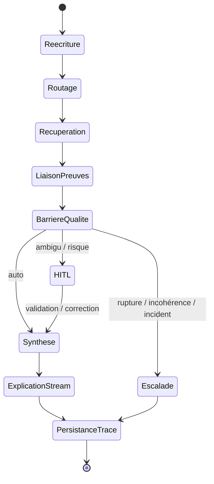

# 0) Titre
## Note de synthèse — *Intermediate Query Explanation*
### Innovation : explicabilité intermédiaire d’un pipeline RAG (process + produit)

## 1) Résumé exécutif (10–15 lignes)
Dans des contextes industriels critiques (production IA, industrie régulée, documentation technique), les systèmes de **Retrieval‑Augmented Generation (RAG)** — génération augmentée par recherche dans une base de connaissances — améliorent la factualité mais restent souvent **opaques** : l’utilisateur et l’auditeur ne voient pas comment la requête est interprétée, quels arbitrages de récupération sont faits, ni quelles preuves sont réellement mobilisées.

L’innovation **Intermediate Query Explanation** propose une **couche d’explicabilité** qui rend le pipeline RAG **observable en temps réel** (streaming) et **auditable a posteriori** (traces persistées), en exposant de manière contrôlée : la **réécriture de requête (query rewriting)**, le **chemin de récupération** (couches, scores, seuils), et les **preuves rattachées** (sources/chunks/citations) utilisées pour produire la réponse.

La fiabilité en production est obtenue par des mécanismes de contrôle : **barrières qualité (quality gates)** (seuils et règles), **routage (routing)** auto/**HITL** (*Human‑In‑The‑Loop*, arbitrage humain)/**escalade**, **supervision (monitoring)** (KPI et alertes de **dérive (drift)**), et **non‑régression** (tests et journaux d’exécution). L’explication est cadrée comme une **“system interpretation”** (décisions internes), et non comme une vérité absolue.

Points d’innovation (mécanismes concrets et vérifiables) :
- explicabilité **temps réel (streaming)** des étapes du pipeline (progression + décisions) ;
- découpage en **étapes explicables** (réécriture, routage, analyse, *embedding* (vectorisation), récupération, synthèse) ;
- **traçabilité post-hoc** (métadonnées persistées par session) ;
- **preuves rattachées** (sources/chunks/citations) ;
- **gouvernance par paramétrage** (visibilité selon profil/risque) ;
- **signaux décisionnels de récupération** (scores, seuils, adaptations en cas de “zéro résultat”) pour diagnostiquer et calibrer.

## 2) Contexte et problème industriel
### Contexte
- **Données/process** : bases documentaires hétérogènes (PDF, pages techniques, procédures, tickets, référentiels), souvent versionnées et structurées.
- **Volumétrie** : collections de taille variable (de milliers à millions de passages/chunks), mises à jour fréquentes.
- **Criticité** : décisions et contenus à impact (sécurité, conformité, maintenance, support), où l’erreur ou l’hallucination a un coût.

### Risques
- **Sécurité & conformité** : réponse incorrecte sans preuve traçable ; impossibilité de démontrer “ce qui a été consulté / utilisé”.
- **Réputation & coûts** : baisse de confiance, sur‑sollicitation du support, recalibrages empiriques non reproductibles.

### Exigences
- **Traçabilité** : logs/artefacts permettant audit et relecture.
- **Reproductibilité** : explications stables, comparables dans le temps.
- **Robustesse** : gestion des cas “zéro résultat”, timeouts, dérive des données.
- **Délais** : explicabilité en temps réel sans dégrader excessivement la latence.

## 3) Périmètre générique (ce que couvre / ne couvre pas)
### Entrées (minimales + optionnelles)
- **Minimales** : requête utilisateur, paramètres de récupération (top‑k, seuils), base de connaissances indexée.
- **Optionnelles** : contexte conversationnel, profils utilisateur (**utilisateur final** / **administrateur (audit)**), politiques de visibilité, contraintes (domaine, confidentialité).

### Sorties attendues (artefacts livrables)
- **Artefacts d’explication** : `original_query`, `rewritten_queries[]`, `decision_steps[]`, `retrieval_signals`, `evidence[]`.
- **Preuves** : sources/chunks citables (ID, extrait, score, métadonnées).
- **Traces post-hoc** : logs structurés exportables (JSON/CSV) et consultables par session.
- **Actions opérationnelles** : diagnostics (seuil trop strict, source manquante), déclenchement HITL, escalade.

### Hypothèses (contraintes d’exploitation)
- Les documents sont indexés (sparse/dense/hybride selon configuration).
- L’explication exposée est **contrôlée** (pas de divulgation de secrets, pas de “raisonnement brut” non maîtrisé).

### Hors périmètre (pour éviter les malentendus)
- Ne vise pas à prouver une “vérité” : l’explication décrit des **décisions internes**, pas une garantie épistémique.
- Ne remplace pas une politique de gouvernance/qualité : elle la rend **observable** et **auditable** (auditabilité opérationnelle).

## 4) État de l’art et limites
Approches courantes :
- **Affichage de sources** (citations) : utile mais insuffisant ; ne décrit pas le chemin de décision.
- **Logs techniques** : souvent internes (dev/ops), non lisibles par un utilisateur ou un auditeur.
- **Évaluation humaine** : coûteuse, non scalable, difficile à systématiser et à rejouer.

Évolutions récentes (sur lesquelles s’appuyer) :
- **Explicabilité post-hoc “boîte noire”** : des approches par **perturbations** évaluent l’impact de variations d’entrées / documents récupérés pour attribuer (a posteriori) les contributions des sources et la stabilité des réponses.
- **Cadres d’évaluation automatisée de pipelines RAG** : plusieurs travaux proposent des métriques et juges (LLM‑as‑judge / cross‑encoder) pour mesurer pertinence/fidélité et produire des recommandations actionnables sur les composants du pipeline (retrieval, rerank, génération).
- **Recherche sur la réécriture de requêtes** : l’usage de LLM et de stratégies multi‑réécritures progresse (règles de réécriture, multi‑query rewriting, feedback de reranker), principalement pour améliorer la récupération.
- **Contrôle de la récupération** : des travaux modélisent la décision d’itération/arrêt de récupération (*stop conditions*) pour optimiser coût/qualité.

Écart avec l’innovation proposée (ce que l’état de l’art couvre mal) :
- **Explicabilité “process” temps réel** : la plupart des approches produisent des évaluations ou explications **post-hoc** (ou des logs techniques), mais pas une explicabilité **streaming**, orientée utilisateur, synchronisée avec les décisions du pipeline.
- **Artefacts auditable(s) standardisés** : les travaux se focalisent sur des métriques/diagnostics ; ils couvrent moins la production d’artefacts homogènes et persistés (par session) permettant de répondre de façon systématique à “quoi a été consulté / utilisé, quand, et selon quel chemin décisionnel”.
- **Mise sous contrôle production** : barrières qualité, routage auto/HITL/escalade, supervision, non‑régression et gestion d’incidents sont souvent traités “autour” du pipeline, mais rarement intégrés au cœur d’un mécanisme d’explicabilité.
- **Gouvernance de la visibilité** : le besoin de niveaux d’explication (utilisateur final vs administrateur/audit) et de politiques de confidentialité n’est généralement pas modélisé comme un composant de première classe.

Limites :
- **Non actionnable** : impossible d’identifier précisément si l’échec vient du rewriting, du seuil, du reranking, des données.
- **Non auditable** : pas d’artefacts standardisés “quoi a été consulté / utilisé”.
- **Non industrialisable** : manque de barrières qualité, de routage, de supervision et de tests de non‑régression.

Ces limites motivent une démarche R&D visant une explicabilité **orientée décision**, **streaming**, **auditable** et compatible production.

## 5) Verrous / incertitudes techniques (le cœur R&D)
- **V1 — Fidélité de l’explication** : garantir que l’explication reflète réellement le pipeline (pas une rationalisation a posteriori).
- **V2 — Cadrage “system interpretation”** : éviter la confusion avec une “preuve de vérité” ; formaliser un vocabulaire stable.
- **V3 — Confidentialité** : exposer des traces utiles sans divulguer prompts internes, secrets, données sensibles.
- **V4 — Reproductibilité** : stabiliser les artefacts malgré la variabilité (modèles, données, paramètres).
- **V5 — Explicabilité temps réel** : streamer des étapes et signaux sans pénaliser excessivement la latence.
- **V6 — Qualité des preuves** : rattacher les citations/chunks de manière robuste et éviter les erreurs d’attribution.
- **V7 — Zéro résultat & dérive** : diagnostiquer (seuil trop strict, index incomplet, dérive) et dégrader gracieusement.
- **V7 — Zéro résultat & dérive** : diagnostiquer (seuil trop strict, index incomplet, dérive) et dégrader gracieusement.
- **V8 — Non‑régression** : éviter qu’une optimisation (rewriting/thresholding/reranking) dégrade silencieusement d’autres cas.

## 6) Solution proposée (architecture + principes)
### Principe central
**Réécrire/interpréter → rechercher (multi‑étapes) → sélectionner des preuves → synthétiser → expliquer (stream + audit) → router (auto/HITL/escalade)**.

### Organisation des composants (rôles)
- **Orchestrateur** : exécute le pipeline et produit `decision_steps[]`.
- **Réécriture de requête** : désambiguïse/expanse la requête (traçable et explicitée).
- **Récupération** : sparse/dense/hybride, fusion/reclassement (*reranking*), avec signaux (scores, seuils).
- **Liaison des preuves** : associe preuves (chunks) et réponse (citations).
- **Couche d’explicabilité** : transforme l’exécution en événements streaming + traces post-hoc.
- **Politique & routage** : applique règles de visibilité, barrières qualité et HITL.

### Invariants / garde‑fous (inviolables)
- **Confidentialité** : suppression/masquage d’informations sensibles dans les traces exposées.
- **Traçabilité** : chaque décision de récupération exposée a un identifiant et une horodatation.
- **Séparation utilisateur final / administrateur (audit)** : niveaux de détails distincts (paramétrables).

### Sorties structurées (schéma logique)
- `decision_steps[]` : étapes (réécriture, routage, analyse, *embedding*, récupération, *rerank*, synthèse…).
- `evidence[]` : preuves (doc/chunk id, extrait, score, métadonnées).
- `retrieval_signals` : top‑k, scores, seuils, adaptations, latences.
- `routing` : auto/HITL/escalade + raisons.
- `audit_log` : export JSON/CSV, consultable post-hoc.

### Exemples d’artefacts (format indicatif, auditables)
Ces exemples illustrent des sorties structurées **exploitables en UI** (utilisateur final / administrateur) et **exportables** (audit). Les champs exacts sont ajustables, l’objectif étant de garantir : identifiants, horodatage, raisons, preuves, et règles appliquées.

**Exemple A — `decision_steps[]` (étapes de décision)**

```json
{
  "decision_steps": [
    {
      "step_id": "step-001",
      "type": "query_rewrite",
      "status": "completed",
      "started_at": "2026-01-14T10:15:22Z",
      "duration_ms": 84,
      "summary": "Réécriture de requête pour désambiguïsation et expansion",
      "input": { "original_query": "..." },
      "output": { "rewritten_query": "...", "expansions": ["...", "..."] }
    },
    {
      "step_id": "step-003",
      "type": "retrieve",
      "status": "completed",
      "duration_ms": 210,
      "summary": "Récupération hybride + fusion + reclassement",
      "signals": {
        "top_k_requested": 5,
        "top_k_returned": 5,
        "similarity_threshold": 0.20,
        "threshold_adapted": false
      }
    }
  ]
}
```

**Exemple B — `evidence[]` (preuves rattachées)**

```json
{
  "evidence": [
    {
      "evidence_id": "ev-01",
      "document_id": "doc-123",
      "chunk_id": "chunk-456",
      "title": "Procédure de maintenance — Section 4",
      "excerpt": "… extrait court …",
      "relevance_score": 0.78,
      "metadata": { "version": "v3", "source_type": "pdf" }
    }
  ]
}
```

**Exemple C — `routing` (auto / HITL / escalade)**

```json
{
  "routing": {
    "decision": "HITL",
    "reasons": [
      { "type": "low_evidence_coverage", "detail": "Couverture insuffisante sur un point critique" },
      { "type": "conflicting_sources", "detail": "Deux preuves se contredisent" }
    ],
    "quality_gates": {
      "min_evidence_count": 2,
      "require_evidence_for_critical": true
    }
  }
}
```

**Exemple D — `audit_log` (export post-hoc)**

```json
{
  "audit_log": {
    "run_id": "run-789",
    "session_id": "sess-001",
    "started_at": "2026-01-14T10:15:22Z",
    "ended_at": "2026-01-14T10:15:28Z",
    "decision_steps_count": 8,
    "evidence_count": 4,
    "routing_decision": "auto",
    "exports": [
      { "type": "json", "uri": "audit/run-789.json" },
      { "type": "csv", "uri": "audit/run-789.csv" }
    ],
    "redactions_applied": ["pii_masking", "prompt_secret_removal"]
  }
}
```

### Schéma end‑to‑end (flowchart)

```mermaid
flowchart TD
  U[Utilisateur] --> Q0[Requête initiale]

  subgraph RW[Réécriture de requête (query rewriting)]
    Q0 --> Q1[Requête réécrite / désambiguïsée]
    Q1 --> Q2[Expansion / synonymes / contraintes]
  end

  subgraph IDX[Indexation (offline)]
    D[Documents] --> CH[Chunking]
    CH --> EMBD[Embedding documents]
    EMBD --> VDB[(Vecteur DB / index)]
  end

  Q2 --> QE[Embedding requête]

  subgraph HAH[HAH-RAG : récupération (online)]
    direction TB
    QE --> L1[Couche I : récupération coarse (sparse+dense)]
    QE --> L2[Couche II : récupération medium (hybride)]
    QE --> L3[Couche III : récupération fine (spécialisée)]

    L1 --> AS1[Async VDB calls]
    L2 --> AS2[Async VDB calls]
    L3 --> AS3[Async VDB calls]

    AS1 --> M[Fusion + merge candidats]
    AS2 --> M
    AS3 --> M
    M --> RR[Reranking / filtrage]
    RR --> CTX[Contexte final (chunks uniques)]
  end

  CTX --> LLM[LLM : génération de réponse]
  LLM --> A[Réponse]

  subgraph EXP[Intermediate Query Explanation (explicability layer)]
    direction TB
    E1[Trace réécriture\n(Q0→Q1→Q2)]:::exp
    E2[Trace récupération\n(couches, latence, top-k, scores)]:::exp
    E3[Trace fusion/rerank\n(changements de rang)]:::exp
    E4[Preuves utilisées\n(doc/chunk IDs + extraits)]:::exp
  end

  Q0 -.-> E1
  Q2 -.-> E1
  L1 -.-> E2
  L2 -.-> E2
  L3 -.-> E2
  M -.-> E3
  RR -.-> E3
  CTX -.-> E4
  A -.-> E4

  EXP --> UI[UI : vue utilisateur final + vue administrateur/audit]

  classDef exp fill:#eef6ff,stroke:#3b82f6,color:#0f172a;
```

### Boucle décisionnelle (state diagram)



## 7) Intégration production (fiabilité démontrable)
### Barrières qualité (seuils + règles)
- Seuils configurables : top‑k minimum utile, seuils de similarité, couverture minimale, règles de citations.
- Règles de cohérence : “zéro preuve” interdit sur certains types de réponses ; dégradation contrôlée sinon.

### Routage (auto / HITL / escalade)
- **Auto** : preuves suffisantes et cohérentes ; explication complète exposée.
- **HITL** : ambiguïtés (conflits de sources, faible confiance, variations terminologiques critiques).
- **Escalade** : timeouts, index indisponible, incohérences détectées, suspicion de rupture (incident).

### Supervision (KPI, alertes de dérive)
Exemples de KPI (à instrumenter) :
- latence par étape (réécriture / récupération / *rerank* / synthèse) ;
- taux “zéro résultat” et taux d’adaptation de seuil ;
- taux de HITL et causes principales ;
- proportion de réponses avec preuves rattachées.

### Boucle de feedback
Les validations HITL (accept/reject/correction) alimentent :
- recalibration des seuils (barrières qualité) ;
- règles de réécriture et de routage ;
- jeux de non‑régression (cas récurrents).

### Gestion d’incident
En cas de rupture (timeouts, données invalides, index indisponible) :
- journalisation d’un événement “incident” ;
- bascule en mode dégradé (réponse limitée + explication des limites) ;
- escalade si criticité élevée.

### Gestion des cas limites (modes dégradés) — détection → action → trace
L’objectif n’est pas de “masquer” les limites, mais de les **rendre explicites** et **auditables** : chaque cas limite déclenche une décision de **routage** (auto/HITL/escalade), une action de **dégradation contrôlée** si nécessaire, et la production d’artefacts (`decision_steps[]`, `routing`, `audit_log`) exploitables en supervision et audit.

| Cas limite (exemples) | Détection (signaux) | Action (barrières qualité + routage) | Trace produite (artefacts) |
| --- | --- | --- | --- |
| **Zéro résultat** | `top_k_returned = 0`, scores < seuil | mode dégradé : explication des causes probables + propositions de reformulation ; option : adaptation contrôlée de seuil si autorisée ; escalade si périmètre critique | `decision_steps[]` inclut raison “zero_result”; `routing.decision`; `retrieval_signals` (seuil, adaptation) |
| **Preuves insuffisantes** | `evidence_count < min_evidence_count` | blocage ou réponse limitée ; HITL si criticité ; sinon guidance utilisateur (demander précision) | `routing.reasons=[low_evidence_coverage]`; `audit_log` (gate déclenché) |
| **Sources contradictoires** | conflit entre preuves (règles/heuristiques) | HITL (arbitrage) ou réponse explicitement nuancée + mention du conflit (si autorisé) | `routing.reasons=[conflicting_sources]`; `evidence[]` marquées “conflict_group” |
| **Dérive (drift) / baisse de qualité** | hausse “zéro résultat”, baisse Recall@K, dérive distributions scores | activation mode “surveillance renforcée” : hausse HITL sur segments à risque ; ajustement de seuils via boucle de feedback | alertes supervision + `audit_log` (tag “drift_alert”) |
| **Index indisponible / timeout** | erreurs retrieval, latence p95 > budget | mode dégradé : réponse bornée + explication ; escalade si criticité | `audit_log` (incident_type, timestamps) + `routing.decision=escalade` |
| **Confidentialité (redaction échoue)** | détection de fuite (PII/secret) ou redaction non appliquée | blocage réponse / escalade ; purge des traces exposées ; HITL sécurité si nécessaire | `audit_log.redactions_applied` + event “redaction_failure” ; aucune trace sensible exposée |
| **Ambiguïté forte de la requête** | rewriting multiple / faible stabilité / low confidence | HITL ou guidage utilisateur (question de clarification) avant synthèse | `decision_steps[]` (clarification_needed) + `routing.decision` |

## 8) Validation et preuves (méthodologie)
### Jeux d’évaluation (représentativité)
- corpus multi‑domaines (documents techniques, procédures, FAQ, tickets),
- cas “normaux” + cas adverses (ambiguïtés, requêtes courtes, synonymes, “zéro résultat”).

### Protocoles
- **Hold‑out** : évaluer sur un ensemble non vu lors du calibrage.
- **Non‑régression** : rejouer un corpus fixe à chaque changement (réécriture, seuils, récupérateurs, politiques de visibilité).
- **Stress tests** : volumétrie, latence, dégradation (index partiel, timeouts).

### Mesures (KPI) — définitions opérationnelles
*(KPI illustratifs à calibrer selon domaine, criticité et budget de latence.)*
- **KPI‑1 — Taux de preuves rattachées** : \(\frac{\# réponses\_avec\_evidence \ge 1}{\# réponses}\) (hors modes dégradés explicités).
- **KPI‑2 — Complétude des étapes explicables** : \(\frac{\# exécutions\_avec\_decision\_steps\_complets}{\# exécutions}\) (toutes les étapes réellement exécutées doivent être traçées, avec `step_id`, `type`, `status`, `duration_ms`).
- **KPI‑3 — Intégrité des traces (fidélité)** : taux de passages des contrôles de cohérence “trace ↔ exécution” (ex. étape déclarée `completed` ⇒ métriques présentes ; `routing.decision` cohérente avec les règles de barrières qualité).
- **KPI‑4 — Qualité de récupération** : métriques IR sur un jeu étiqueté (ex. Recall@K / MRR) + taux “zéro résultat”.
- **KPI‑5 — Stabilité post-hoc** : à conditions identiques (même corpus/paramètres), stabilité des sorties (ex. overlap des `evidence_id`/`chunk_id` et stabilité de l’ordre des `decision_steps.type`).
- **KPI‑6 — Latence explicabilité** : overhead p95 ajouté par la couche d’explicabilité (génération/serialisation/persistance des artefacts) et **temps‑au‑premier‑événement** (TTFE) en streaming.
- **KPI‑7 — Taux HITL & causes** : \(\frac{\# HITL}{\# exécutions}\) et distribution des raisons (ex. “conflicting_sources”, “low_evidence_coverage”).
- **KPI‑8 — Confidentialité** : nombre d’incidents de fuite (ex. PII/secret) dans les traces exposées, + taux de redactions appliquées.

### Critères d’acceptation (illustratifs, à calibrer)
- **Preuves** : ≥ **95%** des réponses “production” accompagnées d’au moins 1 preuve rattachée (hors mode dégradé) ; ≥ **99%** sur périmètre critique après stabilisation.
- **Complétude** : ≥ **99%** des exécutions avec `decision_steps[]` complets (étapes exécutées traçées) ; aucune étape “fantôme” (tracée mais non exécutée).
- **Intégrité** : ≥ **99.5%** de checks de cohérence “trace ↔ exécution” réussis sur corpus de non‑régression.
- **Latence** : overhead p95 de la couche d’explicabilité ≤ **150 ms** *ou* ≤ **5%** de la latence end‑to‑end (selon budget choisi) ; TTFE p95 ≤ **300 ms**.
- **Zéro résultat** : baisse du taux “zéro résultat” après calibrage (ordre de grandeur illustratif) et **justification systématique** en cas de “zéro résultat” (raison explicitée dans `decision_steps[]`/`routing`).
- **Confidentialité** : **0** incident de fuite d’information sensible dans les traces exposées (sur jeux de tests + audits réguliers).

### Lien KPI ↔ verrous (traçabilité de la démarche R&D)
| Verrou | Ce qu’on cherche à garantir | KPI principal |
| --- | --- | --- |
| V1 — Fidélité | explication conforme à l’exécution | KPI‑3 (intégrité) |
| V2 — Cadrage | vocabulaire stable, “system interpretation” | KPI‑2 (complétude) + audits qualitatifs |
| V3 — Confidentialité | aucune fuite dans traces exposées | KPI‑8 |
| V4 — Reproductibilité | résultats comparables dans le temps | KPI‑5 |
| V5 — Streaming | explicabilité temps réel sans surcharge excessive | KPI‑6 |
| V6 — Qualité des preuves | preuves rattachées fiables et suffisantes | KPI‑1 + KPI‑4 |
| V7 — Zéro résultat & dérive | diagnostic et dégradation contrôlée | KPI‑4 + KPI‑6 |
| V8 — Non‑régression | pas de dégradation silencieuse | KPI‑3 + campagnes non‑régression |

## 9) Résultats attendus / ordres de grandeur
*(Ordres de grandeur illustratifs à calibrer selon domaine et criticité.)*
- **Réduction du temps de diagnostic** (support/ops) : \(-30\%\) à \(-60\%\) grâce à la visibilité sur rewriting, seuils, preuves.
- **Baisse du taux “zéro résultat”** : via adaptation contrôlée et feedback (ex. \(-10\%\) à \(-25\%\)).
- **Réduction du taux de réponses sans preuve** : objectif “quasi‑zéro” sur périmètre critique via barrières qualité.

### Tableau Pareto (illustratif) — causes principales d’échec / priorisation
| Cause dominante | Signal observable | Action prioritaire |
| --- | --- | --- |
| Seuil trop strict | scores faibles, “zéro résultat” | recalibrage / adaptation contrôlée |
| Rewriting trompeur | divergence requête vs intention | règles de réécriture + HITL |
| Données manquantes | preuves absentes | ingestion/qualité corpus |
| Reranking faible | preuves peu pertinentes | tuning rerank/fusion |
| Incident technique | timeouts/index indispo | mode dégradé + escalade |

## 10) Livrables (produit & process)
### Produit
- API/flux d’événements d’explicabilité (streaming) ;
- schémas d’artefacts (`decision_steps[]`, `evidence[]`, `routing`, `audit_log`) ;
- exports (JSON/CSV) pour audit et relecture post-hoc.

### Process
- règles de barrières qualité et routage (auto/HITL/escalade),
- règles de visibilité (profils/risque),
- protocole de validation (hold‑out, non‑régression, stress tests) + tableaux de bord.

## 11) Références (bibliographie/sitographie)
- [Lewis et al., 2020 — *Retrieval‑Augmented Generation for Knowledge‑Intensive NLP Tasks*](https://arxiv.org/abs/2005.11401) : fondations RAG (retrieve‑then‑generate).
- [Karpukhin et al., 2020 — *Dense Passage Retrieval*](https://arxiv.org/abs/2004.04906) : base dense retrieval.
- [Robertson et al., 2009 — *Okapi BM25*](https://en.wikipedia.org/wiki/Okapi_BM25) : base sparse retrieval (référence pratique).
- [Cormack et al., 2009 — *Reciprocal Rank Fusion*](https://dl.acm.org/doi/10.1145/1571941.1572114) : fusion de classements (hybride).
- [NIST — *AI Risk Management Framework 1.0*](https://www.nist.gov/itl/ai-risk-management-framework) : cadrage gouvernance, traçabilité, contrôle du risque.
- [ISO/IEC 23894:2023 — *Artificial intelligence — Risk management*](https://www.iso.org/standard/77304.html) : référence risque/production (attentes de contrôle).
- [ISO/IEC 42001:2023 — *AI management system*](https://www.iso.org/intelligence-artificielle/systeme-de-management-ia) : cadre de gouvernance opérationnelle (processus, contrôle, amélioration continue).
- [OpenTelemetry — *Semantic Conventions*](https://opentelemetry.io/docs/specs/semconv/) : standardisation du tracing (attributs/événements) utile pour une auditabilité outillée.
- [RAGAS — *Retrieval-Augmented Generation Assessment*](https://github.com/explodinggradients/ragas) : outillage d’évaluation RAG (métriques, tests) pour validation et non‑régression.
- [ARES — *Automated RAG Evaluation System*](https://arxiv.org/abs/2311.09476) : évaluation automatisée RAG (pertinence du contexte, fidélité, utilité).
- [VERA — *Validation and Evaluation of Retrieval‑Augmented Systems*](https://arxiv.org/abs/2409.03759) : cadre d’évaluation multi‑métriques (incluant des juges de type cross‑encoder).
- [RAGXplain — *From Explainable Evaluation to Actionable Guidance for RAG*](https://arxiv.org/abs/2505.13538) : transforme des évaluations RAG en recommandations d’amélioration actionnables.
- [Explicabilité par perturbations pour les systèmes RAG (atelier DIAG‑LLM 2025)](https://aclanthology.org/2025.jeptalnrecital-diagllm.1/) : attribution post-hoc des sources via perturbations (stabilité/explications).
- [GenRewrite — *Query Rewriting via Large Language Models*](https://arxiv.org/abs/2403.09060) : réécriture de requêtes par LLM (règles en langage naturel, itérations).
- [RaFe — *Ranking Feedback improves Query Rewriting for RAG*](https://arxiv.org/abs/2405.14431) : entraînement de réécriture via feedback de reranker (sans annotations).

## 12) Conclusion
L’innovation **Intermediate Query Explanation** rend un pipeline RAG **observable** et **auditable** (auditabilité opérationnelle) en exposant, de manière contrôlée, la chaîne de décision : **réécriture/interprétation → récupération multi‑étapes → preuves rattachées → synthèse**, en **streaming** et en **post-hoc**.

En production, cette explicabilité est mise sous contrôle par : (i) des **barrières qualité** (seuils/règles), (ii) un **routage** auto/**HITL**/**escalade**, (iii) une **supervision** basée sur des KPI (dont dérive, “zéro résultat”, latences, couverture de preuves), et (iv) une **gestion des cas limites** via modes dégradés explicités et traçés.

Les artefacts (`decision_steps[]`, `evidence[]`, `routing`, `audit_log`) permettent d’auditer systématiquement “quoi a été consulté / utilisé, quand, et selon quel chemin décisionnel”, et de valider la solution par **hold‑out**, **non‑régression** et **stress tests**. Les points d’innovation clés restent : explicabilité temps réel, découpage en étapes explicables, preuves rattachées, traçabilité persistée, gouvernance par paramétrage et signaux décisionnels actionnables.
