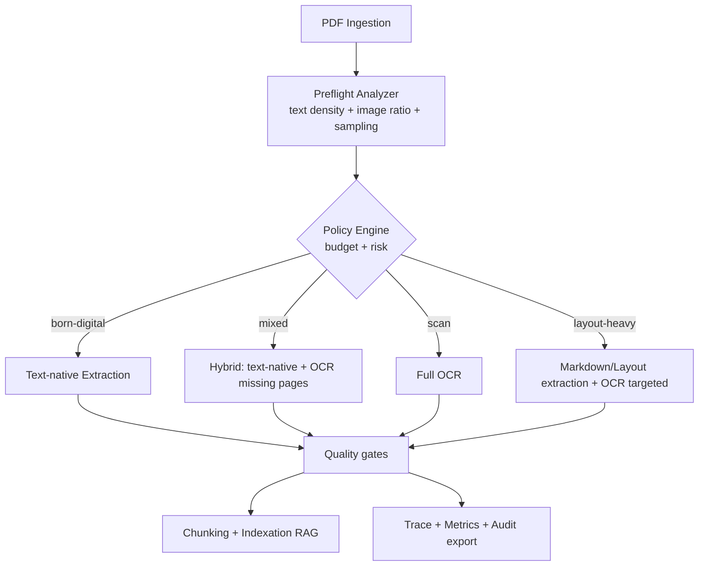
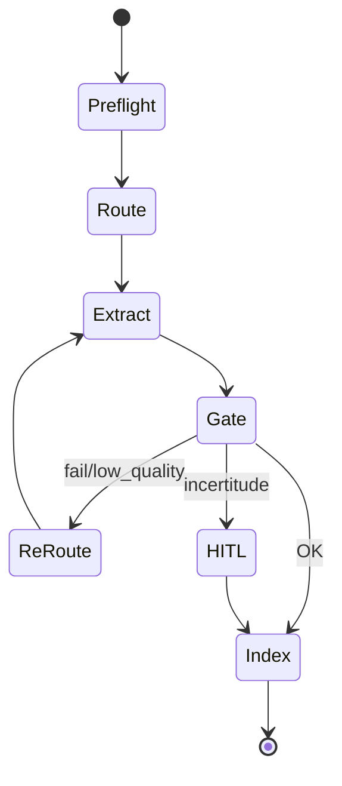

# 0) Titre

## Note de synthèse — *Smart PDF Ingestion*

### Innovation : déclenchement intelligent OCR / extraction texte (process + produit)

## 1) Résumé exécutif (10–15 lignes)

Dans des environnements industriels où l’on ingère des volumes importants de documents PDF pour alimenter des systèmes **Retrieval‑Augmented Generation (RAG)**, le coût et la latence de traitement à l’ingestion deviennent rapidement structurants. Or, l’**OCR** (*Optical Character Recognition*) est un traitement “lourd” : il consomme du CPU/GPU, ajoute de la latence, et peut introduire du bruit sémantique (erreurs OCR) qui dégrade retrieval et génération.

L’innovation **Smart PDF Ingestion** vise à **adapter automatiquement** la méthode d’extraction au contenu réel du document : si le PDF est “born‑digital” (texte natif exploitable), on **évite l’OCR** (“bazooka pour tuer la mouche”) ; si le PDF est scanné ou partiellement image‑only, on déclenche un **OCR ciblé** (page‑par‑page, voire zone‑par‑zone), avec des garde‑fous de qualité, des modes dégradés et une traçabilité exploitable.

En production, la fiabilité est assurée par des **quality gates** (seuils de détection et de confiance), du **routing** auto/**HITL**/**escalade** lorsque l’incertitude est élevée, un **monitoring** de KPI (latence, coût, taux OCR évité, qualité texte), et des tests de **non‑régression** sur corpus mixtes. L’innovation est particulièrement pertinente pour des architectures multi‑couches de type **HAH‑RAG** (recherche hybride asynchrone) où la réduction de coût/latence d’ingestion et la qualité du texte conditionnent la performance globale.

## 2) Contexte et problème industriel

### Contexte

- **Données/process** : PDF “born‑digital”, PDF scannés, PDF mixtes (certaines pages ont du texte natif, d’autres non), documents à mise en page riche (tableaux, colonnes, figures).
- **Volumétrie** : ingestion par lots, actualisations fréquentes, contraintes de SLA (mise à disposition rapide).
- **Criticité** : documentation technique / production IA, avec attentes de robustesse, auditabilité et maîtrise des coûts.

### Risques

- **Sur‑traitement** : OCR systématique → surcoût (temps, ressources, énergie) et goulots d’étranglement à l’ingestion.
- **Sous‑traitement** : ne pas OCR quand nécessaire → trous de couverture (zéro contexte sur pages scannées), baisse de recall.
- **Qualité RAG** : erreurs OCR → embeddings bruités → retrieval moins pertinent → réponses moins fiables.

### Exigences

- **Robustesse** multi‑formats et multi‑qualité (PDF corrompus, encodages, langues).
- **Traçabilité** : expliquer/relire les décisions “OCR ou non”, par page, avec paramètres et versions.
- **Performance** : latence/throughput compatibles avec l’ingestion industrielle.

## 3) Périmètre générique (ce que couvre / ne couvre pas)

### Entrées (minimales + optionnelles)

- **Minimales** : fichier PDF (chemin/binaire), contraintes de budget (latence max, coût max), langues attendues (optionnel).
- **Optionnelles** : profil de risque (ex. production régulée), politique HITL, seuils et priorités (qualité vs coût).

### Sorties attendues (artefacts livrables)

- **Texte extrait** (texte natif, OCR, ou hybride) + structure minimale (pages/sections si disponible).
- **Journal de décision** : décisions par document et par page (méthode, seuils, raisons, timing, erreurs).
- **Métriques** : temps, coût estimé, taux d’OCR évité, indicateurs de qualité.

### Hypothèses

- L’OCR est une capacité “coûteuse” à utiliser **sous contrôle** (budget, seuils, routing).

### Hors périmètre

- OCR parfait sur cas extrêmes (manuscrits très dégradés) : non objectif du socle.
- Extraction sémantique profonde (NER/knowledge graph) : optionnelle, non requise pour décider OCR.

## 4) État de l’art et limites

Approches “classiques” :

- **Extraction texte** (pdfplumber/PyPDF2/PyMuPDF) : très efficace sur born‑digital, limitée sur scan/image‑only.
- **OCR systématique** (Tesseract / services cloud / suites propriétaires) : couverture large mais coût/latence élevés.
- **OCR de “PDF searchable”** (ajout d’une couche texte) : utile pour recherche, mais ne règle pas le tri “OCR nécessaire vs inutile”.
- **Layout analysis** (détection de tables/colonnes) : utile pour pages complexes, mais ajoute un coût si activée partout.

Limites :

- **Décision binaire trop grossière** (document‑level) : les PDF mixtes nécessitent une granularité page‑level.
- **Trade‑off non piloté** : peu de contrôle explicite coût/qualité (budget) et de routage en cas d’incertitude.
- **Impact downstream sous‑estimé** : des travaux récents montrent que l’OCR peut dégrader les performances RAG (bruit) si appliqué inutilement.

Ces limites motivent une démarche R&D visant une stratégie **adaptative, mesurable et industrialisable**.

## 5) Verrous / incertitudes techniques (le cœur R&D)

- **V1 — Détection fiable born‑digital vs scan** : “présence de texte” ne suffit pas (polices exotiques, encodage, texte caché, faibles densités).
- **V2 — Documents mixtes** : décider page‑par‑page sans explosion de latence/mémoire ; assembler un texte cohérent.
- **V3 — Pilotage coût ↔ qualité** : modéliser et optimiser le gain marginal de l’OCR vs son coût (budget‑aware).
- **V4 — Mise en page riche** : tables/colonnes/figures ; déterminer quand un pipeline “markdown/layout” est préférable à OCR brut.
- **V5 — Multi‑langues et paramètres OCR** : choix langues/PSM/DPI adaptatifs ; éviter la dégradation sur langues inattendues.
- **V6 — Robustesse opérationnelle** : timeouts, PDF corrompus/cryptés, pages très lourdes, gestion mémoire.
- **V7 — Traçabilité et gouvernance** : produire des traces auditables (décision, seuils, version extracteur/OCR) sans fuite de données sensibles.
- **V8 — Non‑régression** : éviter les régressions silencieuses (changement d’heuristiques, versions OCR, bibliothèques PDF).

## 6) Solution proposée (architecture + principes)

### Principe central

**Pré‑diagnostiquer → router → extraire → vérifier → tracer** : analyser rapidement le PDF pour estimer sa nature et son coût, router vers une stratégie d’extraction, appliquer OCR uniquement quand nécessaire (granularité page/zone), vérifier la qualité minimale, et produire des artefacts de traçabilité.

### Organisation des composants (rôles)

- **PDF Preflight Analyzer** : extraction texte rapide + métriques (densité texte, pages vides, ratio image/texte, présence de fontes).
- **Policy Engine (budget‑aware)** : applique règles/seuils (latence max, % pages OCR max, profil de risque).
- **Extractor Router** :
  - **Text‑native path** (born‑digital) : extraction texte rapide.
  - **Hybrid path** (mixte) : extraction texte natif + OCR uniquement sur pages sans texte.
  - **Full OCR path** (scan) : OCR complet (avec paramètres adaptés).
  - **Layout/Markdown path** (page complexe) : extraction structure + tables/images, OCR ciblé si besoin.
- **Quality Gates** : contrôles (texte non vide, taux caractères valides, confiance OCR, WER/CER approximés si gold).
- **Trace & Metrics** : journal de décision + métriques techniques (latence, coût estimé, fallback).

### Invariants / garde‑fous (inviolables)

- **Ne jamais OCR “par défaut”** : OCR déclenché seulement si la décision le justifie (sauf configuration explicite).
- **Décision explicable** : toute activation OCR doit produire un motif (règle + métriques + seuil).
- **Dégradation contrôlée** : si incertitude élevée → HITL ou mode dégradé (indexer ce qui est disponible + alerte).

### Sorties structurées (exemple indicatif)

```json
{
  "ingestion_trace": {
    "document_id": "…",
    "decision": "hybrid_ocr",
    "budget": {"latency_ms_max": 15000, "ocr_pages_max_ratio": 0.4},
    "page_decisions": [
      {"page": 1, "method": "text_native", "text_chars": 3200},
      {"page": 2, "method": "ocr", "reason": "no_text_layer", "dpi": 150, "langs": ["fra","eng"]}
    ],
    "quality_gates": {"min_chars": 200, "min_text_pages_ratio": 0.6},
    "metrics": {"latency_ms": 8200, "ocr_pages": 3, "ocr_avoided_pages": 27},
    "fallbacks": [{"from": "markdown", "to": "hybrid_ocr", "error": "timeout"}]
  }
}
```

### Schéma end‑to‑end (flowchart)



### Boucle décisionnelle (state diagram)



## 7) Intégration production (fiabilité démontrable)

### Quality gates (seuils + règles)

- **Seuils de texte** : ratio de pages avec texte natif > X ; sinon basculer en hybrid/OCR.
- **Seuils OCR** : pages OCR ≤ Y% (budget‑aware) ; sinon escalade ou traitement différé.
- **Validité** : détection PDF chiffré/corrompu → routage incident.

### Routing (auto / HITL / escalade)

- **Auto** : born‑digital ou hybrid stable ; métriques OK.
- **HITL** : documents critiques avec incertitude (langue inconnue, faible confiance OCR).
- **Escalade** : timeouts répétés, erreurs de parsing/OCR, documents systématiquement non traitables.

### Monitoring (KPI, drift, santé)

- p50/p95 latence ingestion (par type de route),
- taux OCR évité (pages et documents),
- taux documents mixtes, taux fallback, taux incidents,
- qualité texte (proxy) : densité, caractères invalides, score OCR/confidence,
- impact downstream (sur échantillons) : Recall@K / taux “zéro résultat”.

### Gestion d’incident (modes dégradés)

- **Timeout** : relâcher la stratégie (hybrid → text‑only) + tag “incomplet”.
- **OCR indisponible** : indexer texte natif + alerte ; reprocessing asynchrone.
- **PDF corrompu/chiffré** : quarantine + workflow de remédiation.

## 8) Validation et preuves (méthodologie)

### Jeux d’évaluation

- corpus représentatif : born‑digital / scans / mixtes / layout‑heavy (multilingue),
- sous‑ensemble “gold” (vérité terrain) pour CER/WER et qualité structure.

### Protocoles

- **Hold‑out** par type de PDF,
- **Non‑régression** : golden set + distributions (latence, taux OCR, qualité),
- **Stress tests** : PDFs très longs, basse résolution, tableaux, multi‑langues.

### Mesures (KPI)

- **KPI‑D1** : erreur de décision (faux OCR déclenchés, faux OCR manqués) au niveau page/document.
- **KPI‑L1** : latence p50/p95 ingestion (ms) par route.
- **KPI‑C1** : coût OCR (pages OCR / doc) + coût CPU/GPU estimé.
- **KPI‑Q1** : qualité texte (CER/WER sur gold ; proxies sinon).
- **KPI‑R1** : impact retrieval : \(\Delta\)Recall@K / \(\Delta\)MRR et taux “zéro résultat” vs baseline.

### Critères d’acceptation (illustratifs)

- OCR évité sur **50–80%** des pages born‑digital (selon corpus) sans perte de recall mesurable.
- Réduction latence ingestion de **30–60%** vs OCR systématique sur corpus mixte.
- Taux d’erreur de décision (page‑level) ≤ **5%** après calibration (à ajuster par risque).

## 9) Résultats attendus / ordres de grandeur

Illustratifs à calibrer.

- **Coûts** : baisse du coût OCR global de **30–50%** sur corpus mixte.
- **Latence** : réduction p95 ingestion par document de **30–60%** si OCR n’est plus systématique.
- **Qualité RAG** : baisse du bruit OCR → amélioration de la pertinence retrieval sur certains cas (ordre de **+3 à +10 points** Recall@K) ou maintien avec coût réduit.

## 10) Livrables (produit & process)

### Produit

- module **Preflight + Router** (smart trigger) avec règles/seuils paramétrables,
- pipeline **hybrid page‑level** (texte natif + OCR ciblé),
- **traces structurées** (décisions, métriques, paramètres OCR) + exports auditables,
- outillage de **monitoring** et tableaux de bord (latence/coût/qualité).

### Process

- protocole de calibration des seuils (budget ↔ qualité),
- jeux d’évaluation + non‑régression,
- runbook incident (OCR down, timeouts, PDFs non traitables),
- gouvernance (profils/risque : quand activer HITL).

## 11) Références (bibliographie/sitographie)

- [ISO/IEC 23894:2023 — *Artificial intelligence — Risk management*](https://www.iso.org/standard/77304.html) : cadre de contrôle risque/production.
- [NIST — *AI Risk Management Framework 1.0*](https://www.nist.gov/itl/ai-risk-management-framework) : gouvernance et traçabilité.
- [Tesseract OCR](https://github.com/tesseract-ocr/tesseract) : OCR open‑source (référence de base).
- [PyMuPDF](https://pymupdf.readthedocs.io/) : extraction texte et rendu page (support page‑level).
- [pdfplumber](https://github.com/jsvine/pdfplumber) : extraction texte/table sur PDF born‑digital.
- [OCRmyPDF](https://ocrmypdf.readthedocs.io/) : OCR “searchable PDF” (ajout/optimisation de couche texte) et pratiques industrielles OCR‑as‑a‑step.
- [Apache Tika](https://tika.apache.org/) : parsing multi‑formats avec options d’extraction/OCR (référence outillage ingestion).
- [pdfminer.six](https://pdfminersix.readthedocs.io/) : parsing PDF bas‑niveau pour extraction texte (référence complémentaire aux extracteurs high‑level).
- [ABBYY (ex.) — détection “text layer”](https://support.abbyy.com/hc/en-us/articles/4408659760915-How-to-determine-if-a-page-of-a-PDF-file-has-a-text-layer) : exemple industriel de vérification de présence/fiabilité de couche texte.
- [NVIDIA — *Approaches to PDF data extraction for information retrieval*](https://developer.nvidia.com/blog/approaches-to-pdf-data-extraction-for-information-retrieval/) : panorama extraction (OCR vs VLM) et compromis coût/qualité.
- [*OCR Hinders RAG: Evaluating the Cascading Impact of OCR on Retrieval-Augmented Generation* (2024)](https://arxiv.org/abs/2412.02592) : impact négatif possible d’un OCR bruité sur RAG.
- [DocLayNet (2022)](https://arxiv.org/abs/2206.01062) : dataset layout pour documents variés.

## 12) Conclusion

**Smart PDF Ingestion** industrialise une décision clé souvent traitée de manière naïve : quand utiliser l’OCR. En rendant la décision **adaptative** (born‑digital / mixte / scan / layout‑heavy), **mesurable** (KPI coût/latence/qualité) et **audit‑ready** (traces), on réduit les coûts et on améliore la robustesse de la base documentaire pour RAG — et encore plus pour des architectures multi‑couches type HAH‑RAG où l’efficacité globale dépend fortement de la qualité/latence d’ingestion.
