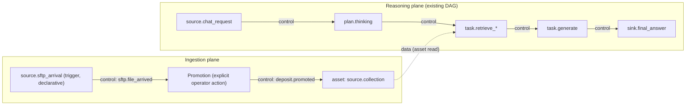

# ADR — Sources and inputs as first-class nodes in the Flow Builder

- **Status:** Accepted (drives the 3-phase plan `flow_builder_sources_dag`)
- **Date:** 2026-07-10
- **Scope:** Flow Builder (`frontend-ng/src/app/features/orchestration/flow/`), run engine walker (`backend/app/services/run_engine/dag.py`), DAG validator (`backend/app/services/chains/dag_validator.py`), flow manifest (`backend/app/services/systems/flow_manifest.py`).
- **Related:** `docs/mental-model.md` §3/§29 (Flow), §26 (Context), §20.6 (`execution_mode`); `docs/chat-agentic-thinking-spec.md` (membrane / `collection_allowlist`); plan `flow_builder_sources_dag_73f5fb8c`.

> This ADR is the contract of record. The node/edge shapes in §3 are pinned
> **verbatim** so backend and frontend implementers do not drift. Change them here
> first, then in code — never the other way around.

---

## 1. Context and problem

Today the Flow Builder only renders the **reasoning half** of a system's DAG:
`plan → route → retrieve → generate → gate → sink`. The other half — where the
data actually comes from — lives outside the canvas:

- **SFTP ingestion** is configured through connectors and the secure deposit flow.
- **Indexed collections** are configured under Knowledge.

Both are invisible on the flow graph. The graph therefore documents *reasoning*
but hides *provenance*: an operator looking at "Andritz Chat Agentic"
(`run_engine_dag`, variant `chat_agentic_thinking_v1`) cannot see which collection
the retrieval nodes read, nor that an SFTP arrival exists upstream at all.

Two concrete symptoms motivate this decision:

1. For `run_engine_dag` systems, the flow manifest `effective_config` is currently
   `{}` (verified on Chat Agentic). Retrieval resolves its collection *implicitly*
   from workspace scope, so the manifest projects nothing about the data plane.
2. A real DAG orchestrator (Dagster, Airflow, Prefect) connects sources and inputs
   **explicitly** as graph objects. Agentium's builder does not, which is the gap
   this ADR closes.

### Technical facts that de-risk the work (from the plan)

- The walker (`dag.py`, `_execute_node`) already treats any unknown `kind` as a
  **pass-through with a warning** — declarative nodes cannot break a run.
- The validator (`dag_validator.py`) has **no node-kind allowlist** — new kinds are
  accepted at save time; only `node_orphan` (error) forces new nodes to be either
  connected or explicitly exempted.
- Edges **already** carry `kind: 'data' | 'control' | 'branch'`
  (`flow-serializer.service.ts`).
- `semantic_search_v1` already accepts `collection` / `knowledge_scope` via
  payload / `inputs_map` (`skills_registry/wrappers.py`, `_rag_runtime_kwargs`), so
  Phase 2 needs **no new runtime mechanism**.
- No `event_driven_automation` executor exists yet — Phase 3 is the only genuinely
  new infrastructure.

---

## 2. Decision

Introduce **two node natures** that make the data plane first-class on the canvas:

1. **Source-triggers (push).** Nodes that *trigger* runs, e.g.
   `source.sftp_arrival`, `source.chat_request`. They represent an event that
   starts execution.
2. **Source-references / assets (pull).** Nodes that are *read* by retrieval nodes,
   e.g. an indexed collection. They represent a dependency the reasoning plane pulls
   from, connected through **data edges**.

We adopt the node/edge contract in §3 **exactly as pinned**, so the frontend
serializer, the Python walker, the validator, and the manifest projector all agree
on the same shapes.

This keeps a clean separation of the two planes:

- **Ingestion plane** — how data enters and becomes an asset (SFTP arrival →
  operator promotion → collection).
- **Reasoning plane** — the existing agentic DAG that consumes assets.

They are joined by a single, explicit **data edge** from an asset to the retrieval
node(s) that read it.

---

## 3. Pinned contract (state verbatim — do not drift)

### 3.1 Node kinds

`NodeKind` gains `'asset'`.

- **Frontend:** add `'asset'` to `NodeKind` in
  `frontend-ng/src/app/core/flow-serializer.service.ts` (today: `task | decision |
  fork | join | loop | retry | hitl | subflow | source | sink`).
- **Backend:** the Python mirror usage in the walker recognises the same `'asset'`
  kind. Triggers keep `kind: 'source'` with a specific `type`.

### 3.2 Asset node (pull / reference)

```jsonc
{
  "kind": "asset",
  "type": "source.collection",
  "config": {
    "collection_slug": "string",     // which indexed collection this node references
    "workspace_scoped": true          // boolean — resolve within the workspace tenant scope
  }
}
```

- **Walker behaviour (Phase 1):** a **declarative pass-through** that emits
  `{"output": {"collection": <collection_slug>}}`. It performs no retrieval and has
  no side effect; it only surfaces the collection into the run's variable pool.

### 3.3 Trigger node (push)

```jsonc
{
  "kind": "source",
  "type": "source.sftp_arrival"       // declarative in Phase 1; also e.g. source.chat_request
}
```

- **Phase 1:** declarative only — the walker ignores it, the manifest projects it.
  It becomes executable only in Phase 3, behind a flag (see §5.3).

### 3.4 Edges

- Edges from asset nodes are **always** `kind: 'data'`.
- Reuse the **existing** edge kinds only: `'data' | 'control' | 'branch'`. No new
  edge kind is introduced.

---

## 4. Edge semantics

The two edge families carry orthogonal meaning, matching the Dagster/Airflow
distinction between task dependencies and dataset (asset) dependencies:

| Edge kind | Meaning | Example |
|---|---|---|
| `control` (and `branch`) | Triggering / branching — "run B after A", "take this branch when condition holds" | `source.chat_request → plan.thinking`; `decision.route_mode -[branch]-> task.retrieve_deep` |
| `data` | Asset / dependency read — "B reads the output of A" | `asset:source.collection -[data]-> task.retrieve_*` |

- **Control edges** move *execution*.
- **Data edges** move *values/assets*.

An asset is therefore never a trigger: it only ever appears at the tail of a `data`
edge feeding a node that reads it.

### Two-plane graph



Solid arrows are `control` edges (execution). The dashed arrow is the single `data`
edge that binds the ingestion plane's asset into the reasoning plane's retrieval.

---

## 5. Three-phase rollout and risk posture

Each phase is independently shippable and independently reversible. The ordering
moves risk from "none" to "high", so that value lands early and the genuinely new
infrastructure is gated last.

### Phase 1 — Declarative / additive (low risk)

**Goal:** the graph *shows* SFTP → collection → retrieval; the walker ignores it;
the manifest projects it.

- **Frontend:** add `'asset'` to `NodeKind`; add two palette primitives —
  **Collection (asset)** (picker fed by the existing collections catalogue) and
  **SFTP arrival (trigger, "declarative" badge)**. Distinct canvas rendering for
  assets (dashed border + database icon); outgoing edges from assets forced to
  `kind: 'data'`.
- **Backend tolerance:** add an explicit `asset` case in the walker →
  **silent** pass-through (no warning) emitting `{"output": {"collection":
  config.collection_slug}}`, documented as declarative. Validator: **warn** (not
  error) if an `asset` lacks `collection_slug`; exempt declarative `asset`/trigger
  nodes from `unreachable_node` when they sit upstream of the entry.
- **Manifest:** for `run_engine_dag`, project a minimal `effective_config`
  = { collections of the asset nodes + resolved workspace scope } (today `{}` — the
  observed gap on Chat Agentic).
- **Seed pilot:** a data-only migration (pattern 048–051) adding to
  `andritz_chat_agentic_v3` the nodes `asset.collection[...spl-pilot]` and
  `source.sftp_arrival`, plus data edges into the `task.retrieve_*` nodes, with a
  `seed_origin` marker and a targeted downgrade.

**Risk posture:** additive; no runtime behaviour changes (asset = pass-through,
retrieval keeps its implicit resolution). Guard-rail: extend
`test_chat_agentic_dataflow.py` so the DAG's answer is **identical** with and
without the asset nodes.

### Phase 2 — Authoritative binding (medium risk, feature-flagged)

**Goal:** retrieval nodes resolve their collection **from their incoming data
edges** instead of implicit workspace resolution.

- **Wiring via existing mechanism:** set `task.retrieve_*.config.inputs_map.collection
  = VariableRef{ node_id: "asset.collection", path: ["collection"] }`, consumed as-is
  by `_rag_runtime_kwargs` (payload `collection` takes precedence over ctx). **No
  wrapper change required.** The asset node becomes the source of truth.
- **Membrane coherence:** on flow save (`update_system`), synchronise
  `membrane_spec.inbound.collection_allowlist` to the set of `collection_slug` of the
  connected asset nodes (today `[]` = neutral). The graph becomes the policy.
  Validator: **error** if a retrieval `task` has an incoming edge from an asset **and**
  an `inputs_map.collection` pointing elsewhere (inconsistency).
- **Flag:** `flow_asset_binding_authoritative` (pattern of `enable_agentic_chat`).
  OFF = Phase 1 (declarative); ON = wired `inputs_map` + synchronised allowlist.
- **A/B:** pilot on Chat Agentic Andritz only, via the existing
  `agentic_chat_spike.py` harness before flipping the flag.

**Risk posture:** the main risk is a **retrieval regression** (wrong collection →
empty answers). Mitigations: (1) **runtime fallback** — if the bound collection is
not found, log and fall back to workspace resolution (never a silently empty
retrieval — the lesson from the 2026-06-26 grounding fix); (2) A/B before flip;
(3) instantly reversible flag; (4) auto-synced allowlist only when ≥1 asset node
exists, otherwise stay `[]` (neutral) so a too-strict allowlist never blocks
legitimate sources.

### Phase 3 — Executable triggers (high risk, governance)

**Goal:** `source.sftp_arrival` actually triggers an ingestion/analysis run;
unify with `execution_mode = event_driven_automation` (today metadata with no
executor).

- **Minimal trigger infra:** new `backend/app/services/run_engine/triggers.py` — a
  registry `(event_kind, workspace_id) → system_id` built from Systems whose flow
  contains an active trigger node. Emission points: a hook after
  `promote_file_to_collection` / `promote_files_to_collection_batch`
  (`secure_deposit.py`) emitting `deposit.promoted`; an SFTP reconciliation hook
  emitting `sftp.file_arrived`. Dispatch via the existing `schedule_run` with
  `Run.trigger = "webhook"`.
- **Execution guard-rails:** idempotency key `(system_id, event_kind, payload_hash)`
  (a promoted file triggers exactly one run); per-System rate limit (e.g. 10
  triggered runs/hour) via the existing ControlPolicy; circuit breaker (3 consecutive
  failures → trigger disabled + Decision proposed in the Hypervisor).
- **Flag:** global `enable_event_triggers`, **OFF by default**, enabled per System.
- **Two sub-lots:** (a) plumbing + `deposit.promoted` in **dry-run** (the run is
  logged as `simulated`, not executed, visible under Runs); (b) real execution after
  the dry-run is validated on the demo VM.

**Risk posture:** highest — genuinely new infrastructure. Dry-run before real
execution; flag OFF returns to exact Phase 2 behaviour.

---

## 6. Governance invariant (non-negotiable)

> **SFTP promotion remains an explicit operator action.** This is a hard constraint,
> not a default that a flag can relax.

- `sftp.file_arrived` may **only** trigger *analysis / notification* runs — **never
  ingestion**. It cannot, by itself, cause data to enter a collection.
- Only `deposit.promoted` — which is emitted **after** a human has validated the
  promotion — may feed a **downstream** run.
- The registry encodes this: each `event_kind` carries an allowlist of node types
  permitted as its immediate downstream.
- Any **auto-triggered** run that produces a side effect must pass through the
  existing `hitl` nodes (pause + `Decision(proposed)`) before that effect is applied.

This invariant holds across all three phases. Phase 1 and Phase 2 cannot violate it
because triggers are declarative; Phase 3 enforces it in the trigger registry and via
mandatory HITL.

---

## 7. Consequences

**Positive**

- The flow graph becomes an honest, end-to-end picture: provenance (ingestion plane)
  and reasoning plane on one canvas. The traceability gap on `run_engine_dag` systems
  disappears.
- `effective_config` stops being empty for `run_engine_dag` systems — the manifest
  reflects the data plane.
- The membrane `collection_allowlist` (Phase 2) is derived from the graph, so the
  visible topology *is* the retrieval policy — no hidden divergence.
- A path to executable event triggers exists (Phase 3) that finally gives
  `execution_mode = event_driven_automation` a real executor, without touching the
  reasoning DAG.

**Negative / costs**

- One more `NodeKind` and two more palette primitives to maintain across
  frontend + backend + validator + manifest.
- Phase 2 introduces a flag and a fallback path (added branching in retrieval
  resolution) that must be tested on both sides of the flag.
- Phase 3 adds real infrastructure (registry, hooks, dedup, rate limit, circuit
  breaker) with operational surface area (monitoring, back-pressure).

---

## 8. Alternatives considered

- **Read-only reference panel only, no nodes (rejected).** Show sources/collections
  in a side panel next to the canvas instead of as nodes. Rejected: a *real* flow
  builder must let inputs be **connected** — a panel cannot express the data edge from
  a collection into a specific retrieval node, cannot become the authoritative binding
  in Phase 2, and cannot host a trigger in Phase 3. It would re-create the exact
  invisibility problem this ADR closes.
- **Overload the existing `source` kind for collections (rejected).** Model a
  collection as `kind: 'source'` with a `type` of `source.collection`. Rejected:
  triggers (push) and assets (pull) have opposite edge semantics — conflating them on
  one kind would blur `control` vs `data` and make rendering/validation ambiguous.
  A distinct `'asset'` kind keeps the two natures clean.
- **A separate standalone ingestion DAG product (rejected/deferred).** Build ingestion
  orchestration as its own graph disjoint from reasoning. Rejected for now: it re-splits
  the two planes we are trying to unify and duplicates the walker/validator/manifest
  surface. The two-plane-in-one-graph model gives the same clarity with far less new code.
- **Make retrieval binding authoritative immediately, no declarative phase (rejected).**
  Skip Phase 1 and wire `inputs_map` directly. Rejected: it puts a retrieval-regression
  risk on the critical path before any A/B or fallback exists. The declarative phase
  ships value (visibility) at zero runtime risk first.

---

## 9. Rollback story per phase

| Phase | Rollback | Resulting state |
|---|---|---|
| **Phase 1** | Run the migration `downgrade` (removes the seeded asset/trigger nodes); the frontend simply ignores kinds that are absent. | No asset/trigger nodes; unchanged runtime (was pass-through anyway). |
| **Phase 2** | Set `flow_asset_binding_authoritative = OFF` (instant). Runtime already falls back to workspace resolution if a bound collection is missing. | Exact Phase 1 declarative behaviour; allowlist reverts to neutral `[]`. |
| **Phase 3** | Set `enable_event_triggers = OFF` (instant). Dry-run mode (`simulated` runs) is the intermediate safety net before real execution. | Exact Phase 2 behaviour; triggers inert/declarative again. |

Each phase's rollback returns the system to the previous phase's known-good state
with no data migration and no reasoning-plane change.

---

## 10. Delivery order

1. **This ADR** — taxonomy, edge semantics, governance invariant — validated before
   any code.
2. **Phase 1** (frontend + manifest + seed pilot) — shippable alone; immediate value
   (the observed traceability gap disappears).
3. **Phase 2** behind flag, A/B on Chat Agentic Andritz.
4. **Phase 3** in two sub-lots — dry-run, then real.

Each phase closes with: build + backend tests (`test_chat_agentic_dataflow.py`,
`dag_validator` tests), isolated commit, `omnirag-demo` deployment, and an A/B check
with no latency regression (keep everything off the walker's critical path).
