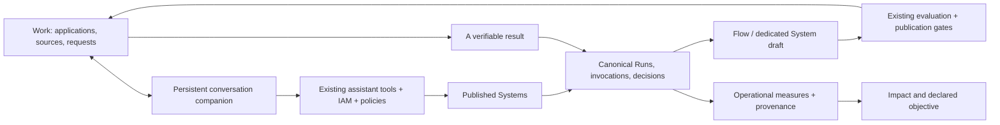

# Agentium adoption — implementation and acceptance

Status: implemented behind an opt-in experience flag; **not released or accepted by users**.
Base revision: `7a4924f7dd406b831ca0b2eafd110d079b664330` on `demo/agentic`.
Development branch: `codex/adoption-roadmap`. Local checks: 10 September 2026.
The release SHA must be recorded after the reviewed changes are committed. The
base SHA is not an identifier for the changed code.

Executive briefing of the Hypervisor, the decision chain and the learning
curve (C-level / métier):
[`agentium-hypervisor-decision-strategy.md`](./agentium-hypervisor-decision-strategy.md),
deck [`deck-agentium-decision-adoption.md`](./deck-agentium-decision-adoption.md).
This file remains the implementation and acceptance contract.

This implements the adoption roadmap using the existing navigation resolver,
HelpService, ChatSession/Message, assistant engine, System publication, Run,
Decision, Experience lifecycle and IAM boundaries. It does not introduce another
orchestrator or an alternative execution ledger.

## Experience and contracts



- The root destination is resolved after workspace hydration. Configured,
  permitted destinations take precedence. With the adoption experience and
  Experience enabled, business use starts in Work; builder use starts in Create.
  Explicit object links retain their destination. Legacy facet names remain
  accepted; visible System facets match overview, runs, design and context.
- The desktop Cockpit rail uses Create, Monitor, Improve, Impact and Administer
  (FR: Créer, Suivre, Améliorer, Impact, Administrer). IDs remain unchanged.
  Empty mini-rail sections disappear.
- In the adoption experience, the title bar keeps technical health behind a
  native, keyboard-accessible Diagnostics disclosure. Throughput, latency and
  completed-Run rate are explained as technical measurements, not business
  success. No substitute financial total is fabricated in the global chrome.
- Guides `start`, `sources`, `systems`, `runs`, `value` are served in EN/FR by
  `GET /help-content/guides/{id}?language=en|fr` and rendered at `/help/{id}`.
  Old unpublished Markdown anchors are replaced. Guides contain static product
  copy; their public route serves no workspace documents.
- Member preferences use `GET/PATCH /auth/workspaces/{slug}/me/experience`.
  The record belongs to one membership: persona, NorthForge journey, completed
  interactions, dismissal, own session and Run references. It cannot change
  workspace mode, role or entitlements. A PATCH adds one completed step
  idempotently. The existing audit mechanism records `adoption.progress` metadata,
  never question or document text.
- The optional NorthForge path is `/work/getting-started`: choose the example,
  ask, open a citation, recover the result. It reuses ChatPanel and its existing
  server session. Availability requires the canonical Showcase workspace and a
  ready, nonempty `agentium-showcase-notices` collection. Missing examples explain
  their unavailability. Visited steps do not certify understanding.
- The desktop companion is nonmodal and expands in place; narrow screens use
  the full panel. The root service preserves turns when navigating or reopening
  the panel in the same workspace. Changing workspace or explicit System scope
  clears the active conversation. Server sessions remain user/workspace/scope
  bound. The older voice, profile and document-drop surfaces are retained.
- Pilot turns carry `system_ids` (0–10) and a stable `request_id`. Empty scope
  allows discovery, not a System launch. Every selected ID is checked before
  executing or replaying a request. New read tools are `inspect_system`,
  `compare_runs` and `read_operational_metrics`; launch and approval reuse
  their canonical services and published contracts.
- A model cannot accept or reject a human gate. The separate
  `POST /assistant/decisions` requires an explicit UI action and the observed
  decision ID; stale decisions are refused. Canonical IAM, execution, managed
  System and gate-plane restrictions still apply. Unsupported delegated gates
  direct the user to Runs. Existing authenticated manual decision endpoints also
  record explicit human provenance.
- The transport receipt in `assistant_requests` prevents the same HTTP request
  from executing again across retries/workers. Completed requests replay their
  response after access checks; altered bodies, pending and failed claims return
  409. Pending claims are **never automatically re-executed**. Inspect the
  canonical Runs before deciding how to recover an uncertain operation.
  Deleting a ChatSession cascades its completed transport receipts.
- Tool/time limits remain bounded (existing turn ceiling, 120-second turn
  deadline). Repeated identical mutation calls within a turn reuse their result.
  If a model fails after a tool acted, the response retains the tool evidence.
  Providers without tool support receive an explicit UI fallback.

## Developer exercise

The seed adds a synthetic `Operational Analysis` System and, when opted in, a
Work application `operational-analysis`. Source:
`backend/scripts/showcase_operational_analysis.py`.

| Order | Planned minutes | Actual minutes |
|---|---:|---:|
| NF-01 | 30 | 40 |
| NF-02 | 40 | 35 |
| NF-03 | 20 | 25 |
| NF-04 | 30 | 55 |

The fixed Flow is source → Python/Polars → LLM synthesis → numerical check → sink.
Expected: **4 orders, 120 planned, 155 actual, 35 net overrun, 3 late orders**.
Polars is pinned to 1.31.0 in the existing recipe environment. It needs an
enabled recipe worker and a usable model route. There is no external write tool.
The checker proves the reference arithmetic and a nonempty answer; it does not
prove the semantic accuracy of the LLM summary or any realized savings.

The app's authorized Cockpit links open bound Systems' design facets and the
in-product build guide. Export the reference Flow, create a separate System,
import into its draft, inspect recipe inputs/outputs, and change the summary
prompt. Execute and evaluate before publishing. Create a separate Experience
and binding to that published version; use its readiness/release/audience gates.
This reuses the existing export/import and publication interfaces. It is not
an automatic clone or an assistant-authored publication.

Installing the sample uses the canonical binding, readiness, release and
deployment services **only in the canonical Showcase**. An existing application
is left at its existing release; rerunning the seed does not republish it.
Local tests exercised this lifecycle in a disposable database, not on a client.

## Operational objectives and value

Optional `System.settings.operational_objective` has metric, numeric target,
start date, exclusive end date, owner and comparison reference. The window is
1–90 days, metric/unit choices are fixed and no formula is evaluated.
It is exposed in the System overview and Impact and through the same assistant
read tool. The update endpoint merges settings without changing Flow versions.

Updating uses canonical System admin enforcement and the managed-System guard.
Because this is a new boundary, its compatibility policy uses the existing
`legacy_workspace_admin` helper. It does not inherit the historical permissive
edit policy for ordinary Systems. The read response supplies `can_edit` using
that exact guard; personal experience preferences do not grant editing.
The same guard applies to objectives supplied through generic System creation
or settings updates. Unrelated settings replacements preserve the existing
objective; an explicit change or removal requires objective administration.

| Metric | Evidence and limits |
|---|---|
| Completed volume | Authorized Runs started in the selected interval; completed status is activity, not answer validation |
| Mean duration | Completed Runs with recorded duration; missing durations suppress comparable deltas |
| Human waits | Current pending status of that Run cohort; no historical target delta is inferred from today's queue |
| Human validation rate | Explicit authenticated human confirmation, timestamp and final decision; historical/automatic decisions do not acquire a human label |
| Measured cost | Finite invocation cost with `cost_measured`; a measured zero is retained, absent evidence stays absent |

The response carries the period, generation timestamp, sources, sample counts,
completeness and accessible Run/Decision IDs. It is bounded to 10,000 Runs.
Incomplete, access-filtered, still-open periods or partial measures do not
produce comparable deltas. Synthetic fixture Runs are excluded and demonstration
Systems are labelled. Economic impact is explicitly unattested here; use the
existing value-loop evidence to establish it. `value_basis`, its locked catalogue
rules and the existing scenario → simulation → approval → action → measurement
loop remain the economic authority.

## Delivery lots and closure

| Lot | Implemented evidence | Acceptance still required |
|---|---|---|
| 0 | Reproduction sheet below; four reference tasks; metadata-only progress events using the existing audit trail | Actual 5 business + 5 developer baseline sessions and their observations |
| 1 | Resolver entry fix, published guides, actual facets, rail labels, priority Work/Knowledge/Systems/Runs/Impact recovery actions | Full supported configuration matrix, screenshots and expert-path sign-off on the released SHA |
| 2 | Optional four-step NorthForge path, persistent member preferences, resume/hide, context help | At least 4/5 business participants finish unaided within ten minutes and find the supporting passage |
| 3 | Persistent scoped companion, canonical tools/proofs, comparison, explicit human decisions, deduplication | Real configured model: launch → inspect → compare; network/provider/permission scenarios on Showcase |
| 4 | Fixed Python/Polars System, Work app, design links and adaptation/publication guide | Recipe worker + LLM execution; 4/5 developers adapt and explain within thirty minutes; publish their own app |
| 5 | Structured objective, five bounded measures, edit authorization and provenance | Responsible owner explains goal, delta and evidence; economic evidence remains independently verified |

**No lot is closed by these local tests alone.** The roadmap sponsor makes the
final acceptance decision using separate technical and user-success evidence.
The full 44-surface help/85-empty-state inventory is not
claimed complete by adding the priority guides and recovery actions.

## Reproduction baseline

Record the deployed SHA from `/api/v1/build-info`, workspace slug, role/template,
navigation profile, shared mode and feature flags for every browser observation.
The static baseline below is from the base revision; it is not a recording of
the current deployed client environments.

| Ticket | Repeatable baseline inspection | Observation / hypothesis boundary |
|---|---|---|
| ONB-01 | Fresh member, Work and Cockpit; inspect routes and membership model at the base SHA | No dedicated member onboarding record or NorthForge journey in this baseline. Whether a guided task reduces abandonment requires user sessions |
| ONB-02 | `app.routes.ts:45` at base SHA; generic entry with builder + cockpit navigation flags | Static root redirects to Hypervisor; downstream resolver behavior depends on configuration. New resolver tests cover generic homes and retained direct links |
| ONB-03 | Inspect `help_content.yaml`, `<ck-help>` placements and the lexicon at base SHA | Ticket's 9/44 and 18/16 counts are supplied audit estimates, not a fresh exhaustive count. Priority missing surfaces now have contextual entries |
| ONB-04 | Follow each base registry `learn_more` destination | Unpublished document anchors replaced by five in-product guide IDs; HTTP test resolves every published link in both languages |
| ONB-05 | Empty Work/Knowledge/System/Run/Impact; repeat with filter, error and restricted principal | Action slots already exist through `EmptyStateComponent` projection (base line 60). The supplied 13/85 figure does not imply a missing shared action API |
| ONB-06 | Compare workspace mode/settings, navigation profile and `HelpService` persona storage | Shared policy and personal help preference are different concepts. New membership preference changes help/onboarding only, not any of the permission mechanisms |

Browser baseline runs on actual client configurations: **NOT RUN**.
Do not rewrite the estimates as measured percentages.

## Acceptance session sheet

Recruit five business users and five developers who did not design the product.
Use the same four tasks and retain a first-session and a return-session row per
participant. Use pseudonymous participant IDs; collect no prompt/document content
in telemetry. Ask permission separately if session recording is desired.

1. **Source-backed answer:** in Showcase ask “At what pressure does the PMP-700
   relief valve open?” from `app/resources/retrieval_golden/showcase_notices.json`.
   Expected 735 bar and the matching passage in the operating manual or
   commissioning checklist. 700 bar is the continuous setpoint, not the answer.
   Repeat with an unseeded part and verify that missing evidence is acknowledged.
2. **Handle an awaiting decision:** an authorized user opens a prepared
   in-process synthetic gate, reads the proposed outcome, explicitly accepts
   or rejects and finds its canonical decision/Run. A viewer and a stale
   decision must be refused. No customer integration is used.
3. **Adapt the example:** run Operational Analysis, inspect Python input/output,
   import the reference Flow into a new System draft and change only the summary
   instruction. Numbers must remain 4/120/155/35/3. Evaluate, publish a new
   version and a separate app for one authorized colleague. Record the
   original reference publication ID before/after: it must be unchanged.
4. **Explain a metric:** identify the owner, interval, target and source for
   one operational objective. Explain measured zero vs missing cost and why an
   automatic check does not attest savings. If a difference is unavailable,
   explain which data or comparison condition is missing.

| Participant | Profile | Task | Session | SHA/config | Unaided success | Elapsed | Help requests | Blocker | Source/Run found |
|---|---|---|---|---|---|---|---|---|---|
| To collect | Business/developer | 1–4 | First/return | To collect | NOT RUN | — | — | — | — |

These small sessions identify usability problems; they do not estimate market
adoption statistically. Track errors, time to a verifiable result, resumed
journeys, help requests and success on the return task. Keep the existing
navigation telemetry; join step metadata by membership/workspace rather than
logging content.

## Activation and release

Use the existing workspace settings mechanism to merge:

```json
{ "features": { "adoption_experience_v1": true } }
```

This is the only new product flag; it defaults off. Preserve other settings.
Work needs the existing `experience_v1` flag; authoring requires the existing
Studio permissions/flags, and the new Impact panel uses existing Hypervisor v2.
Do not grant tool privileges through this flag. In the existing assistant
allowlist, opt in to the read tools above and, only where policy permits,
`start_system_run` and `answer_hitl_gate`. Explicit allowlists are not expanded
silently. Keep a tool-capable model configured using the existing model routing.

Apply additive migrations 101 → 102 → 103 before activating:
membership JSON, transport request receipts and nullable human-confirmation
fields. Historical decisions remain unknown. Rollback means disabling the
experience or returning to schema-compatible images; retain newly written data.
Do not restore an old database over newer writes or drop these columns to
roll back a frontend activation.

Progression is Showcase synthetic → internal cohort → explicit client pilot →
generalization, preserving independent tool policies. The seed is an intentional
Showcase installation step, not a deployment side effect. This implementation
has not run the seed against a remote database.

Follow [the release process](agentium-release-process.md): local gates, reviewed
commit, publish to `demo/agentic`, build immutable SHA images on `omnirag-demo`,
canaries from carakai, then manual checks. Client defaults change only in an
explicit release. Do not delete old routes until replacement usage and expert
regression results are known.

### Default switch and retirement

The flag is temporary rollout control, not a permanent persona or a supported
client edition. It does not wrap every fix: guide destinations, dead facet
repairs, error states, objective authorization and CI guards already apply
independently. The guided journey, member preference UI, companion presentation,
readable rail and objective panel are the experience under progressive rollout.
Tool permissions remain independent.

The release decisions below are the intended sequence, **not scheduled calendar
dates or permission to deploy**. The roadmap sponsor (the requesting user) is
the final decision maker for default activation and removal, as confirmed in
review. Technical reviewers supply test and migration evidence; they are not
an additional decision committee. No team capacity or acceptance session date
has been supplied. The sponsor chooses actual dates in the release record.

| Decision | When | Evidence required | Who decides |
|---|---|---|---|
| Pilot activation | First explicitly approved Showcase/internal release with passing local and GitLab gates | Release SHA, configuration and live canaries; the four reference tasks are runnable | Roadmap sponsor; release operator executes |
| Default for supported workspaces | First release after the pilot's user and expert-path acceptance passes | The 5+5 sessions, successful return tasks, supported client configuration matrix, no unresolved critical regression; an explicit client-default release note | Roadmap sponsor |
| Remove the compatibility branch and flag | Target the following planned release, after one complete stable release cycle under the new default | Usage shows that every retained entry point has a supported replacement; no remaining workspace depends on the old presentation; migration/rollback rehearsed | Roadmap sponsor, reviewing the removal diff and evidence |

If the removal target is missed, record the concrete blocker, affected
workspace/configuration, owner and new target release in that release record.
Do not silently preserve the flag indefinitely. Removing it retires presentation
branches, not canonical routes, permissions, voice interfaces or a member's
ability to hide the walkthrough.

Release record fields: pilot SHA/date; default SHA/date; removal target
release/date; product acceptance; technical acceptance; outstanding blockers.
All are **not scheduled / not signed** for this local branch.

### Response to the adoption review

- LEX-02 is a release gate: `agentium-frontend-quality` now runs
  `check:i18n`, `check:nav-links`, `check:ui-chrome`, unit tests and the build.
  It has no change filters or feature-flag conditions, is not allowed to fail,
  and is an explicit dependency of the production job.
- The reference and mental model now explicitly endorse conversational control.
  Historical demo scripts are historical material, not a contrary product rule.
- Technical title-bar readouts are behind Diagnostics in the new experience.
  Their labels and explanation distinguish completed execution from quality
  and economic benefit. The System grid uses `systems()` locally, and the rail
  injects its workspace dependency before declaring the derived signal.
- **O5 remains an acceptance gap.** The five operational metrics do not measure
  hours saved or money gained. A usable economic view still needs a declared
  business baseline, comparable observed outcomes and links to canonical
  measurement evidence. It must be tested with a responsible business user;
  renaming Hypervisor to Impact does not establish that outcome.
- Converging status vocabulary requires an explicit display mapping for each
  canonical lifecycle. Client labels in generic catalogues need separation
  from client extensions. The remaining empty-state inventory and the complex
  Impact presentation need task-based review. These are not closed by renaming
  local variables or counting additional empty-state tags.

## Local verification

Results and screenshots: [local review evidence](evidence/adoption-local/README.md).

Frontend: `check:i18n`, `check:nav-links`, `check:ui-chrome`, `test:unit`,
`build:prod`. Backend: the adoption, migration, assistant/config/authorization,
voice assistant, Flow publication, Hypervisor semantics, HITL authorization and
Showcase suites. Exact results are recorded with the review evidence.

The existing `16-experience-work-canary.spec.ts` includes an opt-in local
contract using API fixtures:

```bash
E2E_BASE_URL=http://127.0.0.1:4321 E2E_ADOPTION_MOCKED=1 \
  npx playwright test e2e/tests/16-experience-work-canary.spec.ts \
  --grep 'Adoption local contract'
```

Serve the production build with the existing `PORT=4321 node e2e/serve-dist.mjs`.
The fixture verifies Work entry, companion continuity, proof links, bilingual
guides and narrow layout. Its screenshots are **local UI evidence**, not live
RAG/model/worker results. The existing authenticated Work canary remains the
deployment gate; retain its deployed-SHA and accessibility checks.

Still unexecuted: real retrieval/LLM/recipe chain, LiveKit audio regression on the
deployed stack, client-specific navigation matrices and the ten usability
sessions. No production or client deployment was performed for this change.


## Native visual identity and protected client themes

The sponsor confirmed that NAWA's theme must be preserved. Generic Cockpit
surfaces may be harmonised. Workspace administrators and application authors
now have an in-product identity editor with preview; the existing permissions
and application publication lifecycle remain authoritative. See
[White labelling through the product UI](agentium-white-labelling.md) for the
paths, bounded options, protection boundary and local acceptance evidence.
