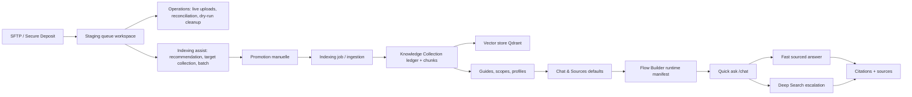
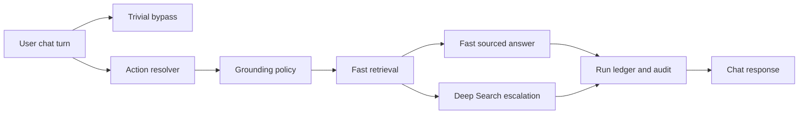

# Andritz Retrieval Demo QA - 2026-06-09

## Objectif

Preparer la demonstration Andritz du flow retrieval reel Agentium : reception SFTP, assistance a la promotion, collection Knowledge, reglages Chat & Sources, Flow Builder synchronise avec `/chat`, puis reponse chat sourcee.

Ce document est un runbook de demo et de QA. Il ne presente pas une maquette : les ecrans verifies sont ceux de `https://agentium.papai.ai` sur le workspace `Andritz`.

## Etat de prod verifie

| Zone | Resultat QA |
|---|---|
| Deploiement | Frontend redeploye sur `demo/agentic` commit `0f7308d` |
| SFTP | `agentium-sftp` laisse intact, up depuis 17h au moment du test |
| Backend | `agentium-backend` laisse intact, healthy |
| Frontend | `agentium-frontend` rebuilt/recreated, healthy |
| Build local | `tsc` OK, Angular production build OK, warnings budget existants |
| Smoke UI | SFTP, Knowledge, Chat & Sources, Flow Builder, Chat testes via Playwright headless authentifie |

## Schema Global



## Flow Chat Reel

Systeme : `Andritz Workspace Chat`

Route : `/systems/63466ee2-7db8-4f25-bce1-710da46bafe1/flow`

Le Flow Builder montre le DAG reel du chat transverse. Le smoke final a verifie 9 noeuds et 9 connexions.



Configuration effective exposee dans le Runtime Manifest :

| Parametre | Valeur observee |
|---|---|
| `assistant_profile` | `andritz_spl_advisor` |
| `knowledge_scope` | `andritz-spl-knowledge-experiment` |
| Retrieval | `latency_profile=fast`, `retrieval_profile=chat`, `top_k=6`, `mode=chah`, `deep_search_enabled=true` |
| Grounding | mode `balanced`, modes autorises `strict` et `balanced`, citations requises |
| Source policy | grounding industriel, conservation des termes utilisateur, preference references exactes |

## Parcours De Demo

### 1. SFTP / Secure Deposit

Route : `/connectors/sftp`

Narratif :

> "On commence par la donnee brute. Les fichiers envoyes par le client arrivent dans le Secure Deposit, dans une staging queue workspace. Rien n'est automatiquement injecte dans la connaissance : on pilote, on audite, puis on promeut."

Points a montrer :

- `Target collection` selectionne maintenant une vraie collection existante : `andritz-notices-techniques-spl-pilot`.
- Le lien `Open collection` renvoie vers la collection Knowledge.
- `SFTP operations` montre les uploads en cours, les fichiers temporaires, la reconciliation et le seuil `24h`.
- `Live uploads` sera vide s'il n'y a pas de transfert actif ; c'est nominal.
- `Run check` lance une reconciliation en dry-run. Ne pas lancer `Move to quarantine` en demo sauf besoin explicite.
- `Indexing assist` guide la promotion mais ne promeut pas automatiquement.
- La staging queue reste workspace-scoped et filtre les statuts `received/promoted/rejected/all`.

QA observee :

- Operations presentes.
- Indexing assist present.
- Collection picker present.
- Collection cible reelle : `andritz-notices-techniques-spl-pilot`.
- Liens collection presents.

### 2. Knowledge Collections

Route liste : `/knowledge`

Narratif :

> "Une fois les fichiers promus et indexes, ils deviennent une collection Knowledge gouvernee : on voit le volume, l'etat d'indexation et les collections exploitables par les systemes."

Compteurs liste observes :

| Collection | Etat observe |
|---|---|
| `andritz-notices-techniques-spl-pilot` | 27 952 docs, 889 104 chunks, indexed |
| `andritz-non-wovens-france-excel-pilot` | 25 docs, 4 998 chunks, indexed |
| `andritz-manuals-bba120-pilot` | 22 docs, 568 chunks, indexed |
| `andritz-non-wovens-pilot-archive` | 25 docs, 45 chunks, indexed |

Route detail SPL : `/knowledge/andritz-notices-techniques-spl-pilot`

Points a montrer :

- KPIs detail immediats : `25 597` docs actifs, `886 411` chunks, `2` bindings, vector DB `qdrant`.
- Overview : status `ready`, embedding model `text-embedding-3-small`, chunking `recursive_character`.
- `Sources` : inventaire actif avec filtres par type, extension, statut.
- Typologie visible : `pdf`, `markup/html`, `image`, `text`, `document`.
- `Guide`, `Table facts`, `Bindings` ouvrent les couches de contextualisation, faits tabulaires et systemes consommateurs.
- Onglet `More` donne acces aux facettes plus avancees : structure, facts, OCR, diagnostics.

Point de vigilance :

Les compteurs liste et detail ne sont pas identiques. Le detail affiche l'inventaire actif pret a citer, alors que la liste affiche le resume collection enregistre. En demo, dire : "on voit ici le detail actif de l'inventaire cite par le chat ; il reste un alignement de compteurs resume/detail a finaliser."

### 3. Chat & Sources

Route : `/workspace/andritz/chat-knowledge`

Narratif :

> "Le no-code de tuning n'est pas cache dans le code. Ici on configure les scopes documentaires, les modes de retrieval, les profils documentaires/tableurs, l'OCR et les prompts par defaut du workspace."

Points a montrer :

- `Source scopes` avec plusieurs scopes Andritz.
- `andritz-spl-knowledge-experiment` combine :
  - `andritz-manuals-bba120-pilot`
  - `andritz-notices-techniques-spl-pilot`
  - `andritz-non-wovens-france-excel-pilot`
- Mode retrieval observe : `chah`.
- `Top-K` observe : `6` pour le scope SPL.
- `Available collections` permet d'ouvrir/copier les slugs.
- Profils documentaires et OCR visibles : providers, langues, seuils, timeouts.
- Reglages chat : placeholders, prompts, profils assistant.

Prudence demo :

Ne pas sauvegarder des modifications au hasard. Montrer que les champs sont editables, puis annuler ou revenir a l'etat initial sauf decision explicite avec Andritz.

### 4. Flow Builder

Route : `/systems/63466ee2-7db8-4f25-bce1-710da46bafe1/flow`

Narratif :

> "Le Flow Builder n'est pas seulement un schema. Il expose le systeme `/chat` synchronise : runtime manifest, noeuds, edges, contrats d'entree/sortie, instructions et configuration par noeud."

Points a montrer :

- Header : `Runtime Synced`, `Source system_seed`, `Extended Yes`.
- Runtime Manifest : `Workspace chat · /chat`, `LIVE SYNC`.
- Noeuds : `User chat turn`, `Trivial bypass`, `Action resolver`, `Grounding policy`, `Fast retrieval`, `Fast sourced answer`, `Deep Search escalation`, `Run ledger and audit`, `Chat response`.
- Bouton `Configure` sur `Grounding policy` :
  - Side sheet large.
  - Tabs `Overview`, `Config`, `Prompts`, `Runtime`.
  - Binding skill `chat_grounding_policy_v1`.
  - Inputs/outputs map visibles.
- Les instructions/prompts sont visibles via `Instructions` / `Prompts`, pas uniquement dans le code.
- Les edges ont ete mesures connectes au smoke final.

Prudence demo :

Le bouton `Save to System` persiste les changements. Pour une demo, montrer le tuning puis ne sauvegarder que si le donneur d'ordre valide explicitement.

### 5. Chat Direct

Route : `/chat`

Question de demo :

```text
quelles infos sur AKK200 ?
```

Reponse attendue :

- Manuel cite : `AKK200 Nonwoven System User's Manual`.
- Donnees techniques : largeur de travail `0,3 m`, vitesse mecanique `50 m/min`, vitesse de production `10-20 m/min`.
- Structure : securite, system units, `Hydroentanglement-unit`, troubleshooting, annexes/system drawings.
- Contenu documentaire : certificat, schemas procede/electrique/pneumatique, plans, spare parts list.
- Limites explicites : certains dessins/listes pieces ne sont pas dans les extraits visibles.
- Sources : bulles/citations numerotees, `Sources · 8`, bouton `Deep search`.

Latence observee :

- Dernier run : indicateur UI autour de `17-19s`.
- Prevoir une marge de `20-45s` en demo, surtout si la conversation precedente est chargee.

Conseil demo :

Demarrer une nouvelle conversation avec le bouton `+` avant la question AKK200 pour eviter que l'historique de tests apparaisse autour de la reponse.

## Ce Qu'il Faut Dire A Andritz

Trame courte :

> "Agentium separe la reception brute, la gouvernance d'indexation et la reponse. Le SFTP recoit les fichiers sans les injecter automatiquement. L'operateur voit les uploads, audite les ecarts, choisit la collection cible et lance une promotion assistee. La collection Knowledge expose ensuite l'inventaire actif, les chunks, le modele d'embedding, le chunking, les guides et les bindings systemes. Le chat n'est pas une boite noire : son flow reel est visible dans le Flow Builder, avec les politiques de grounding, le retrieval rapide, la reponse sourcee et l'escalade Deep Search. On peut regler ces choix en no-code, puis tester immediatement dans le chat avec citations."

Phrase de mitigation :

> "On n'affirme pas que tout est parfait : certains compteurs resume/detail doivent encore etre alignes et la latence de reponse directe depend du corpus et de la charge. Mais le parcours critique est reel, gouverne, source et maintenant pilotable depuis l'UI."

## QA Detaillee

| Scenario | Statut | Notes |
|---|---|---|
| SFTP operations visible | PASS | `Live uploads`, reconciliation, seuil 24h, target collection |
| SFTP target collection | PASS | `andritz-notices-techniques-spl-pilot` selectionnee |
| Knowledge liste | PASS | 8 collections, Qdrant, gros corpus SPL visible |
| Knowledge detail | PASS avec vigilance | KPIs et tuning visibles ; ecart resume/detail a expliquer |
| Chat & Sources | PASS | Scopes, modes, top-k, OCR, prompts/defaults visibles |
| Flow Builder DAG | PASS | 9 noeuds, 9 edges, runtime manifest live sync |
| Flow configuration sheet | PASS | Side sheet `Grounding policy` avec `Config`, `Prompts`, `Runtime` |
| Chat AKK200 | PASS | Reponse sourcee, 8 sources, limites explicites |
| Deep Search | PRESENT | Bouton visible ; a utiliser si besoin de rappel plus large |
| SFTP safety | PASS | SFTP non redeploye, service up depuis 17h |

## Limites A Ne Pas Masquer

- Les compteurs liste/detail de la collection SPL ne sont pas parfaitement alignes.
- Les diagnostics lourds et graph embeddings restent des facettes a charger a la demande.
- Si aucun transfert SFTP n'est actif, `Live uploads` est vide : c'est normal.
- La reconciliation corrective doit rester en dry-run en demo, sauf decision explicite.
- La reponse chat directe est sourcee mais pas instantanee sur ce corpus.
- Le chat affiche parfois `Reponse a verifier`, ce qui est acceptable : c'est un signal de prudence, pas un echec.
- Les donnees detaillees non presentes dans les extraits doivent etre demandees via sous-section ou Deep Search.

## Reproduction Rapide

1. Aller sur `/connectors/sftp`.
2. Verifier `Target collection = andritz-notices-techniques-spl-pilot`.
3. Montrer `SFTP operations`, `Live uploads`, `Reconciliation`, `Indexing assist`.
4. Ouvrir la collection via `Open collection`.
5. Dans `/knowledge/andritz-notices-techniques-spl-pilot`, montrer Overview puis Sources.
6. Aller sur `/workspace/andritz/chat-knowledge`, montrer scopes et reglages.
7. Aller sur `/systems/63466ee2-7db8-4f25-bce1-710da46bafe1/flow`.
8. Selectionner `Grounding policy`, cliquer `Configure`, montrer tabs et prompts/runtime.
9. Aller sur `/chat`, nouvelle conversation, poser `quelles infos sur AKK200 ?`.
10. Montrer sources, limites et bouton `Deep search`.
