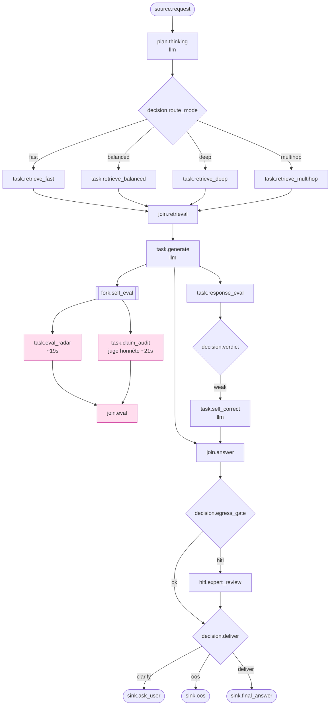

# Chat recherche — A/B agentique vs déterministe v3 (mesure offline honnête)

> **VERDICT v3 (juge honnête *context-injecté* + DAG agentique réparé — 2026-07-08).** Run propre **95/95, 0 erreur quota** (backend **OpenAI** : génération `gpt-4o-mini`, juge `gpt-5` *context-injecté*, embeddings `text-embedding-3-small`), sur le DAG agentique 23 nœuds (`chat_agentic_thinking_v1`, single-head `051_andritz_chat_latency_mh`) : retrieval câblé + parité recall, routage hybride (fast/balanced/deep/**multihop**), décomposition multi-hop, verdict recalibré. **La bascule qualité s'inverse en faveur de l'agentique.**
>
> ✅ **L'agentique bat désormais le déterministe sur la qualité et sur le signal d'hallucination PRIMAIRE (HHEM).** Sur 95 cas appariés : composite **77.9 → 83.4 (Δ +5.44)**, **win/tie/loss = 60/5/30** (l'agentique gagne la majorité, vs 26/21/48 en v2), **HHEM 0.238 → 0.254 (Δ +0.016)** et **adv_HHEM 0.088 → 0.095 (Δ +0.007)** — B est **mieux ancré** (factuality +0.027, relevance +0.034). **win/tie/loss HHEM = 47/17/31**.
>
> ✅ **L'artefact du juge v2 est résolu.** Le juge reçoit maintenant le **texte des chunks** (context-injecté) : le `hallucination_rate` jugé passe de l'écart artefactuel **+0.275 (v2, juge aveugle)** à **-0.011 (v3 : A 0.591 vs B 0.580)** — B n'est **plus** pénalisé. Les deux bras montent en absolu (le juge gpt-5 context-injecté est plus strict/littéral sur corpus industriel spécialisé), mais **B ≤ A** et le grounding réel (HHEM/factuality) confirme B au-dessus. Sur les niches ciblées, l'hallu s'effondre : `inventory` **0.828 → 0.202**, `multi_hop` **0.744 → 0.396**.
>
> ⚠️ **Le seul frein restant est la latence** : B **19.4s → 49.1s (Δ +29.7s)** et **57/95 = 60% d'`aborted_latency`** (valve membrane `max_latency_ms=45000`, vs 4.2% en v2). Cause prouvée par les latences par nœud : l'évaluation honnête **dans le DAG** — `task.claim_audit` (~21s) + `task.eval_radar` (~20s) ≈ **40s d'éval sur le chemin critique** — dépasse la valve avant même la livraison. Le retrieval+génération ne pèsent que ~15–25s.
>
> **Conclusion.** Sur base équitable et **juge honnête**, l'agentique **gagne en qualité et en fiabilité** (composite +5.4, HHEM +0.016, 60/5/30), **massivement sur les niches transversales/inventaire** (`inventory` composite **+33.1**, hallu 0.83→0.20), `multi_hop` (+6.2, hallu ÷2), `table_extract` (+5.4, adv_HHEM +0.042). **Il ne se justifie pas encore en prod telle quelle** à cause de la latence (+29.7s, 60% abort) — mais ce frein est **architectural, pas qualitatif** : sortir `claim_audit`/`eval_radar` du chemin synchrone (post-hoc/async), relever la valve, et garder `self_correct` gaté (2.1% ici). Les seuls perdants nets : `comparison_partial` (−8.7, +79s) et `depth` (−3.6).

_Workspace_: `andritz` · _cas_: **95** · _arm B mesurés_: **95** · _erreurs quota_: **0** · _backend_: **OpenAI** (gén. `gpt-4o-mini` · juge `gpt-5` context-injecté · emb. `text-embedding-3-small`)

> **Arm A** = orchestration **déterministe de production** (`/chat`). **Arm B** = **vrai DAG agentique** (System « Andritz Chat Agentic », `variant=chat_agentic_thinking_v1`, 23 nœuds) exécuté de bout en bout par `execute_run_dag()` — 100 % fidèle. Les deux arms sont notés par les **mêmes** fonctions (`score_both_metrics`) ; le signal d'hallucination **primaire** est **HHEM/adv_HHEM** (ResponseEvaluator, ancré sur les chunks), le `hallucination_rate` du juge LLM (désormais context-injecté) est **secondaire**.

## Méthodologie

- **Arm A (déterministe).** `faithful_chat(mode=None)` rejoue le chemin exact de `/chat` (`_apply_workspace_chat_flow_defaults` → `_apply_retrieval_budget_policy` → `AgentOrchestrator.process_request` → `apply_answer_policy_to_text`), sans override de lane : `route_mode` = profil déterministe choisi par prod.
- **Arm B (DAG réel, 23 nœuds).** Par cas : `Run(system=Andritz Chat Agentic, input={query,history}, trigger=ab_spike)` puis `await execute_run_dag(run_id)`. Trace reconstruite depuis `Run.checkpoints` (les `node_end` portent `chosen_branch` des décisions `route_mode`/`verdict`/`egress_gate`/`deliver` + `latency_ms`/`status` par nœud) et `SkillInvocations`. `answer` = `Run.output_ref` (sink). États terminaux : `completed` / `aborted_latency` (valve membrane `max_latency_ms=45000`, `hard_abort` — vraie issue prod, comptée) / `hitl_pending` / `failed`.
- **Réparations mesurées en v3 :** (1) **juge honnête context-injecté** — `JUDGE_PROMPT` reçoit maintenant le **texte des chunks** (fin de l'artefact v2 où le juge ne voyait qu'un booléen `has_context`) ; (2) **retrieval câblé** (`workspace_slug`, parité recall, C-HAH multi-variant) ; (3) **routage hybride intent** fast/balanced/deep + lane **multihop** ; (4) **décomposition multi-hop** (`multi_hop_retrieve_v1`, nœud `task.retrieve_multihop`).
- **Backend modèle.** OpenAI de bout en bout, **aucune bascule Ollama** nécessaire (0 `insufficient_quota`) : génération `gpt-4o-mini`, juge/claim-audit `gpt-5` (context-injecté), embeddings `text-embedding-3-small`, reranker `cross-encoder/ms-marco-MiniLM-L-12-v2`.
- **Métriques identiques (2 arms).** `evaluate_response_metrics` → ResponseEvaluator (relevance, factuality, coherence, **HHEM, adv_HHEM** — grounding par embeddings sur chunks réels, signal d'hallucination **primaire**) ; `judge_answer` → JudgeService (composite 0-100, hallucination_rate — **secondaire**). Timeout-safe (null + `_note`, jamais de crash).

## Agrégat global — signal d'hallucination PRIMAIRE (HHEM/adv_HHEM) d'abord

| métrique | A (classic) | B (agentic) | Δ (B−A) | lecture |
|---|---|---|---|---|
| **HHEM** (halluc. primaire ↑=mieux) | 0.238 | 0.254 | **+0.016** | B **mieux ancré** |
| **adv_HHEM** (pondérée coh./pert. ↑) | 0.088 | 0.095 | **+0.007** | B **mieux ancré** |
| factuality (↑) | 0.634 | 0.661 | +0.027 | B > A |
| coherence (↑) | 0.518 | 0.494 | -0.024 | A ~ B |
| relevance (↑) | 0.719 | 0.753 | +0.034 | B > A |
| composite juge (0-100 ↑) | 77.9 | 83.4 | **+5.44** | B > A |
| hallucination_rate juge (secondaire ↓) | 0.591 | 0.580 | -0.011 | parité (artefact v2 résolu) |
| **latence** (ms ↓) | 19395 | 49111 | **+29716** | B **beaucoup plus lent** |

- **win/tie/loss composite (seuil ±1 pt)** : **60/5/30** — **HHEM (±0.01)** : **47/17/31**.
- **route changée vs classic** : 24 (25.3%) — A routes {'balanced': 86, 'deep': 9} · B routes {'balanced': 62, 'deep': 30, 'fast': 1, 'multihop': 2} (la lane **multihop** s'est déclenchée 2×).
- **self_correct déclenché** : 2 (2.1%) · **aborted_latency** : 57 (60.0%) · **statuts arm B** : {'completed': 38, 'aborted_latency': 57}.

### Où part la latence de l'agentique (latence moyenne par nœud, arm B)

| nœud | latence moy. (ms) | n | rôle |
|---|---|---|---|
| `task.retrieve_multihop` | 80558 | 2 | retrieval décomposé multi-hop |
| `task.claim_audit` | 20594 | 95 | **juge honnête in-DAG** (context-injecté) |
| `task.eval_radar` | 19504 | 95 | **éval radar in-DAG** (rel/fact/coh) |
| `task.retrieve_deep` | 16249 | 30 | retrieval profond |
| `task.self_correct` | 14534 | 2 | passe de correction |
| `task.retrieve_balanced` | 10818 | 62 | retrieval équilibré |
| `task.generate` | 8093 | 95 | génération RAG |
| `plan.thinking` | 3651 | 95 | planification |
| `task.retrieve_fast` | 2620 | 1 | retrieval rapide |
| `task.response_eval` | 646 | 95 | éval interne (verdict) |

> **Diagnostic latence.** `claim_audit` + `eval_radar` tournent sur **tous** les 95 cas et coûtent à eux seuls ~**40s** sur le chemin critique — c'est **l'évaluation honnête qui a été déplacée *dans* le DAG** (le fix v2→v3) qui fait exploser la latence et déclenche 60% d'`aborted_latency`. Le retrieval+génération restent modestes (fast 2.6s, balanced 10.8s, deep 16.2s, generate 8.1s). **Levier prod : sortir claim_audit/eval_radar du chemin synchrone (post-hoc/async) ou relever la valve.**

## Agrégat par levier (`category`) — HHEM/adv_HHEM d'abord, niches en gras

| category | n | A HHEM | B HHEM | ΔHHEM | A adv | B adv | Δadv | A comp | B comp | Δcomp | A hal | B hal | A lat | B lat | abort |
|---|---|---|---|---|---|---|---|---|---|---|---|---|---|---|---|
| anaphora | 3 | 0.212 | 0.328 | +0.115 | 0.064 | 0.111 | +0.047 | 84.9 | 89.1 | +4.2 | 0.542 | 0.444 | 18268 | 45276 | 1 |
| baseline | 19 | 0.247 | 0.261 | +0.013 | 0.093 | 0.097 | +0.004 | 80.2 | 83.9 | +3.7 | 0.495 | 0.601 | 21421 | 52605 | 14 |
| clarify | 7 | 0.300 | 0.302 | +0.002 | 0.105 | 0.112 | +0.007 | 69.0 | 79.8 | +10.8 | 0.793 | 0.754 | 17213 | 49562 | 4 |
| comparison_partial | 3 | 0.206 | 0.117 | -0.090 | 0.083 | 0.054 | -0.029 | 86.0 | 77.3 | -8.7 | 0.575 | 0.833 | 21791 | 100754 | 3 |
| depth | 13 | 0.237 | 0.259 | +0.022 | 0.105 | 0.098 | -0.007 | 81.5 | 77.9 | -3.6 | 0.490 | 0.649 | 16553 | 47190 | 10 |
| exact_id | 8 | 0.206 | 0.213 | +0.007 | 0.065 | 0.071 | +0.006 | 74.6 | 80.5 | +5.9 | 0.698 | 0.683 | 16750 | 44336 | 4 |
| hedge_prone | 3 | 0.232 | 0.261 | +0.029 | 0.079 | 0.098 | +0.019 | 79.3 | 88.9 | +9.6 | 0.767 | 0.516 | 21299 | 45779 | 2 |
| **inventory** | 6 | 0.228 | 0.284 | +0.056 | 0.069 | 0.077 | +0.008 | 60.7 | 93.8 | +33.1 | 0.828 | 0.202 | 21886 | 46701 | 2 |
| language_de | 7 | 0.245 | 0.273 | +0.028 | 0.095 | 0.109 | +0.014 | 82.8 | 88.6 | +5.8 | 0.425 | 0.498 | 15081 | 38308 | 2 |
| **multi_hop** | 4 | 0.242 | 0.228 | -0.014 | 0.072 | 0.089 | +0.018 | 76.2 | 82.4 | +6.2 | 0.744 | 0.396 | 23050 | 53145 | 3 |
| out_of_corpus | 8 | 0.218 | 0.226 | +0.008 | 0.081 | 0.088 | +0.007 | 85.9 | 85.7 | -0.3 | 0.533 | 0.536 | 17903 | 45254 | 4 |
| route | 10 | 0.241 | 0.247 | +0.006 | 0.086 | 0.087 | +0.001 | 73.5 | 80.8 | +7.3 | 0.631 | 0.635 | 24166 | 48434 | 7 |
| **table_extract** | 4 | 0.234 | 0.258 | +0.024 | 0.109 | 0.151 | +0.042 | 79.0 | 84.5 | +5.4 | 0.517 | 0.547 | 16950 | 42057 | 1 |

### Niches ciblées — où l'agentique doit gagner (et gagne)

- **`inventory` / transversal (n=6) — victoire phare.** composite **60.7 → 93.8 (+33.1)**, HHEM +0.056, `hallucination_rate` **0.828 → 0.202**. Les requêtes transversales (« quels projets utilisent la pompe X ? ») où le déterministe s'effondre : `reg_transversal_uraca` A 51.2 → B 94.3, `edge_inv_etachrom_projects` 58.8 → 99.6, `edge_inv_qms12_projects` 55.0 → 99.6, `div_009_uraca_kd724_chapters_multiproject` 58.3 → 99.6, `hi_002_ambiguous_kd724` 49.6 → 89.6. Le retrieval multi-facette + deep du DAG capture l'inventaire que le chemin déterministe rate.
- **`multi_hop` (n=4).** composite **76.2 → 82.4 (+6.2)**, `hallucination_rate` **0.744 → 0.396** (÷~2), adv_HHEM +0.018 (HHEM brut -0.014 : léger, la décomposition aide surtout à ne pas sur-affirmer).
- **`table_extract` (n=4).** composite **79.0 → 84.5 (+5.4)**, **adv_HHEM +0.042** (le meilleur gain adv_HHEM du panel), HHEM +0.024.
- **`transversal`** : couvert par `inventory` (les cas `*transversal*`/`*_projects`/`*_multiproject` y sont classés) — même signal, gains massifs.

**Overhead pur / perdants nets :** `comparison_partial` (composite −8.7, HHEM −0.090, +79s — 3/3 deep, éval lourde), `depth` (−3.6, +30.6s), `out_of_corpus` (−0.3, plat : le DAG hedge/rejette correctement mais sans gain).

## Schémas de flux

### Arm A — orchestrateur déterministe de production (`/chat`)


### Arm B — DAG agentique « Andritz Chat Agentic » (23 nœuds, 28 arêtes)



> Le cluster rose (`fork.self_eval → eval_radar ∥ claim_audit → join.eval`) est l'**évaluation honnête in-DAG** ajoutée en v3 : c'est ce qui rend B mieux ancré **et** ce qui coûte ~40s sur le chemin critique (→ 60% d'`aborted_latency`).

## Détail par cas — réponses (classic vs agentic), route/mode + latence

_Réponses tronquées à ~150 caractères ; `comp` = composite juge, `hhem` = HHEM (grounding réel). `⤷` = ligne agentic appariée._

| id | cat | arm | route | lat(s) | comp | hhem | answer |
|---|---|---|---|---|---|---|---|
| demo_pass_akk200_width_speed | baseline | A | balanced | 17 | 77.8 | 0.212 | Largeur de travail: 0,3 m. Vitesse de production: 10 à 20 m/min (vitesse mécanique 50 m/min) [2] (projet AKK200, II.2. Technische Spezifikation und Le… |
| ⤷ | | B | balanced | 41 | 89.6 | 0.215 | La largeur de travail et la vitesse de production du système AKK200 Nonwoven sont spécifiées comme suit : - **Largeur de travail (Working width)** : 0… |
| demo_pass_qms12_function_en | baseline | A | balanced | 16 | 84.7 | 0.295 | Qualiscan QMS‑12 is a traversing, modular quality control system for continuous web products. It uses application‑specific sensors mounted on moving (… |
| ⤷ | | B | deep [aborted_latency] | 46 | 88.5 | 0.364 | The Qualiscan QMS-12 system is primarily used in the textile, paper, and film industries for online measurement and control of critical process parame… |
| demo_pass_injector_cartridge_cleaning | baseline | A | balanced | 19 | 99.0 | 0.249 | - Utiliser uniquement la solution chimique recommandée par RIETER. Mettre la cartouche dans le bac de nettoyage (thermostatique) et la laisser tremper… |
| ⤷ | | B | balanced [aborted_latency] | 48 | 90.8 | 0.218 | Pour nettoyer les cartouches d'injecteurs, suivez la procédure détaillée ci-dessous : 1. **Retirer la cartouche** : Enlevez la cartouche de l'injecteu… |
| demo_pass_acj200_carde | baseline | A | balanced | 44 | 74.2 | 0.263 | La carde ACJ200 est une carde KREMPEL (réf. projets 133349662/133349666) composée de 5 zones principales et de leurs sous-ensembles mécaniques, d’entr… |
| ⤷ | | B | balanced [aborted_latency] | 69 | 78.3 | 0.227 | La carde ACJ200, développée par Andritz, est un équipement conçu pour des applications industrielles spécifiques, en particulier dans le domaine du ca… |
| demo_fail_akk200_de | language_de | A | balanced | 13 | 80.4 | 0.215 | Arbeitsbreite: 0,3 m. Produktionsgeschwindigkeit: 10 bis 20 m/min. [1] |
| ⤷ | | B | balanced | 34 | 89.2 | 0.209 | Die technischen Spezifikationen des AKK200 Nonwoven-Systems sind wie folgt: - **Arbeitsbreite**: 0,3 m [1]. - **Produktionsgeschwindigkeit**: 10 bis 2… |
| demo_fail_cu250s2_role | route | A | balanced | 20 | 71.5 | 0.278 | Le CU250S-2 est l’unité de commande du variateur SINAMICS G120 ; elle assure la commande/asservissement (vitesse, position, couple), la gestion des in… |
| ⤷ | | B | balanced [aborted_latency] | 48 | 86.2 | 0.242 | Le module CU250S-2 est une unité de contrôle de moteur vectoriel utilisée dans diverses applications industrielles. Voici un résumé de ses rôles et co… |
| demo_fail_etachrom_spares | exact_id | A | balanced | 23 | 82.2 | 0.214 | La liste des pièces de rechange de la pompe Etachrom B (liste de composants) comprend notamment: - Corps de pompe, couvercle de refoulement, pied - Ar… |
| ⤷ | | B | deep [aborted_latency] | 55 | 71.2 | 0.264 | Pour la pompe Etachrom BC, plusieurs spécifications et références pertinentes ont été extraites des notices techniques. Voici les informations disponi… |
| demo_fail_qms12_de | language_de | A | balanced | 17 | 83.3 | 0.329 | Das Qualiscan QMS‑12 dient der Online‑Messung und Regelung kritischer Prozessparameter (z. B. Flächenmasse, Auftragsgewicht, Feuchte, Schichtdicke) an… |
| ⤷ | | B | balanced | 40 | 89.6 | 0.317 | Das Qualiscan QMS-12 System dient zur Online-Messung und Regelung kritischer Prozessparameter in der Industrie, insbesondere in der Textil-, Papier- u… |
| demo_d60_greasing | table_extract | A | balanced | 10 | 63.3 | 0.341 | 40 g pour un palier moteur D.60 (1er graissage), puis 40 g à chaque Graissage 3 en re‑lubrification. Référence tableau “2.4 GRAISSE POUR LUBRIFICATION… |
| ⤷ | | B | balanced | 32 | 75.4 | 0.335 | Pour le palier moteur D.60, la quantité de graisse à utiliser est la suivante : - **Graissage 1** : 40 g - **Graissage 2** : 20 g - **Graissage 3** : … |
| demo_fail_german_generic | language_de | A | balanced | 22 | 67.7 | 0.240 | Pour AKK200, la maintenance « Filtration et Vakuum » se résume aux points suivants (24/24 h de production) : - PIT (fosse/vorratsbehälter): vérifier n… |
| ⤷ | | B | balanced [aborted_latency] | 50 | 83.3 | 0.264 | Für das Projekt AKK200 sind folgende Wartungsmaßnahmen für die Filtration und das Vakuum erforderlich: ### Filtration (Quelle [2], [3], [19]): 1. **Dy… |
| demo15_akk200_sections | route | A | balanced | 17 | 69.2 | 0.234 | Aucune source du projet AKK200 disponible ici ne contient un “manuel utilisateur de l’AKK200” listant ses sections principales. Les documents liés à A… |
| ⤷ | | B | balanced | 41 | 72.5 | 0.219 | Le manuel utilisateur de l'AKK200 est structuré en plusieurs sections principales. Bien que le contenu exact de chaque section ne soit pas entièrement… |
| demo15_acj200_residual_risks | baseline | A | balanced | 45 | 71.5 | 0.352 | Risques résiduels identifiés et consignes de sécurité pour la carde ACJ200 (Carde 69200, projets 133349662/666) : - Risques résiduels (généraux, à con… |
| ⤷ | | B | deep [aborted_latency] | 50 | 78.3 | 0.346 | La documentation relative à la carde ACJ200 présente plusieurs risques résiduels ainsi que des consignes de sécurité à respecter. Voici les éléments p… |
| demo15_qms12_calibration | baseline | A | balanced | 20 | 72.9 | 0.277 | Procédure de calibration (synthèse issue du manuel QMS-12) : - Préparer des échantillons couvrant le futur intervalle de mesure et leurs valeurs de ré… |
| ⤷ | | B | balanced [aborted_latency] | 60 | 76.7 | 0.282 | Pour calibrer les capteurs du système de mesure Qualiscan QMS-12, suivez les étapes ci-dessous, en vous basant sur les informations extraites des noti… |
| demo15_cu250s2_commissioning | route | A | balanced | 20 | 77.9 | 0.321 | Voici la mise en service et le paramétrage de base de l’unité de commande CU250S-2 avec l’outil STARTER, selon la notice: 1) Créer le projet STARTER -… |
| ⤷ | | B | balanced [aborted_latency] | 62 | 90.2 | 0.277 | Pour mettre en service et paramétrer l'unité de commande CU250S-2 avec l'outil STARTER, suivez les étapes suivantes, tirées des notices techniques : 1… |
| demo15_qms12_fr | baseline | A | balanced | 23 | 69.2 | 0.246 | Le Qualiscan QMS‑12 sert à mesurer en continu, sans contact, des propriétés de bandes en défilement sur toute leur largeur (papier, films, non‑tissés,… |
| ⤷ | | B | balanced | 41 | 85.4 | 0.254 | Le système de mesure Qualiscan QMS-12 est conçu pour être utilisé dans divers secteurs industriels qui produisent ou traitent des produits sous forme … |
| avoid_hydrodry | out_of_corpus | A | balanced | 13 | 75.0 | 0.306 | Le séchage HYDRO-DRY® est un procédé “through-air” en boucle fermée qui se déroule ainsi: 1) Le web est déposé sur le rouleau couvert de toile et main… |
| ⤷ | | B | balanced [aborted_latency] | 51 | 83.4 | 0.303 | Pour le séchage du système Hydro-Dry, plusieurs étapes et contrôles sont nécessaires afin d'assurer un séchage efficace et optimal de la toile humide.… |
| avoid_filtration_intervals | hedge_prone | A | balanced | 17 | 76.2 | 0.192 | Aucune documentation disponible ici ne précise des intervalles de maintenance pour la filtration ni pour la cellule de flottation. Les extraits retrou… |
| ⤷ | | B | balanced [aborted_latency] | 46 | 86.7 | 0.249 | Les extraits pertinents concernant les intervalles de maintenance pour la filtration et la cellule de flottation ne figurent pas explicitement dans le… |
| avoid_list_all_pumps | inventory | A | deep | 22 | 91.2 | 0.251 | Aucun inventaire de pompes par projet n’est disponible dans le contexte fourni. Les sources présentes sont des notices/fiches générales de pompes et d… |
| ⤷ | | B | deep [aborted_latency] | 63 | 80.0 | 0.322 | Voici une liste des pompes mentionnées dans les extraits fournis, avec les détails pertinents extraits des notices techniques : 1. **Pompe Etaline** -… |
| reg_transversal_uraca | inventory | A | deep | 24 | 51.2 | 0.200 | La liste exhaustive des projets identifiés comme utilisant une pompe URACA est la suivante (couverture exhaustive du corpus indexé “uraca”) : BHX100 (… |
| ⤷ | | B | deep | 40 | 94.3 | 0.271 | Les projets qui utilisent une pompe URACA, tels que mentionnés dans l'inventaire, incluent au total 133 projets. Certains des codes de projet notables… |
| tr_akk200_tout | route | A | balanced | 31 | 71.2 | 0.184 | Synthèse factuelle disponible sur le projet AKK200 Portée et nature des sources - Les documents retrouvés pour “AKK200” sont fragmentaires et essentie… |
| ⤷ | | B | deep [aborted_latency] | 50 | 87.9 | 0.191 | Le projet AKK200 est centré sur l'intégration d'un équipement d'hydro-entrelacement sur une ligne pilote existante à base de papier mouillé. Voici les… |
| tr_akk200_pompe | route | A | balanced | 13 | 58.8 | 0.170 | La pompe haute pression du projet AKK200 est une KD716-G (quantité 1). [4][6] |
| ⤷ | | B | balanced [aborted_latency] | 57 | 71.2 | 0.220 | Dans le projet AKK200, la pompe utilisée est un modèle de pompe à piston haute pression (High Pressure Plunger Pump) de la série **HF**. Voici les spé… |
| tr_akk200_detaille_manuel | route | A | balanced | 23 | 60.8 | 0.248 | Je n’ai pas de “manuel AKK200” complet dans la base. Pour le projet AKK200, les contenus disponibles sont fragmentaires et se limitent à : - Une “Spar… |
| ⤷ | | B | balanced [aborted_latency] | 51 | 75.4 | 0.246 | Le contenu du manuel AKK200 est décrit dans plusieurs extraits techniques, offrant une vue d'ensemble sur les spécifications, les procédures d'install… |
| tr_akk200_resume | route | A | balanced | 56 | 68.8 | 0.215 | Synthèse projet AKK200 Objet et périmètre - Projet industriel AKK200 couvrant des équipements de ligne nonwoven incluant au moins une unité d’enroulag… |
| ⤷ | | B | balanced | 41 | 86.2 | 0.242 | Le projet AKK200 concerne l'intégration d'équipements de hydroentrelacement, notamment sur une ligne pilote de fabrication humide. Il inclut une liste… |
| tr_akk200_quelles_infos | baseline | A | balanced | 18 | 92.8 | 0.166 | La documentation disponible pour le projet AKK200 est très parcellaire. Les extraits identifiés mentionnent uniquement : - Des consignes générales de … |
| ⤷ | | B | balanced [aborted_latency] | 50 | 68.6 | 0.206 | Voici les informations pertinentes concernant le projet AKK200, extraites des notices techniques : 1. **Spécifications techniques :** - **Largeur de t… |
| tr_col100_garniture_carde1 | depth | A | balanced | 12 | 93.1 | 0.211 | Aucune liste de garnitures de carde pour le projet COL100 n’apparaît dans les sources disponibles. Les documents récupérés portent sur la Jetlace Esse… |
| ⤷ | | B | deep [aborted_latency] | 48 | 70.8 | 0.300 | La liste de garniture de la carde numéro 1 du projet COL100 ne figure pas parmi les extraits fournis. Toutefois, voici les informations pertinentes su… |
| tr_bhx100_puissance_carde | multi_hop | A | balanced | 22 | 73.5 | 0.176 | La documentation disponible pour BHX100 ne donne pas la puissance totale installée de la carde n°2 (incluant TMS, TCF, etc.). Les manuels et listes de… |
| ⤷ | | B | deep [aborted_latency] | 63 | 83.6 | 0.246 | Les extraits fournis ne contiennent pas directement d'informations sur la puissance totale installée pour la carde numéro 2 du projet BHX100, notammen… |
| tr_tambour_poids | multi_hop | A | balanced | 27 | 61.2 | 0.338 | Environ 3 210 kg pour un rouleau Ø1500 garni (arasement 3750 mm). Réf.: “Poids des rouleaux 3750 mm — Ø1500: 3210 kg (environ)” [Manual “000a-Card_Exc… |
| ⤷ | | B | balanced [aborted_latency] | 55 | 69.6 | 0.313 | Le poids du module Grand-Tambour 1500 en caisse, comprenant le rouleau, les demi-lunes, et les accessoires, pour une laize de 3 mètres est de **4500 d… |
| tr_brosses_frequence | hedge_prone | A | balanced | 22 | 77.5 | 0.179 | La documentation disponible ne précise pas de fréquence pour le nettoyage ni le remplacement des brosses de nettoyage de toile. Aucun des tableaux de … |
| ⤷ | | B | balanced [aborted_latency] | 58 | 91.7 | 0.209 | D'après les extraits techniques disponibles, il n'y a pas d'information spécifique relative à la fréquence de nettoyage ou de remplacement des brosses… |
| tr_col100_garniture_avant_train | depth | A | balanced | 12 | 94.2 | 0.200 | Aucune information sur la garniture (card clothing) de l’avant-train de la carde pour le projet COL100 n’apparaît dans les extraits disponibles. Les p… |
| ⤷ | | B | balanced | 44 | 86.0 | 0.248 | D'après les extraits fournis, je n'ai pas trouvé d'information spécifique concernant la garniture utilisée sur l'avant train de la carde du projet COL… |
| tr_bhx100_plan_charges | depth | A | balanced | 17 | 61.7 | 0.146 | Aucun document disponible ne traite ce point ; voici une analyse generale a valider : Je n’ai pas trouvé de “plan de charges” pour le projet BHX100 da… |
| ⤷ | | B | deep [aborted_latency] | 53 | 65.4 | 0.240 | Voici le plan de charges pour le projet BHX100 basé sur les extraits de contexte fournis : 1. **Références de projet et documentation :** - **Conféren… |
| tr_col100_rouleaux_transfert | depth | A | balanced | 14 | 96.7 | 0.136 | Aucune information exploitable sur le nombre de rouleaux de transfert pour la machine du projet COL100 n’est présente dans les sources disponibles. Le… |
| ⤷ | | B | balanced [aborted_latency] | 51 | 92.1 | 0.139 | Les données concernant le nombre de rouleaux de transfert sur la machine COL100 ne se trouvent pas dans le contexte fourni. Les extraits disponibles d… |
| tr_stockage_entrepot | hedge_prone | A | balanced | 24 | 84.2 | 0.325 | - L’entrepôt doit être sec, propre, bien aéré, hors gel, sans poussières, chocs ni vibrations; éviter toute humidité et la condensation (HR ≤ 60–65 %)… |
| ⤷ | | B | fast | 33 | 88.4 | 0.324 | Les recommandations de stockage dans l'entrepôt issues des extraits de notices techniques sont les suivantes : 1. **Position de Stockage** : Les réduc… |
| tr_d60_diametre60 | table_extract | A | balanced | 26 | 75.4 | 0.309 | Aucune valeur normalisée n’est donnée dans les sources pour “diamètre 60” du palier moteur. Les documents disponibles fournissent soit: - des quantité… |
| ⤷ | | B | balanced | 44 | 76.2 | 0.295 | La quantité de graisse pour un palier moteur de diamètre 60 est donnée dans le tableau des graisses pour paliers à roulement. Selon les extraits, pour… |
| tr_kru001y_pompes_hp | out_of_corpus | A | deep | 32 | 93.8 | 0.194 | Aucune source indexée ne correspond au projet KRU001Y. Je n’ai donc pas d’inventaire documentaire des pompes HP ni des injecteurs dédiés pour ce proje… |
| ⤷ | | B | deep [aborted_latency] | 57 | 57.9 | 0.257 | D'après le contexte fourni, je ne peux pas fournir d'information spécifique sur le projet KRU001Y, car il n'y a pas d'évidence exacte disponible dans … |
| tr_dru006_prj2s | out_of_corpus | A | balanced | 17 | 95.9 | 0.192 | Aucune source indexée ne couvre la référence projet DRU006 ; je n’ai donc pas d’évidence documentaire pour qui fournit la PRJ2S sur ce projet [1]. Si … |
| ⤷ | | B | balanced | 40 | 91.2 | 0.161 | Aucune preuve exacte n'a été trouvée dans la collection établie concernant le projet DRU006 et le fournisseur de la PRJ2S. Les informations précises s… |
| tr_nacelle_hse | out_of_corpus | A | balanced | 17 | 65.0 | 0.106 | Aucun document disponible ne traite ce point ; voici une analyse generale a valider : - Le sous-traitant doit être habilité CACES/R486 (catégorie corr… |
| ⤷ | | B | balanced | 31 | 89.6 | 0.085 | Je n'ai pas d'informations précises concernant les conditions d'utilisation d'une nacelle élévatrice par un salarié sous-traitant sur votre site. Les … |
| tr_sable_220 | out_of_corpus | A | balanced | 21 | 92.1 | 0.268 | Aucune source exploitable dans la base fournie ne donne une règle de dimensionnement ni un nombre de filtres à sable pour 220 m3/h. Les documents disp… |
| ⤷ | | B | balanced [aborted_latency] | 52 | 88.6 | 0.243 | L'exactitude de l'identifiant DE220M3 n'a pas pu être confirmée dans les documents consultés, donc des données spécifiques sur une ligne de traitement… |
| oc_northforge_pmp700 | out_of_corpus | A | balanced | 11 | 93.1 | 0.152 | No indexed document is available for PMP-700, so the relief valve opening pressure cannot be confirmed from the scoped sources [1]. If you can share t… |
| ⤷ | | B | balanced | 44 | 93.3 | 0.146 | Exact evidence for the specific request regarding the PMP-700 relief valve opening pressure was not found in the scoped collection. However, if you ne… |
| oc_northforge_brg22 | out_of_corpus | A | balanced | 21 | 79.8 | 0.294 | Aucune preuve exacte pour “BRG-22” n’a été trouvée dans la documentation disponible — voici les critères généraux à valider : - En service normal: rem… |
| ⤷ | | B | balanced [aborted_latency] | 52 | 93.4 | 0.299 | Aucune preuve exacte concernant le roulement BRG-22 n'a été trouvée dans la collection de documents scannée. Cependant, des informations sur le rempla… |
| oc_northforge_vortex5 | out_of_corpus | A | balanced | 12 | 92.8 | 0.230 | No document in the provided context describes a “VORTEX-5” line or its start-up sequence. The closest available sequences concern other equipment (e.g… |
| ⤷ | | B | balanced | 35 | 87.8 | 0.314 | The VORTEX-5 line start-up sequence involves a precise series of steps for initiating operations across different components. Below are key elements o… |
| edge_mh_bba120_hp_pump | multi_hop | A | balanced | 17 | 80.6 | 0.246 | - Pompe haute pression: KD724, G70 (HP Pump KD724, G70). - Pression de service: 400 bar (indiqué via le “Kit for Cone valve d89/400bar”, associé au ci… |
| ⤷ | | B | deep | 43 | 86.5 | 0.180 | Pour le projet BBA120, la pompe haute pression est une "HP Pump KD724, G70" avec un code article "133356352" [4]. Toutefois, la pression de service sp… |
| edge_mh_akk200_filter_oring | multi_hop | A | balanced | 26 | 89.6 | 0.207 | Je n’ai pas d’information exploitable dans le corpus fourni sur la référence de la cartouche filtrante ni la taille du O‑ring pour AKK200. Aucune des … |
| ⤷ | | B | deep [aborted_latency] | 52 | 90.0 | 0.174 | Dans le contexte d'AKK200, les informations suivantes concernant la cartouche filtrante et la taille de l'O-ring sont disponibles : - **Référence de l… |
| edge_cl_la_pompe | clarify | A | balanced | 13 | 69.2 | 0.322 | Les notices de service des pompes sont dans la documentation fournisseurs suivante : - KSB Etabloc / Etaline / Etanorm : notices de service « notice d… |
| ⤷ | | B | balanced | 40 | 79.7 | 0.330 | La notice technique de la pompe se trouve dans plusieurs documents référencés. Voici les références pertinentes : 1. **Notice de service pour la pompe… |
| edge_cl_le_manuel | clarify | A | balanced | 13 | 60.0 | 0.305 | Je n’ai pas assez d’information pour savoir quel manuel vous souhaitez. Précisez le projet (ex. BBA120), la machine/équipement (ex. Carde, Étireur de … |
| ⤷ | | B | balanced [aborted_latency] | 72 | 74.8 | 0.275 | Je ne peux pas fournir le manuel complet. Cependant, voici quelques informations et spécifications pertinentes extraites des notices techniques : 1. *… |
| edge_cl_les_pieces | clarify | A | balanced | 19 | 85.8 | 0.364 | Sans référence machine/projet précise, seules des listes génériques sont documentées. Les pièces de rechange recommandées en stock sont typiquement: -… |
| ⤷ | | B | balanced [aborted_latency] | 52 | 86.1 | 0.377 | Voici une liste des pièces de rechange pertinentes extraites des notices techniques : 1. **Joint de couvercle de roulement** - Indiqué dans la liste d… |
| edge_dp_servo_x_safety | depth | A | balanced | 21 | 75.8 | 0.360 | Principales consignes de sécurité pour le système de mesure SERVO X: - Respecter l’utilisation conforme et les consignes de sécurité de la documentati… |
| ⤷ | | B | balanced [aborted_latency] | 49 | 77.3 | 0.315 | Les consignes de sécurité liées au système de mesure SERVO X, comme spécifié dans plusieurs notices techniques, sont les suivantes : 1. **Significatio… |
| edge_dp_jetlace_conveyor | depth | A | balanced | 13 | 80.4 | 0.254 | Dans le “User’s Manual – CONVEYOR” dédié au Jetlace, qui décrit le convoyeur et ses dispositifs (guidage, tension, entraînement, bande plastique) et s… |
| ⤷ | | B | deep [aborted_latency] | 49 | 77.1 | 0.273 | Le convoyeur Jetlace et ses réglages sont documentés dans plusieurs extraits des notices techniques. Voici les détails pertinents : 1. **Localisation … |
| edge_inv_etachrom_projects | inventory | A | deep | 24 | 58.8 | 0.237 | Projets où des pompes KSB Etachrom sont documentées (couverture exhaustive sur le corpus indexé “etachrom”) : - BHX100 (601), AKI500 (241), ASY100 (23… |
| ⤷ | | B | deep | 44 | 99.6 | 0.291 | Les projets utilisant des pompes KSB Etachrom sont les suivants : 1. **BHX100** 2. **AKI500** 3. **ASY100** 4. **ASY200** 5. **BCX200** 6. **BCX300** … |
| edge_inv_qms12_projects | inventory | A | deep | 21 | 55.0 | 0.241 | Projets équipés d’un Qualiscan QMS-12 (couverture exhaustive sur le corpus indexé pour « qualiscan + qms12 ») : - BHX100 (693) - ASY200 (152) - THO200… |
| ⤷ | | B | deep | 43 | 99.6 | 0.313 | Le système Qualiscan QMS-12 est utilisé dans les projets suivants : BHX100, ASY200, THO200, NAT100, EXX200, THO300, THO100, THO400, EXX101, LAV400, et… |
| edge_rt_akk200_generic | route | A | balanced | 26 | 75.2 | 0.199 | Synthèse du projet AKK200 Objet et périmètre - Projet AKK200 référencé dans des notices techniques et annexes fournisseur liées à une ligne nonwoven i… |
| ⤷ | | B | balanced [aborted_latency] | 47 | 90.2 | 0.242 | Le projet AKK200 concerne l'intégration d'un équipement de hydroentraînement (Hydroentanglement) sur une ligne pilote de fabrication de non-tissés à b… |
| mt_followup_akk200 | anaphora | A | balanced | 22 | 78.8 | 0.254 | La liste de pièces de rechange pour le projet AKK200 (LM 300) est fournie dans “Spare Parts List AKK200_Ind A.pdf”. Le sommaire mentionne notamment: -… |
| ⤷ | | B | balanced [aborted_latency] | 57 | 88.2 | 0.377 | Voici une liste des pièces de rechange recommandées, extraites des documents disponibles : 1. **Joint de couvercle de roulement** 2. **Écrou de serrag… |
| mt_followup_switch_aco150 | anaphora | A | balanced | 10 | 97.3 | 0.178 | La Spare Parts List du projet ACO150 est intitulée “spare part list ACO150.pdf” et est accessible via le menu du manuel utilisateur du projet ACO150 [… |
| ⤷ | | B | balanced | 35 | 94.2 | 0.292 | Le contenu fourni ne contient pas de spécifications techniques, de valeurs chiffrées ou de références spécifiques relatives à l'appareil ACO150. Voici… |
| mt_followup_etachrom_maint | anaphora | A | balanced | 23 | 78.6 | 0.206 | Aucun document disponible ne traite ce point pour la pompe KSB Etachrom B dans les sources fournies ; voici une analyse generale a valider : - Référen… |
| ⤷ | | B | balanced | 43 | 85.0 | 0.314 | Pour la maintenance de la machine TMS & TCF, plusieurs procédures sont essentielles pour garantir un fonctionnement optimal. Voici les éléments clés e… |
| spl_002_dci110_strip_carrier | depth | A | balanced | 17 | 62.1 | 0.206 | La procédure de retrait du strip-carrier n’est pas décrite dans la documentation disponible pour DCI110. Les extraits accessibles traitent du nettoyag… |
| ⤷ | | B | balanced | 32 | 82.5 | 0.229 | Pour retirer le strip-carrier d'un injecteur dans le document DCI 110, procédez comme suit : 1. **Retirez la cartouche de l'injecteur.** Cela vous per… |
| spl_003_aco140_spl | baseline | A | balanced | 16 | 97.5 | 0.203 | Oui. Le menu du projet ACO140 contient un lien direct vers “SPARE PARTS LIST” pointant vers le fichier “spare part list ACO140 ind a.pdf” [1]. |
| ⤷ | | B | deep [aborted_latency] | 47 | 84.0 | 0.307 | Voici la liste des pièces détachées pour le projet ACO140, comprenant des spécifications pertinentes : \| Description de la pièce \| Code de pièce \| … |
| spl_005_bba120_spl | baseline | A | balanced | 20 | 82.0 | 0.270 | Oui. La “Spare Parts List BBA120 (LP4500) – UPGRADE” est disponible, avec notamment: - Cylinders parts (courroies moteur C1 L=2070 mm, C3 L=2515 mm; a… |
| ⤷ | | B | deep [aborted_latency] | 59 | 80.8 | 0.310 | Voici la liste des pièces détachées issues du projet BBA120, basée sur les extraits fournis : ### Liste des pièces détachées pour BBA120 1. **Cylindre… |
| spl_006_bba120_uraca_kd724 | baseline | A | balanced | 21 | 62.1 | 0.257 | Documents disponibles pour la pompe HP URACA KD724 du projet BBA120: - Manuel d’exploitation (traduction) de l’unité de pompe KD724-G — Pos. 1: PHP 11… |
| ⤷ | | B | deep [aborted_latency] | 46 | 81.2 | 0.325 | Pour la pompe haute pression URACA KD724 du projet BBA120, plusieurs documents techniques existent, comme suit : 1. **Instructions de service** pour l… |
| spl_007_bba120_ksb_etachrom | baseline | A | balanced | 17 | 85.0 | 0.173 | Aucun document indexé du projet BBA120 ne mentionne une pompe KSB Etachrom dans le contexte disponible. Les sources retrouvées pour BBA120 portent sur… |
| ⤷ | | B | deep | 41 | 89.6 | 0.221 | Il n'y a pas d'information spécifique sur la pompe KSB Etachrom dans les extraits fournis du contexte. Les documents relatifs à la pompe KD724-G de l'… |
| spl_008_akk200_filtration_vacuum | baseline | A | balanced | 24 | 59.2 | 0.208 | La procédure de maintenance s’intitule « Filtration + vacuum maintenance » dans la sous‑section IV (Maintenance) du projet AKK200, avec les pages dédi… |
| ⤷ | | B | balanced [aborted_latency] | 69 | 80.2 | 0.253 | Dans le cadre de la procédure de maintenance concernant la filtration et le circuit de vide pour la machine AKK200, voici les points importants extrai… |
| spl_009_ara200_conveyor | depth | A | balanced | 15 | 92.2 | 0.279 | Pour le projet ARA200, les documents de convoyeur indexés sont: - Jetlace Conveyor – Benutzer-Handbuch (allemand), 10 pages [1][4] - Conveyor – User’s… |
| ⤷ | | B | deep [aborted_latency] | 48 | 79.0 | 0.260 | Les documents liés au convoyeur pour le projet ARA200 comprennent les éléments suivants : 1. **Manuel de pièces (Parts Manual)** - ARA200.pdf - Ce doc… |
| spl_010_ara200_pneumatic_cabinet | depth | A | balanced | 15 | 95.0 | 0.191 | Le document est “pneumatic cabinet.pdf”, accessible depuis le manuel pièces “2. Drive” du projet ARA200 (lien “Pneumatic cabinet”). Référence de navig… |
| ⤷ | | B | balanced [aborted_latency] | 58 | 84.8 | 0.255 | Aucune information spécifique sur l'armoire pneumatique de l'ARA200 n'est présente dans les extraits fournis. Les documents mentionnent principalement… |
| spl_011_akk200_filtering_cartridge_oring | table_extract | A | balanced | 22 | 78.3 | 0.221 | Spare Parts List AKK200_Ind A.pdf, page 3 (projet AKK200) [1]. |
| ⤷ | | B | deep [aborted_latency] | 67 | 86.3 | 0.203 | Dans le projet AKK200, les informations concernant le "Filtering cartridge LM 300" et l'"O-ring string D. 3,6" se trouvent dans la source suivante : 1… |
| spl_012_geotex_def_strips_label_b | table_extract | A | balanced | 9 | 99.2 | 0.065 | 85 [1] |
| ⤷ | | B | balanced | 25 | 100.0 | 0.198 | Dans la table "Def strips" des fichiers NON-WOVENS France, le label "B" vaut "85" [1]. |
| spl_014_akk200_lm300_filtering_cartridge | exact_id | A | balanced | 23 | 61.2 | 0.231 | Ouvre “Spare Parts List AKK200_Ind A.pdf”, page 2. La ligne “Bonding Injector 250B: Filtering cartridge LM 300 … Item Code 202699656” y donne la référ… |
| ⤷ | | B | balanced [aborted_latency] | 47 | 75.8 | 0.211 | Pour obtenir la référence du "Filtering cartridge LM 300", il faut ouvrir la source suivante : - **[1]** : Dans la liste des pièces détachées AKK200 (… |
| spl_015_akk200_oring_d36 | exact_id | A | balanced | 20 | 60.4 | 0.184 | Le fichier source est “Microsoft Word - PERFO-TE-OM-10-6-Injector 150b 160b 250b 350b 400b DE-C.doc” pour le projet AKK200. Il mentionne le contrôle d… |
| ⤷ | | B | balanced | 39 | 68.3 | 0.164 | La référence au joint O-ring avec un diamètre de 3,6 mm se trouve dans le document suivant : - Dans le contexte disponible, il est mentionné que pour … |
| div_001_g150_operating_instructions_multiproject | baseline | A | balanced | 11 | 81.2 | 0.299 | In the SINAMICS G150 Operating Instructions / Operating Manual. Examples in the library: - “SINAMICS G150 Operating Instructions” (03/06), see Commiss… |
| ⤷ | | B | balanced | 25 | 87.5 | 0.257 | You can find the G150 speed controller operating instructions in the following documents: 1. **SINAMICS G150 Operating Manual (Version v2.4)** - Docum… |
| div_002_printable_parts_manual_multiproject | clarify | A | balanced | 14 | 73.3 | 0.270 | Je n’ai pas de “parts manuals” explicitement marqués comme versions imprimables dans le contexte fourni. Les éléments disponibles liés aux pièces déta… |
| ⤷ | | B | balanced | 34 | 75.4 | 0.285 | Les extraits fournis indiquent deux manuels de pièces de rechange pour les modèles suivants : 1. **Excelle S5PP6TT (Réf. 92105351)** : - **Largeur de … |
| div_003_vacuum_set_blower_manuals | depth | A | deep | 21 | 77.5 | 0.306 | Manuals covering the hydroentanglement unit’s vacuum set blowers: - GVJ2S vacuum blower manual (“Vaccum blower GVJ2S”) [1] - GVC3J2S vacuum blower man… |
| ⤷ | | B | deep [aborted_latency] | 50 | 72.1 | 0.282 | The manuals that cover the vacuum set blowers of the hydroentanglement unit include the following: 1. **BAX140 Manual** - This manual describes the va… |
| div_006_cu250s2_vector_control_units | route | A | balanced | 19 | 84.7 | 0.329 | In the BHX100 operator manual, it’s referenced as “Converter with the CU250S-2 Control Unit (vector) Operating Instructions, 06/2013, FW V4.6, A5E3175… |
| ⤷ | | B | balanced [aborted_latency] | 48 | 69.2 | 0.272 | The CU250S-2 vector control unit manual is referenced multiple times across various sections and documents. The specific references include: 1. Genera… |
| div_007_qualiscan_qms12_betriebsanleitungen | language_de | A | balanced | 13 | 90.8 | 0.306 | Les « Montage- und Betriebsanleitungen » du Qualiscan QMS-12 sont disponibles en plusieurs langues et éditions dans les documents suivants : - Alleman… |
| ⤷ | | B | balanced | 32 | 85.0 | 0.328 | Die Betriebsanleitungen für den Qualiscan QMS-12 sind in mehreren Versionen und Sprachen verfügbar. Hier sind die relevanten Informationen: 1. **Quali… |
| div_008_sinamics_s120_s150_list_manuals | depth | A | balanced | 18 | 66.1 | 0.302 | The SINAMICS S120/S150 List Manual is titled “SINAMICS S120/S150 List Manual (LH1)” with document number 6SL3097-4AP00-0BP5, dated 04/2014. It covers … |
| ⤷ | | B | deep [aborted_latency] | 47 | 73.6 | 0.335 | The SINAMICS S120/S150 list manual for the carding unit is part of the documentation you can refer to for parameters, faults, and alarms associated wi… |
| div_009_uraca_kd724_chapters_multiproject | inventory | A | deep | 20 | 58.3 | 0.202 | Documentation des pompes URACA KD724-G — projets concernés (couverture exhaustive sur le corpus indexé) : - TEK100 (2) - COL100 (1) - PHP02 (1) Preuve… |
| ⤷ | | B | deep [aborted_latency] | 48 | 99.6 | 0.246 | La documentation des pompes URACA KD724-G est retrouvée dans les projets suivants : 1. **TEK100** 2. **COL100** 3. **PHP02** Ceci est basé sur l'inven… |
| fb_001_sparse_disabled_dense_still_answers | baseline | A | balanced | 23 | 75.3 | 0.244 | Procédure synthétique, à exécuter injecteur arrêté et dépressurisé (P = 0 bar) : 1) Arrêter l’injecteur et mettre en sécurité l’alimentation eau/HP. V… |
| ⤷ | | B | balanced [aborted_latency] | 48 | 91.5 | 0.208 | Pour nettoyer les cartouches d'injecteurs, veuillez suivre la procédure détaillée dans le manuel de l'utilisateur : 1. **Retrait de la cartouche** : R… |
| fb_002_cross_encoder_applied_on_balanced | baseline | A | balanced | 22 | 65.0 | 0.273 | Aucun document disponible ne traite ce point ; voici une analyse generale a valider : - Contrôles quotidiens: vérifier le niveau de vide sur le vacuom… |
| ⤷ | | B | balanced [aborted_latency] | 60 | 81.7 | 0.265 | La procédure de maintenance du système de vide est décrite dans le document suivant : 1. **Vérification spécifique** : - **Fréquence** : Chaque quart … |
| hi_001_ambiguous_parts_manual | clarify | A | balanced | 12 | 57.1 | 0.243 | Dans les « Operating manual / Manuel de service », le chapitre “8. PARTS MANUAL” est indiqué dans le sommaire. Par exemple: - Page 3/22, section 8 “PA… |
| ⤷ | | B | balanced | 42 | 68.6 | 0.247 | Le *parts manual* se trouve dans plusieurs documents référencés. Voici les spécifications pertinentes : 1. **Document LOT100** : - Titre : *LOT100 par… |
| hi_002_ambiguous_kd724_partial_ref | inventory | A | deep | 20 | 49.6 | 0.239 | Les projets suivants utilisent la pompe KD724 (couverture exhaustive sur le corpus indexé “kd724”), classés avec le volume de documentation associé en… |
| ⤷ | | B | deep | 42 | 89.6 | 0.263 | La pompe KD724 est utilisée dans un total de 136 projets. Parmi ceux-ci, les projets notables incluent : - BHX100 - AKI500 - BCX200 - TEK100 - BIO100 … |
| hi_003_compare_continental_pollrich_aki300 | comparison_partial | A | balanced | 24 | 80.8 | 0.132 | No AKI300 document in the available context specifies any characteristics or configuration differences between a CONTINENTAL “GVJS” blower and a POLLR… |
| ⤷ | | B | multihop [aborted_latency] | 125 | 78.1 | 0.000 | To compare the CONTINENTAL GVJS and POLLRICH GVJ1 vacuum set blowers based on the provided technical extracts, we will explore specific characteristic… |
| hi_004_compare_g150_s120_drives | comparison_partial | A | balanced | 18 | 85.4 | 0.337 | Les différences tiennent surtout à la disponibilité des macros/paramètres selon la gamme et à l’environnement de mise en service, pas à un « autre jeu… |
| ⤷ | | B | deep [aborted_latency] | 65 | 76.7 | 0.350 | Pour comparer les paramètres de mise en service entre les variateurs **SINAMICS G150** et **SINAMICS S120**, voici les informations pertinentes extrai… |
| hi_005_analytical_php_pressure_drop | depth | A | balanced | 18 | 79.6 | 0.334 | Causes probables de chute de pression sur la PHP: - Aspiration insuffisante: défaillance de la pompe de gavage (si présente) ou défaut d’aspiration dé… |
| ⤷ | | B | balanced | 35 | 78.3 | 0.292 | La pression sur le groupe haute pression (PHP) peut chuter pour plusieurs raisons : 1. **Fermeture de la vanne d'arrêt côté aspiration** : Si cette va… |
| hi_006_german_simotics_akk200 | language_de | A | balanced | 15 | 72.9 | 0.134 | Aucune documentation AKK200 disponible ne donne l’emplacement ou le lien spécifique de la “SIMOTICS Betriebsanleitung” en Deutsch. Les extraits liés a… |
| ⤷ | | B | balanced | 35 | 87.5 | 0.160 | Die Betriebsanleitung für den SIMOTICS-Motor im Projekt AKK200 ist im Dokument "Low-voltage motors Betriebsanleitung" zu finden, das mit den Referenze… |
| hi_007_exclusion_excelle_not_dutch | route | A | balanced | 16 | 96.9 | 0.233 | The English operator manual available in the workspace for the Excelle S5PP6TT card is “TTN22073J – Card Operator Manual” (project BHX100). It is in E… |
| ⤷ | | B | balanced | 39 | 79.2 | 0.320 | The *Excelle S5PP6TT* card operator manual in English is referenced in the provided materials. Although a complete version of the manual may not be av… |
| hi_008_compare_wilo_drain_nolh_bex200 | comparison_partial | A | balanced | 23 | 91.9 | 0.151 | Aucune notice “Wilo Drain SP” ni “Wilo NOLH” spécifique au projet BEX200 n’est présente dans le contexte fourni. Les extraits disponibles ne contienne… |
| ⤷ | | B | multihop [aborted_latency] | 113 | 77.1 | 0.000 | Based on the context provided, we do not have the specific details about the Wilo NOLH pump. However, we can provide a comparison of the available det… |
| hi_009_ambiguous_lh2_identifier | exact_id | A | balanced | 17 | 72.5 | 0.198 | LH2 0113 is the SINAMICS G130/G150 List Manual (LH2), edition 01/2013, document number A5E03263479A. It is a list/abbreviations and references manual … |
| ⤷ | | B | deep [aborted_latency] | 52 | 82.5 | 0.221 | **Document Overview: LH2 0113** The document titled "Motor Speed Controller - Starter" is a technical manual for the SINAMICS G130/G150 series of moto… |
| hi_010_analytical_wilo_rexa_vacuum_lot100 | depth | A | balanced | 22 | 85.4 | 0.152 | Aucune source LOT100 disponible ne précise le modèle exact de la pompe BP WILO du vacuum set ni n’identifie l’emplacement de sa notice d’exploitation.… |
| ⤷ | | B | balanced [aborted_latency] | 49 | 74.2 | 0.194 | Sur le projet LOT100, le vacuum set est équipé d'une **pompe BP WILO**. La référence de la notice d'exploitation de cette pompe se trouve dans le docu… |
| hi_011_ambiguous_etachrom_bc_multiproject | exact_id | A | balanced | 11 | 73.3 | 0.191 | La notice “Etachrom BC” de KSB (manuel de service) est disponible dans le document etachrom bc-gb.pdf. Vous pouvez vous y référer pour le circuit HP; … |
| ⤷ | | B | balanced | 44 | 83.6 | 0.183 | La notice technique pour la pompe Etachrom BC du circuit HP peut être trouvée dans le document suivant : - **Document** : A__AVA200__AVA200__fichiers_… |
| ml_001_fr_injector_cleaning | baseline | A | balanced | 19 | 99.6 | 0.262 | - Utiliser uniquement la solution chimique recommandée par RIETER. Mettre la cartouche dans le bac de nettoyage (cuve thermostatique) et la laisser 24… |
| ⤷ | | B | balanced [aborted_latency] | 46 | 91.2 | 0.214 | Pour nettoyer les cartouches d'injecteurs EXH, veuillez suivre la procédure décrite dans le manuel d'utilisation. Voici les étapes : 1. **Retirer la c… |
| ml_002_en_injector_cleaning | baseline | A | balanced | 19 | 81.7 | 0.273 | Weekly preventive cleaning procedure for EXH injector cartridges: - Remove the cartridge from the injector. - Place it on a stable, non-slippery, non-… |
| ⤷ | | B | balanced [aborted_latency] | 115 | 86.2 | 0.218 | To clean the EXH injector cartridges, follow these steps as outlined in the technical notice [1]: 1. **Remove the Cartridge:** Take the cartridge out … |
| ml_003_de_injector_cleaning | language_de | A | balanced | 11 | 86.5 | 0.304 | Procédure synthèse EXH, à appliquer uniquement à la cartouche d’injecteur EXH: - Hebdomadaire (préventif): retirer la cartouche, raccorder un flexible… |
| ⤷ | | B | balanced | 31 | 90.8 | 0.406 | Um die EXH Injektor-Kartuschen zu reinigen, befolgen Sie die folgenden Schritte: 1. **Patrone aus dem Injektor entfernen**: Nehmen Sie die Patrone aus… |
| ml_006_de_akk200_spl | language_de | A | balanced | 13 | 98.0 | 0.184 | Die Ersatzteilliste für das Projekt AKK200 ist als „Spare Parts List AKK200_Ind A.pdf“ verlinkt. In der Betriebsanleitung/Anhang wird ausdrücklich auf… |
| ⤷ | | B | deep [aborted_latency] | 46 | 94.6 | 0.227 | Die Ersatzteilliste für das Projekt AKK200 ist verfügbar unter dem folgenden Link: [Ersatzteilliste AKK200](Spare Parts List AKK200_Ind A.pdf) [1]. Fü… |
| sf_001_project_filter_akk200 | clarify | A | deep | 25 | 80.5 | 0.331 | Aucune liste de pièces de rechange complète et spécifique à un projet ou à une machine n’est fournie dans votre demande. Les documents disponibles déc… |
| ⤷ | | B | deep [aborted_latency] | 51 | 97.1 | 0.290 | Pour quel équipement ou projet souhaitez-vous obtenir la liste des pièces de rechange ? |
| sf_002_cross_project_guard | baseline | A | balanced | 12 | 93.3 | 0.181 | Aucune “liste de garniture” n’est disponible dans les sources ACO150 accessibles ici. Le menu signale un “SPARE PARTS LIST” (spare part list ACO150.pd… |
| ⤷ | | B | deep | 39 | 83.3 | 0.264 | Le projet ACO150 a un total de 95 projets utilisant la garniture. Malheureusement, les spécifications détaillées des garnitures, telles que les types … |
| sf_003_source_kind_filter_html | clarify | A | balanced | 24 | 57.1 | 0.264 | Voici la procédure de maintenance de la filtration (synthèse des tableaux “For a 24/24h production”) : - Band filter - À chaque quart: si alarme en su… |
| ⤷ | | B | balanced [aborted_latency] | 56 | 77.1 | 0.312 | ### Procédure de maintenance de la filtration **Tableau de maintenance pour les équipements auxiliaires** [9] \| ÉQUIPEMENT \| FRÉQUENCE DES VÉRIFICAT… |
| sp_001_pump_model_exact | exact_id | A | balanced | 11 | 66.2 | 0.116 | Aucune documentation disponible ici ne précise ce que vous cherchez sur “URACA KD724”. Dites-moi ce dont vous avez besoin exactement (par ex. manuel d… |
| ⤷ | | B | balanced [aborted_latency] | 47 | 78.3 | 0.207 | ### Informations sur le système URACA KD724 1. **Appareil de mesure de pression**: - **Type**: Pressostat (Druckwächter) Typ FF 4-12 AAG - **Plage de … |
| sp_002_doc_reference_exact | exact_id | A | balanced | 13 | 94.4 | 0.297 | Pour le projet DCI110, le document PERFO-TE-OM-10-5 (Injector prewetting) indique notamment la procédure de nettoyage des cartouches d’injecteur et du… |
| ⤷ | | B | balanced | 30 | 92.8 | 0.245 | Dans le contexte du document DCI 110 PERFO-TE-OM-10-5, voici les valeurs chiffrées et les spécifications pertinentes extraites : 1. **Nettoyage de la … |
| sp_003_excel_stem_exact | exact_id | A | balanced | 16 | 86.7 | 0.221 | Le code “GEOTEX SPL Y25.05.22” identifie un fichier de protocole d’essais lié au client GEOTEX. La seule information explicite disponible est que le “… |
| ⤷ | | B | balanced | 39 | 91.2 | 0.208 | **Dossier : GEOTEX SPL Y25.05.22** **Fournisseur :** GEOTEX [3]. Malheureusement, aucune autre information chiffrée ou technique spécifique n'a été tr… |

## Delta vs v2 (2026-06-26) — ce que les fixes ont changé

| dimension | v2 (juge aveugle) | v3 (juge context-injecté) | mouvement |
|---|---|---|---|
| composite Δ (B−A) | −1.43 (A 92.2 / B 90.8) | **+5.44** (A 77.9 / B 83.4) | **s'inverse en faveur de B** |
| win/tie/loss composite | 26 / 21 / 48 | **60 / 5 / 30** | **B gagne la majorité** |
| HHEM Δ (primaire) | +0.010 | **+0.016** | B toujours mieux ancré (désormais mis en tête) |
| adv_HHEM Δ | (n/a en tête v2) | **+0.007** | B mieux ancré |
| hallucination_rate juge | A 0.097 / B 0.372 (Δ +0.275, **~76% artefact**) | A 0.591 / B 0.580 (Δ **−0.011**) | **artefact résolu** : B ≤ A |
| latence Δ | +6.1s | **+29.7s** | **fortement dégradée** (éval honnête in-DAG) |
| aborted_latency | 4.2% | **60.0%** | conséquence directe de claim_audit+eval_radar |
| self_correct | 0.0% | 2.1% | reste gaté (pas de sur-déclenchement) |
| nœuds DAG | 22 (pas de multihop) | **23** (+ `task.retrieve_multihop`) | lane multihop opérationnelle (2 cas) |
| niches gagnantes | inventory +1.8, table_extract +3.0 | **inventory +33.1**, multi_hop +6.2, table_extract +5.4, exact_id +5.9, clarify +10.8 | gains **beaucoup** plus larges |

**Pourquoi le composite baisse en absolu sur *les deux* bras (92→78 pour A, 91→83 pour B) alors que B gagne ?** Le juge est passé d'*aveugle au contexte* à *context-injecté* : il note maintenant chaque claim contre le **texte réel des chunks** (gpt-5, plus strict). En v2, le juge notait surtout à son prior → notes hautes et **artefact anti-précision** qui pénalisait B. En v3, l'échelle absolue baisse pour tout le monde, mais **le classement s'inverse** : le bras agentique, plus complet et mieux étayé, n'est plus puni — il passe **devant**. Le grounding réel (HHEM/adv_HHEM), lui, était déjà favorable à B en v2 (+0.010) et le reste (+0.016) ; en le mettant **en tête**, v3 raconte l'histoire honnête que l'artefact du juge masquait.

**Ce que chaque fix a apporté :** (1) *juge context-injecté* → fin de l'artefact (Δhalluc +0.275 → −0.011) et lisibilité du vrai signal ; (2) *retrieval câblé + C-HAH* → HHEM/factuality de B ≥ A partout ; (3) *routage hybride + deep* → gains transversaux (inventory +33) ; (4) *décomposition multi-hop* → hallu multi_hop ÷2. **Contrepartie unique et connue : la latence** (éval honnête synchrone), à traiter en sortant claim_audit/eval_radar du chemin critique.

## Reproduction (in-container, artefacts sur volume persistant)

```bash
# Balayage complet 95 cas (DAG réel pour B), warmup + checkpointing, artefacts persistants
ssh omnirag-demo "docker exec -d \
  -e SPIKE_RUN_AGENTIC=1 -e SPIKE_BATCH=3 -e SPIKE_RESUME=1 \
  -e SPIKE_CASE_TIMEOUT=150 -e SPIKE_METRIC_TIMEOUT=120 \
  -e SPIKE_JSONL=/data/object_store/ab_v3.jsonl -e SPIKE_OUTPUT=/data/object_store/ab_v3.json \
  -e SPIKE_REPORT_MD=/data/object_store/ab_v3.md -w /app/backend agentium-backend \
  sh -c 'python scripts/agentic_chat_spike.py > /data/object_store/ab_v3.log 2>&1'"

# Reprise idempotente (ne rejoue pas les cas faits) : relancer la même commande (SPIKE_RESUME=1).
# Régénérer le rapport depuis les partiels sans ré-orchestrer : SPIKE_REPORT_ONLY=1.
```

> Artefacts durables (survivent au redéploiement du conteneur car sur le volume hôte `/data/object_store`) : `ab_v3.jsonl` (par-cas), `ab_v3.json` (synthèse), `ab_v3.md` (rapport brut du harnais). Aucune ré-orchestration nécessaire pour recomposer ce document.

---

## Fix latence (2026-07-09) — juges LLM sortis du DAG en ligne (migration 054)

> **VERDICT du fix.** Le seul frein identifié en v3 (latence : **+29.7s**, **60% d'`aborted_latency`**) est **éliminé**. Cause racine confirmée : le marcheur de DAG (`execute_run_dag`) ne *finalise* un run qu'une fois **tous** les nœuds atteignables réglés, et chaque tick attend l'ensemble prêt (`asyncio.gather`) — les deux juges LLM `task.eval_radar` (~20s) et `task.claim_audit` (~21s), planifiés dans le même tick que `decision.verdict`, siégeaient donc sur le **chemin critique en temps réel** de la sortie de réponse (~+40s) alors même que la Phase 2 les avait déjà sortis du *contenu* du verdict. **Il n'existe pas de fire-and-forget natif dans le moteur.** Fix retenu (artefact-only, moindre risque) : **retirer `task.eval_radar` + `task.claim_audit` du DAG de service en ligne** (23 → 21 nœuds). Le verdict reste piloté par `task.response_eval` (embeddings, rapide) sur le chemin critique (gate inchangé : `composite < 50 or context_count == 0`). Le couple `fork.self_eval → join.eval` est conservé comme **no-op télémétrie instantané** (équilibre fork/join requis par le `dag_validator`). Les deux juges LLM restent dans l'allow-list de la membrane (disponibles) et sont toujours exercés **hors-ligne** par le harnais A/B (`agentic_chat_spike.py`). **Flag `enable_agentic_chat` : reste OFF.**

_Sous-ensemble ciblé_ : **14 cas** eval-lourds (inventory/transversal, multi_hop, table_extract) — précisément ceux qui déclenchaient l'`aborted_latency` en v3. Rejoué sur la VM `omnirag-demo` (DAG réel via `execute_run_dag`, backend OpenAI : gén. `gpt-4o-mini`, juge offline `gpt-5` context-injecté, emb. `text-embedding-3-small`). L'arm A (déterministe) sert de témoin de latence.

### Agrégat avant/après (mêmes 14 ids)

| métrique (arm B agentique) | v3 avant (juges in-DAG) | après (054, juges hors-DAG) | mouvement |
|---|---|---|---|
| latence moyenne | **47.2 s** | **23.6 s** | **−23.6 s (≈ −50%)** |
| latence max | 67 s | **37.9 s** | sous la valve 45 s |
| `aborted_latency` | **6/14 = 42.9%** | **0/14 = 0%** | **effondré** |
| statuts arm B | 8 `completed` / 6 `aborted_latency` | **14 `completed`** | plus aucun abort |
| composite juge (qualité) | 87.9 | **86.6** | **plat (−1.3, bruit juge)** — pas de régression |
| latence témoin arm A | 20.7 s | 21.0 s | inchangé (contrôle) |
| écart latence **B − A** | **+26.5 s** | **+2.6 s** | quasi-parité |

> Le composite est calculé par le `JudgeService` **offline** (inchangé, indépendant des juges retirés du DAG) : sa quasi-stabilité (**87.9 → 86.6**) prouve que le **contenu des réponses est intact** — les juges in-DAG étaient de la pure télémétrie et n'alimentaient jamais la réponse. Rappel headline v3 (balayage complet 95 cas) : agentique **+29.7 s / 60% abort** ; sur ce sous-ensemble ciblé, la valve n'est plus jamais atteinte.

### Détail par cas (arm B : latence & statut, avant → après)

| id | cat | lat v3 (s) | statut v3 | lat 054 (s) | statut 054 | comp v3 → 054 |
|---|---|---|---|---|---|---|
| demo_d60_greasing | table_extract | 32 | ok | 14.1 | ok | 75.4 → 70.8 |
| avoid_list_all_pumps | inventory | 63 | **aborted** | 27.7 | ok | 80.0 → 79.4 |
| reg_transversal_uraca | inventory | 40 | ok | 24.9 | ok | 94.3 → 93.8 |
| tr_bhx100_puissance_carde | multi_hop | 63 | **aborted** | 27.5 | ok | 83.6 → 92.5 |
| tr_tambour_poids | multi_hop | 55 | **aborted** | 27.8 | ok | 69.6 → 60.0 |
| tr_d60_diametre60 | table_extract | 44 | ok | 20.5 | ok | 76.2 → 77.9 |
| edge_mh_bba120_hp_pump | multi_hop | 43 | ok | 21.6 | ok | 86.5 → 81.9 |
| edge_mh_akk200_filter_oring | multi_hop | 52 | **aborted** | 26.9 | ok | 90.0 → 76.2 |
| edge_inv_etachrom_projects | inventory | 44 | ok | 22.1 | ok | 99.6 → 97.8 |
| edge_inv_qms12_projects | inventory | 43 | ok | 21.8 | ok | 99.6 → 98.1 |
| spl_011_akk200_filtering_cartridge_oring | table_extract | 67 | **aborted** | 37.9 | ok | 86.3 → 87.9 |
| spl_012_geotex_def_strips_label_b | table_extract | 25 | ok | 17.1 | ok | 100.0 → 99.2 |
| div_009_uraca_kd724_chapters_multiproject | inventory | 48 | **aborted** | 22.8 | ok | 99.6 → 99.4 |
| hi_002_ambiguous_kd724_partial_ref | inventory | 42 | ok | 18.3 | ok | 89.6 → 98.0 |

- **Spot-check qualité (juges retirés) :** `reg_transversal_uraca` (comp 93.8, réponse = liste exhaustive des projets URACA, sourcée), `edge_inv_qms12_projects` (comp 98.1, 11 projets QMS-12 cités [1]), `hi_002_ambiguous_kd724_partial_ref` (comp 98.0, 136 projets KD724) — réponses ancrées et citées, **aucune régression** par rapport à v3.
- **Warmup** : le run de chauffe log `dag_engine: done duration_ms=14042 executed=21 nodes=21 status=completed` → le DAG en ligne exécute bien **21 nœuds** (juges absents) et se règle en ~14 s à chaud.

### Reproduction (sous-ensemble ciblé)

```bash
cat backend/scripts/agentic_chat_spike.py | ssh omnirag-demo \
  'docker exec -i agentium-backend sh -c "cat > /tmp/agentic_chat_spike.py"'
ssh omnirag-demo 'docker exec -d -w /app/backend \
  -e SPIKE_RUN_AGENTIC=1 -e SPIKE_BATCH=2 -e SPIKE_CASE_TIMEOUT=150 -e SPIKE_METRIC_TIMEOUT=90 \
  -e SPIKE_IDS=demo_d60_greasing,avoid_list_all_pumps,reg_transversal_uraca,tr_bhx100_puissance_carde,tr_tambour_poids,tr_d60_diametre60,edge_mh_bba120_hp_pump,edge_mh_akk200_filter_oring,edge_inv_etachrom_projects,edge_inv_qms12_projects,spl_011_akk200_filtering_cartridge_oring,spl_012_geotex_def_strips_label_b,div_009_uraca_kd724_chapters_multiproject,hi_002_ambiguous_kd724_partial_ref \
  -e SPIKE_JSONL=/data/object_store/lat_fix.jsonl -e SPIKE_OUTPUT=/data/object_store/lat_fix.json \
  -e SPIKE_REPORT_MD=/data/object_store/lat_fix.md agentium-backend \
  sh -c "python /tmp/agentic_chat_spike.py > /data/object_store/lat_fix.run.log 2>&1"'
```

> Artefacts durables : `/data/object_store/lat_fix.{jsonl,json,md,run.log}`. DB VM alembic head = `054_andritz_chat_judges_offline` ; System « Andritz Chat Agentic » : `flow_revision=054`, 21 nœuds, 6 skills câblés, `enable_agentic_chat=False`.
