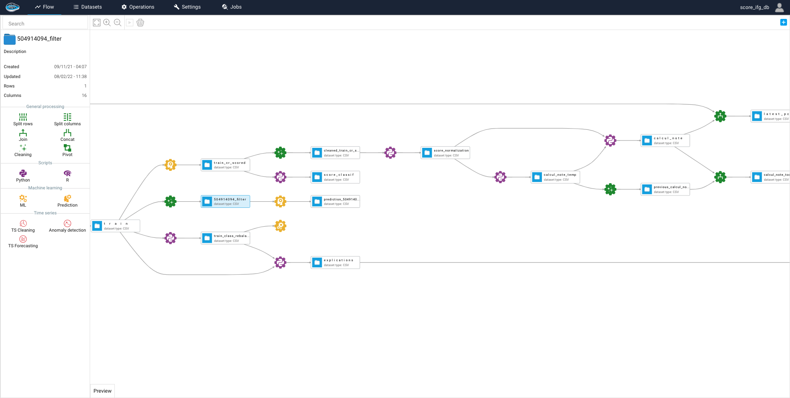

# Finalité

Le **Plan de Continuité d’Activité** (PCA) a pour objectif de décliner la stratégie et l’ensemble des dispositions qui sont prévues pour garantir à **Datategy** la reprise et la continuité de ses activités à la suite d’un sinistre ou d’un événement perturbant gravement son fonctionnement normal.

Le PCA permet de garantir que le personnel et les actifs de **Datategy** sont protégés, et adresse les prérequis pour (1) atténuer le risque et les conséquences d’un événement perturbateur, (2) récupérer les actifs critiques, reprendre les services et les opérations le plus vite et le plus efficacement possible.
Le PCA prévoit à minima d’atténuer les effets et dommages de situations exceptionnelles si elles ne peuvent pas être prévenues dans leur entièreté.

# Contexte

Datategy est un éditeur de logiciel Français et commercialise une solution d’Entreprise IA permettant de créer, piloter et surveiller des applications d’IA. L’entreprise est basée en France et opère en France.

En adoptant le travail à distance, Datategy a dû adapter ses processus opérationnels ; par conséquent Datategy n’est pas exposée aux risques classiques de perturbation tels que la défaillance d’équipement, coupures d’électricité, coupure de télécommunication, attaques terroristes, incendies ou désastres naturels.

# Rôles and responsabilités

Datategy a constitué un comité PCA, responsable de :

- Approuver les changements et les exceptions majeures de la stratégie de continuité
- Implémenter, exécuter et surveiller le plan et la stratégie de continuité

Le comité est notamment composé du CEO, CTO et d’ingénieurs DevOps. Le comité PCA a développé une stratégie basée sur les étapes suivantes :

- Définir les actifs et unités critiques pour le business
- Identifier les principaux risques et impacts business pour chaque actif/unité
- Déterminer quels contrôles doive être mis en place pour atténuer les risques
- Définir un plan de récupération 
- Définir les rôles et les responsabilités
- Définir un plan de test et la fréquence de ces tests
- Définir un Return Time Objective (RTO) et un Return Point Objective (RPO)

# Actifs critiques

Les interruptions associées aux bâtiments, système de calculs, infrastructure, communications, hardware, données, personnels, et autres actifs décrites ici posent un risque pour la fourniture des services de Datategy :

- **Environnement d’essai** : l’environnement d’essai papAI est hébergé chez le fournisseur OVHCloud. Un ensemble de machines et une infrastructure sont utilisés pour fournir un accès à des clients souhaitant tester la solution. Cet ensemble inclut notamment des machines virtuelles, des conteneurs et des logiciels.
- **Environnement de build** : l’environnement de build est hébergé chez le fournisseur OVHCloud. Un ensemble de machines et une infrastructure sont utilisés pour builder et délivrer les applications papAI aux clients de Datategy. Cet ensemble inclut notamment des machines virtuelles, des conteneurs et des logiciels.
- **Back office** : les opérations back office font référence aux bâtiments, procédures et unités supportant les opérations de Datategy (Finance, RH, R&D, DevOps, Delivery, Support client). La plupart des actifs back office n’impactent pas de fonctions ou services client critiques.

# Recovery time obective (RTO) et Recovery point objective (RPO)

**L'objectif de point de récupération** (RPO) est la période maximale pendant laquelle les données peuvent être perdues suite à un incident majeur.

**L' objectif de délai de récupération** (RTO) est la durée dans laquelle un service doit être restauré après un incident.

| Services                     	| RTO       	| RPO               	|
|------------------------------	|-----------	|-------------------	|
| Environnement d’essai papAI  	| 6 heures  	| jusqu’à 12 heures 	|
| Environnement de build papAI 	| 6 heures  	| jusqu’à 12 heures 	|
| Back office Datategy         	| 48 heures 	| jusqu’à 72heures  	|

# Procédure

## Évaluer

Une procédure d’évaluation est initiée pour les évènements non-résolus affectant la disponibilité des services pour une période donnée. Les responsables d’unités affectées rassemblent une équipe interne qui aura pour responsabilité d’évaluer et de déterminer la criticité et le degré de l’interruption, une estimation du temps de récupération, permettant de décider s’il faut activer le PCA.

Le PCA peut être invoqué :

- Lorsque la récupération à la suite d’un incident est incertaine et si la perturbation ne peut être résolue dans un période raisonnable
- Lorsque la résolution d’un incident a un impact sur la conformité au SLA de clients critiques

La procédure d’évaluation adressera à minima les aspects suivants :

- Potentielles causes d’origine
- Périmètre initial des services ou environnements affectés
- Stabilité des environnements affectés
- Estimation du temps de récupération

## Notifier

Le cas échéant, Datategy maintient une liste de contact d’urgence à contacter (clients, partenaires, personnels) et à tenir informer de l’état des services délivrés par Datategy, par exemple à propos d’une maintenance planifiée qui pourrait causer une interruption non conforme au SLA et clauses de service.

## Agir

Afin d’adresser les risques, Datategy a conduit une analyse des perturbations possibles et une analyse d’impact pour chaque fonction critique de l’entreprise. Ces analyses sont utilisées comme base du plan et de la stratégie du PCA.

### Sévérité 1 : Incident ayant un impact immédiat sur les clients Datategy et les activités utilisateur

**Perturbation des services OVHCloud**, spécifiquement les régions dans lesquels l’environnement d’essai et l’environnement de build sont hébergés.

- **Effet 1** : La dégradation ou la perte des services OVHCloud rend l’environnement d’essai indisponible. Les utilisateurs en phase d’essai de la solution sont affectés et peuvent observer de fortes perturbations dans leurs activités.
- **Effet 2** : La dégradation ou la perte des services OVHCloud rend l’environnement de build indisponible. Les releases, patches et corrections de bugs sont développés et testés dans des environnements de build avant d’être livrés en production ou sur l’environnement d’essai ; ces déploiements de test peuvent être perdus ou indisponibles.
- **Solutions** : Suivant la durée et la nature de la dégradation des services du fournisseur, la solution consiste à attendre pour une durée maximale la restauration des services ou de provisionner un nouvel environnement de build. En utilisant des snapshots des machines virtuelles, la récupération depuis ces sauvegardes est relativement rapide.

**Indisponibilité du personnel de support en cas d’urgence client.**

- **Effet 1** : Le temps de réponse n’est pas conforme aux exigences de support.
- **Solutions** : Les urgences client sont prises en charge par toute personnes effectuant une ronde d’astreinte. Les urgences déclenchent également des notifications dans la messagerie interne Datategy, alertant toute l’entreprise sur un canal général.

**Perturbation du système de remontée de billet.**

- **Effet** : Le processus et l’activité de support sont perturbés.
- **Solutions** : Lorsqu’un délai de 4 heures est atteint, les demandes de contact sont redirigées vers les adresses électroniques des membres du support.

### Sévérité 2 : Incident dépassant une période de 72 heures et ayant un impact sur la capacité de Datategy à poursuivre ses activités de back office

**Perturbation des services de productivité Salesforce, Google Workspace**

- Pas de solution de contournement établie à ce jour.

### Sévérité 3 : Incident non critique

**Perturbation de la messagerie interne Slack**

- En cas d’indisponibilité du service Slack, le personnel Datategy est invitée à utiliser la messagerie WhatsApp

## Apprendre

Lorsque le PCA est activé, une analyse des causes d’origine est conduite et sert de référence pour examiner les leçons tirées. L’analyse doit conduire à la revue des conditions de déclenchement et d’exécution du PCA ; et doit donner lieu à l’élaboration de mesures visant à prévenir l’occurrence d’incidents similaires. Si la réactivité à un scénario donné peut être améliorée, le PCA et les actions doivent mis à jour en conséquence. 

## Prévenir

- Transférabilité entre fournisseur Cloud : L’infrastructure Datategy (basée sur des outils open-source conteneurisés) est hébergée chez OVHCloud et peut facilement être déplacée chez un autre fournisseur (Amazon, GCP, Azure). Ces fournisseurs sont sujet à des standards stricts de SLA et de récupération de services.
- Usage de services SaaS : Datategy exploite différentes solutions SaaS dans le cadre de ses opérations. Ces fournisseurs de solution SaaS sont sujet à des standards stricts de SLA et de récupération de services. En exploitant des solutions SaaS, la fourniture des services Datategy ne dépend pas de la présence sur site.
- Organisation adaptée au distanciel : Datategy a adaptée ses méthodes de travail afin de supporter le travail à distance, atténuant le besoin d’être présent sur un site donné pour maintenir la fourniture des services. Le personnel Datategy est équipé pour supporter des périodes de travail étendues en distanciel.
- Surveillance de l’infrastructure : Les composants critiques sont surveillés et des alertes sont remontées aux parties prenantes adéquates, les équipes de maintenance et les équipes DevOps afin d’assurer une forte réactivité.
- Validation des développements : Les procédures de développement et de livraison sont basées sur les principes déploiement continu. Chaque développement est strictement revu et testé afin d’assurer qu’ils n’introduiront pas d’incidents.
- Sauvegarde et récupération : Les composants critiques sont sauvegardés quotidiennement et les sauvegardes sont conservées 7 jours. Ces sauvegardes son validées quotidiennement pour en assurer la fiabilité et des tests de récupération sont conduits tous les trimestres.

## Tester

Tester le PCA permet de vérifier l’efficacité des procédures, de former les participants aux scénarios réels et d’identifier des pistes d’amélioration. Le PCA est testé à minima une fois par an.
Afin de mesure l’efficacité du PCA, des scénarios de test et des indicateurs mesurables sont définis par les responsables d’unités.

Les tests suivants sont conduits : 

- Test annuel de la reprise après sinistre
- Test trimestriel de récupération de données
- Test annuel de connectivité
- Test annuel des pratiques à distance
- Test mensuel d’évacuation du site
- Test annuel d’incident de sécurité
