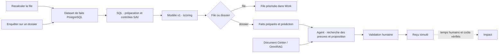

# Luma — un System, une application, un parcours hybride

La business app Réclamations utilise un seul System opérationnel :
**Luma — Résolution SAV hybride**. Sa file et ses enquêtes partagent la lecture
PostgreSQL, la préparation du dataset et le modèle v1. L’agent rapproche ensuite
ces faits et cette prédiction des documents, avant la validation humaine.

Cette livraison remplace l’activation à deux Flows décrite dans la précédente
version de [DATAOPS-MLOPS.md](DATAOPS-MLOPS.md). Le code doit être déployé par
l’opérateur avant cette activation. Les objets natifs d’apprentissage et de
bootstrap sont déjà présents dans Showcase ; la composition n’est pas encore
activée sur le site au moment de cette livraison.

## Un Flow commun



Les deux actions sont des bindings Work natifs de la même publication :

| Action | Binding | Entrée du Flow |
|---|---|---|
| Enquêter sur un dossier | `showcase.claims.investigate` | `source.request`, un `claim_id` autorisé |
| Recalculer la file | `showcase.claims.refresh_queue` | `source.queue`, payload vide |

L’entrée figée dans le Run détermine le périmètre : un dossier ou les 23
dossiers autorisés. Un argument d’agent ne peut ni choisir une autre cohorte,
ni changer le SQL ou la version du modèle. Le recalcul ne lance aucune enquête
et ne demande aucune approbation financière. Les deux opérations conservent
les contrôles Work de publication, d’audience, de confirmation et d’idempotence.

**DataOps a un effet métier.** Chaque exécution matérialise un snapshot daté
dans Data Center, puis un dataset préparé. Le SQL ajoute les indicateurs
`evidence_gap` et `duplicate_refund_check`. Ces indicateurs entrent réellement
dans le contexte de l’agent et orientent la recherche des pièces et du reçu
antérieur. Le dataset préparé reste le parent du dataset scoré.

**MLOps a un effet métier.** Le scoring utilise l’artefact réel du modèle
`67ee9f56-0a79-4ad6-b550-a932fa0d6e78`, version 1. La probabilité `score_1`
ordonne la file et conseille la priorité du dossier ; la version servie et les
datasets sont liés au Run. Les faits relus, les documents cités et les gardes
existantes déterminent la résolution. Une erreur de lecture, préparation,
scoring ou lignage arrête le parcours avant l’agent.

Le bandeau **Parcours Luma** donne accès à PostgreSQL, au dataset préparé de
la file, au modèle, au dataset scoré et au **Flow Luma**. L’enquête expose aussi
les données préparées et la prédiction de son propre dossier. Les actions
secondaires conservent les proportions et les tokens visuels du chrome.

## Historique d’apprentissage conservé

Les Systems techniques `04aaadef-e8d7-4614-aea0-454d08652e15` (entraînement)
et `7477fafa-574b-479f-aea3-b8a5ac1fb540` (bootstrap) passent à `retired`.
Ils disparaissent de la liste active, avec un lien vers le System Luma dans
leurs métadonnées. Leurs versions, Runs, datasets et modèle restent conservés
et consultables par lien historique. Aucune donnée n’est supprimée.

L’entraînement n’est pas rejoué à chaque dossier. Model Center reste l’entrée
pour ses métriques, son dataset et son historique. La composition sert une
version épinglée ; elle n’ajoute pas un réentraînement automatique. Les
[résultats d’apprentissage](DATAOPS-MLOPS.md) portent sur 1 200 dossiers
synthétiques et ne mesurent pas un gain en production.

## Activation par l’opérateur

Déployer le commit de cette livraison depuis `origin/demo/agentic`, via le
miroir Bitbucket et le [runbook VM sûr](../../ops/agentium-safe-vm-deployment.md).
Vérifier la révision du backend, du worker et du frontend. Aucun changement de
schéma SQL, de credentials PostgreSQL, d’ingestion ou de modèle n’est requis.

Depuis le checkout propre déployé, produire la revue sans appliquer :

```bash
cat docs/demo-runs/showcase-ecommerce/fixtures/dataops/live_composition_plan.json |
  docker exec -i agentium-backend python -m scripts.activate_ecommerce_composition \
    --workspace agentium-showcase \
    --actor-user-id 06a2e190-ae2d-4365-b4f3-9952401f531d \
    > /tmp/luma-composition-review.json
```

Le [plan figé](fixtures/dataops/live_composition_plan.json) cible le System
principal v3, la release Work 2, le modèle v1 et les publications/drafts des
deux Systems techniques constatés le 6 octobre 2026. Il refuse un changement
métier non publié, une publication différente, un autre binding sur un System
à archiver ou une release Work différente.

La revue inclut le Flow de **20 nodes et 22 edges**, les pages Work, le nouveau
binding, le modèle épinglé, le nom principal et les deux archivages. L’empreinte
`composition_sha256` couvre cet ensemble, au-delà du seul graphe.

Cibles revues le 6 octobre 2026 :

- Flow : `0ffa1ee16b3eba0a6ff9c6660e1b68541bc973470115ddb40959b6678d661a58`.
- Composition : `53070b6cc9a1635eba17ce10a32381253b9df0352e864a7660abce0ba61c41fa`.

Si la revue opérateur diffère, arrêter et revoir l’état
courant ; ne pas substituer automatiquement une nouvelle empreinte.

```bash
cat docs/demo-runs/showcase-ecommerce/fixtures/dataops/live_composition_plan.json |
  docker exec -i agentium-backend python -m scripts.activate_ecommerce_composition \
    --workspace agentium-showcase \
    --actor-user-id 06a2e190-ae2d-4365-b4f3-9952401f531d \
    --apply --expected-composition-sha256 53070b6cc9a1635eba17ce10a32381253b9df0352e864a7660abce0ba61c41fa \
    > /tmp/luma-composition-activation.json
```

L’activation publie le Flow commun, épingle les deux bindings Work sur cette
publication, crée et déploie une release Work, puis archive les deux Systems
techniques dans la même transaction. Elle conserve les versions et releases
précédentes. Conserver le reçu d’activation et ses IDs. Ne pas rejouer
`install_ecommerce_demo`, `activate_ecommerce_triage` ou les seeds historiques.

## QA après activation et trame de présentation

1. Ouvrir [Réclamations](https://agentium.papai.ai/work/reclamations/studio).
   Le bandeau affiche le modèle mais aucune priorité avant le premier recalcul
   de la nouvelle publication. Le bootstrap ancien ne devient pas un résultat
   de la composition.
2. **Recalculer la file** : vérifier un Run terminé sur le System principal,
   entrée `source.queue`, trois Skills de lecture/préparation/scoring, 23 lignes
   dans les datasets préparé et scoré, sans agent, approbation ni reçu financier.
   Montrer le lignage et l’ordre de priorité.
3. **Flow Luma** : montrer les deux entrées et le chemin partagé. Ouvrir le node
   PostgreSQL, puis les tables Luma ; inspecter le SQL et le modèle v1 ; suivre
   les cinq collections documentaires vers l’agent.
4. Enquêter sur RC-1042, RC-1043 et RC-1044 depuis Work. Chaque Run utilise
   `source.request`, produit les datasets d’un dossier, rapproche les faits et
   le score, puis recherche les preuves. Les propositions restent : enquête
   transporteur pour la contradiction d’adresse, 49,90 € pour la perte
   confirmée, clôture du doublon déjà remboursé. La validation humaine précède
   tout reçu, qui reste explicitement simulé.
5. Vérifier FR/EN, clair/sombre, clavier et mobile. Les liens du dossier
   doivent viser ses artefacts, ceux du bandeau la file complète. Après 60 min,
   les priorités expirent ; le recalcul reste disponible.
6. Dans Systems, un seul System Luma opérationnel reste actif. Dans Model
   Center, l’historique d’apprentissage et ses datasets restent consultables.

La QA navigateur locale utilise des réponses API simulées pour les nouveaux
écrans. Les tests backend font réellement tourner le SQL natif, chargent un
artefact entraîné par le harness de production et scorent les datasets ; seul
l’étage externe documents/LLM est remplacé dans ces tests de branchement.
La QA du raccordement déployé reste à exécuter après le reçu opérateur.

Vérifications locales de cette livraison : **118 tests backend**, dont huit
tests de composition (invocations depuis les bindings de la release Work),
**1 937 tests unitaires frontend** et **22 scénarios navigateur** sur la
business app et les sources du Flow. Le graphe composé de 20 nodes a aussi été
parcouru en clair et sombre : aperçu PostgreSQL, navigation vers son consommateur,
modèle et version sélectionnés, zéro violation Axe dans l’inspecteur de source.
La compilation de production passe avec l’inlining des polices externes
désactivé pour le réseau local ; la configuration du dépôt est conservée.
Les limites du contrôle global pré-commit dues à la dette existante du dépôt
restent décrites dans [DATAOPS-MLOPS.md](DATAOPS-MLOPS.md).

## Impact

Le [protocole humain](ROI-PROTOCOL.md) conserve dix paires manuel/assisté et
**40 €/h, hypothèse de démonstration**. Aucune paire humaine n’est encore
terminée. Les gains, coûts incrémentaux, bénéfice net et ROI restent inconnus.
Les opérations DataOps/MLOps du dossier sont tracées dans son Run ; les coûts
de préparation de file et d’apprentissage doivent aussi être documentés et
alloués avant toute annonce de ROI. Un tarif catalogue nul ne prouve pas un
coût d’infrastructure nul.

Les aides automatiques restent masquées pendant une condition manuelle ou
inconnue. Le serveur refuse aussi une nouvelle exécution composée lorsqu’une
session manuelle de l’opérateur est active ou en pause. La QA automatique
n’alimente pas les temps humains ni les gains du benchmark.
