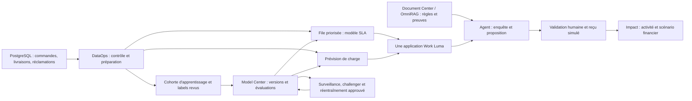

# Luma : couvrir les nouveautés dans un parcours métier cohérent

Analyse du 9 octobre 2026. **Proposition de préparation, pas reçu d’activation.**
Le code examiné et les deux révisions déployées (frontend/backend) sont
`fd7d4055a37e3173f21cf0dc3e1d5a070333e5b9`. Les contrôles du workspace
`agentium-showcase` ont été effectués en lecture seule par HTTPS authentifié,
vers 16 h 31–16 h 36, heure de Paris. Pas de nouvelle QA visuelle navigateur :
Chromium rencontre une erreur de confiance du certificat dans cet environnement.
La révision documentaire Hugging Face `03be93a4`, arrivée pendant l’analyse,
est également prise en compte ; elle ne livre pas de nouveau code exécutable.

Le principe reste celui demandé : utiliser et configurer les fonctions produit ;
combler les trous par des composants génériques. Les données, noms, politiques et
hypothèses Luma sont une configuration de showcase. Ils ne justifient pas un écran,
une carte Impact ou une branche de runtime spécifique à cette démonstration.

## Promesse et architecture

**« Luma absorbe un pic de réclamations sans perdre la maîtrise des délais, des
décisions et des coûts. »**

Une seule application Work et un seul System métier portent cette promesse.
Le conseiller traite les dossiers ; le responsable anticipe la charge ; le
référent data améliore les modèles avec des preuves et des validations humaines.
Ces rôles de présentation ne constituent pas, à eux seuls, une preuve de RBAC.

La navigation proposée dans Work est **À traiter · Charge et capacité ·
Amélioration · Historique**. Le dossier s’ouvre depuis la file. Les datasets,
documents, versions de modèles et Runs s’ouvrent par des liens contextuels vers
les écrans produit existants, avec retour au dossier ou à la file.

Le System métier aura plusieurs entrées explicites : recalculer la file,
enquêter sur un dossier, produire une prévision. L’apprentissage et la
surveillance ont leur propre cadence ; ils ne sont pas relancés pour chaque
réclamation. Le produit crée aujourd’hui des Systems techniques de monitoring :
ils doivent être rattachés au modèle et distingués du portefeuille métier.
« Une application et un System métier » ne signifie donc pas supprimer les
objets techniques nécessaires à MLOps.

## Ce qui est réellement disponible

| Objet | Constat du 9 octobre | Conséquence pour la préparation |
| --- | --- | --- |
| Runtime ML | Cinq familles disponibles : tabular, forecasting, forecasting_deep, tabular_deep, clustering. Serving de prévision et des modèles deep disponible. | Les nouvelles familles peuvent être préparées sur des données Luma. Disponibilité ne vaut pas qualification de tous les parcours Luma. |
| Modèles | Neuf versions réparties sur quatre lignées : modèle SLA Luma, qualification Lot 5, qualification Chronos, qualification MiniLM. | Les modèles de qualification prouvent une exécution technique ; leurs métriques ne sont pas des résultats Luma. |
| SLA Luma | v1 champion, AUC 0,858 sur son jeu synthétique, 26 lignes scorées. Aucun label de résultat observé dans le monitoring. | Préparer une version récente et sa cohorte de feedback avant de raconter une amélioration mesurée. |
| Monitoring Luma | Surveillance planifiée et shadow désactivés ; nouvelles références statistiques absentes de l’ancien artefact. | Un nouveau fit est nécessaire pour les nouveaux tests de drift. |
| Catalogue MLOps | `ml_monitor_model_v1` et `ml_retrain_model_v1` sont installés mais filtrés comme `unclaimed` : aucune Capability porteuse. Un réentraînement technique a pourtant produit un challenger v2. | La configuration par Model Center peut fonctionner ; la découverte et l’inspection des Skills dans le catalogue/palette doivent être corrigées. |
| Données | Historique brut 1 236 lignes, préparé 1 200 ; file de 23 dossiers. Historique daté de 2025, sans verbatim et sans saisonnalité métier intentionnelle. | Étendre les fixtures de manière cohérente avant forecasting et classification de texte. |
| Sources | Catalogue PostgreSQL accessible : sept tables. Six collections Luma prêtes : 47 documents, dont une archive. | Conserver le drill-down PostgreSQL/datasets et les preuves documentaires du dossier. |
| Flow métier publié | v3, 13 nodes/13 edges, agent, sources, décision, validation et reçu. Aucune étape DataOps/ML native dans ce graphe publié. | La composition documentée à 20 nodes n’est pas activée. Le déploiement de code ne l’active pas automatiquement. |
| Work | Une seule action publiée : `showcase.claims.investigate`. Triage : `not_configured`. | Raccorder d’abord la file et le scoring au même System avant d’ajouter la prévision. |
| Impact | Vue générique par défaut « SAV — activité et scénario », périmètre System Luma, 7 jours, activité et scénario financier configurés. | Réutiliser Personnaliser, les composants génériques et le périmètre enregistré. Aucune carte Luma codée en dur à ajouter. |

La révision 12 du draft du Flow contient aussi des différences de contexte RAG,
pas seulement des positions de nodes. Le plan de [composition](COMPOSITION.md)
du 6 octobre doit être rapproché de ce draft avant publication : conserver le
contrôle d’empreinte et revoir les différences, sans forcer une ancienne activation.

Sur les sept jours glissants au 9 octobre, l’API Impact expose **20 tentatives,
12 terminées, 8 échouées et 204 invocations**. Sur 30 jours, elle retrouve
**23 tentatives, 15 terminées et 231 invocations** : les trois exécutions du
2 octobre sont sorties de la fenêtre de sept jours. Les 20 autres sont datées
du 6 octobre UTC, soit du 7 octobre en France. Cette différence de fenêtre et de
fuseau doit rester compréhensible dans la lecture de l’activité.

## Déroulé principal : 15 minutes

| Acte | Scène dans la même application | Décision métier et preuve à montrer |
| --- | --- | --- |
| 1 — Anticiper, 2 min | Charge et capacité : historique, prévision et incertitude ; ouvrir le document décrivant la campagne commerciale. | Le responsable identifie un pic et prépare la capacité. Distinguer ce que prévoit le modèle de ce que le document explique. |
| 2 — Prioriser, 2 min | À traiter : recalcul de file, risque SLA, fraîcheur, version du modèle. Ouvrir une ligne puis sa source PostgreSQL. | Traiter d’abord les dossiers à risque ; montrer préparation SQL, dataset et score reliés au Run. |
| 3 — Résoudre, 5 min | Dossier RC-1042 : faits de commande/livraison, preuve documentaire contradictoire, enquête agent, proposition et validation humaine. | Montrer pourquoi l’agent ouvre une enquête transporteur. RC-1043 (perte confirmée) et RC-1044 (déjà remboursé) servent de variations courtes. Les reçus restent simulés. |
| 4 — Améliorer, 4 min | Amélioration puis Model Center : labels revus, alerte déjà produite, comparaison d’un challenger et décision humaine. | Montrer une boucle vérifiable. Les entraînements et alertes sont préparés avant la présentation ; une promotion n’est jamais implicite. |
| 5 — Valoriser, 2 min | Impact : activité du System, échecs inclus, coûts connus/inconnus, puis scénario financier. | Distinguer l’activité observée du gain de capacité projeté. Retrouver un Run depuis sa preuve. |

Le parcours principal garde les noms métier. Les approfondissements ci-dessous
permettent de couvrir chaque nouveauté en ouvrant son écran natif au bon moment.
Une variante spécialisée peut choisir l’étiquetage ou le réentraînement comme
temps fort de l’acte 4 ; elle n’impose pas tous les réglages à chaque audience.

## Matrice de couverture des nouveautés

**État** : « à préparer » = capacité produit existante, données/configuration Luma
à préparer ; « écart Work » = restitution générique à compléter ; « spécification »
= non activable dans cette révision. Le cœur documentaire et agentique reste le
socle du parcours, même lorsqu’il ne s’agit pas d’une nouveauté ML.

| Capacité produit | Utilité dans l’histoire Luma | Où la montrer / préparation | État |
| --- | --- | --- | --- |
| PostgreSQL, datasets, SQL et lignage | Fiabiliser la file avant toute décision | Work → Flow → source, dataset brut/préparé/scoré ; activer la composition après revue du draft | À raccorder |
| Document Center, OmniRAG, boucle agent, HITL | Confronter politique et preuves puis justifier la décision | Acte 3 ; documents du dossier, choix des outils, approbation, reçu | Socle déjà actif |
| Studio/Flow : options ML partagées | Retrouver la même configuration du modèle depuis le Flow ou Model Center | Inspecteur modèle et configuration d’entraînement versionnée | À préparer |
| Calibration et seuil portable | Comprendre le score SLA et le compromis précision/rappel | Modèle tabulaire récent ; comparer calibration et confusion selon le seuil | À préparer ; écart Work pour les seuils métier |
| Tuning Optuna borné | Chercher un meilleur challenger dans un budget explicite | Comparer une baseline et une recherche sur le même split ; ouvrir essais, durée et métrique tenue à part | À préparer |
| Explain pack : arbre substitut, PDP/ICE, groupes | Expliquer le comportement global et repérer les sous-groupes moins bien servis | Approfondissement Model Center : fidélité, effets des variables et effectifs | À préparer |
| Régression et intervalles conformes | Estimer une durée calendaire de résolution avec incertitude | Modèle annexe de durée ; intervalle et couverture sur jeu de test | À préparer, hors parcours court |
| Encodages de texte classiques | Exploiter le message initial du client pour qualifier sa demande | Baseline texte sur verbatims FR/EN, avec même protocole de test que les alternatives | À préparer |
| Étiquetage LLM avec budget et reprise | Accélérer la constitution d’une cohorte de motifs SAV | Dataset → étiquetage structuré → revue humaine canonique ; montrer budget et erreurs | À préparer |
| Distillation après revue | Confier la qualification répétitive à un modèle plus léger | Comparaison enseignant/élève/labels humains sur les mêmes lignes de test | À préparer |
| MiniLM multilingue figé | Comparer une représentation sémantique des messages FR/EN à la baseline | Model Center, famille tabular_deep ; provenance du modèle local et performances Luma | Runtime prêt ; modèle Luma à préparer |
| KMeans numérique | Repérer des cohortes de dossiers pour une action d’équipe | Profils, tailles et stabilité ; nommer les groupes après inspection métier | À préparer, approfondissement |
| Drift statistique et feedback | Détecter une évolution des populations et de la qualité SLA | Nouveau modèle, références, fenêtres, labels de résolution réellement disponibles | À préparer |
| Challenger en shadow asynchrone | Comparer une version sans changer la réponse utilisée par le SAV | Deux versions tabulaires compatibles ; taux de sélection, jobs et comparaison | À préparer |
| Monitoring planifié et réentraînement approuvé | Passer d’une alerte à un challenger traçable | Politique → alerte → proposition → HITL → nouvelle version ; décision de promotion distincte | À préparer ; classement des Systems techniques à améliorer |
| Prévision classique et tuning temporel | Anticiper les volumes sans fuite depuis le futur | Historique régulier, baseline saisonnière, validation temporelle et recherche bornée | À préparer ; écart Work pour la courbe |
| Prévisions vs observations et réentraînement | Vérifier les prévisions émises puis réapprendre sur l’historique observé | Émettre avant les dates cibles, attendre leurs observations, associer et revoir le candidat | À préparer avec délai réel |
| Chronos local zero-shot | Comparer une prévision prête à l’emploi aux modèles classiques | Mêmes séries et coupures ; quantiles et qualité mesurée, sans prétendre entraîner ses poids | Runtime prêt ; modèle Luma à préparer |
| Runtime ml-deep isolé et poids locaux | Rendre l’exploitation des modèles explicite et reproductible | Approfondissement technique : disponibilité, versions, artefacts provisionnés, coûts | Disponible et utilisé par les modèles de qualification |
| Impact personnalisable | Réunir activité, preuves et hypothèses de valeur dans une vue choisie | Personnaliser → périmètre Luma → composants → ordre → vue par défaut | Déjà configuré ; compléter les mesures humaines |
| Connecteur Hugging Face | Future acquisition gouvernée de modèles/datasets | Mention de feuille de route uniquement : [spécification](../../agentium-huggingface-connector.md) | Spécification, pas implémentation |

La spécification Hugging Face révisée ajoute un prolongement cohérent : importer
un dataset rejouable avec sa révision et sa provenance, puis provisionner les
modèles locaux via des artefacts vérifiés au lieu d’une copie opérateur. Les lots
HF-2 et HF-3a portent ces usages. Les adaptations RAG et LLM sont des extensions
ultérieures du même registre, pas un prérequis à Luma. Un dataset public éventuel
doit rester identifié comme source externe, sans se confondre avec l’activité SAV.

## Compatibilités à respecter

| Famille / parcours | Ce qui se combine | Limites à garder visibles |
| --- | --- | --- |
| Tabular classification | Options Lot 2, labels revus/distillation selon le parcours, drift, shadow compatible, réentraînement supervisé | Calibration : au moins 200 lignes de calibration et 20 par classe. Avec 1 200 lignes, split 75 % puis calibration 20 %, il ne reste que 180 lignes : calibration sautée avec avertissement. Seuils disponibles : 0,5, F1 ou Youden ; aucun optimum financier automatique. |
| Tabular regression | Tuning, explications, intervalles conformes selon configuration ; drift, shadow compatible et réentraînement approuvé | Une durée de résolution comprend de l’attente ; ce n’est pas le temps humain économisé. Les prédictions ne garantissent pas le SLA. |
| Forecasting classique | Observations associées, réentraînement approuvé et, pour les estimateurs éligibles, tuning temporel | Tuning pour boosting/forêt/Ridge, pas ETS/ARIMA/naïf saisonnier. Réentraînement soumis à la cohérence fréquence, observations et covariables. |
| Chronos / forecasting_deep | Poids locaux figés, prévision zero-shot et quantiles | Pas de covariables exogènes, de tuning classique ni du parcours de réentraînement TS-B. Au plus 32 séries, contexte 512, horizon 1–64, backtests 1–5. |
| MiniLM / tabular_deep | Une colonne texte explicite, embeddings figés, réduction et estimateur supervisé | Pas de CV, Optuna, calibration, seuil optimisé, intervalles, explain pack, shadow ou réentraînement planifié de la famille tabular. Ces embeddings ne sont pas ceux d’OmniRAG. |
| KMeans / clustering | 1–50 features numériques, 2–20 groupes, jusqu’à 50 000 lignes, profils et stabilité | Pas de cible, probabilité de classe, texte/catégories natifs, choix automatique de K, parcours supervisé de feedback/shadow ou réentraînement planifié. Les numéros de clusters ne sont pas stables entre versions. |

L’arbre substitut explique approximativement le modèle ; afficher sa fidélité.
PDP/ICE ne prouvent pas une causalité. Les comparaisons de groupes nécessitent des
effectifs suffisants. Ces vues globales ne doivent pas devenir une justification
locale inventée dans le dossier.

## Préparer des données qui racontent la même histoire

1. **Un historique cohérent et daté.** Étendre les fixtures avec des volumes
   quotidiens réguliers, des pics explicitement synthétiques et des dates adaptées
   à la session. Conserver les clés dossier/commande/livraison, les contrôles de
   qualité et les datasets dérivés. L’historique uniforme de 2025 ne démontre pas
   à lui seul une saisonnalité promotionnelle.
2. **Des textes disponibles au moment de la décision.** Ajouter des messages
   initiaux FR/EN et une taxonomie métier stable. Isoler les dossiers de
   présentation, le test tenu à part et les cohortes d’apprentissage. Une
   information connue seulement à la clôture ne devient pas une feature d’entrée.
3. **Des résultats distincts des décisions.** Le label SLA est « résolution après
   72 h » constaté à la clôture, pas « remboursement approuvé ». Le motif du
   message et la durée de résolution constituent des cibles différentes.
4. **Une revue humaine réelle.** Prévoir quelques centaines de verbatims si le
   parcours texte est retenu. Le validateur revoit la cohorte exportable, pas
   seulement les trois lignes d’aperçu. Garder les corrections, rejets et coûts
   de cette revue. Un accord entre enseignant et élève n’est pas une vérité terrain.
5. **Un contexte documentaire commun.** Ajouter le calendrier de campagne et
   les consignes de capacité comme documents versionnés. L’agent les cite ; le
   modèle de prévision n’est crédité que des entrées qu’il consomme effectivement.
6. **Une chronologie MLOps vérifiable.** Le parcours de réentraînement supervisé
   exige un champion en alerte et au moins `max(40, ML_TRAIN_MIN_ROWS)` appels
   labellisés dans la fenêtre des 400 derniers appels. Le feedback actuel porte
   sur la première ligne de chaque appel, pas sur toutes les lignes d’un batch.
   Émettre les prévisions avant leurs dates cibles ; attendre les
   observations échues. Viser au moins 20 intervalles évaluables pour le badge de
   couverture. Les backtests restent identifiés séparément.

Toutes ces données restent des données de démonstration identifiées comme telles.
Une exécution et sa durée peuvent être réellement mesurées sur ces données ; cela
ne transforme pas le cas synthétique en résultat commercial réalisé.

## Quatre compléments produit génériques

**1. Contrat de prédiction dans Work.** La file actuelle utilise une cible
`resolution_over_72h`, une classe positive `1` et des seuils de bandes 0,60/0,35
spécifiques au parcours existant. Un seuil F1/Youden du modèle ne change pas ces
bandes. Faire évoluer le contrat du bloc vers une configuration explicite :
cible, classe, score/unité, bandes, version, fraîcheur et liens de provenance.
Classification, intervalle de régression et segment doivent conserver leurs
sémantiques. Le scénario Luma fournit les mappings, pas un nouveau composant.

**2. Série temporelle dans Work.** Les graphiques certifiés du runtime Work sont
actuellement `bar`/`donut`. Le composant de prévision de Model Center existe déjà,
mais le Skill de forecast renvoie principalement une référence de dataset et un
résumé. Ajouter un accès autorisé et borné à ce dataset et un bloc générique
historique/prévision/bande d’incertitude : mappings date, série, valeur, bornes,
unités, fraîcheur et provenance. En attendant, les KPI/tableaux et le lien vers
Model Center permettent une restitution utile avec les composants actuels.

**3. Propriété et visibilité des opérations de modèles.** Le monitoring crée un
System actif `Monitor · <modèle> · vN`, actuellement visible parmi les Systems
métier. Introduire une classification et un rattachement génériques, avec filtres
et navigation depuis Model Center. Garder les Runs et les coûts auditables ;
expliciter leur allocation au parcours métier dans Impact. Ne pas résoudre ce
problème en cachant globalement les Runs techniques ou en les supprimant.

**4. Découverte des Skills MLOps.** Les Skills de monitoring et de réentraînement
existent et sont appelables via les bindings du System créé par Model Center,
mais le catalogue du workspace les filtre comme `unclaimed`. Les rattacher à une
Capability produit appropriée dans le registre, puis réconcilier le catalogue.
Vérifier visibilité, inspection et ajout depuis le Flow. Une simple réinstallation
du seed actuel ne corrige pas le rattachement manquant ; ce 404 de découverte ne
signifie pas que le runtime de réentraînement est absent.

Pour ces écrans, réutiliser le chrome, les composants et la hiérarchie existants :
une action principale proportionnée par zone, actions de détail compactes,
unités et états lisibles, navigation clavier, clair/sombre, petits écrans et
états vide/chargement/erreur. L’application métier montre des décisions et leurs
preuves ; les hyperparamètres restent dans les écrans d’administration du modèle.

## Ordre recommandé et critères d’acceptation

| Priorité | Travail | Preuve attendue avant présentation |
| --- | --- | --- |
| P0 — terminer l’hybridation | Revoir le draft et activer la composition DataOps/ML/agent dans le System métier ; publier les bindings Work correspondants | Depuis Work, un Run traverse PostgreSQL → préparation → score → agent → HITL ; tous les liens mènent aux artefacts du même dossier. La file se recalcule séparément. |
| P1 — anticiper la charge | Préparer les séries et documents de campagne ; qualifier baseline/classique/Chronos ; ajouter la restitution générique Work | Comparaison sur les mêmes coupures, courbe lisible avec unités/incertitude, provenance et résultats inconnus explicitement affichés. |
| P1 — rendre la priorité intelligible | Nouveau modèle tabulaire, calibration éligible, contrat de prédiction configurable | Version, cible et bandes cohérentes de Model Center à Work ; test indépendant et absence de fuite de cible. |
| P2 — améliorer à partir des retours | Verbatims et labels revus ; comparaison hors ligne baseline texte/distillation/MiniLM. Cycle drift, shadow et réentraînement sur le tabular classique ; rattachement catalogue des Skills MLOps | Cohorte et décisions de revue consultables ; candidat distinct du champion ; aucune promotion ni preuve de qualité fabriquée. Systems techniques rattachés et identifiables, Skills découvrables. |
| P3 — couvrir les approfondissements | Régression/intervalles, explain pack, KMeans, tuning et observations de prévisions | Artefacts prêts à ouvrir, limites et effectifs lisibles ; observations seulement après échéance. Ces modules peuvent être préparés parallèlement à P1/P2. |
| Transverse — UX et valeur | QA end user puis Impact | Parcours FR/EN, clavier, clair/sombre et petit écran ; mêmes périmètre, période et fuseau compréhensibles ; coûts incomplets conservés comme inconnus. |

Les hypothèses financières validées restent **8 min manuelles, 2 min de travail
humain assisté, 40 €/h et 0,50 €/dossier de budget complet** : 3,50 € de bénéfice
net projeté par dossier et 700 % de ROI projeté, selon ce budget. Le volume
mensuel enregistré est absent : aucune projection mensuelle supplémentaire à
présenter sans hypothèse explicite. Les coûts de labellisation, revue,
entraînement, serving, shadow et monitoring doivent être documentés et répartis.
Ne pas les additionner une seconde fois à un budget annoncé « tout compris »
sans en redéfinir la convention. AUC, latence et durée calendaire de résolution
ne sont pas des mesures du temps humain économisé.

## Sources et reproductibilité de l’inventaire

Contrôles GET : `/api/v1/build-info`, `/build-info.json`,
`/api/v1/ml-models/catalog`, `/api/v1/ml-models`, `/api/v1/datasets`,
`/api/v1/connectors/postgresql/catalog`, `/api/v1/systems`,
`/api/v1/skills?include_filtered=true`,
`/api/v1/hypervisor/activity?window=7d&system_id=f3ea83de-df89-45ec-8a85-c00d676b2713`
et le même périmètre en `30d`, ainsi que configuration Impact, détails des
modèles/monitoring et publication Work du workspace. Ces contrôles décrivent un
instantané ; une nouvelle activation exige de relire l’état courant.

Références de préparation : [composition](COMPOSITION.md),
[DataOps/MLOps](DATAOPS-MLOPS.md), [protocole ROI humain](ROI-PROTOCOL.md),
[campagne d’activité](ACTIVITY-ROI-2026-10-07.md).

Références produit : [Lot 2](../../agentium-ml-lot2-verification.md),
[étiquetage](../../agentium-ml-lot4a-labeling.md),
[distillation](../../agentium-ml-lot4-distillation.md),
[drift](../../agentium-ml-lot5a-drift.md), [shadow](../../agentium-ml-lot5b-shadow.md),
[réentraînement supervisé](../../agentium-ml-lot5c-retraining.md),
[observations de prévisions](../../agentium-ml-ts-a-actuals.md),
[réentraînement temporel](../../agentium-ml-ts-b-retraining.md),
[tuning temporel](../../agentium-ml-ts-c-tuning.md),
[runtime deep](../../agentium-ml-lot6a-runtime.md),
[Chronos](../../agentium-ml-lot6b-foundation.md),
[MiniLM](../../agentium-ml-lot6c-embeddings.md),
[KMeans](../../agentium-ml-segmentation-kmeans.md).
