# Diagrammes d'architecture

## Orchestration RAG sur Azure — services managés



- **Source** : [rag-orchestration-azure.mmd](rag-orchestration-azure.mmd) · **SVG** : [rag-orchestration-azure.svg](rag-orchestration-azure.svg) · **PNG** : [rag-orchestration-azure.png](rag-orchestration-azure.png) (8768×1440, transparent)

Adaptation de la plateforme aux services managés Azure, **généralisée** (aucun
prérequis sur le contexte client : « métadonnées métier » = code projet, site,
version… selon le domaine). L'idée directrice : plusieurs étages développés
sur mesure deviennent de simples **paramétrages d'Azure AI Search**.

| Composant custom actuel | Service managé Azure | Paramétrages clés |
|---|---|---|
| Parsing + OCR maison | **Azure AI Document Intelligence** | modèle `prebuilt-layout` : OCR, structure, extraction de tableaux |
| Chunking + embeddings | **AI Search Skillset** (vectorisation intégrée) | Text Split skill (taille/overlap), Azure OpenAI Embedding skill |
| Qdrant (vecteurs + payload) | **Azure AI Search — index** | HNSW `m`/`efConstruction`/`efSearch`, champs `filterable`/`facetable`, analyseurs par langue FR/EN/DE |
| BM25 sparse + fan-out dense/sparse + fusion RRF | **AI Search requête hybride native** | vector + keyword en un appel, RRF intégrée, poids vectoriel ajustable par requête |
| Cross-encoder budgété (FlashReranker) | **Semantic Ranker** managé | `semantic configuration` (title/content/keywords), re-classement L2 |
| Fusion adaptative / boosts | **Scoring profiles** | boosts par tag, fraîcheur, magnitude |
| Filtre cross-périmètre (payload project_code) | **Filtres OData** `$filter` | filtrage serveur avant ranking — zéro fuite entre périmètres |
| Table facts + ledger PostgreSQL + historique | **Azure Cosmos DB** | conteneurs conversations/faits/runs, TTL, change feed |
| Object store local | **Blob Storage** | conteneurs brut/extrait/dérivé, SFTP natif, Event Grid |
| Orchestrateur + agents | **Azure AI Foundry** (Agent Service) ou Container Apps | GPT-4o/GPT-5, déploiements, quotas |
| Garde-fou grounding | **Azure AI Content Safety** | groundedness detection sur la réponse vs sources |
| Télémétrie decision steps | **Azure Monitor + App Insights** | latence par étage, taux de fallback |

**Ce qui reste applicatif** (bloc « raffinage résiduel ») : la mémoire
conversationnelle à budget de tokens avec entités du fil de discussion, la
diversité MMR + compression du contexte, le garde-fou « zéro source ➜ le
dire », et les budgets adaptatifs de génération — c'est la valeur métier
au-dessus des briques managées.

---

## Orchestration RAG — vue exécutive (implémentation actuelle)



- **Source** : [rag-orchestration-executive.mmd](rag-orchestration-executive.mmd) (Mermaid, layout ELK)
- **SVG** : [rag-orchestration-executive.svg](rag-orchestration-executive.svg) — fond transparent, vectoriel (zoom infini), prêt pour slides/docs
- **PNG** : [rag-orchestration-executive.png](rag-orchestration-executive.png) — fond transparent (RGBA), 2352×5205 (échelle ×3), pour PowerPoint/outils sans support SVG

### Lecture en 30 secondes

Six blocs, fil rouge : l'utilisateur a parlé du projet AKK200 puis demande
*« et pour celle-ci, quelle liste de pièces ? »*.

1. **Indexation** — les fichiers bruts (archives SFTP, uploads) sont enrichis
   au passage : `project_code`/`machine`/`wave_id` extraits des chemins,
   hash SHA-256 pour la déduplication, parsing/OCR, chunks 1000 caractères,
   embeddings 1536D.
2. **Storage** — rien n'est servi brut : Qdrant (vecteur + payload de
   filtrage), artefact BM25 versionné, table facts (lignes Excel devenues
   requêtables), object store (original/ingested/derived), ledger PostgreSQL.
3. **Question** — bypass des trivialités, mémoire conversationnelle à budget
   tokens avec entités saillantes (c'est elle qui retrouve « AKK200 » derrière
   « celle-ci »), defaults du workspace, routage par profil de latence
   (fast = voix, balanced = chat, deep = asynchrone).
4. **C-HAH** — fan-out parallèle : variantes de requête, dense (le sens) +
   sparse (les mots exacts) + exact-match fichiers/table-facts, fusion RRF
   pondérée selon la requête.
5. **Raffinage** — rerank policy, filtre cross-projet, cross-encoder budgété
   500 ms, MMR (flag), compression 0.7. Chaque étage a un budget temps et
   retombe proprement sur l'étape précédente.
6. **Génération** — garde-fou grounding (« pas de source fiable » plutôt
   qu'inventer), template de raisonnement (flag), budget de tokens adaptatif,
   streaming avec citations, persistance des entités pour le tour suivant.

### Régénérer le SVG

```bash
cd docs/diagrams
# SVG (vectoriel)
npx -y @mermaid-js/mermaid-cli -i rag-orchestration-executive.mmd \
    -o rag-orchestration-executive.svg -b transparent
# PNG haute résolution (transparent, échelle x3)
npx -y @mermaid-js/mermaid-cli -i rag-orchestration-executive.mmd \
    -o rag-orchestration-executive.png -b transparent --scale 3
```
