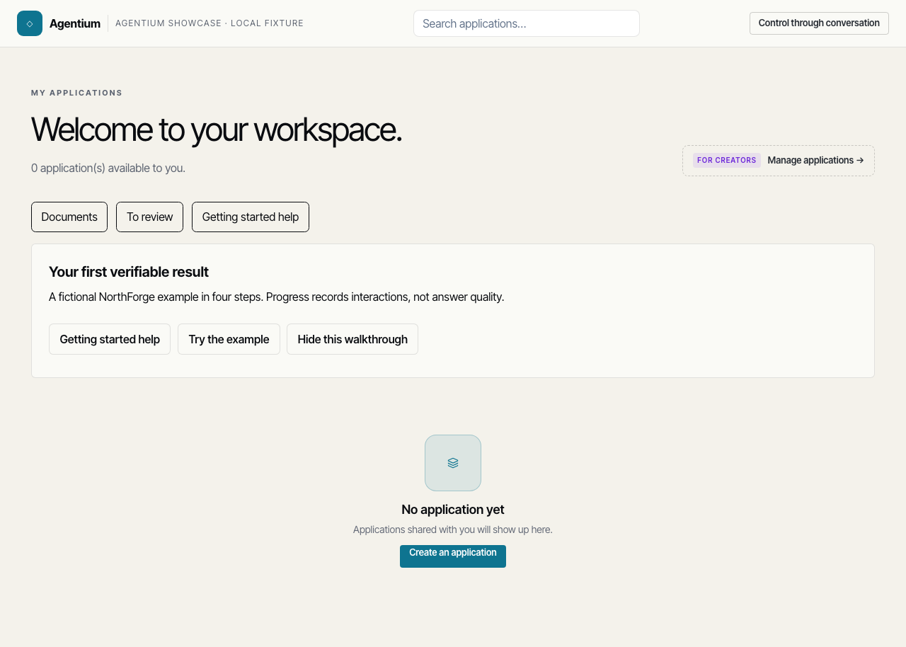
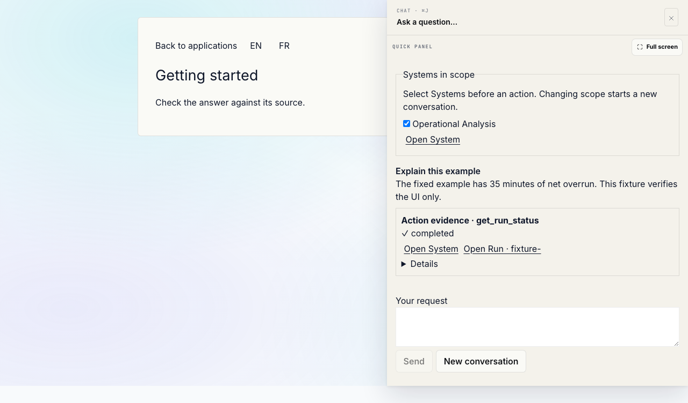
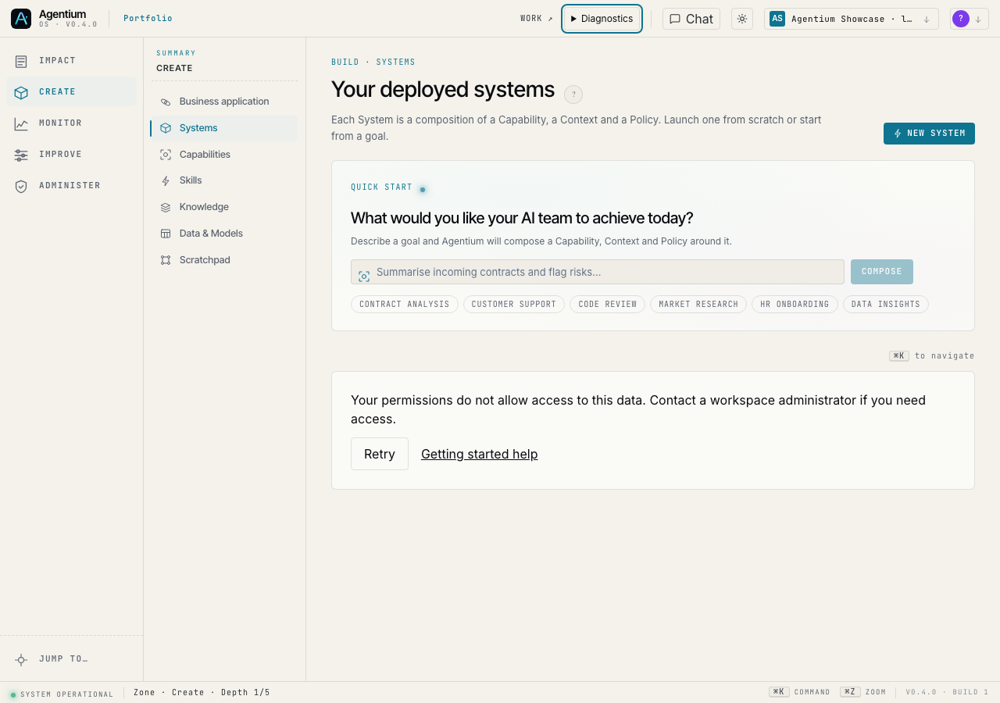
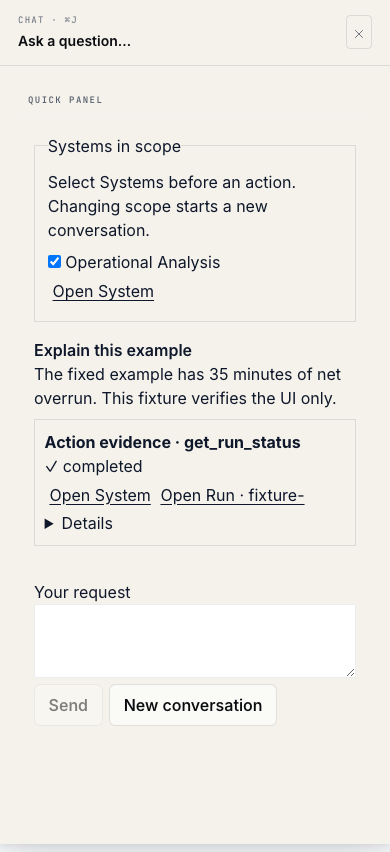
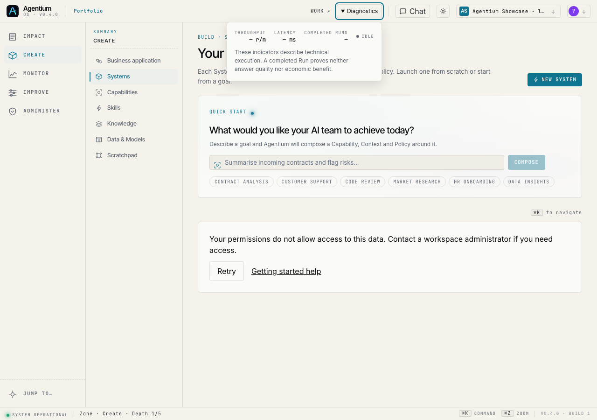

# Local adoption review — 10 September 2026

Base SHA: `7a4924f7dd406b831ca0b2eafd110d079b664330`.
Branch: `codex/adoption-roadmap`, uncommitted working-tree changes.
This is local review evidence, **not a released SHA or client acceptance**.

| Check | Result |
|---|---|
| `check:i18n` | PASS — 7,515 keys |
| `check:nav-links` | PASS — zero raw Cockpit links |
| `check:ui-chrome` | PASS |
| Existing product compliance check | PASS — the synthetic Showcase eligibility branch is explicitly inventoried |
| Frontend unit suite | 1,409 passed, zero failed/skipped |
| Production Angular build | PASS — initial bundle 882.72 kB; budget warnings remain below the fatal 1 MB limit |
| Scoped backend suites | 166 passed; deprecation warnings remain |
| Additive migrations | Upgrade/downgrade preserves preexisting rows; duplicate transport claims rejected; session deletion cascades receipts |
| Existing Work canary, local fixture case | 1 passed in Chromium |
| Human usability sessions / real model and worker chain | NOT RUN |
| Deployed canaries / client activation | NOT RUN |
| GitLab frontend gate | Configured as required for every pipeline and a production dependency; YAML and commands verified locally, remote pipeline NOT RUN |

Environment: bundled Node runtime; Python 3.14 virtual environment; Polars 1.31.0
in an isolated test dependency directory. The E2E fixture serves the production
frontend bundle on port 4321 and mocks the API. It exercises generic Work entry,
conversation persistence across navigation, proof destinations, EN/FR help,
390 px mobile layout, a 403 Systems recovery state and keyboard access to the
collapsed Diagnostics disclosure. It does not measure
retrieval quality, model latency or deployed orchestration.

Backend command (from `backend/`, with Polars installed in the test environment):

```bash
pytest -q \
  app/tests/api/test_adoption_roadmap.py \
  app/tests/services/test_adoption_metrics.py \
  app/tests/services/test_migration_101_103_adoption.py \
  app/tests/services/test_migration_revision_identifiers.py \
  app/tests/scripts/test_showcase_operational_analysis.py \
  app/tests/services/test_assistant_tools.py \
  app/tests/api/test_assistant_turns_api.py \
  app/tests/services/test_assistant_engine.py \
  app/tests/services/test_assistant_config.py \
  app/tests/services/test_assistant_authorization_inventory.py \
  app/tests/services/test_voice_assistant_mode.py \
  app/tests/api/test_flow_publication_api.py \
  app/tests/api/test_hypervisor_v2_semantics.py \
  app/tests/api/test_runs_hitl_auth.py \
  app/tests/scripts/test_seed_showcase_activity.py
```

The objective tests include both the dedicated endpoint and generic System
create/update paths: a viewer cannot inject, change or delete an objective through
settings; unrelated settings edits preserve the existing objective.

## Screenshots — synthetic local UI fixtures

Work entry with an optional first task and recovery actions:



Nonmodal companion with a canonical proof link while navigating to help:



Explicit access refusal and visible navigation labels:



Full-page companion at 390 px:



Technical health is available on demand, without permanently occupying the
title bar or implying business success:



## Review follow-up

The product reference and mental model explicitly recognize conversational
control. The System grid now uses `systems()` locally. The rail's workspace
injection precedes its derived signal. No status lifecycle, client catalogue
or economic measurement semantics were collapsed as part of these corrections.

The roadmap sponsor is the final decision maker for default activation and
removal. The release sequence and remaining O5 economic acceptance gap are in
the delivery contract. No activation, commit, push or deployment was performed.

See [implementation and acceptance protocol](../../agentium-adoption-roadmap.md)
for the exact human criteria, release prerequisites and remaining acceptance work.
