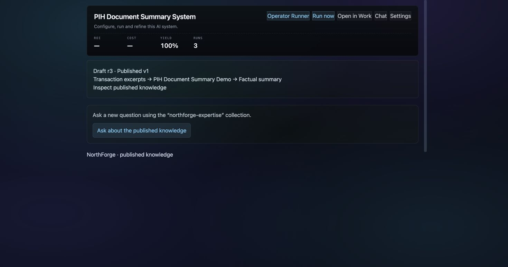
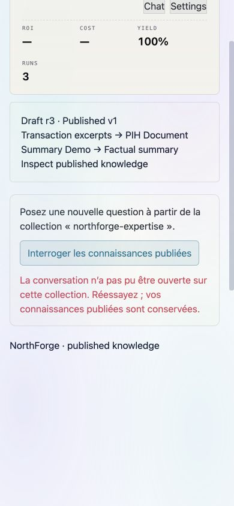

# Capture publication → fresh conversation

17 September 2026. Candidate implementation; live runtime remains 18741f94
until the next documented deployment. Backend code and storage schemas unchanged.

Within workspaces that enabled the existing `adoption_experience_v1` flag,
both Capture publication screens expose “Ask about the published knowledge”.
The actual published collection is shown. Clicking creates an ordinary Context
through the existing canonical API, then opens the existing ChatPanel in fresh,
compact mode. No question is submitted automatically. Context data/memory/history
contain no interview content. Its collection is exact; server retrieval and
workspace permissions remain authoritative. Existing citations, Run links and
source inspection belong to ChatPanel, not a second chat implementation.

A pending or failed publication supplies no action. A failed context creation
shows a retry; it never silently opens on workspace defaults. Double click is
blocked while the request is pending. A closed view, changed publication or
workspace cancels the request and discards late results. An old publication
cannot be opened after switching workspace. The ephemeral Context lasts 24 hours;
this does not delete the published source or its Run evidence.

The Cockpit object header now scrolls normally below 768 px or at viewport heights
up to 600 px, preserving all identity/actions. Desktop sticky behavior remains.
This corrects the real 390 px obstruction recorded in release 18741f94. No native
NAWA theme, workspace settings or permissions are modified.

## Verification

- New Angular-instance tests cover the existing adoption flag and context creation, exact collection, duplicate
  click, failure/wrong collection, retry, workspace/publication change and teardown.
- ChatPanel regression check ensures fresh sessions ignore stored/first history,
  while a newly created session can be requested explicitly.
- [Backend](backend.log): 10 existing tests pass (82 deselected), covering Context
  tenant bindings, chat-session bounds and selected Context replacing defaults
  without widening an executor's frozen source contract.
- [FR/EN](i18n.log): 8,074 keys; [navigation](nav.log), [chrome](chrome.log) and
  [production build](build.log) pass. [Full unit result](unit.log): 1,511 passed.
- [Viewport checks](viewport-checks.json): real shared header is static at 390 px
  and 1100×550, sticky at desktop. The 390 px action receives its hit-test and the
  page has no horizontal overflow. The live canary now checks the version summary
  is not hidden by the header after scrolling.

These local screenshots mount the actual Angular header and publication component
with a controlled API failure. The surrounding PIH summary is fixture content;
no live answer or successful chat round trip is claimed from these images.

## Live acceptance still required

Use retained synthetic publication 7ecda58e-ddfd-470c-93d8-89c64735ef2e in Showcase,
collection qa-capture-inventory-4479. From its published screen, open a fresh chat,
ask the R2INV4479 pressure question, inspect the exact 6-bar source and new Run.
The retained Capture, its publication and previous Runs must not be replaced.
Verify closed/reopened chat is blank; verify a failure does not fall back to an
unrelated corpus. This acceptance must use the candidate deployed through
demo/agentic. Existing provider/model limits remain effective.

The component does not prove voice interruption/reconnection, five full Capture
repetitions, second-user use or human acceptance. R0/R1/R2 remain open according
to their existing criteria.

The first c3f1fb73 image build was superseded before switching: the final candidate
adds the existing adoption rollout guard. No c3f1fb73 runtime activation is intended.
The common header correction remains independent of that UI activation.
