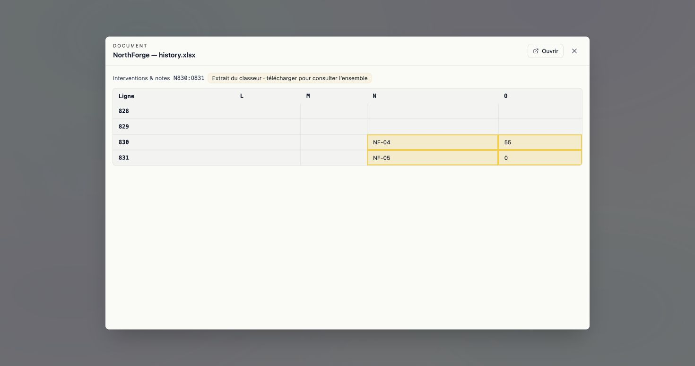
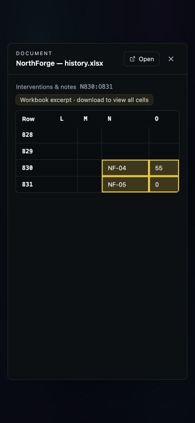

# R2.1 — Open the cited spreadsheet cells

16 September 2026. Implementation on `codex/brd-system-roadmap`, after
`3e29282b`. Subsequently deployed as `6f8f8169`; see the
[release evidence](../release-6f8f8169-2026-09-16/README.md).

## User result / résultat utilisateur

A spreadsheet citation opens its named worksheet around the referenced cells,
with original row numbers and column letters. The selected range is highlighted
by coordinates, including zero and blank values. Previously, the preview always
opened the first worksheet and its first 40 rows, then matched text heuristically.

Une citation Excel ouvre la feuille et les cellules d’origine, même à la ligne
830. Les coordonnées restent visibles ; une feuille supprimée ou un repère invalide
produit une erreur au lieu d’ouvrir une autre feuille. Les libellés de l’aperçu
et les erreurs de repère introuvable sont disponibles en français et en anglais.

## Contract and bounds

The existing authorized rich-preview route accepts optional `sheet_name` and
`cell_range`. The shared Secure Deposit preview service reads at most 40 rows by
12 columns around the selection, retaining two preceding rows/columns where
possible. It returns row/column origins, column labels, and the requested range.
A range exceeding the window is explicitly marked partial. Download/open keeps
the existing original-document route and rights. No new endpoint, dependency,
migration, permission or feature flag.

Malformed, reversed, worksheet-out-of-bounds or Excel-limit-exceeding coordinates
are rejected. A cell range without a worksheet is refused. Existing untargeted
previews still open the first worksheet. PDF/OCR page aliases (`page_number`) now
resolve consistently in the citation label and viewer; malformed page numbers
are not coerced into plausible integers.

Modern Excel formats supported by the existing preview service are covered.
This does not add a coordinate viewer for CSV or legacy XLS, nor row-only
historical citations. Formula caches are read as before; no workbook formula is
executed or recalculated. Large-file preview limits remain in force.

## Validation

- 62 existing document-preview and Secure Deposit backend tests passed; the
  extended preview API suite then passed all 11 tests (63 unique tests across
  those two files).
- 1,479 frontend tests passed; focused Chat tests rerun after final source-locator
  changes: 7 passed.
- i18n, fail-closed navigation, UI chrome guards and production build passed.
- Real Angular shared preview component in Chrome, with a payload produced by
  the actual backend preview service from a synthetic workbook. These are
  controlled local render checks, not screenshots of a deployed RAG answer.
- FR/light desktop and EN/dark at 390 × 844: the four highlighted cells contain
  `NF-04`, `55`, `NF-05`, `0`; row labels 830/831 and columns N/O are visible.
  Mobile page width is 390 with no page-level horizontal overflow; Tab reaches
  Open. The native NAWA theme files were not changed.
- Visual reference: existing shared preview and Cockpit tokens; retain its
  table structure and yellow passage highlight. Add native row/column headers;
  correct the existing dark-background/light-text-theme mismatch using tokens.

## Still open

Live retrieval → citation → original qualification on the next deployed SHA,
OCR/Excel ingestion and recovery, Capture publication/reuse, voice correction,
and the five repetitions/user sessions required by R2. This change does not
close R0, R1 or R2 and does not substitute for human acceptance.
