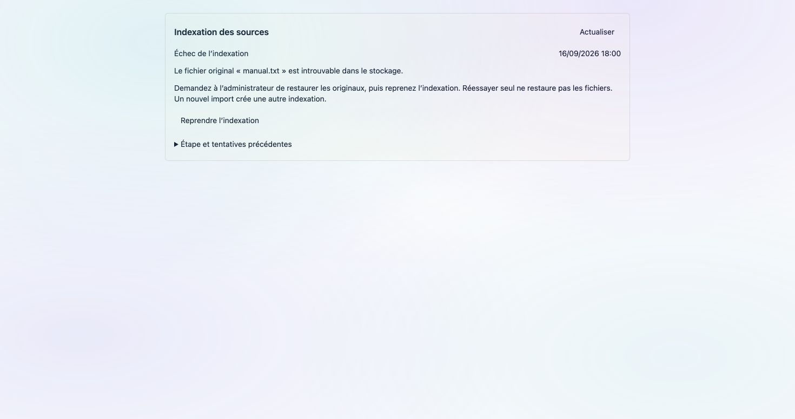
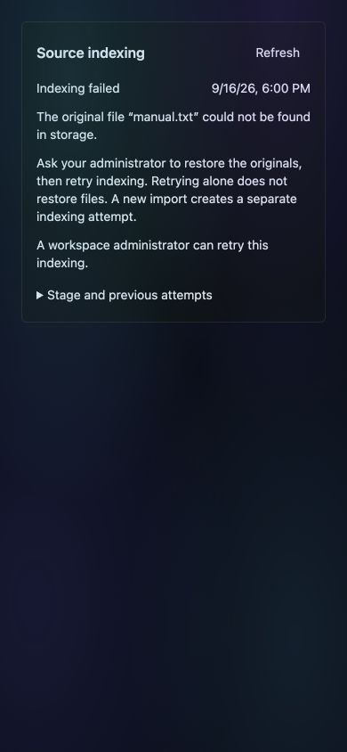

# Explain a missing original before retrying

Implemented after the [real c399 recovery exercise](../release-c399f2be-2026-09-16/README.md)
exposed a raw storage key as the only failure explanation. Not deployed in this
record; the public runtime remains c399f2be.

## Behavior / comportement

When a copy fails with `FileNotFoundError`, the worker confirms absence in the
original store before retaining `source_failure` with a code and filename.
No originals in the collection produces a separate empty-originals diagnosis.
Permission errors, a missing temporary destination, or an unavailable presence
check do not become missing-source claims. Original exceptions remain recorded.
Retry clears the current diagnosis but preserves it in the previous attempt.
Historical errors are not reinterpreted from their strings.

The shared Knowledge/SFTP panel explains the missing original in FR/EN and tells
the operator to restore it before retrying. A new import creates another indexing
attempt. The raw storage error stays in expandable details. Governed campaigns
retain their procedure, and readers receive no retry button.

L’écran nomme le fichier manquant et demande sa restauration avant la reprise.
L’erreur technique et l’historique restent consultables. Une panne réseau ou un
refus d’accès ne sont pas assimilés à un fichier supprimé.

## Evidence

- [75 backend tests](backend.log): missing original → restore → retry → completion
  with diagnosis retained only in history; provider failure path; empty originals;
  permission failure; missing temporary destination; inconclusive storage check;
  existing API rights, stale-state and duplicate-request cases.
- [1,487 frontend tests](frontend.log), [8,048 FR/EN keys](i18n.log),
  [navigation](nav.log), [UI chrome](chrome.log), [production build](build.log)
  and `git diff --check` passed. Existing build warnings remain.
- Actual Angular component rendered in Chrome with controlled local fixtures:
  FR/light cause and restoration instruction, raw key revealed in details;
  EN/dark at 390×844 with no retry for a reader; governed FR case retains campaign
  instructions and no generic retry. These are not production screenshots.

This does not add source upload/replacement permissions, restore files itself,
change campaign recovery, or qualify the rest of the R2 voice/OCR/Excel journey.
No migration, dependency, new flag or NAWA theme change.
