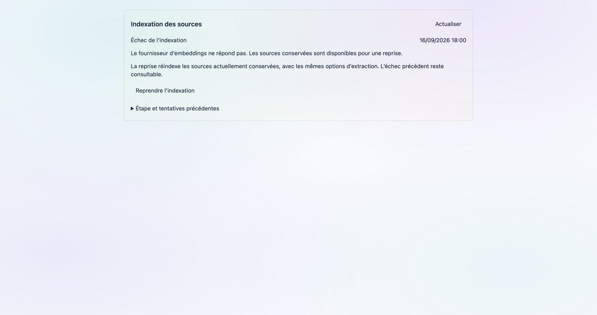
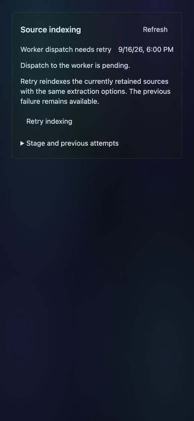

# Source indexing recovery — 16 September 2026

Status: implemented and locally qualified; not deployed in this evidence record.
Current public runtime before this candidate: `6f8f8169`.

## Behavior

Knowledge collection details and the SFTP indexing monitor share a recovery
panel. It displays the persisted ingestion state, failure, worker-dispatch
outage and previous attempts. Active processing is polled; failed reads remain
errors, not empty data. The source inventory also stops replacing network
failures with an empty collection. All new labels and dates follow FR/EN.

An owner/admin explicitly retries the existing `document_ingest_index` job.
The request carries the observed update time and a UUID. Stale views, newer or
active collection ingestions, completed/cancelled work and foreign workspaces
are refused. Repeating an acknowledged request returns the same attempt,
including if that attempt has since failed. Unknown delivery retains the same
browser request key. Dispatch failures can be retried without another failed
attempt entry; the API does not use inline fallback. Explicit test eager mode
continues to use the existing synchronous worker mode.

The original job ID, deposit binding, extraction/OCR options and prior failure
are retained. Completion preserves attempt history, including duplicate-only
exits through the shared updater. The canonical worker still claims queued
work atomically. Linked deposits require their existing promotion permission;
rejected deposits cannot be revived. An incremental retry requires a ready
baseline. Needlepunch/wave ingestions remain governed by their campaign runner
and postflight: the panel explains this instead of bypassing those controls.

Retry uses **currently retained originals and current configured dependencies**;
it is not an immutable replay of previous document bytes or provider versions.
Worker completion does not certify all documents or governed postflight.
No schema migration, new queue, dependency, flag or branding change.

## Verification

- Backend: **107 passed**, including controlled provider failure → retained
  source → explicit API retry → canonical worker completion and retained error;
  stale/foreign/non-admin requests, rejected deposit, denied promotion,
  duplicate request after a second failure, unavailable broker, lost broker
  acknowledgement after completion, existing duplicate-delivery claim tests.
- Frontend: **1,484 passed** in the full run, then the final **7-test** component
  suite passed after date/source-error fixes (**1,486 unique tests covered**).
- FR/EN: **8,045 keys**; navigation fail-closed, shared chrome, production build
  and `git diff --check` passed. Existing build budget/CommonJS warnings remain.
- Actual Angular component rendered in Chrome with controlled local fixture
  responses: FR/light failed → retry → completed → previous error opened;
  EN/dark at 390×844 with dispatch pending; FR/mobile unavailable status;
  keyboard Tab reaches retry and no horizontal overflow at 390px.

These are real component renders with **local synthetic fixture data**, not
screenshots of live ingestion or proof of a production worker restart.
The backend recovery test uses retained local storage and the real worker entry
point, with a controlled parser/indexer/provider boundary. Production PostgreSQL
concurrency, real broker redelivery, VM images/canaries, live OCR/Excel retrieval,
and voice → publication → new-conversation citation still require qualification.
R0 human sessions and authenticated manual acceptance remain open; this increment
does not close R0, R1 or R2.
