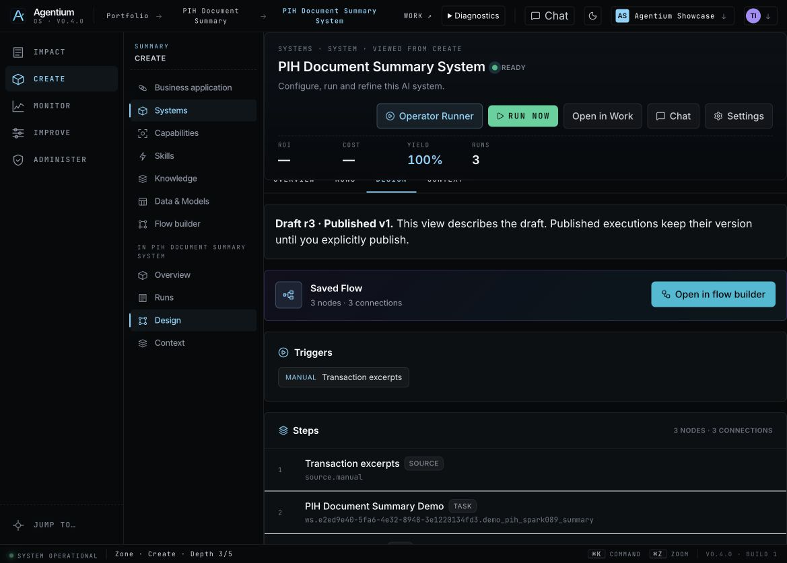
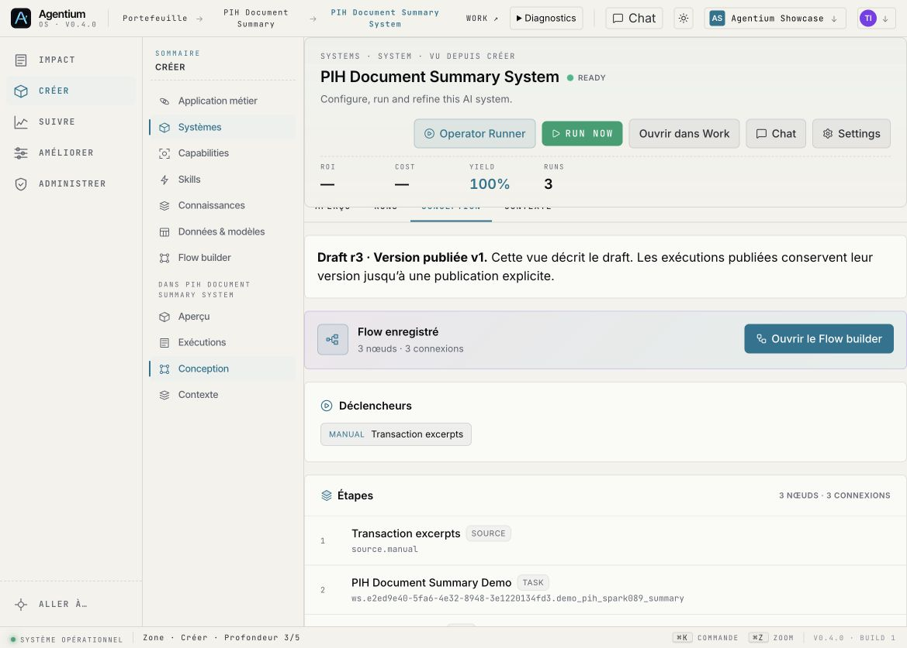

# Release 18741f94 — Design draft and published version

17 September 2026. Live revision `18741f94fb6ced627c53701c0b469685618b852d`,
pushed through `demo/agentic`; immutable VM image tag `18741f94fb6c`.
Rollback: `4baa9f5d1487`. No migration, stored workspace flag change or NAWA theme edit.

## What changed

PIH Design previously summarized published v1 while Flow Builder opened draft r3.
The stored versions are different; neither was overwritten to hide the difference.
Design now reads the canonical draft and explicitly identifies both versions.
Its three nodes and three connections agree with Flow Builder. Overview and
historical Runs keep their published/executed attribution.

The frontend follows the existing server default for `flow_publication_v1`;
an explicit false still opts out. This also exposes the existing Operator Runner
link when the workspace uses that default. No automatic publication occurs.

## Qualification

- [Local gates](../system-design-draft-2026-09-17/README.md): 1,506 frontend tests;
  8,068 FR/EN keys; navigation, UI chrome and production build pass. Backend
  unchanged from the 19 cost/provenance tests qualified before this change.
- [VM build](vm-build.log), [switch](switch.log), [health](runtime-health.log),
  [public identity](public-verification.log): exact frontend/backend revision,
  HTTP 200, healthy services, zero startup exception matches. Both workers and
  durable jobs were idle before switching. Three images built on the VM.
- [Carakai](canaries.log): 10 passed, 2 intentional local-contract skips.
  The observability canary compares Design with the canonical server draft.
- [Worker SDK](worker-sdk.log): Giskard 2.19.2, three cases, four mocked judge
  calls. Offline dependency qualification only; no live provider campaign.

VM evidence: `/srv/agentium-data/roadmap-deployments/2026-09-17-18741f94fb6c`.
Image IDs:

| Image | Digest |
|---|---|
| backend | `sha256:d0b9976d4fcbd6e0f288c1dda8450815d2a6de8be396961c317214163918ce46` |
| worker | `sha256:9373eb11138e06212f8296718dc8be80f550917b31b08d9df102a323a40b7806` |
| frontend | `sha256:232b6de82522d1ce57ae78f9aadf1a581551f3675f59dd4e61cd4a064d9682d4` |

## Five new real Work executions

[Persisted responses](sequential.json), [dispatch log](sequential.log).
All five executed on this exact runtime and the same immutable Flow version
`e997f4e4-3b51-4eef-9481-389f3a9afae4`, hash
`f1cdd9b755357f0960c334129f09e9106c63c4a49d9fa1937829dc01ae59d14d`.

| Attempt | Run | Dispatch-to-observation | Recorded execution |
|---|---|---|---|
| 1 | `91855689-8b2e-437e-b981-9d66d7f2636d` | 25.322 s | 23.457 s |
| 2 | `21df259c-c237-4455-ab42-2add6dd88211` | 23.244 s | 22.112 s |
| 3 | `a6dedc91-c0c7-40ca-9f35-c847eeba4190` | 18.995 s | 18.076 s |
| 4 | `e9bc5e34-363a-432e-9d5e-1230db0169a9` | 21.122 s | 18.402 s |
| 5 | `dd6e1b2e-597d-4a61-9409-acb4d6cd9e51` | 23.160 s | 20.711 s |

Every result contains 4 orders, 120 planned minutes, 155 actual, +35, 3 late
orders and NF-04 at +25. Each has two completed Python invocations and one LLM
invocation. The qualification script verifies replay returns the same Run.
`human_validated=false`, `economic_impact=null`, decision/confidence absent,
`value_source=unset`; the $0.012 internal cost is tariff-derived, not an invoice
or an economic benefit. These technical repetitions do not replace adoption
sessions, human approval or comparison of model quality. Historical concurrent
and graceful-restart tests remain attributed to 7532d449, not this revision.

## Authenticated Chrome smoke

System `a021f6c3-fed5-4940-a3e1-53d5a7617f57`, Showcase, existing owner account.
Design shows draft r3 and published v1, the three saved nodes and three connections.
Opening Flow Builder shows the same draft r3 and node labels; browser Back returns
to Design. No edit, save, publish, approval or retained R1 Run was submitted.

[English DOM](pih-design-en-dom.txt), [French DOM](pih-design-fr-dom.txt),
[Flow DOM](pih-flow-fr-dom.txt).

The new Design block is translated. Existing System header actions and catalog
content still include English in French; this is not whole-screen translation
certification. At 390 px, no horizontal page overflow was observed, but the shared
sticky object header covers the scrolled summary/CTA. [Capture](pih-design-fr-390.png).
Narrow-screen inspection is therefore **not accepted** for this route yet.
Desktop layout, original viewport, English and dark mode were restored.

## Remaining acceptance

R0 adoption baseline: 0/5 business, 0/5 developers. Short video not recorded
(QuickTime command disabled; alternative capture permission pending). Thibaud's
closure decision remains open. The narrow System header needs correction.
R1 retained human decisions, publication and second-user consumption are untouched.
This release does not close R0, R1 or the complete observability task force.
