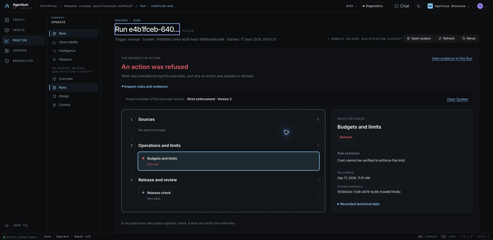

# Mandate postcheck display — intermediate release

Candidate `43a33dcd8cc8880edca8b6e0f2be9b5e456eb4ec`, pushed on `demo/agentic`.

The first deployment and its retained live Runs are documented in [e2294c37](../release-e2294c37-2026-09-17/README.md). This follow-up repairs the display of a persisted postcheck stop and updates the System360 canary for the new governance surface. It does not alter mandate enforcement, permissions or NAWA branding.

## Open in Agentium

- [Edit the synthetic System mandate](https://agentium.papai.ai/systems/141db166-2d4d-42df-bee3-6b65e556ca46?workspace=agentium-showcase&lens=build&facet=context).
- [Mandate and retained Run evidence](https://agentium.papai.ai/systems/141db166-2d4d-42df-bee3-6b65e556ca46?workspace=agentium-showcase&lens=govern&facet=overview).
- [Run stopped: cost measurement unavailable](https://agentium.papai.ai/runs/e4b1fceb-6401-4097-a6e3-07052506a87e?workspace=agentium-showcase).
- [Later Run: 30-second mandate, completed](https://agentium.papai.ai/runs/48624aca-504d-4450-b6c8-85a66b4fb05f?workspace=agentium-showcase).

These are real executions of an explicitly synthetic source-to-sink Flow. They qualify mandate freezing and publication, not model quality, an external tool effect or a live Giskard provider campaign.

## Verification

Initial implementation: 476 backend tests; 1,553 frontend tests; all three UI gates and production build passed. Follow-up: [61 targeted backend tests](local-gates.json), System360 test loading and diff checks passed. Existing build warnings and Python deprecation warnings remain.

Migration 108 was applied for the initial deployment after a verified data-plane backup. This follow-up has no migration. Backup: `/srv/agentium-data/mandate-deployments/2026-09-17-e2294c37e79a`, `.ready` checked. Three follow-up image builds and logs: `/srv/agentium-data/mandate-deployments/2026-09-17-43a33dcd8cc8`.

Rollback image tag: `e2294c37e79a`, compatible with the new frozen-policy contract, but restores the known display defect. Do not roll back new contracts to the pre-mandate worker or restore the database backup above later writes.

## Scope remaining outside this release

The human onboarding sessions, R0 owner acceptance and end-to-end Rx qualification are not claimed complete. No new live Giskard provider campaign was executed for this mandate release. The worker retains the optional SDK and its offline qualification; fixtures do not attest a real provider.

## Remote result

Runtime and real smoke passed. [The fresh Run](https://agentium.papai.ai/runs/3216ed4c-42ba-4cff-8099-71ec45f770d8) completed with its frozen duration limit. The previous cost Run now exposes one blocked event and the matching persisted Decision; see [live API evidence](live-mandate.json).

Canaries: 9 passed, 2 intentional exclusions, 1 failure ([log](canaries.log)). The governance canary still sought a primitive fact in the replaced perspective. Its final revision compares visible coverage and Run identifiers against the authorized mandate API instead. [Final release](../release-6f6d10c0-2026-09-17/README.md).
