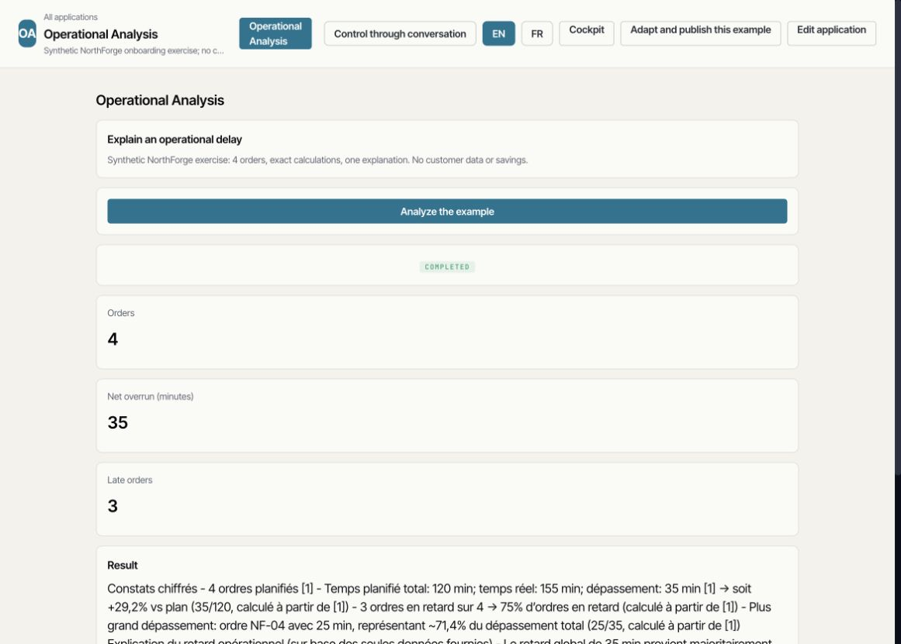
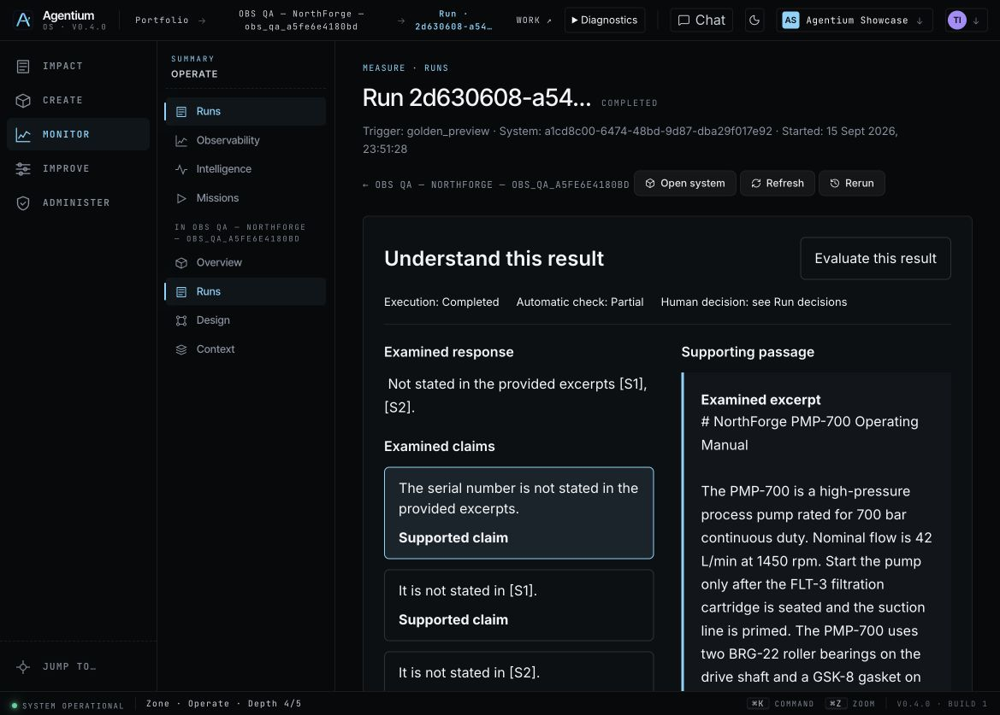
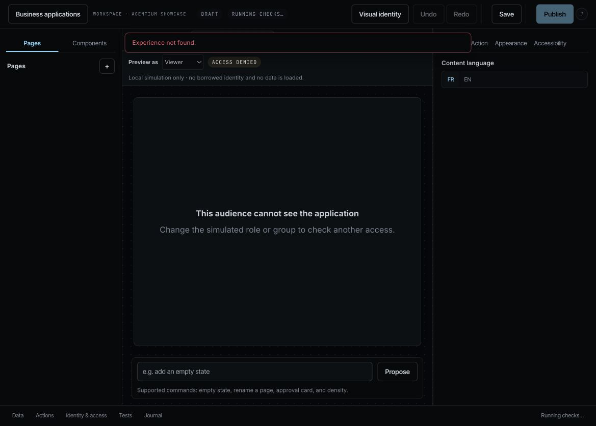

# Release 447997ee — Capture source inventory and live R0 inspection

17 September 2026. Runtime: `447997ee62c280988cd072b32386245173874f3c`,
pushed on `demo/agentic`, built on `omnirag-demo`. Immutable tag:
`447997ee62c2`; rollback: `f9bb42943811`. No migration or flag change.

## Release gates

- [Backend](backend.log): 318 passed, covering Capture API/service, collection
  inventory, retrieval context, chat hardening and Skill wrappers.
- [Frontend](frontend.log): 1,493 passed; [FR/EN](i18n.log): 8,048 keys;
  [navigation](nav.log), [chrome](chrome.log), [production build](build.log): passed.
- [Three VM images](images.log), [idle workers before switching](pre-switch-final.log),
  [storage](storage.log), [health](health.log), exact public
  [backend](backend-build-info.json)/[frontend](frontend-build-info.json) revision,
  [HTTP 200](home-http.log), [zero startup exception matches](startup-error-count.log).
- [Carakai](canaries.log): 10 passed, 2 intentional local-contract skips.
  Runner artifacts: `/tmp/iteration-canaries-20260917T001636Z.JAgpCy`.
- [Giskard SDK 2.19.2](worker-sdk.log): three fixture cases pass in the actual
  worker image. This is not a live-provider campaign.

## Capture: absent before, published, then cited

The [qualification script](qualify-capture.py) records each mutation's intent and
response and refuses an uncertain replay. The [retained evidence](capture-qualification.json)
uses one new, isolated synthetic collection, `qa-capture-inventory-4479`.

1. Before publication, the inventory has zero sources/chunks. The exact question
   produces `no_grounded_context`, without claiming the expected pressure.
   Run: `1fc9d8f6-47d0-43a5-9a27-412d32634975`.
2. A text turn at 8 bar is explicitly amended to 6 bar. The report preserves
   the synthetic nature and prohibition on real intervention, and contains no
   unrelated Context or inventory diagnostic.
3. The technical QA acceptance is labelled as automated, not human acceptance.
   Publication excludes unresolved questions and retains them in the proposal.
   Proposal: `7ecda58e-ddfd-470c-93d8-89c64735ef2e`;
   session: `9d3500c7-c2b1-40ad-bc27-77f94a928ebc`.
4. Inventory is now **ready, one source, one chunk**. Its document/proposal IDs
   and SHA-256 match the publication receipt and authenticated source preview.
   Document: `091af258-47b3-56db-967f-123de591fc6f`.
5. A fresh completion on the same Context asks the same question, without giving
   the answer. It returns **6 bar**, quotes “La pression nominale est fixée à 6 bar.”
   and cites that exact document. Completed
   [Run f2874759](https://agentium.papai.ai/runs/f2874759-7112-406c-bd92-78c3a391ec07).

The model's wording “fiche experte — validée” does not establish a human review.
The empty-answer fallback before publication is technical English despite the
French question; it establishes absence, not a polished localized interaction.
A subsequent Chrome inspection confirms the new source in Knowledge → Sources,
one document/one chunk, status ready, and the authenticated preview at 6 bar:
[source DOM](capture-source-dom.txt), [actual screenshot](capture-source.png).
Capture's direct ingestion has no WorkspaceJob attempt; the UI currently reports
“No indexing attempt” separately from the ready source.
Historical publications with missing ledger rows were not backfilled or replayed.
Voice, UI handoff to a new scoped conversation and five consecutive repetitions
remain open.

## Authenticated Chrome inspection

Chrome was signed in through Agentium's normal form with the existing release
principal. No password was saved; the temporary credential files were removed.
Work was hard-reloaded after the switch. Showcase, EN interface, light Work
branding and dark Cockpit were observed; [workspace context](workspace-context.json)
records the current role/mode/flags. This is agent-operated QA, not a participant session.

| Path | Observed result |
|---|---|
| Work → Operational Analysis → result → Run | Completed in 38.84 s. Four orders, 120 planned/155 actual/+35 minutes, three late, NF-04 +25. The exact Run has two Python operations and one LLM invocation, runtime revision 447997ee. |
| PIH Skill → System design | Both load. Prompt, public OpenAI, effective `gpt-4o-mini` and historical configuration provenance are visible. No retained R1 decision or Run changed. |
| Quality → heatmap selection → Run | Selecting `task_success: 20` opens exactly `2d630608-a541-408d-bfe0-b55aadb5c734`, preserving its partial evaluation and supporting passage. This is a historical Run viewed on the new UI. |
| Work → Edit application | **Failed:** query delimiters were encoded into the application ID; Studio reports “Experience not found.” |
| System design stage links | The same encoded-query defect is visible on preset/collection destinations. |

[Work DOM](work-dom.txt), [Run DOM](run-dom.txt), [PIH Skill](pih-skill-dom.txt),
[PIH System](pih-system-dom.txt), [Quality selection](quality-dom.txt),
[selected Run](quality-run-dom.txt), [Studio failure](studio-link-failure-dom.txt).

The numerical reference passes; the model's French prose in the EN interface is
not certified by that check. Its causal wording about NF-04 explaining other late
orders exceeds the numerical evidence. Run value still displays `$0.00` alongside
`Value source: Unset`; this is not measured economic value. These limitations are
retained, not converted into successful checks.

The navigation correction is prepared separately with real Angular `UrlTree`
regression tests and an extension of the existing Work canary. It is not part of
447997ee. R0 still requires the corrected navigation smoke, the short video,
ten formative sessions and Thibaud's decision. R1–R6 are not declared complete.
