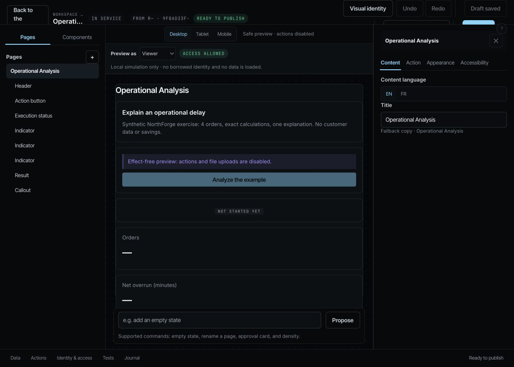

# Release 4771f15b — Work-to-Studio and System navigation

17 September 2026. Deployed `demo/agentic` SHA:
`4771f15b2d54051f7b7611e74ae446cad44bc70d`. All three images built on
`omnirag-demo`, immutable tag `4771f15b2d54`. Rollback: `447997ee62c2`.
No migration, permission, feature flag or NAWA theme change.

## Verification

[Local qualification](../work-context-links-2026-09-17/README.md): 1,495 frontend
tests, FR/EN (8,048 keys), navigation/chrome guards and production build pass.
Backend code is identical to the [318-test qualified 447997ee release](../release-447997ee-2026-09-17/backend.log).

[Images](images.log), [idle workers](pre-switch-final.log), [storage](storage.log),
[healthy containers](health.log), exact public [backend](backend-build-info.json)
and [frontend](frontend-build-info.json) SHA, [HTTP 200](home-http.log),
[zero startup exception matches](startup-error-count.log) verified.
[Giskard 2.19.2](worker-sdk.log) passes the offline fixture qualification inside
the running worker; no new live-provider campaign is claimed.

[Canaries](canaries.log): **10 passed, 2 intentional skips**.
Artifacts: `/tmp/iteration-canaries-20260917T003945Z.4uDRKZ`.
The [extended Work canary](experience-work.json) explicitly records
`work_to_studio: passed`, in addition to its 12 accessibility combinations.
The protected runner received the pushed commit through a verified incremental
Git bundle; its reviewed checkout and source marker match the runtime SHA.

## Actual Chrome smoke

Same Showcase owner, EN interface and existing flags as the
[previous workspace record](../release-447997ee-2026-09-17/workspace-context.json).
Chrome was hard-reloaded after the switch.

- **Work → Edit application → Studio → Back to the application passes.**
  The application ID remains the path; page, return URL and immutable release
  ID remain query parameters. Studio opens Operational Analysis, identifies the
  Work release and previews the current draft without changing or publishing it.
  [DOM](studio-dom.txt), [capture](studio.png).
- **System stage navigation passes.** PIH preset/collection links retain their
  System/Capability context. Clicking “System prompt” opens the existing preset
  catalogue. This verifies the destination, not that a workspace preset replaces
  an authored Skill template. [Links](system-links-dom.txt), [destination](system-preset-dom.txt).
- **New Work execution passes the numerical reference.**
  [Run 9b73e4e5](https://agentium.papai.ai/runs/9b73e4e5-083b-4a8c-b47b-0e52bbbebdf3)
  records runtime revision 4771f15b and the unchanged published Flow version.
  Work shows four orders, +35 minutes and three late orders; the retained output
  has 120 planned/155 actual minutes and NF-04 +25. Two Python operations and
  one OpenAI invocation are completed. The final Python audit explicitly records
  `numerical_reference_passed: true`, `human_validated: false`,
  `economic_impact: null`. [Work](work-dom.txt), [Run](run-dom.txt),
  [opened numerical audit](numerical-audit-dom.txt).

## Remaining R0 issues and acceptance

Following an operation-timeline link exposes another navigation impasse:
`skill_invocation_360_projection_v1` is off in Showcase, so its target displays
“SkillInvocation perspectives are not enabled for this workspace.”
[DOM](invocation-gate-dom.txt), [capture](invocation-gate.png).
The same invocation's audit is already accessible in the parent Run; it was
opened to verify the numerical verdict. The next correction must link to that
authorized audit without activating a new flag or fabricating missing data.
No fix for this shortcut is claimed in this release.

The existing Run value display (`$0.00` with source unset), generic System stage
description, and model-generated French prose in an EN interface retain their
documented limitations. A passed numerical check does not certify the prose.
QuickTime's “New Screen Recording” command was disabled when inspected; no new
video was recorded. Current screenshots and the failed path are retained.

R0 still needs the invocation shortcut correction and its smoke, the short video,
the five business/five developer formative sessions, and Thibaud's closure
decision. No retained R1 human decision was approved, rejected or relaunched.
