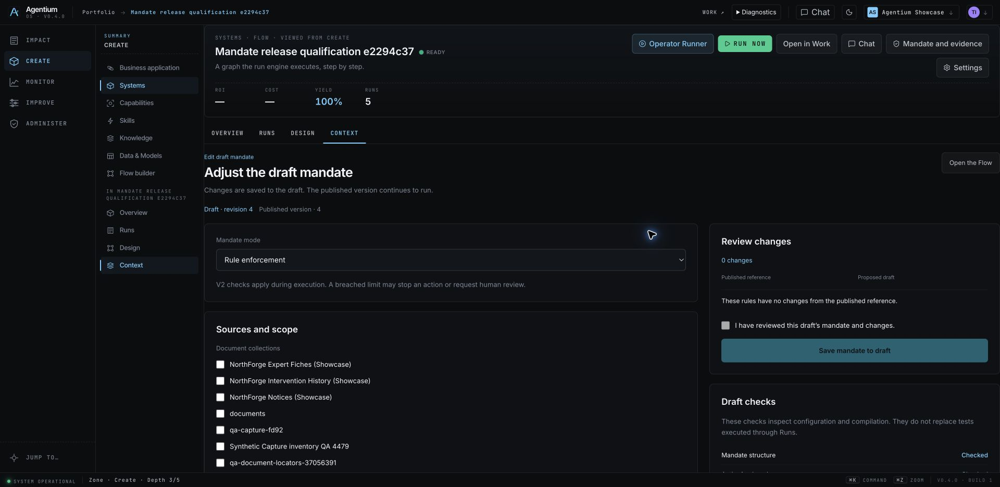
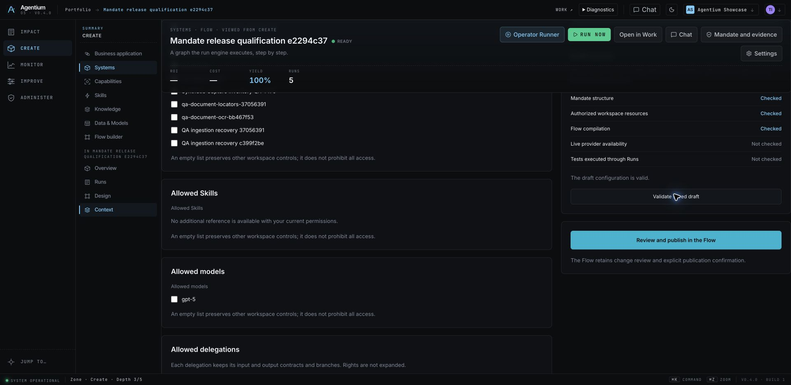

# Visible mandate and editor — release 6f6d10c0

Deployed: `6f6d10c04c62bc6b916da0724a49b379a4e0620d`, from pushed `demo/agentic`.

## Open the feature

- [Mandate editor — System → Context](https://agentium.papai.ai/systems/141db166-2d4d-42df-bee3-6b65e556ca46?workspace=agentium-showcase&lens=build&facet=context).
- [Published mandate and Run coverage](https://agentium.papai.ai/systems/141db166-2d4d-42df-bee3-6b65e556ca46?workspace=agentium-showcase&lens=govern&facet=overview).
- [Stopped Run and exact reason](https://agentium.papai.ai/runs/e4b1fceb-6401-4097-a6e3-07052506a87e?workspace=agentium-showcase&mandateFacet=valves).

The editor saves reviewed changes to the canonical draft, validates configuration, and opens explicit Flow publication. The resulting version freezes its policy; earlier Runs retain their own rules. Current access controls continue to apply.

## Real execution evidence

[Initial live qualification](../release-e2294c37-2026-09-17/live-mandate.json) proves draft isolation, stale-write refusal (409), policy-only diff, canonical publication, and unchanged policy on the previous Run after a later publication. The synthetic Flow uses the strict DAG source/sink executor without a model or external effects.

A USD 0.20 cost ceiling stopped the Run because cost could not be measured. This is an enforced refusal, not a measured overspend. Publishing a 30-second limit produced a completed Run without rewriting the previous evidence.

The live check found and fixed a projection defect: persisted postcheck stops now appear as refused only when the Decision's hard-abort rationale matches the terminal Run error. [Intermediate runtime proof](../release-43a33dcd-2026-09-17/live-mandate.json).

## Gates and release history

- Initial implementation: 476 backend tests and 1,553 frontend unit tests; i18n (8,368 keys), navigation, chrome and production build passed. [Local report](../../reports/mandate-experience/README.md).
- Postcheck correction: 61 targeted backend tests passed. [Delta gates](../release-43a33dcd-2026-09-17/local-gates.json).
- The first two remote canary runs each had 9 passes, 2 intentional exclusions and one obsolete System360 assertion. The final canary checks governance coverage and Run identifiers against the authorized mandate API; identity, workspace isolation, rights and rendered perspective facts remain checked. No gate was disabled.
- Three immutable images are built on omnirag-demo for every candidate, including this test-only follow-up. Runtime application code is unchanged from `43a33dcd`.

Migration 108 was applied during the first deployment after the verified data-plane backup `/srv/agentium-data/mandate-deployments/2026-09-17-e2294c37e79a` (`.ready`, PostgreSQL, MLflow registry and retained objects). This follow-up has no new migration. Build logs: `/srv/agentium-data/mandate-deployments/2026-09-17-6f6d10c04c62`.

Previous compatible image tag: `43a33dcd8cc8`. Never restore the backup over later writes or downgrade frozen-policy versions to the pre-mandate worker. Infrastructure services, existing human decisions, client policies and NAWA branding were not changed.

## Limits

This release qualifies mandate editing, version freezing and visible execution evidence. It does not close R0 human acceptance or qualify all Rx releases. No live Giskard provider campaign was run here; the worker retains the SDK and its offline fixture qualification. The 48 local screenshots remain explicitly synthetic; remote captures below show the actual deployed application and retained Runs.

## Final runtime and browser

Both [backend](backend-build-info.json) and [frontend](frontend-build-info.json) report the exact verified release SHA. [Runtime health](runtime-health.log): six app services running, API/frontend healthy, homepage 200, zero startup traceback/exception matches. Infrastructure was not recreated.

[Final fresh Run](https://agentium.papai.ai/runs/88045ffc-30c0-48f6-a081-5e95291ab5e4?workspace=agentium-showcase) completed on this exact runtime with the published 30-second policy. [API proof](live-mandate.json) also verifies that the earlier cost refusal retains its frozen budget and is correctly classified as blocked.

Chrome was hard-reloaded. The editor showed draft revision 4 and published version 4, the 30-second duration, and no unreviewed changes. “Validate saved draft” returned three passed configuration checks while provider availability and execution tests stayed not checked. No publication or client configuration was changed during this browser inspection. The live browser locale was English; FR/EN parity is covered by the local gates and fixture captures.

The [refusal capture](../release-43a33dcd-2026-09-17/live-run-stop.png) was taken on the preceding runtime with identical application code; it shows the recorded reason and Decision reference.

## Final canary result

**10 passed, 2 intentional exclusions, 0 failed** in 2.2 minutes. [Complete log](canaries.log). Protected runner evidence: `/tmp/iteration-canaries-20260917T092948Z.0PJ85Z` on carakai, reviewed checkout and source marker both at the deployed SHA. The exclusions are the local adoption and white-labelling contract fixtures, not failed remote checks.
