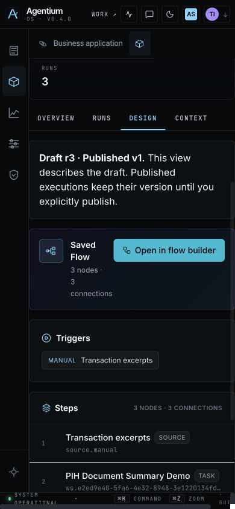

# Release def0b3cc — Capture handoff and responsive Design

Runtime `def0b3cc348ab2c82b455a55cb2a12d04049e593`, built from pushed
`demo/agentic`. Tag `def0b3cc348a`; rollback `18741f94fb6c`.
No migration, permission, workspace flag or native NAWA theme change.
The new Capture action uses the existing `adoption_experience_v1` flag, confirmed
true in Showcase. Earlier c3f1fb73 images were built but never served.

## Deployment — passed

Final VM build: 17 September 2026, 03:22:21–03:30:56 UTC.

| Image | Immutable image ID |
|---|---|
| backend | `sha256:5e8baab865d419303dc26c6c321f1e87fb9601fb7b899ea914b9e98f7e32972e` |
| worker | `sha256:4fec45ff7047399737af137ebe1217317c83e401c761ad9f039104e970f50d53` |
| frontend | `sha256:a311242a3879a836348a65791ee148b714cd61bf4de6a943755a89fa6d1d5558` |

- [Build](vm-build.log), [pre-switch](pre-switch.log): no active durable jobs,
  active/reserved Celery tasks zero before the switch.
- [Public identities](public-verification.log), [backend](backend-build-info.json),
  [frontend](frontend-build-info.json): exact SHA, verified, homepage HTTP 200.
- [Runtime health](runtime-health.log): healthy backend/frontend, six application
  containers on the tag, no startup exception matches.
- [Carakai canaries](canaries.log): **10 passed, 2 intentional local-contract skips**.
  Artifact directory `/tmp/iteration-canaries-20260917T033237Z.myAoqr` on carakai.
- [Worker SDK](worker-sdk.log): Giskard 2.19.2, three cases, four mocked judge calls,
  testset/knowledge-base/report/reference serialization pass. **Not a live provider campaign.**
- [Local gates](../capture-handoff-2026-09-17/README.md): 1,511 frontend tests,
  10 backend checks, 8,074 FR/EN keys, links/chrome/build pass.

## Manual acceptance — mixed

**Design at 390×844 passes the reported obstruction check.** The same PIH draft
r3 / publication v1 summary can be read after scrolling: top 233, bottom 363,
width 342, centre hit-test belongs to the summary. Existing shared header flows
out of view; the shell remains fixed. Viewport restored afterward. This does not
claim every control on the screen is fully localized or accepted on mobile.

**Capture publication → new conversation opens, closes and reopens blank.**
The retained publication was read only; no review or re-publication occurred.
Session `9d3500c7-c2b1-40ad-bc27-77f94a928ebc`, proposal
`7ecda58e-ddfd-470c-93d8-89c64735ef2e`, document
`091af258-47b3-56db-967f-123de591fc6f`, collection `qa-capture-inventory-4479`.

**The actual sourced-answer check failed.** Question:
“Pour la recette synthétique R2INV4479, quelle est la pression nominale après
correction ? Cite le passage source.”

[Run 26d9d307](capture-question-failed-run.json) completed on 17 September,
03:38:19–03:38:28 UTC, but retrieved an inventory summary rather than the actual
6-bar passage. Its answer honestly says it cannot determine the pressure.
The source citation is an inventory, not the published document. The configured
expert-fiche overlay also joined the requested collection, although the UI said
session documents only. The UI exposed an inactive NorthForge source default
and uploaded-document suggestions for a published collection.

[DOM evidence](capture-question-failed-dom.txt), [screenshot](capture-question-failed.png).
The failed Run is retained. A subsequent correction must repeat this exact question
in a fresh conversation and inspect its real source/Run, without rewriting this proof.

The new action remains inside the existing pilot flag. R2 reuse is **not accepted**
on this SHA. Five complete Capture/voice repetitions, second-user use, human
adoption sessions, the short video and Thibaud’s closure decision remain open.
Retained R1 Runs and human decisions are untouched. R0 and the roadmap remain open.
