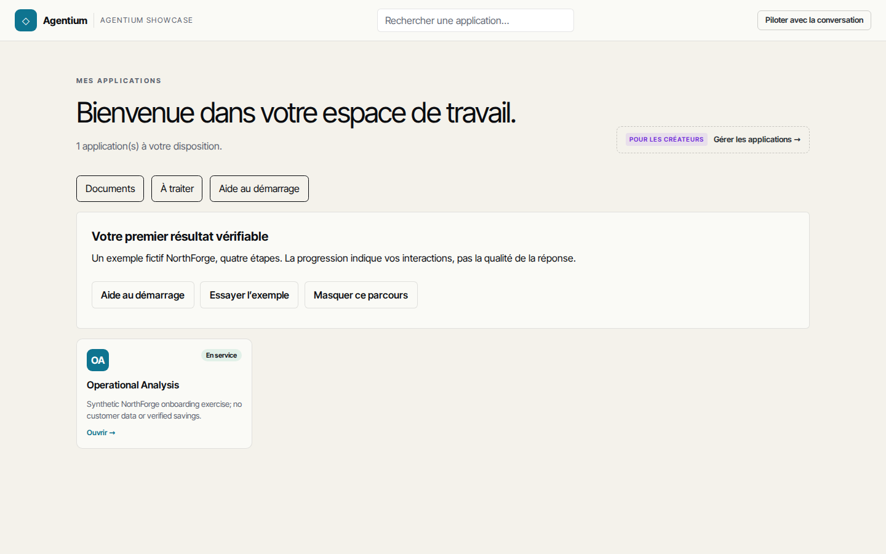
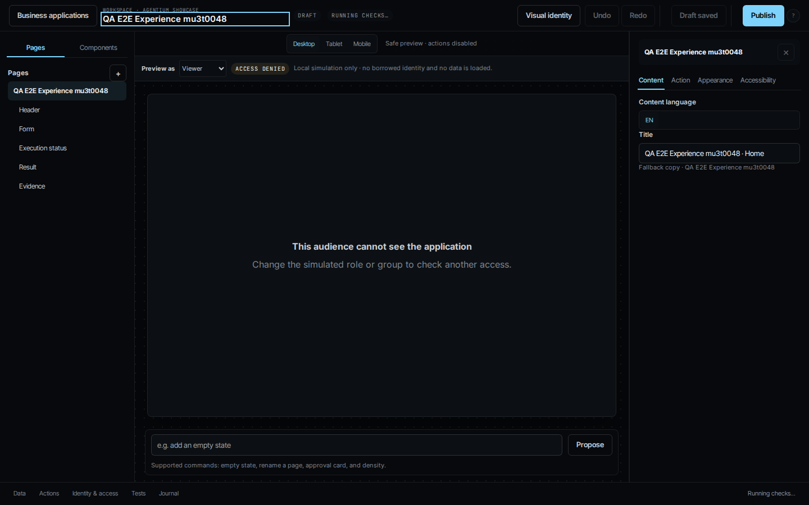

# R0 live evidence — 16 September 2026

Runtime: **196164eb5b8098dca49cf54a7c06c4df05cc8b79**, built and deployed from
`demo/agentic`. Workspace: Agentium Showcase; synthetic data only.

- [Five sequential Runs](sequential-196164eb.json): numerical reference,
  invocations, immutable version and idempotent replay checked.
- [Work canary](work-canary-196164eb.json): passed all 12 visual/accessibility cases.
- [Studio canary](studio-canary-196164eb.json): passed on follow-up test source
  bd160451, which corrects immutable-release cleanup. Application runtime is unchanged.
- [Canary history](canary-history.json): original failures remain recorded.
- [Manual Work → Run](manual-work-path.md): exact-link inspection on e09bde5c.
- [Concurrent failure](concurrent-run-failure.json): unresolved, not included in
  successful sequential repetitions.

**R0 is not closed.** Concurrent recipe execution, unhandled failed checks and
legacy outcome wording remain blockers. Semantic/Giskard evaluation and human
adoption trials are not established by these results. There is no independent
GitLab CI attestation.

## Actual screenshots

24 PNGs in `visuals/`: Work and Studio × FR/EN × light/dark × desktop/456/320px.
These are live screenshots, not mockups. Studio is a synthetic authoring test;
its viewer preview is intentionally access-denied for an admin-only audience.
Reviewer login, Pilot deployment and rollback were not requested by this canary.

### Work — French, light

### Studio — English, dark

[Work at 320px](visuals/work-fr-light-320-reflow.png) ·
[Studio at 320px](visuals/studio-en-dark-320-reflow.png)
