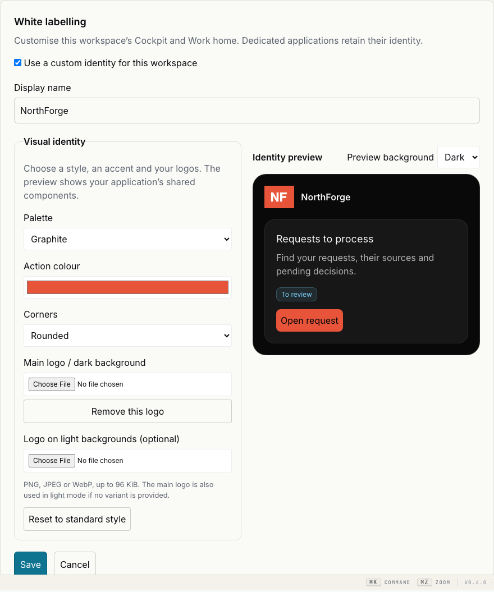

# White labelling — local acceptance evidence

Base SHA: `7a4924f7dd406b831ca0b2eafd110d079b664330`. Branch:
`codex/adoption-roadmap`, uncommitted changes. All browser data and logos below
are synthetic; the SPA is real and its HTTP API is mocked.

## Results

- Full frontend suite: **1,412 passed**, through the existing runner in 14-spec
  batches to fit available temporary disk space. No tests were excluded.
- Backend: **59 passed** (appearance, Experience API, Experience authorization),
  then **10 passed** in the focused suite after the workspace audit event addition.
- Production build passed: initial bundle **888.42 kB**. Existing initial/CSS
  size and CommonJS warnings remain; the fatal size budget is not exceeded.
- `check:i18n` passed (7,551 keys); `check:nav-links` and `check:ui-chrome` passed.
- Existing browser canary 16: **2 passed**. Onboarding/companion compatibility;
  workspace brand editing, image decoding, preview modes, reset/cancel, save,
  reload, mobile layout; Studio edit/save/reload; published theme remains distinct
  from the current draft. Axe found no A/AA violations in the new workspace brand
  form tested on desktop. This is not a whole-product accessibility certification.
- [Native protection check](native-protection.json): 45 NAWA files unchanged;
  original Work styles are preserved verbatim, with generic styles appended.

## Screenshots

[Workspace identity editor](white-labelling-desktop-local-fixture.png)

[Studio identity editor](white-labelling-studio-local-fixture.png) ·
[Mobile preview](white-labelling-mobile-local-fixture.png) ·
[Published application](white-labelling-published-local-fixture.png)

The browser checks do not use a live customer API. Backend tests separately
exercise storage, permissions, compare-and-set and immutable releases. Full live
NAWA visual acceptance and a client rollout remain unexecuted. Nothing was pushed
or deployed and no real workspace setting was changed.
