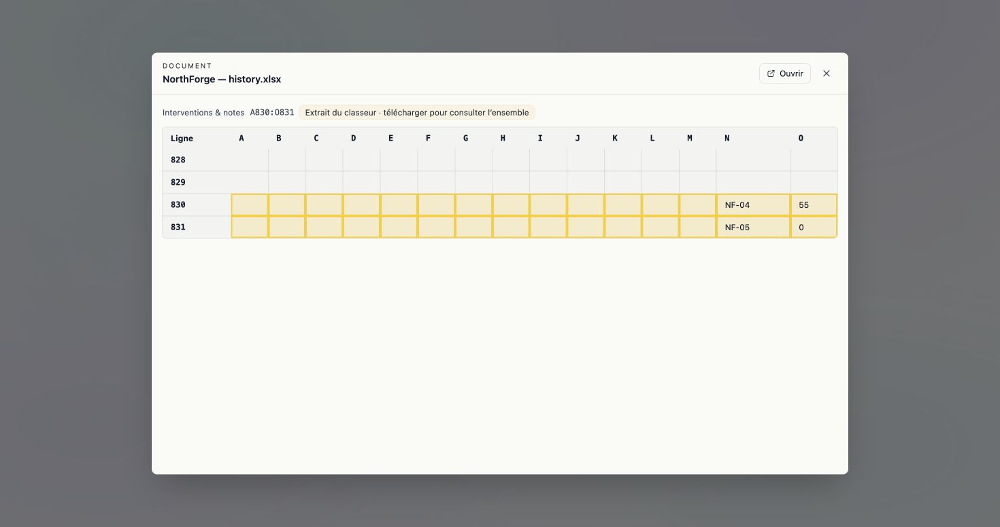
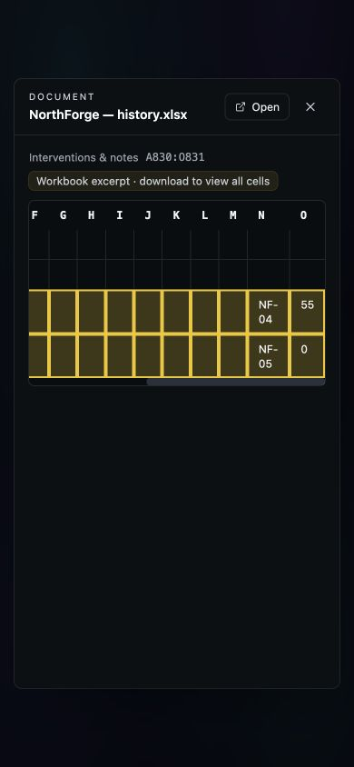

# Keep the retrieved Excel cells inside the preview

The [real 37056391 check](../release-37056391-2026-09-17/README.md) retrieved
`NF-04 = 55` at rank 1 with the actual row citation `A830:O831`. Its preview
stopped at column L and showed blank cells. This was a preview-window defect,
not a retrieval failure. The original failed response remains unchanged.

The shared preview now expands a cited window up to **40 rows × 40 columns**
and gives selected cells priority over the two-cell context margin. It retains
the existing 40 × 12 default for an untargeted preview. Larger selections remain
explicitly partial with the original download available. Document, SFTP and
deposit previews continue through the same implementation; access and source
resolution are unchanged. No frontend implementation, theme or dependency change.

- [66 backend tests](backend.log): actual A830:O831 endpoint regression,
  complete 40×40 selection without context clipping, oversized bounded selection,
  unchanged untargeted window and existing source/deposit access behavior.
- [1,487 frontend tests](frontend.log), [FR/EN](i18n.log), [navigation](nav.log),
  [chrome](chrome.log) and [production build](build.log) passed.
- [Local response](local-preview.json) generated by the corrected backend from
  the same unchanged workbook. The actual Angular component renders every cited
  cell in FR/light desktop. EN/dark 390×844 keeps the existing horizontal scroll;
  the capture shows the value after scrolling it into view. No new visual design.

These are local component captures, not deployed screenshots or user studies.
Deployed as `bb467f53`; the [read-only production recheck](../release-bb467f53-2026-09-17/README.md)
passes against the same retained job, original and rank-1 citation. No re-upload
or narrower hit was used. This does not qualify the full R2 Capture journey.
