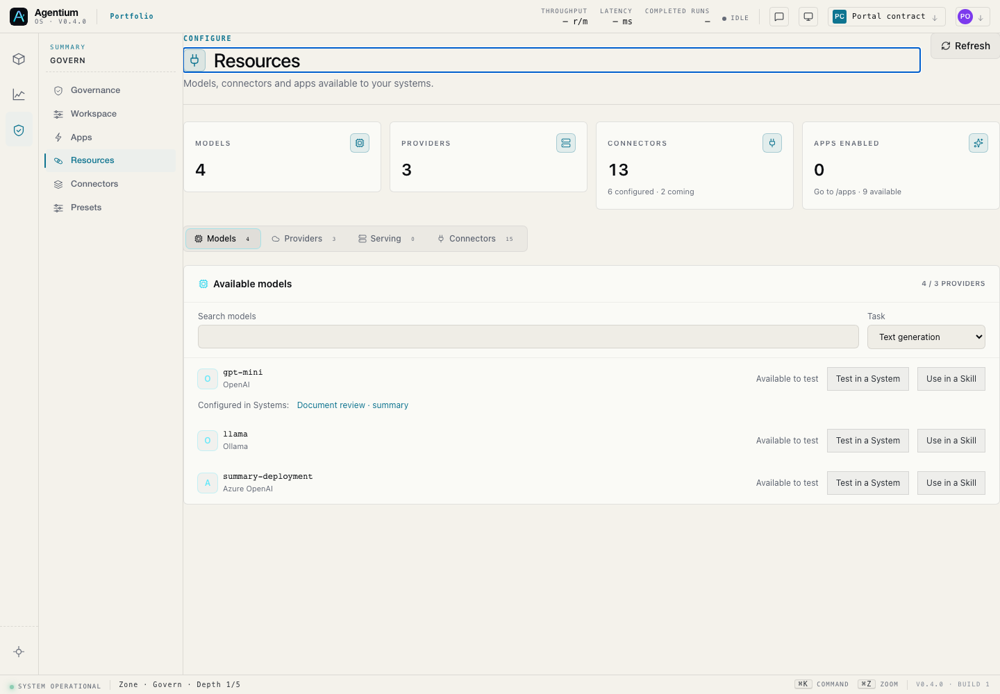
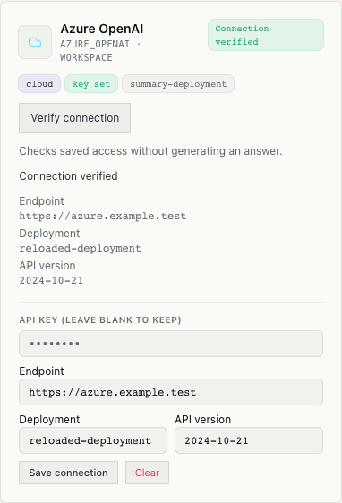
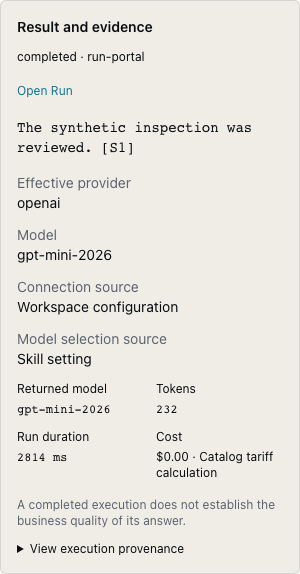
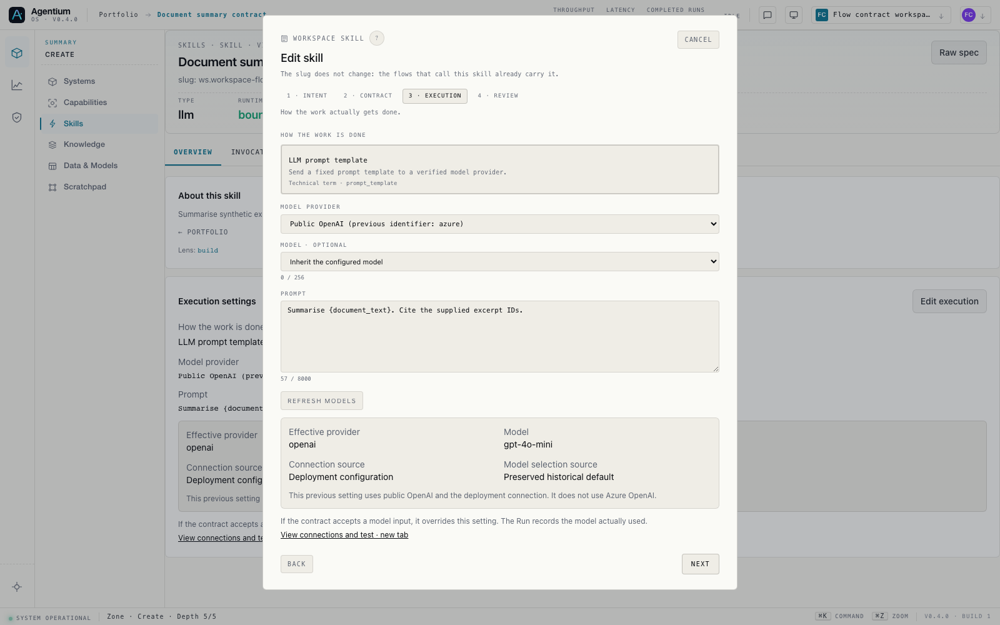

# LLM Portal and Skill execution

The model catalogue, provider configuration and prompt Skills share the same workspace model resolution. The Portal shows configured connections, discovered models and compatible text runtimes separately. A successful connection probe is not reported as a successful generation.

## Resolution and compatibility

New prompt Skills can select `openai`, `azure_openai`, `ollama`, or `workspace`. An explicit provider never falls back to another provider. `workspace` follows the workspace routing configuration; each fallback resolves its own model and passes the execution policy before it is called. Cumulative usage and latency are recorded in the same invocation before the existing Run valves evaluate another attempt. A strict token budget refuses a retry when the previous call's usage is unknown. Streaming cannot restart on another provider after response text has begun.

The model is resolved from the execution input, the Skill's optional `executor.params.model`, the System default, then the matching workspace/deployment default. Input and output schemas are not expanded to insert a configuration field. A provider-qualified model belonging to a different provider is rejected.

Existing `azure` bindings retain their historical behavior: public OpenAI, the deployment credential and the historical model default when no model input is supplied. The UI names this compatibility mode explicitly. It is not a new Azure OpenAI connection. Existing published Ollama bindings without a model retain their historical default. New explicit model selections are stored in the executor and travel with the published execution contract.

Workspace credentials take precedence over environment credentials for canonical providers. An unreadable stored credential fails explicitly; it does not silently fall back to an environment key. Resolution objects retain connection material only in the invocation's private context. Public projections and traces contain provider/model identities and provenance, not secrets.

## Authoring and testing

Resources and the Skill editor read the same `/models` projection. The editor retains an existing value if it is absent from the current catalogue, and marks it as such; changing provider clears the previous model. The model selection from Resources opens a draft Skill in the same workspace, after the server has granted authoring rights. The supplied query parameters grant no permission and carry no prompt or credential.

The connection link opens in a new tab so the unsaved Skill remains available. The Flow inspector shows the current Skill with its effective configuration; the published section shows its frozen binding separately. Reading configuration does not update a graph or a published version.

The Portal's generation test requires an authorized System and a compatible LLM node. `/models/test-targets` exposes eligible targets; `/models/test` checks the provider/model pair and current Flow digest, then delegates to the existing Workbench node preview. The Run uses the System's policies, authorization and budget controls. It does not execute an ungoverned prompt through a second runtime.

The existing `flow_workbench_v1` and `flow_publication_v1` gates govern this test. When no compatible target exists, the user can create a Skill with the selected model and use the Flow testing journey. No System or Skill is created implicitly by merely browsing the Portal or testing a connection.

## Observability

The planned configuration is stored in `trace.model_resolution`. Once a provider call is dispatched, the supported model invocation records `trace.model_execution` and its provider-qualified `trace.effective_model`. Evidence includes the connection source, model-selection source, returned model and fallback attempts. A missing template input or credential does not create evidence of a provider call. Run and invocation views display recorded execution evidence; they do not substitute current configuration for historical facts.

Routing distribution reads the canonical invocation ledger and applies its read controls. It distinguishes inferred historical identities from runtime evidence. A model name or arbitrary Skill output cannot promote itself to authoritative provider evidence.

Costs retain their source and currency. A catalogue tariff is a calculated cost, not a provider invoice; an absent measurement stays absent, and different currencies are not summed into one amount. Partial subtotals and incomplete usage after a fallback are identified as such. Positive costs below display precision remain positive through a less-than label.

Provider probe caches are isolated by workspace. Configuration changes invalidate the appropriate workspace cache. UI reads also discard responses from an obsolete workspace or request generation.

## Validation and release

Development base: `origin/demo/agentic` at `9c00d6de6`, branch `codex/skill-execution-visibility`, including the earlier Skill/Flow visibility correction. No database migration or new experience flag is introduced.

The existing release gates apply: FR/EN and navigation/chrome checks, frontend unit tests, production build, backend model/configuration/Workbench/runtime-policy tests and browser contract cases. Local browser cases use synthetic API fixtures and do not attest a live provider generation. Release to a workspace remains a separate operation through the normal Agentium release process.

For rollout, inspect existing legacy bindings before explicitly migrating their provider. Keep a published version unchanged until its replacement is tested and published. Returning to a previous compatible image must not overwrite workspace configuration or Run evidence created since that image.

Workspace executions cannot use the process-global `serving_*` registry as a fallback. Those connections remain discoverable and manageable in Serving, but are not advertised as supported prompt Skill runtimes. They require an explicit workspace runtime integration before use; the portal explains this limitation.

Mixed flows, RAG, AgentLoop and subflows retain their existing System model entry gate. Jobs without a workspace keep their global configuration. The circuit breaker still counts canonical invocations rather than individual transport failures. A dispatched attempt proves that an API call was attempted; success and billing require their own evidence.

## Audit coverage

| Reported break | Implemented behavior |
| --- | --- |
| Provider label differs from execution | Shared resolution; explicit OpenAI/Azure OpenAI; preserved legacy bindings; effective configuration in Skill and Flow, recorded provider in Run. |
| Models is empty while Providers lists models | Shared workspace catalogue for Resources and Skill selectors, with search, text compatibility and connection/runtime states. |
| Saved settings cannot be tested | Provider/model selection, controlled fallback order, separate connection probe and canonical System/node test. |
| Portal is disconnected from authoring | Model selection opens a Skill draft; the Skill's connection link preserves its unsaved editor in another tab. |
| Errors and metadata are hidden | Public Azure metadata reloaded; write-only keys; explicit read errors, unavailable connections and permission-aware commands. |
| Usage cannot explain an execution | Canonical Run/invocation links, returned model and fallback evidence, current Flow usage distinct from Run history, attributable cost states. |

## Validation record — 15 September 2026

| Check | Result |
| --- | --- |
| `check:i18n` | PASS — 7,671 keys, FR/EN parity and lexical guard. |
| `check:nav-links` | PASS — zero unregistered Cockpit links. |
| `check:ui-chrome` | PASS. |
| Frontend unit suite | PASS — 1,443 tests. The 13 Portal tests also passed after reuse of the cost formatter. |
| Backend integration and regression suites | PASS — 294 tests across 17 files. |
| Production build | PASS — completed at 10:36 UTC; final screenshots inspected. |
| Browser contracts | PASS — 7 Chromium cases, including model-to-Skill handoff, read-only refusal and 390 px layout. |

Backend coverage includes model resolution, workspace configuration and health cache isolation, Portal API authorization, Workbench Run creation, published executor contracts, model policies and valves, token telemetry, streaming, AgentLoop, agentic Skills and judge/tool-call regressions. Every provider client is replaced in these tests; no live generation or remote configuration write is part of this validation.

Build warnings concern the existing bundle/CSS budgets, an optional-chain warning in `vp-map-preview`, and CommonJS dependencies. Backend deprecation warnings remain. None is reported as a successful live integration test.

The browser cases run the production frontend on loopback with synthetic API fixtures. They cover reading and editing a Skill, reloading it, separating the current and published Flow bindings, passing a model into a new Skill draft, read-only access, saved Azure metadata, connection checks, canonical Run results, unavailable targets, failed reads, and a 390 px viewport.

Reproduce browser checks with `E2E_BASE_URL=http://127.0.0.1:4287` and the existing Playwright Chromium project: `e2e/tests/22-model-portal-contract.spec.ts`, plus `e2e/tests/16-flow-builder-authoring-contract.spec.ts --grep 'Skill execution settings'`. The local frontend must serve the current production build; these cases refuse an external target.

Deployed from `demo/agentic` at `30db8c07cc1087ac2f321fba63da103e1157d044` on 15 September 2026 through the immutable-image process. The final navigation correction also passed all 1,445 frontend tests, the three guards, production build and five Portal browser cases. Those cases now check that Govern context remains a query parameter in both Skill and invocation links.

Authenticated live verification confirmed OpenAI access, the Skill editor, Flow settings and the model-to-Skill handoff. Replaying the synthetic PIH example created Run `eceec12a-21f9-4a44-a5c1-3497df25ca28` with a sourced response and recorded OpenAI execution evidence (228 provider-reported tokens). Azure OpenAI remains unconfigured and Ollama unavailable in Showcase. The Portal generation test remains gated by the workspace's Workbench setting; the live replay used the existing Run action. No provider configuration or published Flow was changed during verification.

The image identities, live canaries, captures and rollback address are recorded in [the deployment journal](agentium-safe-vm-deployment.md#15-septembre-2026--llm-portal-et-réglages-dexécution).

## Browser captures

These captures show the implemented production frontend with the local validation fixtures described above.

Shared catalogue and direct entry into Skill authoring:

Saved Azure connection metadata, explicit connection test and readable configuration actions:

Recorded result and evidence on a narrow screen:

Skill execution settings, including the preserved historical provider identity:

