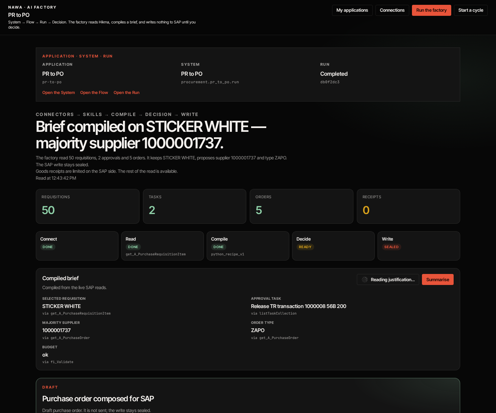
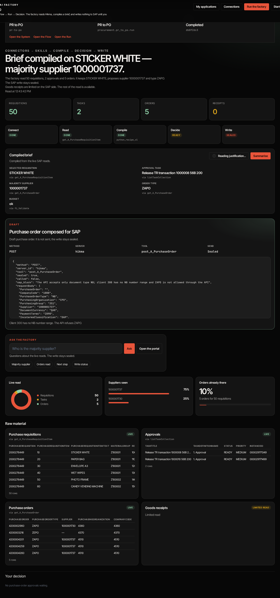
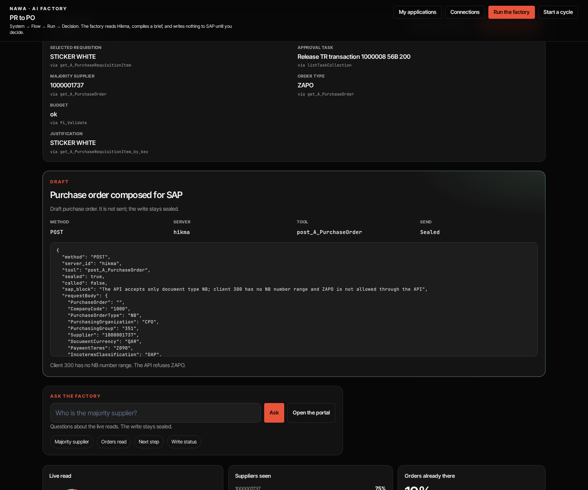
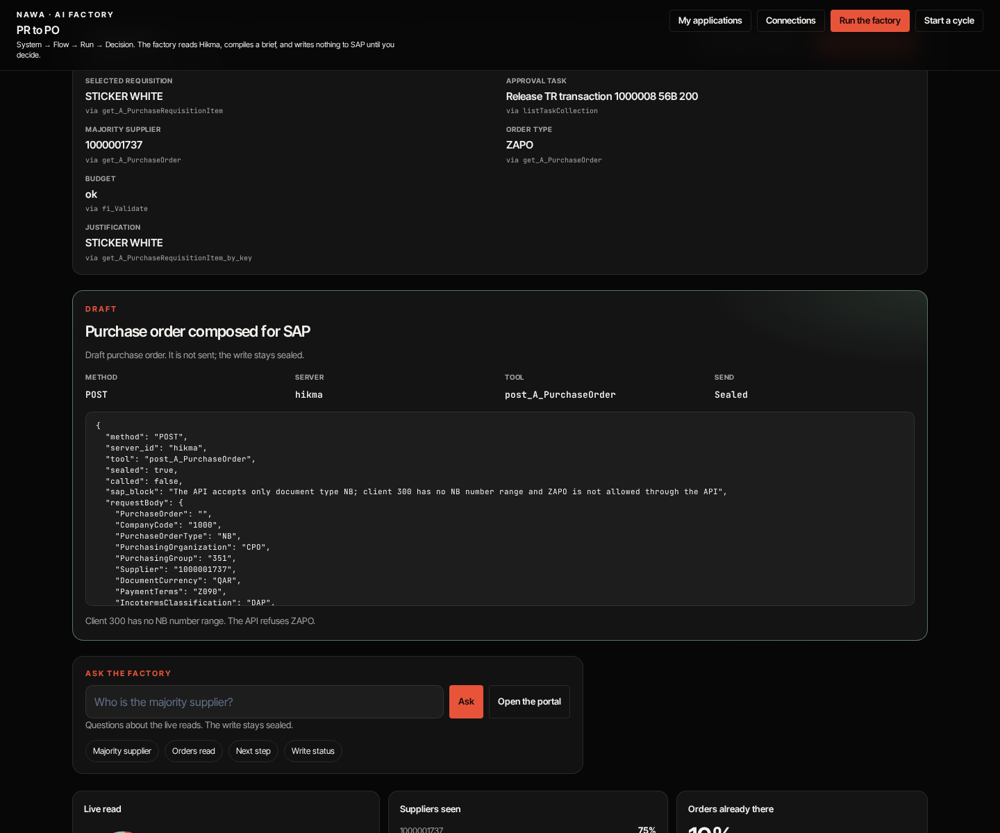
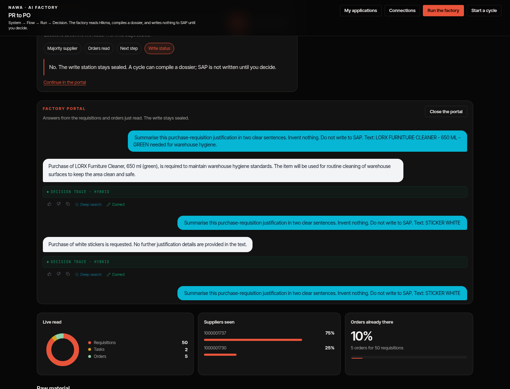

# Nawa PR to PO — live desk playbook (Fayçal)

**Audience:** Fayçal (handout) and the presenter.  
**Language of the desk:** English.  
**Last verified:** 31 August 2026. English desk copy uses **brief** (not dossier). Live VM still serves `cd40fe33` until this slice is switched.

| Give this | To whom |
|---|---|
| This markdown (or the Word) | Fayçal — the four proofs and the walkthrough |
| [`nawa-pr-to-po-live-demo-presenter-fr.md`](nawa-pr-to-po-live-demo-presenter-fr.md) | Presenter — one French page to hold during the talk |
| [`nawa-pr-to-po-live-demo-playbook.docx`](nawa-pr-to-po-live-demo-playbook.docx) | Same content, illustrated, for a printed / emailed handout |

This is the **operator desk**. It is not a numbered demo script. The four proofs live **in this document**. On screen you only see work.

---

## 1. Open this URL

```
https://agentium.papai.ai/work/pr-to-po?workspace=nawa&lang=en
```

Hard-reload (`Ctrl+Shift+R` / `Cmd+Shift+R`) so the browser does not keep an old bundle.

| Field | Value |
|---|---|
| Page title | **PR to PO** |
| Eyebrow | NAWA · AI factory |
| Workspace | `nawa` |
| Login (presenter) | `thibaud.ishacian@datategy.net` |
| Live SHA | `cd40fe337285058120ec7236d587b1853ca72c42` |
| System | `PR to PO` (`28345b5a-0824-4f2b-a420-ebe0aa7cd34f`) |
| Binding | `procurement.pr_to_po.run` → published v2 (`b9217063-b512-48e8-a444-835867a3de76`) |
| SAP | Live Hikma MCP. **No HANA.** |
| Write | **Sealed.** The POST is composed, never sent. |

Subtitle on the desk: *System → Flow → Run → Decision. The factory reads Hikma, compiles a brief, and writes nothing to SAP until you decide.*

---

## 2. What Fayçal must see (four proofs)

The screen does **not** number these. You point at the matching card.

| # | Proof | Where you point | What must be true |
|---|---|---|---|
| 1 | Live SAP MCP | KPI row, stations, then **Read selected requisition** and the brief facts | `get_A_PurchaseRequisitionItem` and `get_A_PurchaseRequisitionItem_by_key` return a real PR. `listTaskCollection` feeds the approval task. `fi_Validate` and `get_A_PurReqnAcctAssgmt` feed budget. `get_A_PurchaseOrderItem` / `get_A_PurchaseOrder` feed orders, supplier, and type. Compile station shows `python_recipe_v1`. |
| 2 | Small agentic task | **Summarise** in the compiled brief | `azure_llm_v1` `POST /chat/completion` `prompt_type: factual` turns the live justification into two clear sentences. Invent nothing. |
| 3 | PO POST package | **Draft / Purchase order composed for SAP** | Server `hikma`, tool `post_A_PurchaseOrder`, method POST, type **NB**, Send **Sealed**. JSON: `sealed: true`, `called: false`. Client 300 has no NB range; ZAPO is refused. Success = honest composed POST, not a live create. |
| 4 | Nice-to-have | **Ask the factory** and **Open the portal** | Read-only. Chips: Majority supplier, Orders read, Next step, Write status. The write stays sealed. |

If the Write station says **Sealed**, that is correct.

---

## 3. Walkthrough (about three minutes)

1. Hard-reload the URL. Header reads **PR to PO**. Four counts. Five stations. Write = **Sealed**.
2. Click **Run the factory**. Wait until Compile is **Done** and the hero reads something like *Brief compiled on STICKER WHITE — majority supplier 1000001737.*
3. **Proof 1.** Point at the counts and the tools under the stations. Click **Read selected requisition** if justification is empty. The brief facts name the live tools.
4. **Proof 2.** Click **Summarise**. Two sentences appear via `azure_llm_v1`.
5. **Proof 3.** Scroll to **Draft / Purchase order composed for SAP**. Read the row: POST · hikma · `post_A_PurchaseOrder` · Send **Sealed**. Open the JSON. Say: *this is the POST we would send; it is not sent.*
6. **Proof 4.** Chip **Write status**. Answer: the write stays sealed.

There is no button that posts a purchase order.

**Talk track:** *This is the PR to PO factory. It reads Hikma through MCP, compiles a brief, and writes nothing until a human decides.*

---

## 4. Screen map

### Top of the desk

Lineage (Application · System · Run), briefing, counts, stations, compiled brief. Actions sit in the brief header: **Read selected requisition**, **Summarise**.



### Compiled brief (proofs 1 and 2)

Facts name their tools. Justification via `get_A_PurchaseRequisitionItem_by_key`. Summary via `azure_llm_v1`.



### Draft purchase order (proof 3)

Kicker **Draft**. Title **Purchase order composed for SAP**.  
Hint: *Draft purchase order. It is not sent; the write stays sealed.*  
Row: Method POST · Server hikma · Tool `post_A_PurchaseOrder` · Send **Sealed**.  
Footnote: *Client 300 has no NB number range. The API refuses ZAPO.*



### Ask the factory (proof 4)

Hint: *Questions about the live reads. The write stays sealed.*  
Placeholder: *Who is the majority supplier?*



### Portal

Hint: *Answers from the requisitions and orders just read. The write stays sealed.*  
Stay on get-PR / get-PO questions. Older summarise prompts in the portal thread are session history, not a second write.



---

## 5. Live example (31 August 2026, SHA `cd40fe33`)

| Field | Value |
|---|---|
| Headline | Brief compiled on **STICKER WHITE** — majority supplier **1000001737**. |
| Voice | The factory read 50 requisitions, 2 approvals and 5 orders. It keeps STICKER WHITE, proposes supplier 1000001737 and type ZAPO. The SAP write stays sealed. |
| Counts | Requisitions 50 · Tasks 2 · Orders 5 · Receipts 0 |
| Stations | Connect **Done** · Read **Done** (`get_A_PurchaseRequisitionItem`) · Compile **Done** (`python_recipe_v1`) · Decide **Ready** · Write **Sealed** |
| Selected requisition | STICKER WHITE via `get_A_PurchaseRequisitionItem` |
| Approval task | Release TR transaction 1000008 56B 200 via `listTaskCollection` |
| PR id (in the POST) | `2000276449` item 10 |
| Justification | STICKER WHITE via `get_A_PurchaseRequisitionItem_by_key` |
| Summary | *The purchase requisition is for white stickers. No additional justification details are provided in the text.* via `azure_llm_v1` |
| Supplier | `1000001737` via `get_A_PurchaseOrder` |
| Order type (read) | ZAPO via `get_A_PurchaseOrder` |
| Budget | ok via `fi_Validate` |
| POST | hikma `post_A_PurchaseOrder`, `PurchaseOrderType` **NB**, Supplier `1000001737`, PurchasingOrganization `CPO`, CompanyCode `1000`, `sealed: true`, `called: false` |

**Ask → Write status:** *No. The write station stays sealed. A cycle can compile a brief; SAP is not written until you decide.*

The exact PR can move on a later read. The **tools** and the **sealed POST** must not.

---

## 6. Exact labels on the desk

Taken from `frontend-ng/src/app/core/i18n/experience.dict.ts` (English).

| Place | English |
|---|---|
| Title | PR to PO |
| Primary | Run the factory |
| Secondary | Start a cycle |
| Sources | Connections |
| Brief | Compiled brief / Compiled from the live SAP reads. |
| Brief facts | Selected requisition · Approval task · Majority supplier · Order type · Justification · Justification summary · Budget |
| Brief actions | Read selected requisition · Summarise |
| Draft card | Draft · Purchase order composed for SAP |
| Draft row | Method · Server · Tool · Send |
| Ask | Ask the factory · Ask · Majority supplier · Orders read · Next step · Write status |
| Portal | Open the portal · Factory portal · Close the portal |
| Stations | Connect · Read · Compile · Decide · Write |
| Station status | Done · Ready · Blocked · Sealed |
| KPIs | Requisitions · Tasks · Orders · Receipts |

Banned on this desk: pipeline, workflow, job.  
Removed from this desk: Success criteria, numbered beats 1–4, Shown / Play / Waiting, *Compose the POST is the success of this demo*.

---

## 7. Seven-minute script

| Time | Do | Say |
|---|---|---|
| 0:00 | URL, `nawa`, English, hard-reload | “Operator desk. Not a slide.” |
| 0:30 | Counts + stations | “Live SAP, through MCP. No HANA.” |
| 1:30 | Brief + **Read selected requisition** + **Summarise** | “One short model call. Two sentences. Nothing invented. Nothing written.” |
| 3:00 | Draft card | “Type NB, sealed, not sent. Client 300 has no NB range. ZAPO is refused.” |
| 5:00 | Chip **Write status**, then **Open the portal** if there is time | “Questions on the reads we just did.” |
| 6:30 | Stop | Write still **Sealed**. Offer **Start a cycle** only if they ask. |

---

## 8. If something looks wrong

| Symptom | What to do |
|---|---|
| Old tiles “1 Live SAP / 2 Agentic / Shown / Play” or a Success criteria strip | Hard-reload. Those tiles were removed on `cd40fe33`. |
| Blank desk / login loop | Login, then hard-reload **this** desk URL. Do not open `/` first in an automated session (it clears the token). |
| `token expired` or HTTP 407 on MCP | Restart the Hikma Cloud Foundry MCP apps. This is **not** an Agentium password problem. |
| Counts at 0 | Click **Run the factory** once and wait. A timeout on `tools/call` often recovers on the next run. |
| Empty justification | **Read selected requisition** once, then **Summarise** once. Do not spam. |
| No draft card | Need a live PR and a majority supplier. Run the factory again. |
| Write station still Sealed after Run | Correct. |
| Goods receipts 0 / Limited read | Expected. `sap_gr` is often 403. Do not dwell. |
| Portal shows older summarise prompts | Session history. Ask a get-PR / get-PO question. Do not treat it as a write. |
| Someone asks to create the PO live | Refuse. Client 300 has no NB range. ZAPO is refused. The composed POST is the artefact. |

---

## 9. Do not

- Do not post a purchase order. No `tools/call` on `post_A_PurchaseOrder`.
- Do not call `fi_EnableForPurchasing` or `fi_Discard`.
- Do not invent MCP aliases (`A_*`, `YY1_*`).
- Do not turn HANA on (`sap_hana_connector` stays off).
- Do not seed the `nawa` workspace on this VM.
- Do not move the `demo-agentic` tag for this slice.
- Do not put the four proofs back on the screen as numbered tiles.
- Do not put a password or an OAuth secret on a slide.

---

## 10. Technical anchors

| Item | Value |
|---|---|
| Desk route | `/work/pr-to-po?workspace=nawa&lang=en` |
| Board | `frontend-ng/src/app/features/experience/work/pr-to-po-board.component.ts` |
| Runtime | `frontend-ng/src/app/features/experience/work/pr-to-po-desk.ts` |
| Copy | `frontend-ng/src/app/core/i18n/experience.dict.ts` |
| Images | `agentium-{backend,worker,frontend}:cd40fe337285` |
| Rollback of this desk slice | `AGENTIUM_IMAGE_TAG=3eb72f95f6b6` |
| Writes via `/read` | HTTP 400 `not a read` |
| Presenter card (FR) | `docs/ops/nawa-pr-to-po-live-demo-presenter-fr.md` |
| Illustrated Word | `docs/ops/nawa-pr-to-po-live-demo-playbook.docx` |
| Word builder | `docs/ops/build-nawa-pr-to-po-playbook.py` |
| Figures | `docs/ops/nawa-pr-to-po-playbook-figures/` |
