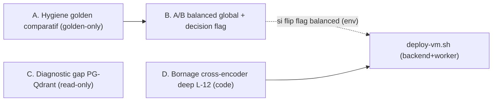

# Plan — Suivis RAG complets (post-volet-2) — 2026-06-15

> Quatre chantiers post-volet-2 : (A) hygiène du golden comparatif pour que le pass-rate reflète le rappel, (B) A/B balanced global pour décider le flag de décomposition comparative, (C) diagnostic read-only du gap d'ingestion PG⊋Qdrant, (D) bornage du cross-encoder deep L-12. A→B séquentiels ; C et D indépendants.

## Contexte et état

Branche `demo/agentic` HEAD `3e5ec198`, VM `omnirag-demo` sur `6176982` (alembic `041 head`, audit dérive vert). Les volets 1/2/3 sont livrés. Ce plan traite les deux suivis ouverts du volet 2 (A, B) plus les deux points historiquement reportés (C, D).

Contraintes transverses (toutes tâches) :
- Déploiement uniquement via `bash scripts/deploy-vm.sh` (jamais `docker cp`/hotfix in-container).
- `git add` ciblé, jamais `git add -A` (exclure `docs/render/` untracked). Garder `KCDBG24a345`.
- Mesures golden/A-B exécutées in-container sur la VM (vrai Qdrant), profil indiqué par tâche.



## A. Hygiène du golden comparatif (golden-only, aucun code live)

Problème : le critère de passage exige au moins une `expected_sources` matchée ET aucun `missing_evidence_terms` :

```304:305:backend/app/services/rag/retrieval_golden.py
        len(matched_sources) >= min(case.min_expected_sources, max(len(expected_sources), 1))
        and not missing_evidence_terms
```

Les cas comparatifs de `backend/app/resources/retrieval_golden/andritz_spl_hard_intents.json` ont `expected_sources` = noms de composants (`CONTINENTAL GVJS`, `Wilo NOLH`) absents des filenames d'export HTML (`index.html`, `accueil-Dryer.html`) -> `matched_sources` toujours vide -> echec structurel malgre `missing_evidence_terms=[]`.

Etapes :
- Scroll Qdrant in-container (collection `andritz__andritz-notices-techniques-spl-pilot`) pour identifier, par cas comparatif, le vrai fragment de `document_filename`/chemin de page recuperable qui porte le contenu de chaque entite (ex. chemins projet `AKI300__...__V.5.Vacuum set__...`).
- Remplacer `expected_sources` par ces fragments reels ; renseigner `expected_evidence_terms` avec les termes d'entites pour exiger les deux cotes. Recalibrer `min_expected_sources` si besoin. Aucune assertion artificielle : on matche les documents qui contiennent reellement la reponse.
- Re-run hard-intents in-container (balanced + deep) : les cas comparatifs passent quand les deux entites sont recuperees, echouent legitimement sinon.
- `poetry run pytest app/tests/ -q -k "golden or retrieval_golden"` vert.
- Commit golden (+ note dans `docs/rag-comparative-decomposition-eval-2026-06-15.md`). Pas de redeploiement (le golden n'est pas dans le chemin de service).

## B. A/B balanced global + decision du flag (depend de A)

Objectif : decider `rag_comparative_decompose_balanced` (defaut False dans `backend/app/core/config.py:172`). Le vrai risque n'est pas la latence (deja ~neutre) mais les faux positifs de detection comparative qui declencheraient la decomposition sur des requetes non-comparatives.

- Harness existant `scripts/golden_flag_ab.py`, in-container, profil balanced, sur hard-intents + batches non-comparatifs (`andritz_spl_dense.json`, `andritz_spl_scope_filters.json`, `andritz_spl_multilingual.json`), flag `rag_comparative_decompose_balanced=true`.
- Regle de decision pour basculer ON :
  1. 0 regression sur les cas non-comparatifs (aucun pass->fail).
  2. 0 faux positif : `comparative_decompose` reste False sur tous les non-comparatifs.
  3. Rappel comparatif en hausse (pass-rate apres A, ou distinct_docs/subhits).
  4. Delta latence balanced dans le budget.
- Si criteres remplis : passer `RAG_COMPARATIVE_DECOMPOSE_BALANCED=true` dans `docker/env/agentium.vm.env` (override env, pas le defaut code) + redeploiement (voir section deploiement). Sinon garder OFF et documenter.
- Livrable : table A/B par cas + reco flag.

## C. Diagnostic gap d'ingestion PG⊋Qdrant (read-only uniquement)

Objectif : savoir quels documents existent dans le ledger PG mais pas dans Qdrant, et pourquoi. Aucune re-ingestion, aucun changement prod.

- Nouveau script read-only `backend/scripts/reconcile_pg_qdrant_sources.py` comparant :
  - PG : `KnowledgeCollectionSource` (`backend/app/models/knowledge_collection.py:151`) par collection/workspace, avec `status` (`indexed`/`ready`/`error`/`deduplicated`/...) et `chunk_count`.
  - Qdrant : `document_id`/`document_filename` distincts presents dans la collection (scroll/agregation via `QdrantVectorDB`).
- Sortie par collection : sources PG en `ready`/`indexed` avec 0 vecteur Qdrant (ou `chunk_count` PG vs Qdrant divergent), classees par cause probable : echec parse/extraction (ex. PDF `KD724.PDF` non extrait), `status=error`, `deduplicated` (attendu, pas un gap), jamais enqueued.
- Execution in-container sur les collections andritz ; livrable `docs/ingestion-gap-pg-qdrant-2026-06-15.md`. Nettoyer le script temporaire si non conserve, ou commit du script + rapport (docs-only, pas de redeploiement).

## D. Bornage du cross-encoder deep L-12 (code live + redeploiement)

Aujourd'hui le deep score le pool COMPLET, passage 512, SANS budget temps :

```106:110:backend/app/services/rag/cross_encoder_stage.py
    if profile == "deep":
        model_name = settings.rag_cross_encoder_model_deep
        max_length = 512
        budget_seconds: float | None = None
        pool = len(chunks)
```

La voie d'execution borne deja par budget existe (`asyncio.wait_for(asyncio.shield(future), timeout=budget_seconds)` l.144-155) avec repli propre sur l'ordre policy au timeout ; il suffit de fournir un `budget_seconds` non-None et de capper le pool pour le deep.

- Ajouter dans `backend/app/core/config.py` : `rag_cross_encoder_budget_seconds_deep` (defaut ~20-30 s, soit une fraction de `rag_deep_retrieval_deadline_seconds=120`) et `rag_cross_encoder_max_candidates_deep` (defaut ~64). Optionnel : `rag_cross_encoder_max_length_deep` (defaut 512).
- Dans `backend/app/services/rag/cross_encoder_stage.py` : pour `profile == "deep"`, `budget_seconds = rag_cross_encoder_budget_seconds_deep`, `pool = min(len(chunks), rag_cross_encoder_max_candidates_deep)`, `max_length = rag_cross_encoder_max_length_deep`. Comportement balanced inchange.
- Tests dans `backend/app/tests/services/` : le deep honore desormais un budget (chemin timeout -> ordre policy preserve) et cappe le pool ; balanced inchange.
- `poetry run pytest app/tests/ -q -k "cross_encoder or rerank or retrieval"` vert.
- Redeploiement backend+worker (voir section deploiement) ; smoke : 1 requete deep, verifier `cross_encoder_status` et respect du deadline deep.

## Sequencement, parallelisme et deploiement

- A puis B (B a besoin du critere repare). C et D independants, parallelisables.
- Un seul `bash scripts/deploy-vm.sh --no-frontend` consolide : le code du bornage CE deep (D) et, si B decide le flip, l'env `RAG_COMPARATIVE_DECOMPOSE_BALANCED=true`. C ne necessite pas de deploiement. A non plus.
- Verifier l'audit de derive vert en fin de deploiement.

## Hors perimetre (confirme)

- Re-ingestion/re-vectorisation des docs manquants (C reste diagnostic). A reprendre apres lecture du rapport gap.
- Modification du defaut code de `rag_comparative_decompose_balanced` (on agit par env VM ; le defaut code reste False).
