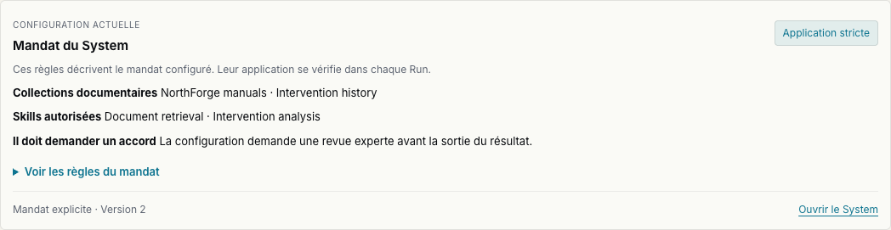
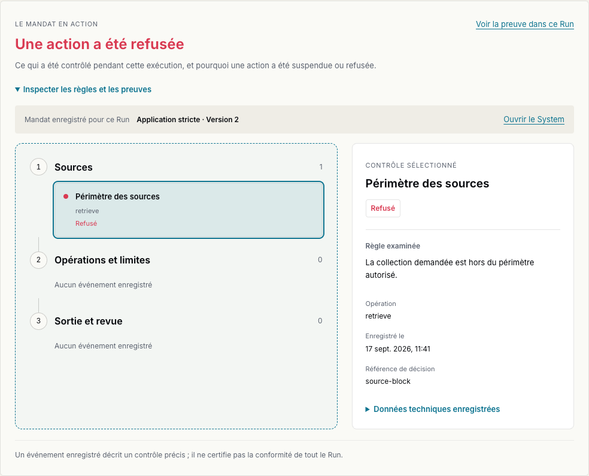
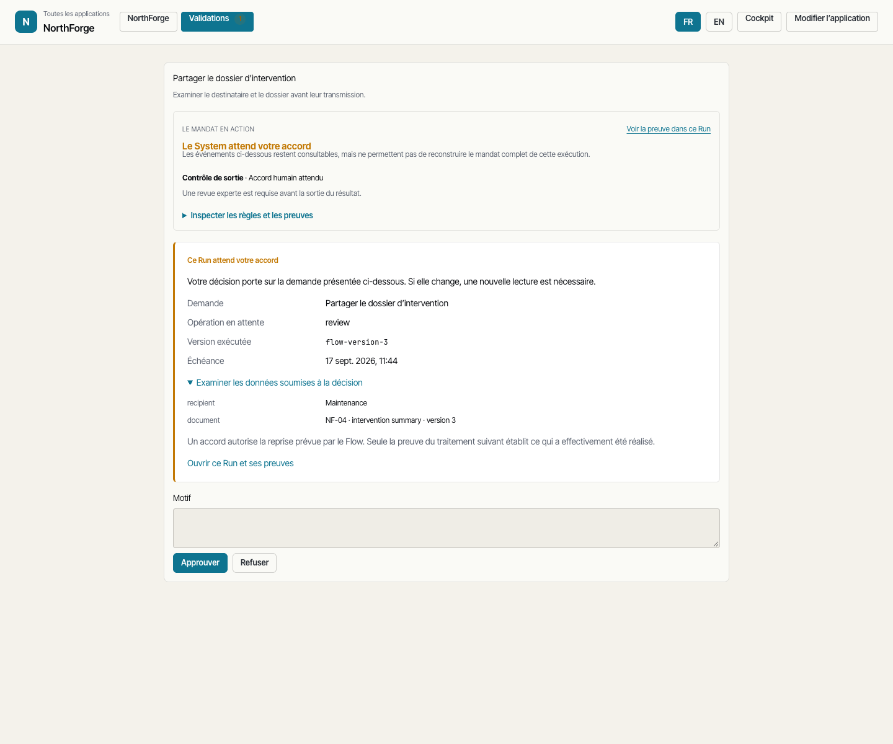
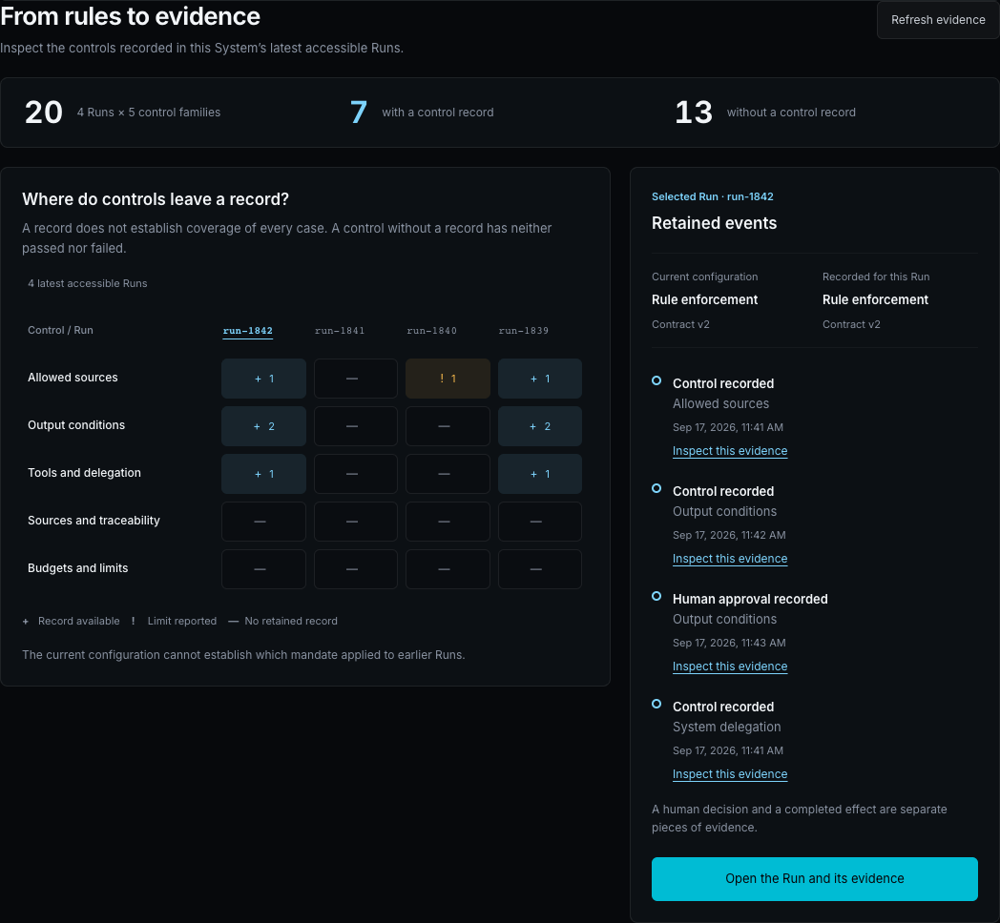
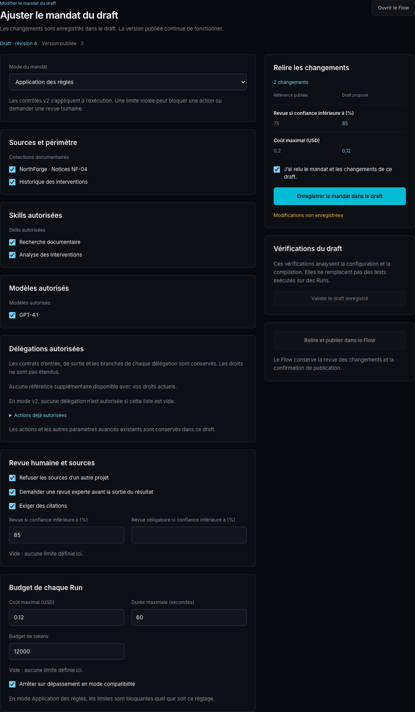
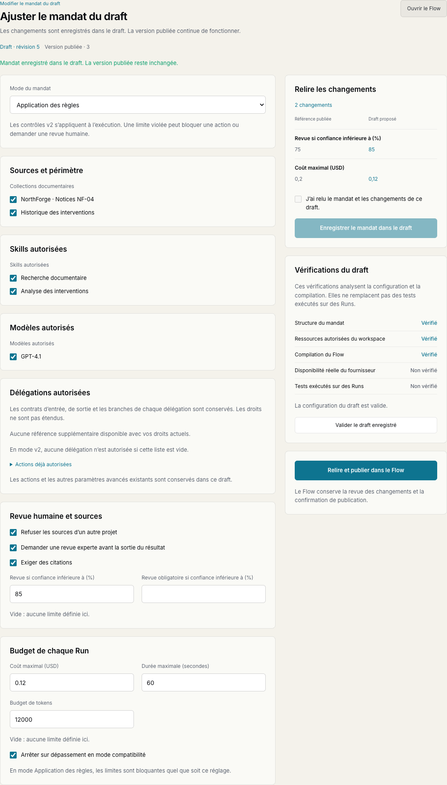
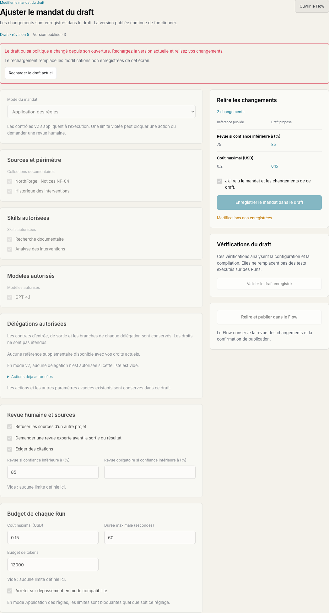

# Mandat visible et éditeur — recette du 17 septembre 2026

**Le mandat est intégré à Chat, Work, System et Run.** La configuration décrit le périmètre prévu ; les événements conservés expliquent les contrôles, attentes et refus de chaque exécution.

Branche : `codex/mandate-experience`. Base : `origin/demo/agentic`, `c432f2dc`. Travail local non commité et non déployé. Les images ci-dessous montrent les composants Angular compilés, alimentés par des fixtures synthétiques locales. Elles illustrent l’interface implémentée, pas une exécution de production.

## Dans le produit

**Ce System peut utiliser ces ressources, et cette sortie nécessite une revue.** Les noms des Skills et Systems autorisés remplacent leurs références techniques lorsqu’ils sont disponibles.



**Cette action a été refusée pour une raison précise.** La sélection relie la règle à l’événement, à l’opération et aux références de décision ou d’invocation. Une délégation enregistrée peut ouvrir son sous-Run, après vérification indépendante de son accès.



**L’accord porte sur la demande examinée.** Work expose le destinataire, les données soumises et la version avant les boutons de décision. Une demande modifiée doit être relue.



**Les règles deviennent vérifiables dans les Runs.** La matrice distingue trace disponible, limite signalée et absence de trace. Une cellule ouvre ses propres événements.



## Édition et publication du mandat

**System → Contexte** permet aux membres autorisés d’ajuster le mandat du draft. La colonne de droite compare les règles à la version publiée. Les changements demandent une revue explicite avant l’enregistrement.



Les vérifications serveur distinguent structure, ressources et compilation. La disponibilité réelle du fournisseur et les tests sur des Runs ne deviennent pas positifs sur la seule base d’une validation de configuration. La publication reste dans le Flow et crée une nouvelle version, même si seul le mandat a changé.



Un conflit de révision ou de policy conserve les modifications à l’écran et demande de recharger avant une nouvelle revue.



## Vérifications

| Vérification | Résultat |
|---|---|
| Backend : draft, publication, droits, intégrité, reprises, délégations, projections, compatibilité Andritz et migration | **476 tests réussis** |
| Frontend : suite unitaire complète | **1 553 tests réussis**, aucun échec ni test ignoré |
| `check:i18n` | Réussi, parité FR/EN ; 8 368 clés vérifiées |
| `check:nav-links` | Réussi, aucun lien Cockpit brut hors liste autorisée |
| `check:ui-chrome` | Réussi |
| `build:prod` | Réussi ; avertissements de budget de bundle/CSS, chaînes optionnelles et dépendances CommonJS conservés dans le build |
| System et Run, clair/sombre × FR/EN, largeur desktop et étroite | 20 états rendus ; sélection cellule → événement du Run et lien vers le sous-Run vérifiés |
| Work, clair/sombre × FR/EN | 4 parcours examiner → approuver → retrouver le même Run ; 8 captures |
| Éditeur M4, clair/sombre × FR/EN | 20 états : chargement, diff, sauvegarde et validation, largeur étroite, conflit ; enregistrement relu et lien de publication vérifiés |

Résultats backend : [sortie de la suite](backend-tests.txt). Les tests incluent deux versions en file d’attente avec policies différentes, suppression de la policy courante, reprises humaines et débogage, délégations, refus d’un contrat altéré, permissions révoquées, revue périmée, publication à graphe identique, source supprimée, restitution sans secret et migration additive.

Les assertions visuelles portent sur l’absence d’erreurs Angular/JavaScript, l’absence de débordement des nouveaux composants, les traductions et les destinations exactes. La largeur est vérifiée à 1 440 et 390 px. Certaines captures de composants augmentent la hauteur de la fenêtre pour inclure le contenu complet sans le masquer derrière l’en-tête fixe.

Résultats détaillés : [System et Run](visual-qa/visual-report.json), [Work](visual-qa/work-visual-report.json), [éditeur](editor-qa/report.json). Les fixtures restent exclusivement dans les scripts de recette.

Cas de régression couverts : snapshot fourni par l’utilisateur refusé comme preuve, ancien Run sans snapshot, absence de provenance concordante, résultat retenu non divulgué, Run/décision/invocation/sous-Run non autorisé, référence d’un autre workspace, porte expirée ou remplacée, statut accepté sans confirmation humaine, mode d’observation, dépassement sans arrêt, double envoi, réponse tardive après changement de workspace ou fermeture de l’application, attente durable de sous-Run, délai UTC sans suffixe de fuseau.

## Reproduire localement

Depuis `frontend-ng`, avec Node ≥ 22 et les dépendances du lockfile :

```sh
npm run check:i18n
npm run check:nav-links
npm run check:ui-chrome
npm run test:unit
npm run build:prod
node e2e/serve-dist.mjs
```

Dans un autre terminal, toujours depuis `frontend-ng` :

```sh
node e2e/qa-mandate.mjs
node e2e/qa-work-mandate.mjs
node e2e/qa-mandate-editor.mjs
```

Les trois scripts acceptent `BASE`, `OUT` et `E2E_CHROMIUM_EXECUTABLE`. La recette a utilisé le binaire Chrome installé, avec des contextes de test isolés. Toutes les requêtes API de ces tests sont interceptées : ils ne lancent ni Run ni décision sur un workspace réel.

Depuis `backend`, dans l’environnement Python du projet :

```sh
python -m pytest -q --disable-warnings \
  app/tests/api/test_mandates_api.py \
  app/tests/api/test_mandate_draft_api.py \
  app/tests/api/test_mandate_run_authority.py \
  app/tests/api/test_flow_publication_api.py \
  app/tests/api/test_flow_ingresses_api.py \
  app/tests/api/test_flow_runner_api.py \
  app/tests/api/test_flow_diff_api.py \
  app/tests/api/test_systems_flow_safety.py \
  app/tests/api/test_runs_hitl_auth.py \
  app/tests/api/test_system_perspective_api.py \
  app/tests/api/test_value_loop_api.py \
  app/tests/services/test_mandate_projection.py \
  app/tests/services/test_frozen_control_policy.py \
  app/tests/services/test_frozen_mandate_integrations.py \
  app/tests/services/test_migration_108_flow_mandate.py \
  app/tests/services/test_run_engine_policy_binding.py \
  app/tests/services/test_run_engine_membrane_v2.py \
  app/tests/services/test_membrane_spec.py \
  app/tests/services/test_membrane_enforcement.py \
  app/tests/services/test_run_engine_dag_e2e.py \
  app/tests/services/test_subflow_orchestration_scoping.py \
  app/tests/services/test_subflow_celery_contract.py \
  app/tests/services/test_flow_contracts.py \
  app/tests/services/test_flow_diff.py \
  app/tests/services/test_value_loop.py \
  app/tests/services/test_system_perspective.py \
  app/tests/services/test_skill_invocation_snapshot.py \
  app/tests/services/test_andritz_membrane_shadow_rollout.py \
  app/tests/services/test_migration_047_andritz_membrane.py
```

## Reprise et release

Le code ajoute deux projections de lecture dans `backend/app/api/v1/endpoints/mandates.py`, leur assemblage dans `services/mandate_projection.py` et un checkpoint serveur au premier démarrage. L’édition ajoute la migration additive `108_flow_draft_control_policy`, sans nouvelle dépendance ni nouveau flag. Le champ nullable du draft conserve la policy candidate ; le contrat existant de chaque version publiée en fige le contenu complet.

Les composants communs sont dans `frontend-ng/src/app/features/mandate`. L’examen de la demande Work utilise `work-decision.ts` et `work-decision-context.component.ts`. La matrice se trouve dans `system-mandate-coverage.*`. Les points d’intégration sont `chat-panel`, `runtime-blocks`, `work-shell`, `system-view` et `run-view`.

Avant la bascule, intégrer le candidat sur `demo/agentic` et appliquer [le processus existant](../../agentium-release-process.md) : images immuables backend/worker/frontend sur `omnirag-demo`, canaries depuis carakai, puis vérification du SHA et du parcours sur de vrais Runs. Cette recette locale ne vaut pas qualification du runtime distant.

L’éditeur M4 et le gel des policies sont implémentés. L’enregistrement ne modifie ni la ControlPolicy partagée ni la version publiée. Les versions historiques sans snapshot restent identifiées comme telles. Les nouvelles versions conservent leur mandat au démarrage, à la reprise humaine, à la reprise du débogage et dans leurs délégations.

Les modèles proposés correspondent aux références configurées ; la validation statique n’atteste pas la disponibilité du fournisseur. Les délégations se limitent aux contrats déjà autorisés. L’éditeur ne crée pas de permission IAM ni de contrat arbitraire de délégation. Les fichiers de thème NAWA restent inchangés.

Pour un System doté d’un mandat publié figé, l’ancien actuateur de l’Hyperviseur qui modifie directement une policy courante exige désormais de passer par la revue du draft et la publication. Il ne peut plus annoncer un changement appliqué sans effet sur les Runs. Les reçus d’actions déjà effectuées restent idempotents.

Déployer API et workers compatibles avant de publier ces nouveaux contrats. Conserver la colonne additive et les écritures lors d’un rollback ; un ancien worker qui rejette le contrat enrichi ne peut pas reprendre ces nouvelles versions. La migration refuse de supprimer des mandats enregistrés.

Voir [la documentation du parcours](../../agentium-visible-mandate.md).
