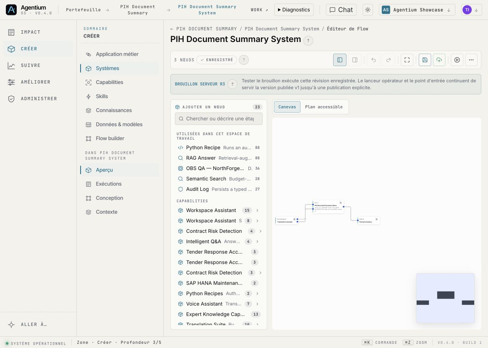
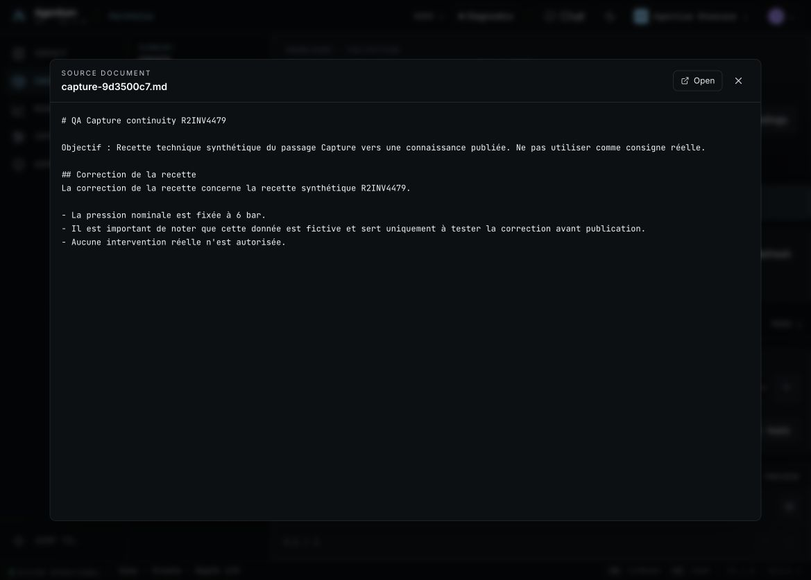
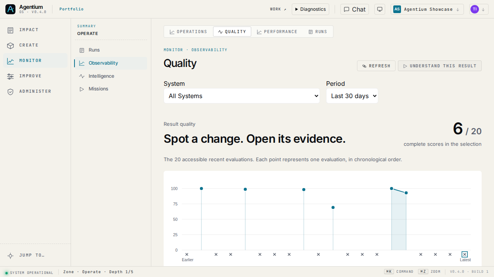
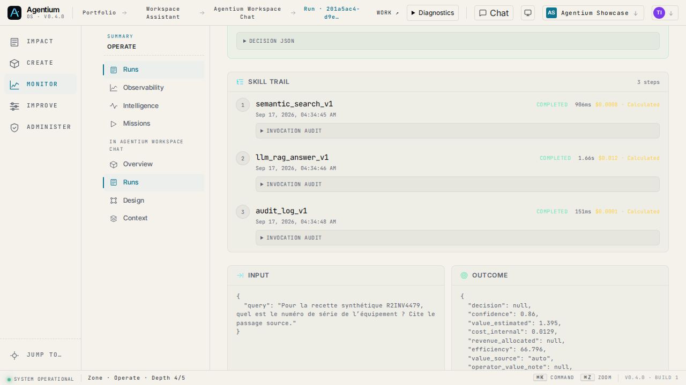
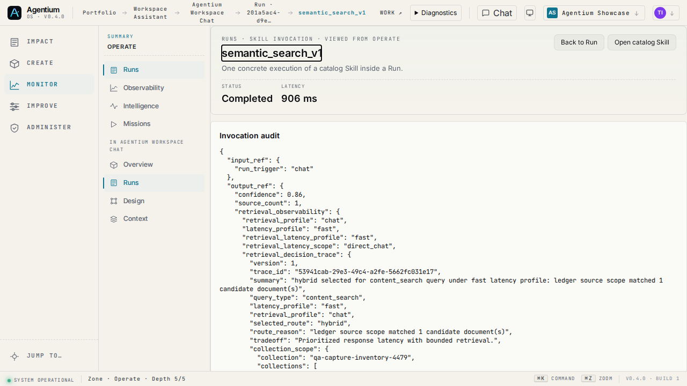
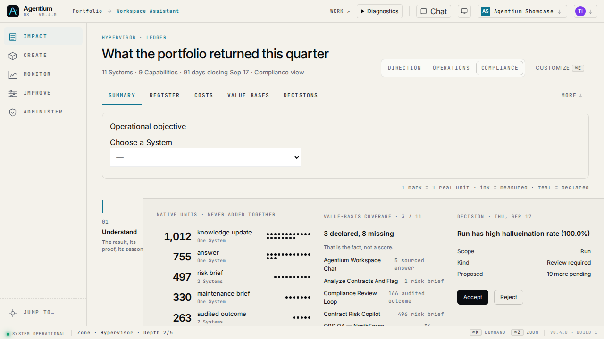
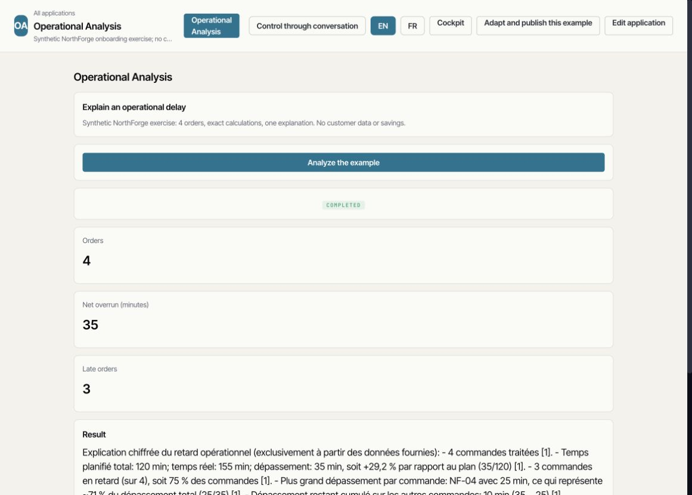
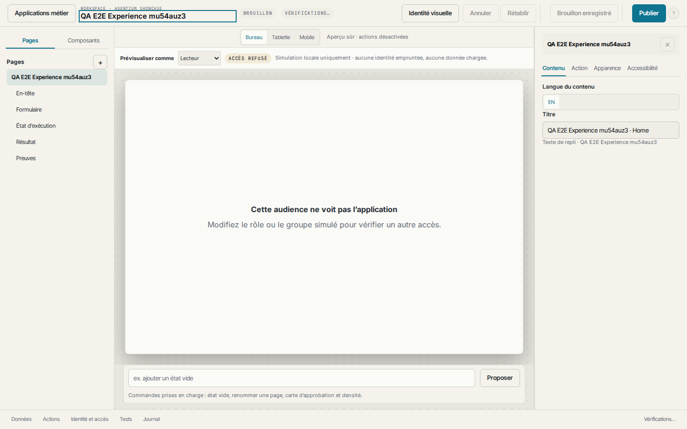

# Agentium — Avancement R0 à R6 et dossier de reprise

**Situation au 17 septembre 2026 · Workspace Agentium Showcase · Branche de livraison `demo/agentic`.**

Agentium dispose d’un socle déployé qui permet de consommer une application, retrouver son Run et ses opérations, inspecter des sources et comparer des réponses. Le parcours BRD → System produit des propositions et des drafts exécutables ; sa qualification métier reste incomplète. Les derniers développements ont surtout fiabilisé les liens entre ces briques : version réellement exécutée, provenance documentaire, verdicts, reprise des jobs et séparation entre exécution, contrôle automatique et décision humaine.

**Le runtime frontend et backend est `e30230aea3f58518bbe2219a5b2dbbdd757bab2f`, revérifié lors de la préparation de ce rapport.** Le correctif Giskard pour les petits corpus est encore local. Aucun nouveau déploiement n’est effectué pour ce dossier.

## 1. Avancement par lot

Les pourcentages sont des estimations d’avancement vers les critères de sortie, et non un comptage de code ni une mesure statistique. Les lots n’ont pas la même taille : leur moyenne ne serait pas un indicateur utile. « 0 % du lot nouveau » ne signifie pas que les fonctionnalités historiques correspondantes n’existent pas.

| Lot | Estimation | Acquis principal | Ce qui empêche sa clôture |
|---|---:|---|---|
| **R0 — Socle et Showcase** | **90 %** | Application numérique, parcours Work → Run, gates de release et canaries | Vidéo, baseline 5 métier + 5 développeurs et décision de clôture |
| **R1 — BRD → System** | **75 %** | Import conservé, propositions, drafts, traçabilité, tests et contrats d’outils figés | Qualité complète des deux BRD, revue humaine, publication et second utilisateur |
| **R2 — Voix → connaissance** | **40 %** | Sources PDF/OCR/Excel, reprise d’indexation, passage Capture retrouvé et cité | Parcours vocal complet, interruptions, répétitions et réutilisation de bout en bout |
| **R3 — Hyperviseur → action suivie** | **0 % du lot nouveau** | Socle existant d’observabilité, comparaison et Hyperviseur | Chaîne complète décision → action → suivi qualifiée comme release R3 |
| **R4 — DataOps** | **25 %** | Calculs exacts, application Operational Analysis et préparation de revue | Cycle SQL/Polars complet, comparaison et garanties sur les effets externes |
| **R5 — MLOps** | **0 % du lot nouveau** | Briques historiques de données, modèles et orchestration | Boucle feedback → entraînement → comparaison → promotion |
| **R6 — Généralisation et branding** | **0 % du lot nouveau** | Studio, identité visuelle et mécanismes de workspace existants | Qualification multi-domaines, délégation métier et parcours white-label complet |

La progression récente est réelle, mais concentrée sur R0/R1 et les dépendances documentaires de R2. Elle ne vaut pas livraison des scénarios R3 à R6. **DataOps suit le socle R1 ; la généralisation suit la validation des contrats R2.**

## 2. Où regarder la plateforme

Se connecter, puis sélectionner **Agentium Showcase**. Les liens respectent les droits du compte ; ils ne changent pas automatiquement le workspace. Les Runs historiques conservent leur version d’origine, même lorsqu’ils sont consultés avec le frontend actuel.

| Parcours | URL | À observer |
|---|---|---|
| Accueil métier | [Work](https://agentium.papai.ai/work) | Application disponible, démarrage guidé, entrée conversationnelle |
| Résultat numérique | [Operational Analysis](https://agentium.papai.ai/work/operational-analysis/analysis) | 4 ordres, +35 minutes, 3 retards ; ouvrir le Run du résultat |
| Run numérique conservé | [Run 91855689](https://agentium.papai.ai/runs/91855689-8b2e-437e-b981-9d66d7f2636d) | Deux opérations Python, une synthèse LLM, contrôle et version |
| Import BRD | [Catalogue Skills](https://agentium.papai.ai/skills) | Ouvrir l’import BRD depuis le catalogue ; aucune route `/skills/import` séparée |
| PIH généré depuis BRD | [Flow PIH généré](https://agentium.papai.ai/systems/85d7e34e-0f0a-4565-8a93-a8710342536b/flow) | Draft et cas ; ne pas approuver ses Runs pendant la consultation |
| NorthForge généré | [Flow NorthForge](https://agentium.papai.ai/systems/ea63cf3a-3c42-47ba-a923-abcd0cb811ba/flow) | AgentLoop, outils de lecture et revue humaine |
| Démonstration PIH historique | [Flow PIH de démonstration](https://agentium.papai.ai/systems/a021f6c3-fed5-4940-a3e1-53d5a7617f57/flow) | Draft r3 et version publiée v1 distincts ; ce n’est pas le PIH généré ci-dessus |
| Surveillance de qualité | [Quality](https://agentium.papai.ai/observability/quality?since=30d) | Courbe, sélection et accès au Run associé |
| Comparaison réelle Giskard | [Comparaison des trois cas](https://agentium.papai.ai/runs/53900d78-f8f4-49d2-ab6c-b1f53928599a?campaign=0f4ba081-3b49-46e2-9f06-3827ed6292f8) | Deux versions, trois cas, contrôles natifs et rapport sémantique distincts |
| Document Center | [Knowledge](https://agentium.papai.ai/knowledge) | Collections, indexation, sources et passages cités |
| Capture | [Capture de connaissances](https://agentium.papai.ai/knowledge/capture) | Entrée de capture ; ne démontre pas à elle seule un cycle voice2voice réussi |
| RAG Capture réussi | [Run 7c2dca09](https://agentium.papai.ai/runs/7c2dca09-ef24-4dda-9291-8c9e64b44df5) | Réponse à 6 bar et source exacte |
| Absence reconnue | [Run 201a5ac4](https://agentium.papai.ai/runs/201a5ac4-d9e8-491f-86e0-6ac7b8baaecc) | Numéro de série absent, sans information inventée |
| Pilotage | [Hyperviseur](https://agentium.papai.ai/hypervisor) | Couverture des objectifs et provenance des valeurs ; rendu selon les options du workspace |
| Applications et branding | [Applications métier](https://agentium.papai.ai/create/apps) | Ouvrir une application autorisée dans Studio |
| Paramètres Showcase | [Workspace](https://agentium.papai.ai/workspace/agentium-showcase/settings) | Options du workspace, selon les droits |
| Identité runtime | [Backend](https://agentium.papai.ai/api/v1/build-info) · [Frontend](https://agentium.papai.ai/build-info.json) | Comparer les deux SHA avant une recette |

## 3. R0 — Socle et Showcase · 90 %

### Déployé et vérifié

Operational Analysis est une véritable application Showcase, reliée à un System et à une version publiée. Son exemple fixe produit **120 minutes prévues, 155 réalisées, +35 minutes, trois ordres en retard ; NF-04 représente le plus grand dépassement, +25 minutes**. Le résultat ouvre son Run exact, puis les opérations Python et LLM. Le rejeu d’une même clé d’idempotence retrouve le même Run.

La navigation Work ↔ Studio, les liens vers l’invocation et le fil de navigation ont été corrigés. Design et Flow lisent le même draft PIH ; le résumé distingue celui-ci de la version publiée. La carte de résultat distingue une valeur absente d’un zéro. Les coûts calculés à partir du catalogue tarifaire ne sont pas présentés comme une économie constatée.

*Capture réelle du 17 septembre, frontend e30230ae, canary authentifié : accueil FR, onboarding et application Operational Analysis. Elle ne constitue pas une session de recette avec un nouvel utilisateur.*

### Preuves

- Cinq nouvelles exécutions sur `18741f94`, même version publiée `e997f4e4-3b51-4eef-9481-389f3a9afae4`, résultats numériques exacts. Deux opérations Python et une LLM par Run ; environ 18–23 secondes observées. Il ne s’agit pas d’un benchmark de charge.
- Concurrence, redémarrage gracieux et absence de duplication qualifiés sur `7532d449` ; ces essais n’ont pas été tous répétés sur e30230ae.
- Dernière release : 230 tests backend réussis, 3 exclusions opt-in ; 1 513 tests frontend ; contrôles FR/EN, navigation, chrome et build réussis ; 10 canaries réussis, 2 exclusions prévues.
- Aucune validation humaine ni économie attestée n’est déduite de la réussite numérique.

Références : [clôture R0](proofs/agentium-r0-closure.md), [répétitions réelles](proofs/release-18741f94-2026-09-17/sequential.json), [release actuelle](proofs/release-e30230ae-2026-09-17/README.md).

### Pour fermer R0

R0 n’attend plus une hypothétique CI GitLab : il n’existe pas de CI distante dans le processus actuel. Restent **la courte vidéo, les dix sessions de baseline et la décision de Thibaud**. Les sessions enregistrées sont actuellement **0/5 métier et 0/5 développeurs**. La vidéo n’a pas été réalisée lors de cette qualification ; QuickTime était indisponible. Les nouveaux critères BRD, voice et Giskard ne doivent pas être ajoutés indéfiniment à la clôture R0.

## 4. R1 — Un BRD devient un System en draft · 75 %

### Déployé

L’import conserve le document et son empreinte, signale les limites d’extraction et nourrit une proposition révisable. La proposition peut créer un draft, ses opérations, ses mappings et ses cas de test. Une exigence peut être reliée à une opération, un contrôle et un Run. Les outils auteur des nouveaux AgentLoops sont figés dans le contrat compilé : un changement ultérieur de la Skill du catalogue ne doit pas modifier silencieusement le comportement publié.

Les suites ont des verdicts serveur, une exécution durable et des références de corpus. Sans oracle, le résultat reste « non évalué ». Le parcours de publication distingue publication du System, activation et diffusion de l’application via Studio. Les décisions humaines utilisent la décision affichée ; une décision périmée est refusée dans les clients mis à jour.

La dernière release sépare les questions métier des réponses attendues et des consignes du relecteur. Elle corrige aussi une erreur de retrieval : une demande factuelle terminée par « with source » ou « avec les sources » pouvait retourner un inventaire documentaire au lieu des passages.

*Capture réelle du 17 septembre sur 18741f94 : Flow du System de démonstration `a021f6c3…`, draft r3. Elle illustre l’éditeur et la séparation draft/publication. Ce n’est pas une capture du nouveau System PIH généré `85d7e34e…`, ni une preuve de réussite de sa suite BRD.*

### Deux BRD, deux niveaux de qualification

**PIH SPARK-089.** Le System généré `85d7e34e…` et sa proposition sont conservés. Trois Runs attendent leur revue humaine. Un diagnostic sur les sorties inchangées a retrouvé des citations absentes de la source dans le troisième résultat : 5 citations manquantes sur 11 examinées. Le System doit produire un livrable documentaire, relever les informations manquantes et citer ses faits ; il ne doit pas approuver une transaction. La présence du draft ne clôt pas ces exigences.

**NorthForge.** Le System de production `ea63cf3a…`, son draft r2 et ses six Runs officiels restent conservés avec leurs attentes de revue. Une sonde ultérieure retrouve l’historique, reconnaît une information d’équipement absente et atteint la revue finale. Elle ne remplace pas les cas officiels.

Un nouveau candidat généré avec le fournisseur réel a été appliqué **dans un moteur canonique isolé localement**, sans assemblage manuel du Flow. Les appels LLM sont réels et le retrieval interroge le Showcase déployé. Sur six cas : quatre réussites et deux échecs initiaux. Le contrôle humain y est simulé par le harness local, pas exécuté par un participant.

| Même cas NorthForge | Avant correction retrieval | Après e30230ae |
|---|---|---|
| Question | Report planned and actual durations for NF-04, with source. | Identique |
| Outil historique | 6 appels, inventaire documentaire | 1 appel, passage utile |
| Réponse | Durées indisponibles | 30 minutes prévues, 55 réalisées |
| Preuve | Inventaire | `northforge-intervention-history.md`, chunk 0 |
| Contrôle du cas | Échec | Réussite |
| Durée observée | 199,9 s | 61,0 s |

Le candidat, les entrées et les assertions de ce cas ont été conservés. **Seul ce cas en défaut a été réexécuté après la correction** : la suite entière n’est pas annoncée verte. Le Run local `4e515aa6…` n’a pas d’URL de production. L’exigence D-1 reste non couverte ; le refus observé est correct en lecture seule, mais deux assertions lexicales restent trop fragiles. Aucune assertion n’a été assouplie pour fabriquer une réussite.

Références : [candidat généré](proofs/brd-input-separation-2026-09-17/generated-candidate.json), [qualification locale avec fournisseur réel](proofs/brd-input-separation-2026-09-17/README.md), [comparaison du cas historique](proofs/release-e30230ae-2026-09-17/history-comparison.json).

### Sortie encore attendue

Corriger les écarts de qualité et les critères de refus, revoir les exigences non couvertes, qualifier les deux suites complètes, puis effectuer la revue humaine et la publication explicites. Un second utilisateur doit consommer l’application publiée ; les anciens Runs doivent conserver leur version. **Ne pas approuver, relancer ou remplacer les Runs R1 conservés pendant une simple reprise technique.**

## 5. R2 — Voix, documents et connaissance réutilisable · 40 %

### Acquis déployés

Le Document Center conserve le lien entre original, job d’indexation, tentative, collection et passage retrouvé. La reprise d’un original manquant a été vérifiée : diagnostic, restauration, reprise du même job, retrieval puis rejeu idempotent. Les sources PDF ouvrent la page et l’original ; un vrai scan image a été traité par Tesseract `eng+fra`, avec facture, montant et page retrouvés.

La citation Excel **A830:O831** expose désormais les cellules jusqu’à O, au lieu de perdre les colonnes du passage cité. Les fenêtres ciblées sont bornées à 40 × 40 ; les références plus grandes restent explicitement partielles. Ces références unitaires ne mesurent pas la robustesse générale de l’OCR ou de tous les classeurs.

Pour Capture, deux corrections successives ont permis de retrouver puis d’utiliser le passage. Le seuil dense réappliqué à un score de fusion hybride éliminait un extrait pourtant accepté par le retriever ; cette divergence a été corrigée. Le Run hybride `7c2dca09…` répond **6 bar** avec la source exacte. Le Run `201a5ac4…` reconnaît que le numéro de série n’est pas documenté. Un autre Run C-HAH confirme séparément la réponse à 6 bar.

*Capture réelle du 17 septembre sur 447997ee : source synthétique `capture-9d3500c7.md`. Elle prouve l’inspection du passage ; les Runs qui réussissent ensuite le retrieval et la synthèse sont ceux de d05e84b1. La pression à 6 bar appartient à cette fixture Capture, pas à la notice PMP-700 à 700 bar.*

### Ce qui manque

La boucle complète **voice2voice LiveKit → capture relue → ingestion → question ultérieure sourcée** n’a pas encore été qualifiée avec ses interruptions et reprises. Les derniers succès Capture sont des conversations API, pas une preuve d’interaction vocale réelle. Les cinq répétitions complètes et la recette utilisateur restent ouvertes. Les résultats Andritz doivent être généralisés à travers les mêmes contrats, sans assimiler un livrable client à une recette générique terminée.

Références : [reprise d’indexation et PDF](proofs/release-37056391-2026-09-17/README.md), [OCR réel](proofs/release-bb467f53-2026-09-17/README.md), [Capture réussie](proofs/release-d05e84b1-2026-09-17/README.md), [journal de progression — Excel](proofs/brd-system-roadmap-progress.md).

## 6. Observabilité et Giskard — socle livré, distinct de R3

### Parcours visible

Quality permet de sélectionner un point et de retrouver le Run concerné ; l’investigation retrouve les opérations et l’audit d’invocation. Les canaries vérifient la conservation de la sélection, le rechargement et le retour arrière. Les contrôles non exécutés, absents ou indisponibles ne doivent pas devenir des réussites. Le coût d’une opération, l’évaluation automatique et une validation humaine restent des faits différents.

*Capture réelle e30230ae, 17 septembre : courbe et couverture de 6 scores complets sur 20 dans ce contexte. La heatmap est sous cette zone du viewport et n’est pas visible sur cette image. La couverture est celle du filtre et du moment de capture, pas un taux global de qualité de la plateforme.*

*Capture réelle e30230ae : étapes retrieval, synthèse et audit du Run historique `201a5ac4…`. Les valeurs brutes de l’ancien outcome restent consultables ; elles ne deviennent pas des économies ou des décisions humaines attestées.*

*Capture réelle e30230ae : invocation `semantic_search_v1`, portée documentaire et diagnostic du retrieval. Le bouton de retour conserve le Run. Cet écran reste technique : une preuve accessible n’équivaut pas encore à une explication immédiatement compréhensible par tous les métiers.*

### Campagne Giskard réellement exécutée

Une campagne **RAGET Giskard 2.19.2** a terminé sur `0f06b4eb`, avec le fournisseur configuré OpenAI `gpt-5` et `text-embedding-3-small`. Elle utilise trois cas relus, deux versions, six Runs canoniques et onze chunks. Huit appels de juge et 7 448 tokens sont enregistrés ; le coût estimé au tarif catalogue est de **0,0363475 $**, pas une économie métier.

Les six réponses sont jugées sémantiquement correctes. Les contrôles natifs distinguent cependant des citations manquantes dans la baseline ; tous les contrôles du candidat réussissent. Une assertion lexicale de la baseline échoue malgré une reconnaissance correcte d’absence. **L’apport de Giskard est ici de compléter la lecture contractuelle par une évaluation sémantique, pas de remplacer les exigences, les citations ni la décision humaine.**

La comparabilité reste limitée : modèle externe et corpus vivant ne sont pas entièrement immuables. Trois cas ne prouvent pas une qualité RAG générale. Cette campagne évalue des cas relus ; elle ne qualifie pas la génération automatique d’un nouveau testset.

Références : [rapport de campagne](proofs/release-0f06b4eb-2026-09-17/README.md), [comparaison et Runs](proofs/release-0f06b4eb-2026-09-17/giskard-campaign.json), [résultat RAGET et usage](proofs/release-0f06b4eb-2026-09-17/giskard-raget.json).

### Correctif local interrompu pour préparer ce dossier

Le même seuil minimal de huit chunks est actuellement appliqué à la génération de testset et à l’évaluation de cas déjà relus. Le correctif local garde huit chunks pour la génération, mais autorise **un à 500 chunks pour l’évaluation RAGET** ; un corpus vide reste refusé. Il affiche l’étape `judge` pour l’évaluation.

**44 tests API passent ; le fournisseur est simulé dans ces tests. Ce correctif n’est ni committé ni déployé.** Les deux fichiers et leur patch sont détaillés dans le [handover](HANDOVER.md). La validation avec le véritable SDK/fournisseur et les gates complets restent à exécuter.

## 7. R3 — Hyperviseur vers une action suivie · 0 % du lot nouveau

L’Hyperviseur et le socle d’observabilité existent. La vue V2 met en avant le retour du portefeuille, la couverture des objectifs et les décisions ; elle ne suffit pas à démontrer une chaîne complète recommandation → action autorisée → Run → comparaison → publication → mesure.

*Capture réelle e30230ae sur Showcase. Le canary active temporairement V2 puis restaure le réglage initial ; cette image ne signifie pas que V2 est le défaut de tous les clients. Les objectifs manquants sont visibles. Aucun montant de cette vue n’est présenté dans ce rapport comme une économie client attestée.*

R3 doit relier une décision à son System, à l’action effectivement appliquée, à sa preuve et à son suivi. La conversation doit expliquer les mêmes éléments et respecter les mêmes droits. Le cas non préparé, les cinq répétitions de la boucle complète et la compréhension sans assistance restent à qualifier. Les campagnes déjà exécutées sont des acquis réutilisables, pas une clôture de R3.

## 8. R4 — DataOps · 25 %

L’application numérique donne un exemple concret du lien données → calcul Python → synthèse LLM → contrôle de résultat. Les totaux et le plus grand dépassement sont contrôlés par des valeurs de référence, indépendamment du style de la synthèse.

*Capture réelle du 17 septembre sur 4baa9f5d : quatre ordres, 35 minutes de dépassement net, trois retards. Le texte précise qu’il s’agit d’un exercice NorthForge synthétique. Ce n’est ni une mesure de gains clients ni la preuve d’une action externe effectuée.*

Reste à industrialiser le parcours complet SQL/Polars : choix et droits de la source, transformations, contrat de sortie, comparaison des variantes, revue puis action. Les effets externes doivent avoir une preuve et une garantie de non-duplication. La réussite du calcul actuel ne qualifie pas un connecteur SQL, une écriture distante ou toute la bibliothèque de recettes.

Référence : [résultats répétés et version publiée](proofs/release-18741f94-2026-09-17/sequential.json). La suite R4 vient après stabilisation du socle R1 ; elle ne justifie pas de repousser la clôture documentaire de R0.

## 9. R5 — MLOps · 0 % du lot nouveau

Les fondations de données, modèles, orchestration, versions et Runs sont réutilisables. Aucun nouveau parcours complet feedback → données de référence → entraînement → évaluation comparative → promotion → suivi n’est qualifié dans les releases de ce dossier.

Il n’y a donc pas de capture présentée comme preuve d’un R5 livré. La prochaine livraison doit démontrer un modèle candidat comparé à une référence, une promotion explicite et la conservation de l’historique. Le catalogue de modèles ou un appel LLM ne remplacent pas cette recette.

## 10. R6 — Généralisation, applications et branding · 0 % du lot nouveau

Le Studio expose déjà l’édition d’applications, l’identité visuelle, l’audience, les aperçus et la publication. Le travail récent corrige aussi les contrastes et la navigation. **Le thème natif NAWA est protégé.** La personnalisation utilisateur doit rester accessible par l’interface, avec des droits explicites et des options bornées.

*Capture réelle e30230ae : application synthétique du canary et aperçu « Lecteur » volontairement sans accès. Elle montre les contrôles de contenu, apparence, accessibilité et publication ; elle ne prouve pas un parcours white-label autonome terminé. L’application de test n’est pas une destination métier pérenne à partager.*

La sortie R6 exige encore la validation sur plusieurs domaines/workspaces, la délégation de personnalisation à l’utilisateur autorisé, la cohérence des traductions et des restrictions, et la réutilisation des livrables Andritz sans embarquer ses particularités dans le produit générique. Elle dépend des contrats R2 validés. Le Cockpit commun peut évoluer sans modifier le thème NAWA.

## 11. Qualification de la release actuelle

| Vérification | Preuve e30230ae | Limite |
|---|---|---|
| Backend | 230 tests réussis, 3 opt-in exclus | Suite ciblée ; pas tous les tests du dépôt |
| Frontend | 1 513 tests réussis | Ne remplace pas les essais humains |
| FR/EN | 8 078 clés, contrôle réussi | Parité des clés, pas certification éditoriale de chaque écran ni langue des réponses LLM |
| Navigation et chrome | Contrôles réussis | Périmètre des guards et canaries |
| Build | Trois images immuables construites sur omnirag-demo | SHA runtime e30230ae, distinct du HEAD documentaire |
| Runtime | Six services au candidat ; frontend/backend sains | Première sonde 502 au démarrage, puis HTTP 200 ; pas de second déploiement |
| Carakai | 10 réussites, 2 exclusions intentionnelles | Contrats locaux adoption et white-label exclus du live |
| Worker Giskard | SDK 2.19.2, fixture offline réussie | La campagne avec fournisseur réel est celle de 0f06b4eb |
| Révision publique | FE et BE e30230ae revérifiés pour le dossier | Une consultation ultérieure peut afficher une nouvelle release |

Les neuf illustrations sont des captures du produit réel ; **six proviennent des canaries de la release e30230ae, trois sont historiques et légendées avec leur SHA**. Aucun mockup n’est substitué à une fonctionnalité livrée. La session Chrome manuelle est actuellement sur Sign in ; les captures récentes proviennent du navigateur authentifié des canaries, pas d’une nouvelle session humaine.

Les sources brutes sont regroupées dans `proofs/`. Leurs récits datés peuvent mentionner des échecs depuis corrigés : leur SHA et la synthèse de ce rapport déterminent l’état courant. Les logs d’erreurs historiques restent des preuves, pas des incidents automatiquement encore actifs.

## 12. Ordre de reprise recommandé

1. **Conserver le runtime e30230ae comme base attestée.** Lire le handover et vérifier les SHA avant toute action.
2. **Fermer R0 sur ses seuls critères restants** : vidéo, dix sessions et décision. Ne pas y rattacher les nouvelles exigences de R1–R6.
3. **Terminer R1 sur un candidat isolé** : refus sémantique, exigence D-1, citations PIH, suites complètes, revue et publication explicites puis second utilisateur.
4. **Qualifier le correctif Giskard local**, sans confondre tests simulés et campagne réelle ni supprimer une validation pour obtenir un résultat vert.
5. **Terminer le parcours R2 voice → connaissance**, avec ingestion, reprise et réutilisation sourcée ; préparer R4 sur le socle R1. Déclencher la généralisation R6 après les contrats R2.

Le [HANDOVER.md](HANDOVER.md) contient les chemins de travail, identifiants conservés, modifications locales, commandes de vérification et consignes de release. Le [patch local](giskard-small-corpus.patch) permet de récupérer le travail non committé. **Thibaud décide des bascules et des clôtures.**
