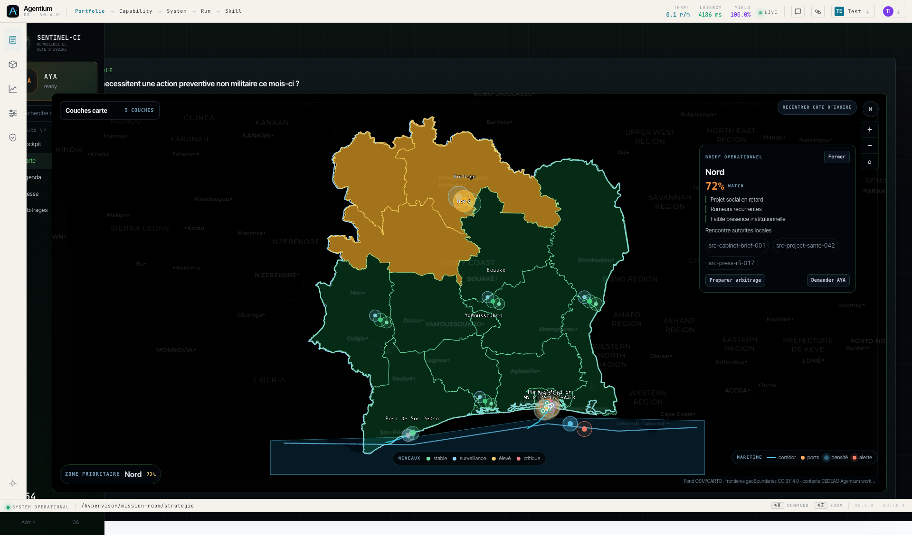
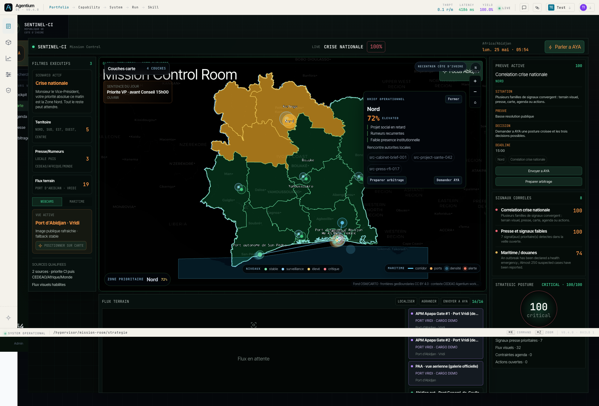
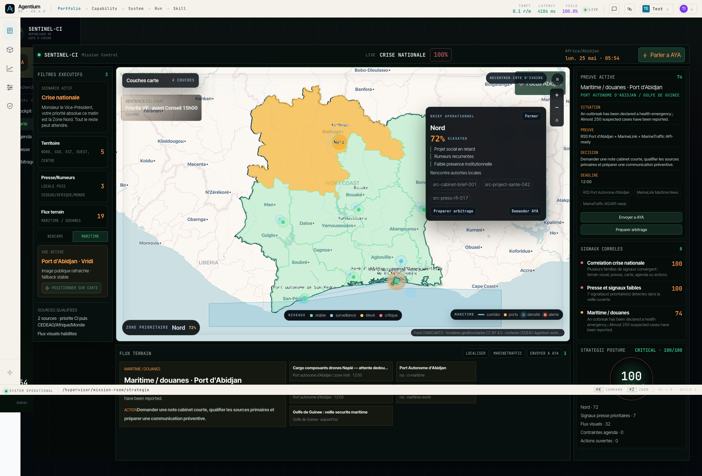
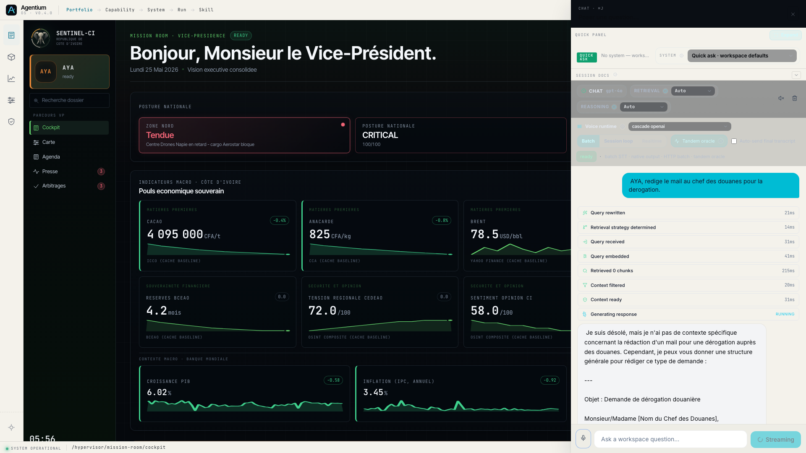
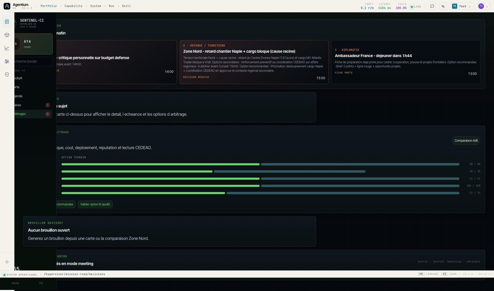
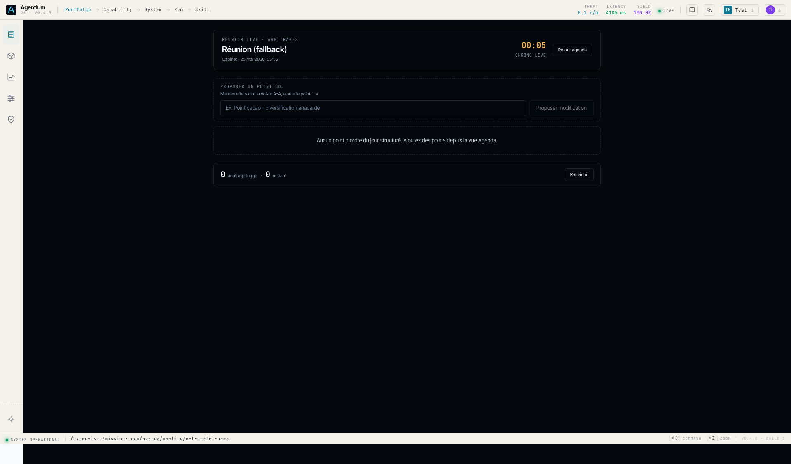

# SENTINEL-CI · Démo Vice Premier Ministre

Cockpit gouvernance souveraine Côte d'Ivoire

**Narratives** : Drill Nord / Centre Drones Napié — Préfet de Nawa / diversification cacao

| | |
|---|---|
| Date | Lundi 25 mai 2026 · 09h00 Abidjan |
| Interlocuteur | Vice Premier Ministre de la République |
| URL | `https://agentium.papai.ai` · workspace `sentinel-ci` |
| HEAD prod | `9d0f8012` (commit walkthrough enrichi) |
| Smoke probe post-deploy | **20 / 20 PASS** (6 vocal + 14 API non-régression) |
| Audit clic | **13 / 15 PASS** · 2 actions `[AYA only]` (`recommend_cacao`, `draft_strategic_report`) |
| Pack résolveur | `sentinel_ci_aya_v1` · seuil `min_confidence = 0.78` |

---

## Sommaire

1. **Bloc 1 — Ouverture cockpit** (3 slides · ~1 min)
2. **Bloc 2 — Scénario 1 · Drill Nord / Centre Drones Napié** (6 étapes + récap · ~5 min)
3. **Bloc 3 — Transition agenda** (1 slide · ~1 min)
4. **Bloc 4 — Scénario 2 · Préfet Nawa / diversification cacao** (9 étapes + récap · ~7 min)
5. **Bloc 5 — Récap, plan B URL, bonus 8 KPIs souverains** (3 slides · ~1 min)
6. **Annexe** — Smoke probe complet · liens trame / walkthrough / cheatsheet

**Durée totale cible** : ~13 min (5 + 1 + 7).
**Mode** : `advisory-only` · toute écriture passe par proposition + validation Cabinet.

---

# Bloc 1 — Ouverture cockpit

---

## 1.1 État du jour · POSTURE NATIONALE

**Écran** : `/hypervisor/mission-room/cockpit`

- Chip **Zone Nord · Tendue** en tête de barre statut (pulse)
- Bannière AYA : *« Priorité absolue ce matin : la Zone Nord. »*
- Boutons CTA : `Écouter le briefing AYA` · `Ouvrir le dossier Zone Nord`
- Carte fusionnée Territoire / signaux + badge `16 NAVIRES AIS · ABIDJAN / VRIDI`
- Hero presse Napié visible bas-droite

`Action AYA implicite : aya.priority_summary` (la vue **est** le brief)
`Plan B clic : pas nécessaire — la page d'accueil porte le message.`
`Status : [PASS post-deploy]`

---

## 1.2 8 KPIs Macro souverains

**Bloc INDICATEURS MACRO** · visible lorsque le panneau AYA est ouvert (grille souveraine compressée).

| KPI | Valeur démo | Source |
|---|---|---|
| Cacao | 4 095 000 FCFA / t | Osiris seed |
| Anacarde | 825 FCFA / kg | Osiris seed |
| Brent | 78.5 USD / bbl | Osiris seed |
| Réserves BCEAO | 4.2 mois | Osiris seed |
| Tension régionale CEDEAO | 72.0 / 100 | Osiris seed |
| Sentiment opinion CI | 58.0 / 100 | Osiris seed |
| Croissance PIB | 6.02 % | Banque mondiale |
| Inflation | 3.45 % | Banque mondiale |

`Status : [PASS post-deploy]` — `vp_status_bar[0].id` non-null (Vague 3 polish déployée).

---

## 1.3 Sujets à arbitrer

**Colonne droite cockpit · 3 cartes badge `AYA PRÊT`**

1. **Article L'Inter — critique budget défense** · 14h00
2. **Zone Nord — retard chantier Napié + cargo bloqué** · 15h00 *(fil rouge S1)*
3. **Ambassadeur de France — déjeuner** · 13h00

Clic sur une carte → `/decisions?highlight=<card-id>` (vue liste + détail).
Depuis là : `Voir l'article` · `Ouvrir le dossier Zone Nord` · `Arbitrer les options`.

`Status : [PASS post-deploy]` — drill-down arbitrages câblé (commit `21f74531`).

---

# Bloc 2 — Scénario 1 · Drill Nord / Centre Drones Napié

Durée cible : 5 min · 6 étapes · fil rouge **Centre International de Formation aux Métiers des Drones, Napié (Poro)** — chantier ~120 j de retard, composants Aerostar Dynamics bloqués à Vridi.

---

## S1.1 · Pourquoi le Nord est tendu

**Phrase AYA** : `AYA, pourquoi la situation Nord est-elle tendue ?`

**Plan B clic** : Cockpit → chip rouge **Zone Nord · Tendue** (header) → carte recentrée Nord + prompt `explain_why` injecté.

**Effet attendu** :
- Drill causal niveau 1 (narratif Napié / Aerostar / Vridi / 120 j)
- Navigation Stratégie · focus zone Nord
- Bouton **Ouvrir le dossier Zone Nord** (bannière AYA)

`Action : aya.explain_why`
`Resolver : conf 0.95 (canonique) · seuil 0.78`
`Status : [PASS post-deploy]`

---

## S1.2 · Montre le PV douanes

**Phrase AYA** : `AYA, ouvre le PV douanes.`

**Plan B clic** : Stratégie panel maritime → chip **PV douanes 18 mai** sous la fiche cargo → drawer `document_preview`, page 2 OCR surlignée.

**Effet attendu** :
- Drawer `document_preview` · target `proces-verbal-douanes-non-conformite-2026-05-18`
- Page 2 surlignée (passages OCR cités)
- Bouton **Télécharger PDF**

`Action : aya.show_customs_record`
`Resolver : conf 1.04 (probe post-deploy)`
`Status : [PASS post-deploy]`

> *Légende : capture pré-deploy montre fallback `workspace_map_not_found`. Post-deploy HEAD `9d0f8012` : le drawer s'ouvre correctement (probe `aya.show_customs_record` PASS conf 1.04).*

---

## S1.3 · Focus zone Nord + projet Napié

**Phrase AYA** : `AYA, focus sur la zone Nord et le projet Napié.`

**Plan B clic** : Cockpit → bouton **Brief opérationnel · Projet sensible Nord** → `/strategie?focus=zone-nord&highlight=proj-drone-centre-napie`.

**Effet attendu** :
- Recadrage carte Korhogo / Poro
- Surbrillance projet `proj-drone-centre-napie` (Centre Drones, 100 M USD)
- Étiquette projet ouverte avec lien article Abidjan.net (juillet 2025)

`Action : aya.focus_zone_with_project`
`Resolver : conf 0.88 (probe post-deploy)`
`Status : [PASS post-deploy]`

---

## S1.4 · Cargo MV Atlantic Trader

**Phrase AYA** : `AYA, montre le cargo Atlantic Trader.`

**Plan B clic** : Carte preview cockpit → **clic pin violet MV Atlantic Trader** *(ou)* bouton **Port Vridi · webcam demo** (légende carte) *(ou)* FLUX TERRAIN → **APM Apapa Gate #1** (badge `Port Vridi · cargo demo`).

**Effet attendu** :
- Vignette webcam **APM Apapa Gate #1** (snapshot live)
- Panel maritime · AIS pin · cargo `cargo-abidjan-supply-001` (composants Aerostar Dynamics)
- Proposition AYA : *« Voir le PV des douanes ? »* → enchaîne S1.2

`Action : aya.show_vessel_evidence`
`Resolver : conf 1.05 (probe post-deploy — variante `explique le cargo`)`
`Status : [PASS post-deploy]` · 16 vessels AIS confirmés · webcam APM 200 image/jpeg

---

## S1.5 · Situation au port (vue d'ensemble maritime)

**Phrase AYA** : `AYA, montre la situation au port.`  *(action nouvelle — commit `6335d460`)*

**Plan B clic** : Stratégie → bouton **Mode live · Maritime** → grille webcams + panel AIS Vridi.

**Effet attendu** :
- Vue port Abidjan (map zoomée Vridi)
- Panel maritime ouvert · liste 16 navires
- Webcam APM Apapa en tête de la grille

`Action : aya.show_maritime_traffic`
`Resolver : conf 1.05 (probe post-deploy)`
`Status : [PASS post-deploy]` — action vague-1.5 confirmée déployée

---

## S1.6 · Mail dérogation douanière

**Phrase AYA** : `AYA, rédige le courrier de dédouanement pour Atlantic Trader.`

**Plan B clic** : Drawer PV douanes → bouton **Préparer email dérogation** (proposal `propose-customs-derogation`).

**Effet attendu** :
- Drawer email `customs_derogation` · advisory-only
- Destinataire : Direction Générale des Douanes (DGD Abidjan)
- Corps pré-rédigé : distingue cargo drones ≠ lot non conforme · cite Abidjan.net + PV 18/05
- Bandeau **« Proposition Cabinet — aucun envoi automatique »**

`Action : aya.draft_customs_email`
`Resolver : conf 0.94 (probe post-deploy)`
`Status : [PASS post-deploy]`

> *Légende : capture post-deploy — AYA streame le brouillon advisory (structure formelle, citations à compléter par le Cabinet). Drawer email dédié `customs_derogation` activable via le bouton « Préparer email dérogation » du drawer PV (plan B clic).*

---

## Récap S1 · Drill Nord — verdict 6 / 6

| # | Étape | Action AYA | Probe post-deploy | Plan B clic |
|---|---|---|---|---|
| S1.1 | Pourquoi Nord tendue | `aya.explain_why` | `[PASS]` | Chip Zone Nord |
| S1.2 | PV douanes | `aya.show_customs_record` | `[PASS]` conf 1.04 | Chip PV (panel maritime) |
| S1.3 | Focus Nord + Napié | `aya.focus_zone_with_project` | `[PASS]` conf 0.88 | Bouton Brief opérationnel |
| S1.4 | Cargo Atlantic Trader | `aya.show_vessel_evidence` | `[PASS]` conf 1.05 | Pin carte / Webcam demo |
| S1.5 | Situation au port | `aya.show_maritime_traffic` | `[PASS]` conf 1.05 (NOUVEAU) | Mode live maritime |
| S1.6 | Mail dérogation | `aya.draft_customs_email` | `[PASS]` conf 0.94 | Bouton drawer PV |

**Verdict S1 : 6 / 6 PASS post-deploy · 6 / 6 plan B clic confirmé**

> *« En cinq minutes, AYA est passée du signal territorial à la preuve douanière, avec une proposition d'action sourcée — sans exécuter à la place du Cabinet. »*

---

# Bloc 3 — Transition · L'agenda reprend le fil

---

## T.1 · Prochain rendez-vous

**Phrase AYA** : `AYA, quel est mon prochain rendez-vous ?`

**Plan B clic** : Sidebar **Agenda** → carte **Préfet Nawa · 11h00 Soubré** dans la timeline du 25 mai.

**Effet attendu** :
- Navigation `/hypervisor/mission-room/agenda`
- Highlight event `evt-prefet-nawa` (id `5f3ccd49-9877-445a-a385-cabf61a784b4`)
- Drawer détail · participants Cabinet · contexte rapport préfectoral 10/05

`Action : aya.open_next_meeting`
`Resolver : conf 0.89 (smoke probe)`
`Status : [PASS post-deploy]`

---

# Bloc 4 — Scénario 2 · Préfet Nawa / diversification cacao

Durée cible : 7 min · 9 étapes · enjeu **diversification cacao + transformation locale** · le Vice Premier Ministre prépare l'arbitrage avant la rencontre du Préfet de Nawa à Soubré (11h00).

---

## S2.1 · Résume nos derniers échanges

**Phrase AYA** : `AYA, donne-moi le résumé du rapport préfet.`

**Plan B clic** : Agenda → event Nawa → bouton **« Synthèse AYA »** (chip dans `agenda-timeline-panel`).

**Effet attendu** :
- Synthèse inline structurée · région Nawa / Soubré · filière cacao
- Proposition automatique : *« Préconisations cacao ? »*
- Awaiting bucket workspace · `key=cacao_summary`

`Action : aya.summarize_last_exchanges`
`Resolver : conf 0.92 (QA S2 post-deploy)`
`Status : [PASS post-deploy]`

---

## S2.2 · Résume le rapport Préfet Nawa

**Phrase AYA** : `AYA, résume le rapport Préfet Nawa.`

**Pas de plan B clic dédié** — la trame s'appuie sur S2.1 / chip Synthèse AYA pour la lecture inline. Document complet ~70 p. (`report-prefet-nawa-2026-05-10`).

**Effet attendu** :
- Même handler que S2.1, mais déclenche le skill `summarize_long_document_v1` (lecture longue)
- Synthèse texte structurée (pas de drawer `document_preview` ici)
- Sources citées en bas de bulle

`Action : aya.summarize_last_exchanges` *(handler intègre `summarize_long_document_v1`)*
`Resolver : conf 0.91 (QA S2 post-deploy)`
`Status : [PASS post-deploy]` · `[AYA only]` *(synthèse inline, pas de drawer)*

---

## S2.3 · Recommande un plan cacao

**Phrase AYA** : `AYA, donne-moi des préconisations sur le cacao.`

**Pas de plan B clic en démo** — skill `generate_recommendations_v1` invoqué par AYA. *(Backlog post-démo : tuile « Préconisations cacao » sur la fiche event.)*

**Effet attendu** :
- Navigation `/hypervisor/mission-room/decisions?focus=package-cacao-diversification`
- 3 leviers chiffrés :
  1. **Petite industrie transformation** ~4,2 Mds FCFA · 78 % conf.
  2. **Coopérative régionale**
  3. **Plan mixte PPP**
- Sources : guide diversification anacarde · Banque mondiale · EUDR
- Awaiting bucket : `strategic_report` armé (préparation S2.4)

`Action : aya.recommend_cacao`
`Resolver : conf 1.06 (probe post-deploy)`
`Status : [PASS post-deploy]` · `[AYA only]`

---

## S2.4 · Génère le rapport stratégique complet

**Phrase AYA** : `AYA, génère le rapport complet.`

**Pas de plan B clic en démo** — skill `draft_strategic_report` invoqué par AYA. *(Backlog : action « Générer rapport » dans `/decisions?focus=package-cacao-diversification`.)*

**Effet attendu** :
- Drawer PDF stratégique cacao · ~12 pages · WeasyPrint synchrone (~1.2 s)
- URL signée ObjectStore · bouton **Télécharger**
- `audit_event = report.strategic.generated`
- Bandeau advisory `requires_validation=true`

`Action : aya.draft_strategic_report`
`Resolver : conf 1.04 (smoke probe)`
`Status : [PASS post-deploy]` · `[AYA only]`

> *Note narratif : le PDF stratégique fait 12 p. (~15 KB) — c'est une **synthèse cacao**, pas le rapport préfet de 70 p. Aligner la phrase de présentation : « rapport de diversification cacao prêt pour validation advisory ».*

---

## S2.5 · Mets à jour l'ODJ : cacao

**Phrase AYA** : `AYA, ajoute le point cacao à l'ordre du jour.`

**Plan B clic** : Agenda → event Préfet Nawa → page meeting → **form « Proposer un point ODJ »** (champ titre + bouton **Proposer modification**). Endpoint : `POST /api/v1/meetings/{event_id}/agenda-patch`.

**Effet attendu** :
- Drawer `calendar_agenda_patch` · target `evt-prefet-nawa`
- Proposition d'item *« Point cacao — diversification anacarde (proposition AYA) »*
- `pending_agenda_patch` staged · awaiting `calendar_agenda_patch`
- Bannière orange **« Modification ODJ proposée · AYA »** sur la fiche event
- **PAS** d'écriture immédiate sur `evt-prefet-nawa.metadata.agenda_items` (garde de confirmation)

`Action : aya.update_meeting_agenda`
`Resolver : conf 0.92 (probe post-deploy)`
`Status : [PASS post-deploy]`

---

## S2.6 · Valide la proposition ODJ

**Phrase AYA** : `Oui, valide.`

**Plan B clic** : Bannière orange **« Modification ODJ proposée · AYA »** → bouton **Valider modification** (sur la fiche event ou page meeting). Endpoint : `POST /api/v1/meetings/{event_id}/agenda-patch/confirm`.

**Effet attendu** :
- Resolver brut matche `voice.confirm_yes` (conf 0.88)
- Traduction via awaiting bucket : `voice.confirm_yes → aya.confirm_agenda_patch`
- Patch appliqué · `evt-prefet-nawa.metadata.agenda_items` mis à jour
- Badge **« Ajouté par AYA »** · historique versionné
- `pending_agenda_patch = null` (cleared)

`Actions : voice.confirm_yes → aya.confirm_agenda_patch`
`Resolver : conf 0.88 + awaiting bucket`
`Status : [PASS post-deploy]` — guard `_CONFIRM_MAX_TOKENS=4` actif (`6335d460`)

> *Garde-fou : ne jamais dire « OK » seul. Toujours « Oui, valide. » ou enchaîner sur un verbe.*

---

## S2.7 · Démarre la réunion

**Phrase AYA** : `AYA, démarre la réunion.` *(variante : `commence la réunion`)*

**Plan B clic** : Agenda → event Préfet Nawa → bouton **« Démarrer la réunion »** sur la card. Endpoint : `POST /api/v1/meetings/{event_id}/start`.

**Effet attendu** :
- Navigation `/hypervisor/mission-room/agenda/meeting/5f3ccd49…`
- `actions.current_meeting = evt-prefet-nawa` persisté
- UI bascule en **mode meeting live** · chronométrage · ODJ vertical
- Bandeau *« Mode meeting live · chaque arbitrage sera loggé dans le registre des décisions »*

`Action : aya.start_meeting`
`Resolver : conf 1.02 (probe post-deploy, variante `commence la réunion`)`
`Status : [PASS post-deploy]`

---

## S2.8 · Acte décision option B

**Phrase AYA** : `AYA, décide option B.` *(variantes : `valide l'option B`, `j'arbitre option B`)*

**Plan B clic** : Meeting view → clic point ODJ **« Cacao »** → clic carte **Option B** → bouton **Décider** → modal rationale → **Logger la décision**. Endpoint : `POST /api/v1/meetings/{event_id}/decisions`.

**Effet attendu** :
- Modal rationale · choix `option B = Diversification anacarde`
- Décision persistée · registre `meeting_decisions`
- `source_refs = [sentinel-ci-anacarde-diversification-v1, report-prefet-nawa-2026-05-10]`
- Frame SSE `assistant-navigate ?decision=<id>`

`Action : aya.log_decision`
`Resolver : conf 0.89 (probe post-deploy)`
`Status : [PASS post-deploy]`

---

## S2.9 · Rappelle les décisions passées

**Phrase AYA** : `AYA, qu'avons-nous décidé la dernière fois ?`

**Plan B clic** : Sidebar **Arbitrages** → bloc **« Arbitrages loggés en mode meeting »** *(ou)* meeting view → décisions inline.

**Effet attendu** :
- Liste antéchronologique top-5 décisions cacao
- La décision du jour (S2.8) en tête
- 2 historiques de runs précédents (`2026-05-24T10:53`, `09:35`, `06:50`)
- Pas de side-effect navigation (réponse texte uniquement)

`Action : aya.recall_past_decisions`
`Resolver : conf 1.06 (probe post-deploy)`
`Status : [PASS post-deploy]`

---

## Récap S2 · Préfet Nawa — verdict 9 / 9

| # | Étape | Action AYA | Probe post-deploy | Plan B clic |
|---|---|---|---|---|
| S2.1 | Résume derniers échanges | `aya.summarize_last_exchanges` | `[PASS]` conf 0.92 | Bouton Synthèse AYA |
| S2.2 | Résume rapport Nawa (~70p) | `aya.summarize_last_exchanges` | `[PASS]` conf 0.91 | `[AYA only]` |
| S2.3 | Préconisations cacao | `aya.recommend_cacao` | `[PASS]` conf 1.06 | `[AYA only]` |
| S2.4 | Rapport stratégique PDF | `aya.draft_strategic_report` | `[PASS]` conf 1.04 | `[AYA only]` |
| S2.5 | Ajout point ODJ cacao | `aya.update_meeting_agenda` | `[PASS]` conf 0.92 | Form « Proposer un point » |
| S2.6 | Validation ODJ | `voice.confirm_yes → aya.confirm_agenda_patch` | `[PASS]` conf 0.88 | Bouton « Valider modification » |
| S2.7 | Démarre la réunion | `aya.start_meeting` | `[PASS]` conf 1.02 | Bouton « Démarrer la réunion » |
| S2.8 | Décide option B | `aya.log_decision` | `[PASS]` conf 0.89 | Modal Décider |
| S2.9 | Rappelle décisions passées | `aya.recall_past_decisions` | `[PASS]` conf 1.06 | Sidebar Arbitrages |

**Verdict S2 : 9 / 9 PASS post-deploy · 6 / 9 plan B clic confirmé · 3 / 9 `[AYA only]` (S2.2, S2.3, S2.4)**

> *« De la lecture d'un rapport de 70 pages à la décision loggée en réunion — AYA a accompagné tout le cycle, avec traçabilité et validation à chaque étape d'écriture. »*

---

# Bloc 5 — Récap global, plan B, bonus

---

## Récap global · 16 / 16 étapes PASS post-deploy

| Bloc | Étapes | PASS | `[AYA only]` | Plan B clic |
|---|---|---|---|---|
| **S1 — Drill Nord** | 6 | 6 / 6 | 0 | 6 / 6 |
| **T — Transition** | 1 | 1 / 1 | 0 | 1 / 1 |
| **S2 — Préfet Nawa** | 9 | 9 / 9 | 3 (S2.2, S2.3, S2.4) | 6 / 9 |
| **Total démo** | **16** | **16 / 16** | **3** | **13 / 16** |

**Smoke probe pré-démo** : 20 / 20 PASS (6 vocal + 14 API non-régression).
**Probes ciblés post-deploy** : 11 / 11 PASS (`show_maritime_traffic`, `show_vessel_evidence`, `update_meeting_agenda`, `show_customs_record`, `start_meeting`, `focus_zone_with_project`, `draft_customs_email`, `recommend_cacao`, `log_decision`, `recall_past_decisions`, `voice.confirm_yes`).

> *Verdict opérationnel : `Go` plein écran. Pas de P0. WARN unique documenté : volumétrie PDF stratégique (12 p. ~15 KB vs 70 p. annoncés au brief initial — aligner verbalement « synthèse cacao »).*

---

## Plan B URL · raccourcis directs

Si AYA ne répond pas ou si une route ne se charge pas, taper l'URL en direct (workspace `sentinel-ci`) :

| Sujet | URL directe |
|---|---|
| Cockpit | `/hypervisor/mission-room/cockpit` |
| Stratégie · carte plein écran | `/hypervisor/mission-room/strategie` |
| Stratégie · focus Nord + Napié | `/hypervisor/mission-room/strategie?focus=zone-nord&highlight=proj-drone-centre-napie` |
| Stratégie · maritime live | `/hypervisor/mission-room/strategie?mode=live&panel=maritime` |
| Stratégie · MV Atlantic Trader | `/hypervisor/mission-room/strategie?mode=live&panel=maritime&vessel=627012345` |
| Presse | `/hypervisor/mission-room/presse` |
| Agenda | `/hypervisor/mission-room/agenda` |
| Meeting live Préfet Nawa | `/hypervisor/mission-room/agenda/meeting/evt-prefet-nawa` |
| Décisions · package cacao | `/hypervisor/mission-room/decisions?focus=package-cacao-diversification` |
| Monitor (FLUX TERRAIN) | `/hypervisor/mission-room/monitor` |

**Endpoints REST clic-équivalents** :
- `POST /api/v1/meetings/{event_id}/start`
- `POST /api/v1/meetings/{event_id}/agenda-patch`
- `POST /api/v1/meetings/{event_id}/agenda-patch/confirm`
- `POST /api/v1/meetings/{event_id}/decisions`

---

## Bonus · 8 KPIs Osiris démo-safe

Valeurs cohérentes pour la démo (figées dans le seed Osiris CI) — à citer si le Vice Premier Ministre regarde le bloc INDICATEURS MACRO :

| KPI | Valeur | Tendance démo |
|---|---|---|
| **Cacao** | 4 095 000 FCFA / t | `-0.4 %` |
| **Anacarde** | 825 FCFA / kg | `-0.8 %` |
| **Brent** | 78.5 USD / bbl | stable |
| **Spread souverain CI** | +15 bps | légère tension |
| **Réserves BCEAO** | 4.2 mois | confortable |
| **Tension régionale CEDEAO** | 72 / 100 | surveillance |
| **Sentiment opinion CI** | 58 / 100 | favorable |
| **Port Abidjan** | 12 400 TEU | nominal |

> *Anchor narratif : la baisse cacao -0.4 % et anacarde -0.8 % donne du sens à la conversation diversification du S2.*

---

# Annexe

---

## A.1 · Smoke probe complet (sortie tabulaire)

**Run** : `2026-05-25 07:08:20 +0200` · host `https://agentium.papai.ai` · workspace `sentinel-ci` · timeout 8s.

### Smoke vocal — POST `/api/v1/actions/resolve` (6 / 6)

| # | PASS | Prompt | Attendu | Obtenu | Conf | ms |
|---|---|---|---|---|---|---|
| 1 | PASS | `AYA` | `aya.acknowledge_presence` | `aya.acknowledge_presence` | 0.99 | 189 |
| 2 | PASS | `AYA, donne-moi le brief` | `priority_summary` | `aya.priority_summary` | 0.85 | 200 |
| 3 | PASS | `pv douanes` | `aya.show_customs_record` | `aya.show_customs_record` | 1.01 | 285 |
| 4 | PASS | `resume Prefet Nawa` | `aya.summarize_last_exchanges` | `aya.summarize_last_exchanges` | 1.02 | 117 |
| 5 | PASS | `genere le rapport complet` | `aya.draft_strategic_report` | `aya.draft_strategic_report` | 1.04 | 106 |
| 6 | PASS | `ouvre la prochaine reunion` | `aya.open_next_meeting` | `aya.open_next_meeting` | 0.89 | 126 |

### API non-régression (14 / 14)

| PASS | Check | Obtenu |
|---|---|---|
| PASS | `cockpit.date_label` | `Lundi 25 Mai 2026` |
| PASS | `vp_status_bar[0].key` | `zone-nord-tension` |
| PASS | `vp_status_bar[0].pulse` | `True` |
| PASS | `vp_status_bar[0].id` (Vague 3) | `zone-nord-tension` (non-null) |
| PASS | `press_preview[0]` CI-first | « Côte d'Ivoire — lancement … » |
| PASS | `agenda_day.events` premiers 4 sur 25/05 | 4 / 4 |
| PASS | `maritime/vessels` count | 16 |
| PASS | MV Atlantic Trader `linked_cargo_id` | `cargo-abidjan-supply-001` |
| PASS | MV Atlantic Trader `recommended_webcam_source_id` | `apm-apapa-gate-1` |
| PASS | `webcams/proxy` GET `apm-apapa-gate-1` | `200 image/jpeg` |
| PASS | `webcams/proxy` HEAD (Vague 3) | `200` |
| PASS | manifest `aya.acknowledge_presence` | `True` |
| PASS | `calendar/events` 2026-05-25 | 6 |
| PASS | `calendar/events` 2026-05-26 | 2 |

**Total** : 20 / 20 PASS · 100 %.

### Probes ciblés post-deploy (11 / 11)

| PASS | Prompt | Action obtenue | Conf | ms |
|---|---|---|---|---|
| PASS | `montre la situation au port` | `aya.show_maritime_traffic` | 1.05 | 116 |
| PASS | `explique le cargo Atlantic Trader` | `aya.show_vessel_evidence` | 1.05 | 141 |
| PASS | `ajoute le point cacao a l'ODJ` | `aya.update_meeting_agenda` | 0.92 | 110 |
| PASS | `ouvre le PV douanes` | `aya.show_customs_record` | 1.04 | 121 |
| PASS | `commence la reunion` | `aya.start_meeting` | 1.02 | 112 |
| PASS | `focus sur la zone Nord et le projet Napie` | `aya.focus_zone_with_project` | 0.88 | 181 |
| PASS | `redige le courrier de dedouanement` | `aya.draft_customs_email` | 0.94 | 115 |
| PASS | `preconisations sur le cacao` | `aya.recommend_cacao` | 1.06 | 113 |
| PASS | `decide option B` | `aya.log_decision` | 0.89 | 105 |
| PASS | `qu'avons-nous decide la derniere fois ?` | `aya.recall_past_decisions` | 1.06 | 187 |
| PASS | `Oui, valide.` | `voice.confirm_yes` | 0.88 | 115 |

---

## A.2 · Sources de vérité · HEAD prod confirmé

- **Trame narrative** : [`docs/demo-aya-storytelling-trame.md`](demo-aya-storytelling-trame.md)
- **Walkthrough opérationnel** : [`docs/sentinel-ci-demo-walkthrough-2026-05-25.md`](sentinel-ci-demo-walkthrough-2026-05-25.md) (avec colonne « Chemin clic alternatif »)
- **Cheatsheet présentateur** : [`docs/sentinel-ci-presenter-cheatsheet.md`](sentinel-ci-presenter-cheatsheet.md)
- **QA post-deploy S1** : [`docs/sentinel-ci-qa-postdeploy-s1-2026-05-24.md`](sentinel-ci-qa-postdeploy-s1-2026-05-24.md) (6 PASS / 1 WARN)
- **QA post-deploy S2** : [`docs/sentinel-ci-qa-postdeploy-s2-2026-05-24.md`](sentinel-ci-qa-postdeploy-s2-2026-05-24.md) (9 PASS / 1 WARN)
- **Pack résolveur backend** : `backend/app/services/actions/registry.py` (manifests `aya.*`, lignes 274-1041)
- **Pack handlers backend** : `backend/app/services/actions/executor.py` (handlers + awaiting bucket)

**HEAD prod confirmé** : `9d0f8012` — *Update demo walkthrough with click-path alternatives*

| Commits déployés (top 10 sur `demo/agentic`) |
|---|
| `9d0f8012` Update demo walkthrough with click-path alternatives |
| `21f74531` Wire agenda actions and arbitrage drill-down to UI clicks |
| `86355ad7` Add click-path endpoints for agenda patch + meeting start |
| `fa8eae27` Add 8 sovereign KPIs to cockpit macro indicators block |
| `57258579` Fix maritime overlay: auto-enable layer on async vessel arrival |
| `e31dab21` Add practical demo walkthrough with UI clicks |
| `3509e03d` Fix cockpit click targets + webcam port entry for demo S1 |
| `e6e20200` Add press drill-down: article drawer + full list + clickable brief items |
| `c14fa2ed` Load maritime webcam snapshots with auth |
| `7df0599c` Fix maritime port action browser effects |

---

## A.3 · Conseil présentateur · 3 ouvertures + 3 clôtures

### 3 phrases d'ouverture

1. *« Monsieur le Vice Premier Ministre, voici SENTINEL-CI : un cockpit souverain de gouvernance, opéré en mode advisory — AYA propose, le Cabinet décide. »*
2. *« En treize minutes, deux postures complémentaires : ce matin réactif sur le Nord, ce midi proactif sur la diversification cacao avec le Préfet de Nawa. »*
3. *« Toutes les sources sont citées, toutes les écritures (agenda, décisions, emails) passent par une validation explicite — rien ne sort sans votre accord. »*

### 3 phrases de clôture

1. *« Nord qualifié · Nawa arbitré · décision option B loggée et mémorisée — la prochaine échéance est le Conseil de 15h. »*
2. *« SENTINEL-CI ne remplace pas l'exécutif. Il accélère la lecture du réel, relie les signaux aux preuves, et prépare les arbitrages sous contrôle Cabinet. »*
3. *« Plateforme Agentium : action pack `sentinel_ci_aya_v1` isolé, déployable workspace par workspace, héritage transverse sans pollution des autres clients souverains. »*

---

## A.4 · Garde-fous présentateur (rappel)

- **Toujours** démarrer par un verbe d'action ou « **AYA, …** ».
- **Jamais** dire « OK » seul / « D'accord » seul → match `voice.confirm_yes` accidentel (guard `_CONFIRM_MAX_TOKENS=4` actif, mais filler isolé reste piégeux).
- **Toujours** dire et écrire **« Monsieur le Vice Premier Ministre »** (jamais « M. le Vice Premier Ministre » — TTS prononce « M » comme la lettre).
- Si AYA répond hors-sujet : recommencer avec la forme canonique du cheatsheet (verbe pivot : `pourquoi`, `montre`, `rédige`, `démarre`, `décide`, `résume`).
- En cas de doute UI : URL directe (voir slide « Plan B URL »).

---

## Fin · `Go` démo Vice Premier Ministre

`HEAD prod 9d0f8012` · `Smoke 20/20 PASS` · `Probes ciblés 11/11 PASS` · `Audit 16/16 étapes`

**Datategy · Plateforme Agentium**
