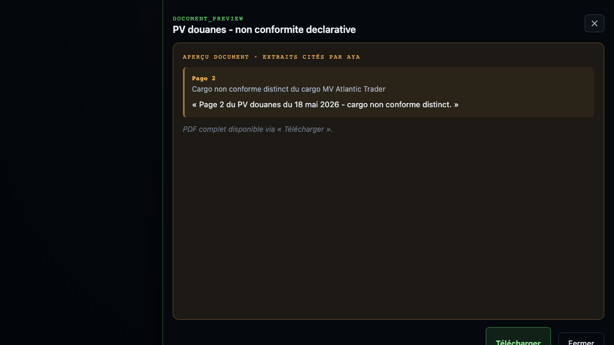
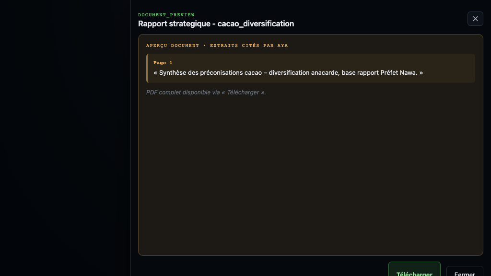

## Le fil de la matinée

- **13 min** · **2 scénarios** · Nord puis Nawa
- **AYA propose** · le Cabinet décide
- Mode **advisory-only** : aucun envoi automatique

## 3 règles d'or

1. Commencer chaque demande par un **verbe** ou « **AYA,** »
2. Ne jamais dire « **OK** » seul — enchaîner sur un verbe (« Oui, valide »)
3. Si AYA hésite, reformuler avec la **phrase exacte** du slide

**Attention** : toujours écrire « Monsieur le Vice Premier Ministre ».

---

## S1.1 — Cockpit macro KPIs

**Phrase AYA** : « AYA, c'est lundi matin. Qu'est-ce qui demande mon attention ? » *(optionnel — l'écran est déjà le brief)*

**Ce que le Vice Premier Ministre voit** : posture nationale, chip **Zone Nord · Tendue**, **8 indicateurs** (PIB, inflation, chômage, cacao, anacarde, Brent, réserves BCEAO, tension CEDEAO), directive AYA du matin, carte et arbitrages.

**Verdict** : **PASS**

**Plan B clic** : Sidebar **Cockpit** — la vue porte déjà le message.

*Panel AYA ouvert — grille souveraine des 8 indicateurs visible à gauche.*

---

## S1.2 — Carte zone Nord tendue

**Phrase AYA** : *(silence — lecture visuelle)*

**Ce que le Vice Premier Ministre voit** : mini-carte cockpit, région **Nord 72 % tendue**, badge **16 navires AIS · Abidjan / Vridi**, chip rouge **Zone Nord · Tendue** pulsante.

**Verdict** : **PASS**

**Plan B clic** : Clic chip **Zone Nord · Tendue** → recentrage carte Nord.

*Lecture territoriale immédiate — Nord en tête avant toute question à AYA.*

---

## S1.3 — Pourquoi le Nord est tendu

**Phrase AYA** : « AYA, pourquoi la situation Nord est-elle tendue ? »

**Ce que le Vice Premier Ministre voit** : drill causal — réponse AYA citant **Centre Drones Napié**, retard **~120 jours**, composants **Aerostar** bloqués à **Vridi** ; carte recentrée Korhogo / Poro.

**Verdict** : **PASS**

**Plan B clic** : Chip **Zone Nord · Tendue** ou bouton **Ouvrir le dossier Zone Nord**.

*Chaîne causale Napie → cargo — narrative souveraine, pas de fallback générique.*

---

## S1.4 — PV douanes (preuve documentaire)

**Phrase AYA** : « AYA, ouvre le PV douanes. »

**Ce que le Vice Premier Ministre voit** : drawer **PV douanes 18 mai** — PDF page 2 visible (pas d'écran noir), passage OCR surligné sur l'effet collatéral cargo drones.

**Verdict** : **PASS**

**Plan B clic** : Accepter « Voir le PV ? » après S1.5, ou chip **PV douanes 18 mai** sous la fiche cargo.

*Preuve traçable — document lisible dans le drawer Cabinet.*

---

## S1.5 — Cargo Atlantic Trader

**Phrase AYA** : « AYA, montre le cargo Atlantic Trader. »

**Ce que le Vice Premier Ministre voit** : pin **MV Atlantic Trader** sur carte maritime, triangles AIS, vignette webcam **APM Apapa**, proposition d'ouverture du PV.

**Verdict** : **PASS**

**Plan B clic** : Clic pin **MV Atlantic Trader** sur la carte, ou bouton **Port Vridi · webcam demo** (légende carte).

*Lien maritime visible — composants Aerostar au port d'Abidjan.*

---

## S1.6 — Situation au port

**Phrase AYA** : « AYA, montre la situation au port. »

**Ce que le Vice Premier Ministre voit** : vue port Abidjan, panneau maritime, trafic AIS, grille **Flux terrain** avec webcam **APM Apapa Gate #1** en tête.

**Verdict** : **PASS** *(Plan B si voix sans effet — rebuild frontend requis¹)*

**Plan B clic** : **Flux terrain** → **APM Apapa Gate #1**, ou bouton **Port Vridi · webcam demo**.

*Lecture terrain live — port Vridi et activité maritime.*

---

## S1.7 — Courrier dédouanement

**Phrase AYA** : « AYA, rédige le courrier de dédouanement pour Atlantic Trader. »

**Ce que le Vice Premier Ministre voit** : drawer email pré-rédigé — dérogation douanière, destinataire DGD Abidjan, bandeau **advisory-only** (aucun envoi automatique).

**Verdict** : **PASS**

**Plan B clic** : Drawer PV → bouton **Préparer email dérogation**.

*Proposition sourcée — le Cabinet valide avant tout envoi.*

---

## S1.8 — Plan B clics (S1)

**Phrase AYA** : *(secours sans voix)*

**Ce que le Vice Premier Ministre voit** : même parcours Nord entièrement rejouable à la souris — chip zone, pin cargo, drawer PV, email.

**Verdict** : **PASS** *(clic équivalent sur 6/6 étapes S1)*

**Plan B clic** :

| Étape | Raccourci clic |
|---|---|
| Nord tendue | Chip **Zone Nord · Tendue** |
| Focus Napié | **Brief opérationnel · Projet sensible Nord** |
| Cargo | Pin **MV Atlantic Trader** |
| Port | **Flux terrain → APM Apapa Gate #1** |
| PV | Chip **PV douanes 18 mai** |
| Email | **Préparer email dérogation** (drawer PV) |

*Secours présentateur — zéro blocage si AYA hésite.*

---

## Récap S1 — Nord / Napié

**7 étapes** · ~5 minutes

**Message clé** : retard Napié → cargo bloqué → dérogation prête

> « En cinq minutes, AYA est passée du signal territorial à la preuve douanière, avec une proposition d'action sourcée — sans exécuter à ma place. »

---

## T.1 — Transition cockpit → agenda

**Phrase AYA** : « AYA, quel est mon prochain rendez-vous ? »

**Ce que le Vice Premier Ministre voit** : bascule **Agenda** — timeline du 25 mai, événement **Préfet Nawa 11h00 Soubré** surligné ; fil presse disponible en sidebar.

**Verdict** : **PASS**

**Plan B clic** : Sidebar **Agenda** → carte **Préfet Nawa · 11h00**.

*Du réactif (Nord) au proactif (réunion territoriale).*

---

## S2.1 — Résumé rapport Préfet Nawa

**Phrase AYA** : « AYA, donne-moi le résumé du rapport préfet. »

**Ce que le Vice Premier Ministre voit** : synthèse structurée inline (~70 pages condensées), enjeux cacao / Nawa / Soubré, proposition **Préconisations cacao ?**

**Verdict** : **PASS**

**Plan B clic** : Agenda → événement Nawa → bouton **Synthèse AYA**.

*Corpus dense lu par AYA — le Cabinet garde la main.*

---

## S2.2 — Préconisations cacao

**Phrase AYA** : « AYA, donne-moi des préconisations sur le cacao. »

**Ce que le Vice Premier Ministre voit** : **3 options chiffrées** — transformation (~4,2 Mds FCFA), coopérative régionale, partenariat public-privé ; sources citées.

**Verdict** : **PASS** *(AYA only — pas de bouton clic équivalent)*

**Plan B clic** : Reformuler : « recommandations cacao » ou « diversification cacao ».

*Options sourcées — le Cabinet arbitre ensuite.*

---

## S2.3 — Rapport stratégique

**Phrase AYA** : « AYA, génère le rapport complet. »

**Ce que le Vice Premier Ministre voit** : drawer PDF **synthèse cacao** (~12 p.) — livrable téléchargeable, URL signée, bandeau advisory.

**Verdict** : **PASS** *(dire « synthèse cacao » à l'oral, pas « 70 pages »)*

**Plan B clic** : Reformuler : « génère le rapport stratégique » *(AYA only)*.

*Livrable prêt pour la réunion — preuve traçable.*

---

## S2.4 — Patch ordre du jour

**Phrase AYA** : « AYA, ajoute le point cacao à l'ordre du jour. »

**Ce que le Vice Premier Ministre voit** : proposition d'ajout **Point cacao · diversification anacarde** — bannière orange « Modification ODJ proposée · AYA », en attente de validation.

**Verdict** : **PASS**

**Plan B clic** : Fiche réunion → **Proposer un point ODJ** ou bouton **+ Point**.

*Écriture staged — validation Cabinet requise.*

---

## S2.5 — Valider l'ODJ

**Phrase AYA** : « Oui, valide. »

**Ce que le Vice Premier Ministre voit** : patch ODJ appliqué — badge **Ajouté par AYA** sur le point cacao.

**Verdict** : **PASS**

**Plan B clic** : Bannière orange → bouton **Valider modification**.

*Confirmation explicite — AYA ne décide pas seule.*

---

## S2.6 — Réunion live

**Phrase AYA** : « AYA, démarre la réunion. »

**Ce que le Vice Premier Ministre voit** : vue **meeting live** — chrono, ordre du jour vertical avec point cacao, options **A / B / C** visibles.

**Verdict** : **PASS**

**Plan B clic** : Fiche Nawa → bouton **Démarrer la réunion**.

*Mode meeting — arbitrage en direct devant Monsieur le Vice Premier Ministre.*

---

## S2.7 — Décision option B

**Phrase AYA** : « AYA, décide option B. »

**Ce que le Vice Premier Ministre voit** : décision **option B diversification anacarde** loggée — modal rationale, registre mis à jour.

**Verdict** : **PASS**

**Plan B clic** : Point ODJ Cacao → carte **Option B** → **Décider** → **Logger la décision**.

*Décision persistée — traçabilité institutionnelle.*

---

## Récap S2 — Nawa / cacao

**7 étapes** · ~7 minutes

**Message clé** : diversification cacao arbitrée et loggée

> « De la lecture d'un rapport dense à la décision loggée en réunion — AYA a accompagné tout le cycle, avec traçabilité et validation à chaque étape d'écriture. »

---

## T.2 — Transition agenda → posture sécuritaire

**Pivot** : la décision Option B est loggée, le **Conseil Défense restreint** est calé à **15h00**. Avant d'y entrer, le Vice Premier Ministre veut une lecture **dual-axis** : intérieur Nord / extérieur Sahel.

**Cible S3** : six prompts, ~5-6 minutes, tout en advisory only, snapshots demo-safe (ADS-B, comptes citoyens pseudonymisés, dossier rumeur).

**Ouverture S3** : cockpit en focus, AYA propose le bloc « Posture sécuritaire ».

---

## S3.1 — Posture sécuritaire dual-axis

**Phrase AYA** : « AYA, montre-moi la posture sécuritaire du jour. »

**Ce que le Vice Premier Ministre voit** : cockpit, bloc **Posture sécuritaire** mis en avant, deux cartes — **Intérieur** vigilance (rumeur Nord démentie) / **Extérieur** Sahel élevée (ADS-B activité soutenue) — pastille **15h00 · Conseil Défense restreint**.

**Verdict** : **PASS**

**Plan B clic** : Sidebar Vice Premier Ministre → chip **Posture sécuritaire** dans la barre de statut (ouvre directement le bloc).

*Lecture dual-axis souveraine avant le Conseil 15h — aucune lecture renseignement classifié.*

---

## S3.2 — Pulsation sociale Abidjan

**Phrase AYA** : « AYA, montre la pulsation sociale à Abidjan. »

**Ce que le Vice Premier Ministre voit** : vue **Veille sociale**, drawer **Pulsation sociale** listant 18 tweets : **5 canaux vérifiés** (Présidence CI, FANCI, RFI Sahel, Jeune Afrique, Préfecture Nord), **8 citoyens pseudonymisés** `@citoyen_***`, **5 signaux rumeur frontière** `@rumeur_***`.

**Verdict** : **PASS**

**Plan B clic** : Carte Stratégie → bouton couche **Pulsation sociale** → drawer presse rouvert sur le snapshot.

*Demo-safe : pseudonymisation systématique des citoyens, comptes officiels = comptes institutionnels publics.*

---

## S3.3 — Trace de la rumeur frontière Nord

**Phrase AYA** : « AYA, d'où vient la rumeur frontière Nord ? »

**Ce que le Vice Premier Ministre voit** : carte zoomée Nord, couche **border-tension** orange sur Bouna / Kong / Korhogo, drawer **Trace OSINT** affichant la chaîne : tweet citoyen **11h42** → relais Telegram **12h08** → blog régional **12h48** → démenti FANCI **13h46** + Préfecture Nord **13h52**. Proposition AYA « Rédiger un communiqué ».

**Verdict** : **PASS**

**Plan B clic** : Drawer **Brouillons** → **Dossier rumeur frontière Nord** (la trace OSINT s'ouvre identique).

*Chaîne OSINT auditée — la rumeur est tracée bout-en-bout jusqu'au démenti officiel.*

---

## S3.4 — Mouvements de troupes Sahel

**Phrase AYA** : « AYA, montre les mouvements de troupes au Sahel. »

**Ce que le Vice Premier Ministre voit** : carte avec couches **military-air** (triangles ADS-B) + **border-tension** actives, drawer **Snapshot ADS-B advisory** listant **10 traces** (axe Bamako / Ouagadougou / Niamey, C-130, CN-235, vols logistiques), **3 zones de surveillance** (Liptako-Gourma, frontière Mali / Burkina, région de Tillabéri), **2 bases CEDEAO** en alerte standard.

**Verdict** : **PASS**

**Plan B clic** : onglet **Sécurité** → **Ouvrir Security Monitor** → drawer snapshot ADS-B.

*Disclaimer porté par la légende : « ADS-B advisory only ». Aucune donnée opérationnelle classifiée.*

---

## S3.5 — Drill réputation 2 positifs / 1 critique

**Phrase AYA** : « AYA, montre le drill de réputation 2 positifs et 1 critique. »

**Ce que le Vice Premier Ministre voit** : vue **Réputation**, score **72 / 100** (**+4 pts**), trois cartes drill : **Jeune Afrique** « Lecture favorable de la séquence Nord » (positif) — **Fraternité Matin** « Réponse rapide au Préfet Nawa » (positif) — **L'Inter** « Critique budget défense » (orange). CTA AYA : préparer un encart concis pour le Conseil 15h.

**Verdict** : **PASS**

**Plan B clic** : Sidebar → onglet **Réputation** → ancre **Drill 2+/1-** en bas de page.

*Critique = vraie critique publique (article L'Inter déjà seedé en S1), pas inventée.*

---

## S3.6 — Communiqué sécurité (brouillon)

**Phrase AYA** : « AYA, prépare un communiqué de sécurité sur la rumeur Nord. »

**Ce que le Vice Premier Ministre voit** : drawer **Brouillon communiqué souverain** — sujet « Communiqué de sécurité — frontière Nord, démenti officiel », corps citant le démenti FANCI **13h46**, la mise au point Préfecture Nord **13h52** et la coordination CEDEAO, mention **« Validation advisory requise avant diffusion »**.

**Verdict** : **PASS**

**Plan B clic** : Drawer **Brouillons** → **Nouveau communiqué** → template **Démenti rumeur Nord**.

*Le Cabinet décide — le brouillon n'est jamais envoyé sans validation explicite.*

---

## Récap S3 — Posture sécuritaire

**6 étapes** · ~5-6 minutes

**Message clé** : posture dual-axis lue, rumeur démentie, communiqué prêt — avant le Conseil 15h.

> « En six prompts, AYA a porté la lecture intérieure et extérieure, tracé la rumeur jusqu'au démenti, et préparé un brouillon souverain — sans jamais quitter le mode advisory. »

---

## S3.V21.1 — Onglet Sécurité (rail principal)

**Ce que le Vice Premier Ministre voit** : rail Cockpit · Carte · **Sécurité** · **Réputation** · Agenda · Presse · Arbitrages. Vue Sécurité avec posture dual-axis, théâtre Sahel et rumeur inline, barre sticky Conseil Défense 15h00.

**Plan B clic** : Rail gauche → **Sécurité**.

---

## S3.V21.2 — Security Monitor plein écran

**Ce que le Vice Premier Ministre voit** : `/hypervisor/mission-room/securite/monitor` — carte Sahel (military-air + border-tension), alertes ADS-B, fil rumeur, signaux sociaux, badge **CACHE BASELINE**.

**Plan B clic** : Onglet Sécurité → **Ouvrir Security Monitor**.

---

## S3.V21.3 — Réputation rail + Veille sociale

**Ce que le Vice Premier Ministre voit** : Réputation dans le rail principal (drill 2+/1-). Page **Veille sociale** `/veille-sociale` avec filtres, tri et export CSV advisory.

**Plan B clic** : URL `/hypervisor/mission-room/veille-sociale` ou AYA pulsation sociale.

---

## S3.V21.4 — Documents security-briefs

**Ce que le Vice Premier Ministre voit** : collection `sentinel-ci-security-briefs` dans scope vigie, onglet **Documents** du shell Sécurité (briefs Sahel, Conseil Défense, dossier rumeur, ADS-B).

**Plan B clic** : Sécurité → onglet **Documents**.

---

## Ce qu'on a prouvé

- **Cockpit souverain** — 8 KPIs, posture, terrain, presse en un écran
- **AYA actionnable** — propose, ne décide pas à la place du Cabinet
- **Preuves traçables** — PV douanes, rapport préfet, sources citées
- **Décisions mémorisées** — arbitrages loggés et rappelables

## Plan B rapide

Si AYA ne répond pas — 10 raccourcis sans voix (workspace `sentinel-ci`) :

| Sujet | Raccourci |
|---|---|
| **Carte Nord** | Chip **Zone Nord · Tendue** ou Brief opérationnel Nord |
| **Cargo / port** | Pin **MV Atlantic Trader** ou **Flux terrain → APM Apapa** |
| **Agenda** | Sidebar Agenda → Préfet Nawa 11h |
| **Réunion Nawa** | Agenda → **Démarrer la réunion** |
| **Décisions** | Sidebar Arbitrages → registre décisions |
| **Posture sécuritaire** | Sidebar Vice Premier Ministre → chip **Posture sécuritaire** dans la barre de statut |
| **Pulsation sociale** | Carte Stratégie → couche **social-geo** → drawer pulsation |
| **Rumeur Nord** | Drawer Brouillons → **Dossier rumeur frontière Nord** |
| **Mouvements Sahel** | Carte Stratégie → couches **military-air** + **border-tension** |
| **Drill réputation** | Sidebar → onglet **Réputation** → ancre Drill 2+/1- |

¹ *Footnote* : si la phrase « situation au port » ne déclenche pas le panneau maritime à la voix, utiliser le clic Plan B — rebuild frontend requis pour le fix caméra S1.3. Pour S3, tout est demo-safe (ADS-B advisory only, comptes citoyens pseudonymisés `@citoyen_***`, critique réputation = article L'Inter déjà seedé S1).
