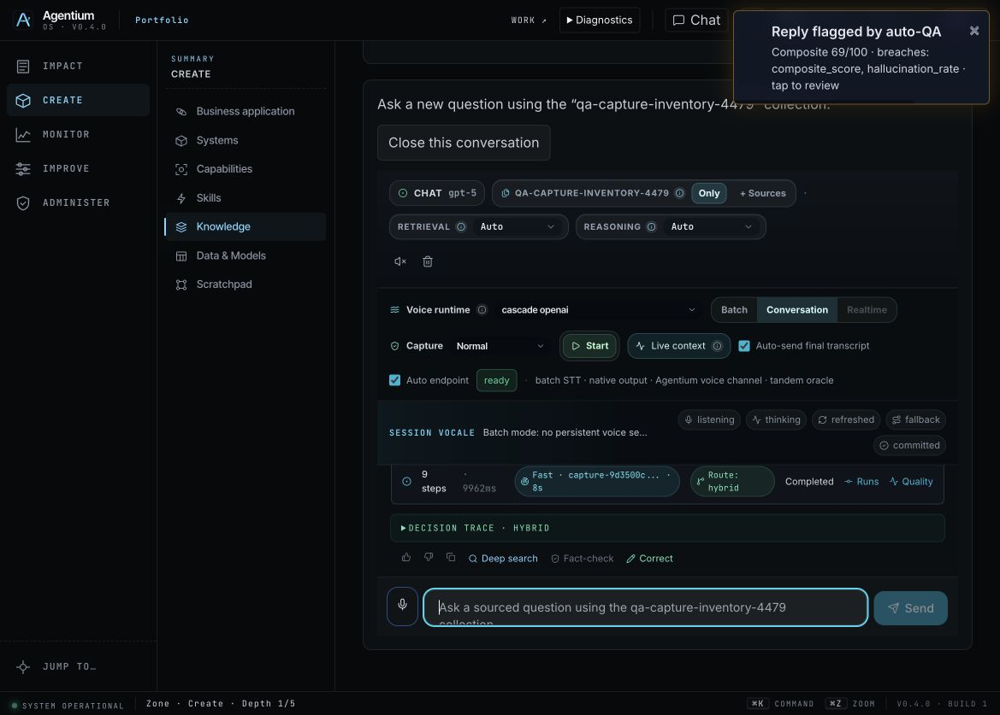

# Capture → published knowledge / Capture → connaissance publiée

## FR — Retrouver une expertise avec sa source

En tant qu’utilisateur, après la revue et la publication d’une Capture, j’ouvre
une nouvelle conversation sur sa collection. L’entretien précédent ne devient
pas l’historique de cette conversation. Je pose une question, ouvre le passage
cité et retrouve le Run qui a produit cette réponse. Fermer puis rouvrir démarre
une conversation vierge ; la connaissance publiée reste conservée.

Le bouton est disponible dans le pilote d’adoption existant. Une création de
contexte en erreur propose une reprise. Les droits de consultation restent ceux
du workspace ; une publication n’accorde aucun nouvel accès.

## EN — Retrieve expertise with its source

After reviewing and publishing a Capture, I open a new conversation scoped to
its collection. The interview is not reused as conversation history. I ask a
question, inspect the cited passage and open the Run behind that answer. Closing
and reopening starts a blank conversation; the publication remains available.

The action uses the existing adoption pilot. A failed context creation can be
retried. Workspace source permissions still apply; publication grants no access.

## Live acceptance status

On 0f06b4eb the same question retrieves the actual 6-bar passage from only the
published collection, and the UI names that scope correctly. Synthesis still
fails because a second filter misreads the hybrid rank score as a cosine
similarity. The [actual Run and diagnosis](../evidence/release-0f06b4eb-2026-09-17/README.md)
are preserved. Removing that duplicate filter is under qualification. This is
not yet a successful end-to-end Capture or voice demonstration.

