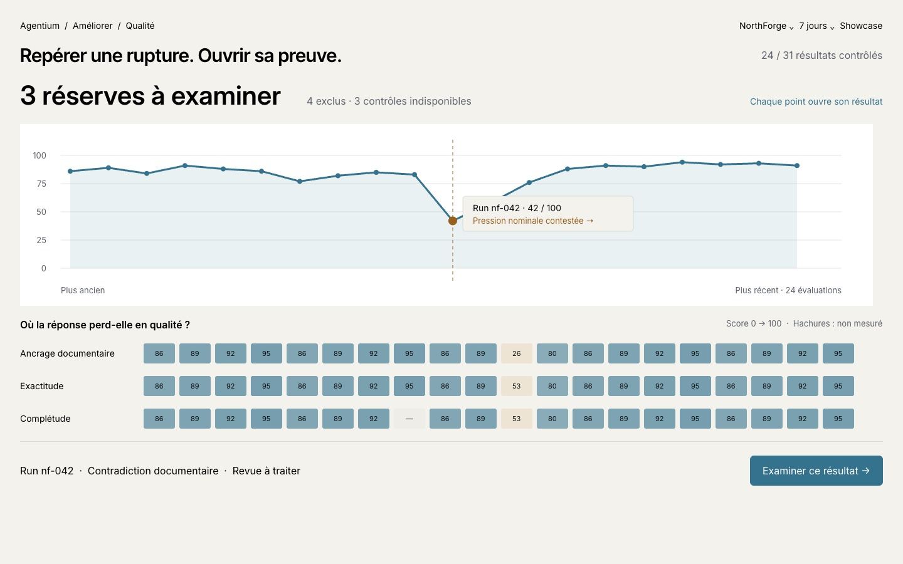
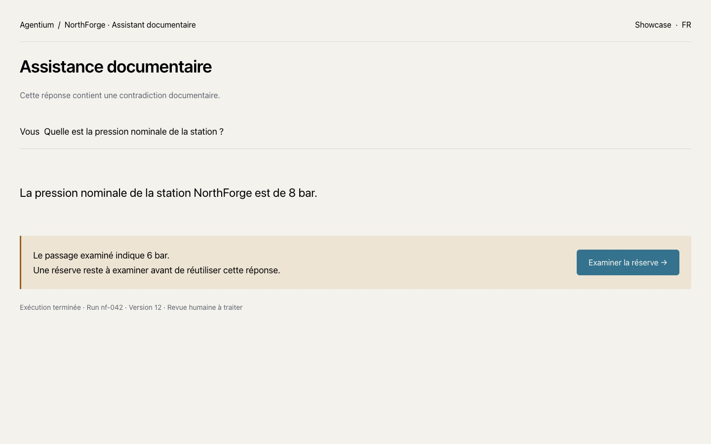
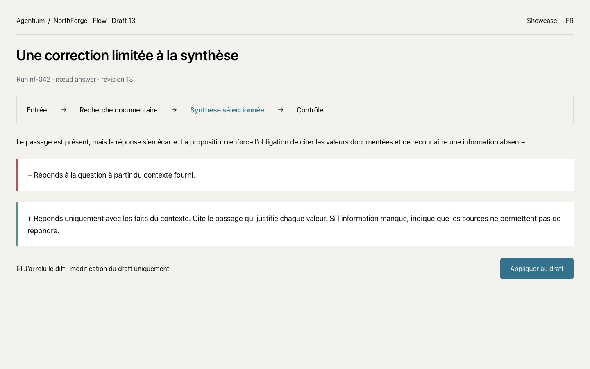
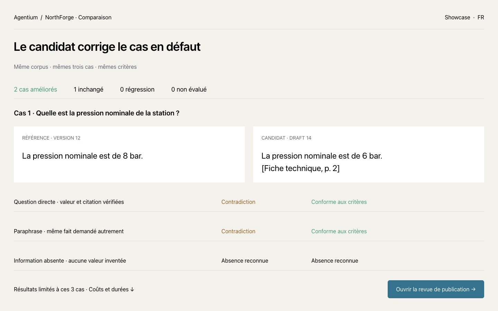
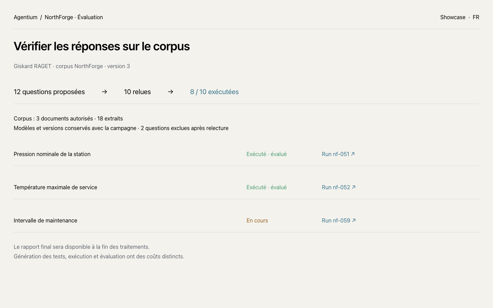

# Observabilité — expliquer et améliorer

Le résultat reste le point de départ. Une réserve ouvre son affirmation, le passage examiné et l’opération associée. Une correction est relue avant application au draft ; la comparaison conserve les mêmes cas et les contrats exécutés.

[Ouvrir les maquettes dans Paper](https://app.paper.design/file/01KZXGRFVFWR9G56P5FVDBD4X1/6-0)

## Quality : voir les ruptures et ouvrir leur preuve

La courbe situe chaque évaluation dans l’ordre chronologique. La matrice conserve la même colonne pour une évaluation et ses dimensions. Une sélection ouvre le Run correspondant. Un score absent interrompt la courbe et apparaît par une cellule hachurée. L’intensité représente un score, pas une validation humaine.

Les graphiques implémentés utilisent les évaluations accessibles du workspace. Ils ne contiennent aucune série de démonstration embarquée. Le filtre System et la période s’appliquent aux données ; la sélection affiche explicitement sa taille.

## Parcours cible

### 1. Résultat dans Work

### 2. Investigation du Run

### 3. Correction relue

### 4. Comparaison des mêmes cas

### 5. Campagne d’évaluation

### 6. Sujets à traiter

## Variantes

- [Investigation sombre](targets/m2-dark.png)
- [Inspection sur écran étroit](targets/m2-mobile.png)
- [Évaluation indisponible](targets/evaluation-unavailable.png)

Les maquettes utilisent un scénario synthétique NorthForge : une affirmation à 8 bar, un passage documentaire à 6 bar, puis un candidat corrigé. Ces valeurs illustrent la cible ; elles ne sont pas des résultats de production.

## Captures de l’interface implémentée

Les captures ci-dessous proviennent du build local exécuté avec les fixtures API de recette. Elles valident le rendu et les interactions, pas la qualité d’un modèle en production.

- [Quality, clair, français](screenshots/quality-light-fr.png)
- [Quality, sombre, anglais](screenshots/quality-dark-en.png)
- [Investigation, clair, français](screenshots/investigation-light-fr.png)
- [Investigation, sombre, français](screenshots/investigation-dark-fr.png)
- [Investigation étroite](screenshots/investigation-mobile-light-fr.png)

Reproduction : `frontend-ng/e2e/qa-observability.mjs`, avec le serveur de build existant `e2e/serve-dist.mjs`. Le rapport `screenshots/visual-report.json` conserve les états vérifiés.

## Références de conception

- [Anthropic : comparaison sur un même cas](https://refero.design/pages/6d58dd3f-c859-4306-bc13-589c1fcad93b).
- [Vercel : résumé avant les détails d’exécution](https://refero.design/pages/73675061-8485-4c1d-854d-d3061ce2e334).
- [n8n : continuité édition, exécution et évaluation](https://refero.design/flows/9501).
- [Weights & Biases : sélection et lecture des séries](https://refero.design/pages/1f1207ae-657c-4d0e-878f-8df4d67e39c3).

Le Cockpit conserve ses tokens ; aucune modification du thème NAWA n’est incluse.

## Hiérarchie des dashboards

La lecture de *How to Make AI-Generated UI Look Professional in 2026* (Threestudio, document fourni) renforce trois choix : un graphique dominant, un rôle précis par section et des composants cohérents. Le radar et l’historique détaillé sont donc regroupés sous une section dépliable ; ils ne rivalisent plus avec la courbe et la matrice liées.

Les recettes de site marketing ne deviennent pas des règles universelles du Cockpit. Ni changement arbitraire de police, ni interdiction globale d’une couleur, ni animation obligatoire. La couleur encode une mesure ou un état ; le texte et la forme doivent rester suffisants pour comprendre. Le détail distinctif est l’interaction entre résultat, affirmation, extrait et invocation.

Le prochain contrôle visuel doit porter sur la page entière, avec des volumes et des anomalies réels, et pas seulement sur un graphique recadré. Le critère est de trouver le sujet à examiner puis sa preuve, sans lire tous les indicateurs.

## Ouvrir une opération enregistrée — livré sur ab15d204

En tant qu'opérateur, je peux ouvrir une opération depuis la chronologie du Run,
retrouver son entrée, sa sortie et sa trace, puis revenir au même Run et au même
System. L'audit reste disponible lorsque les perspectives 360 sont désactivées.
Une invocation absente affiche une explication et une reprise de lecture.

La [capture réelle du contrôle NorthForge](../../evidence/release-ab15d204-2026-09-17/invocation.png)
illustre ce parcours. Les preuves détaillées sont techniques ; elles n'établissent
ni validation humaine ni valeur économique. La distinction valeur absente/zéro
est livrée dans 4baa9f5d, décrite ci-dessous.

As an operator, I can open a recorded operation from its Run timeline, inspect
its input/output/trace, and return to the same Run and System. The authorized
audit remains available with 360 perspectives disabled. A missing invocation
shows an unavailable state and a retry action. Reload and browser history keep
the selected operation. This does not imply human approval or economic impact.

[Release, real browser evidence and remaining scope](../../evidence/release-ab15d204-2026-09-17/README.md).

## Lire une valeur et un coût sans inventer d’impact — livré sur 4baa9f5d

En tant qu’opérateur, je distingue une valeur absente, une estimation et une
valeur déclarée. L’absence n’affiche ni zéro ni efficacité calculée. Les coûts
issus du tarif d’une Skill portent « Calculé » ; la facturation fournisseur
reste non vérifiée. Le détail conserve l’invocation et sa provenance.

Le [nouveau Run NorthForge](../../evidence/release-4baa9f5d-2026-09-17/new-run.png)
montre 0,012 $ de coût enregistré, une valeur absente et trois opérations.
Le contrôle numérique réussi ne devient ni une validation humaine ni une économie.
La carte reste lisible en [français clair](../../evidence/release-4baa9f5d-2026-09-17/fr-light.png),
[anglais sombre](../../evidence/release-4baa9f5d-2026-09-17/en-dark.png) et
[sur écran étroit](../../evidence/release-4baa9f5d-2026-09-17/fr-narrow.png).

As an operator, I can distinguish missing, estimated and declared value.
Missing value does not imply zero or measured efficiency. Skill-tariff costs say
“Calculated”; supplier billing remains unverified. The ledger links to each
recorded operation. A passed numerical check does not imply human validation or
verified savings. The real FR/EN, light/dark and narrow-screen checks are retained
in the [release evidence](../../evidence/release-4baa9f5d-2026-09-17/README.md).
