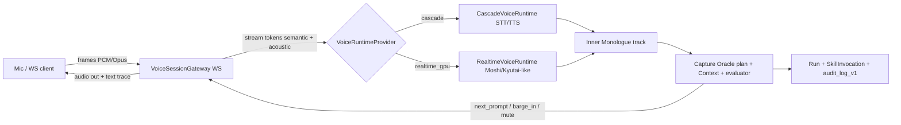

# Voice2Voice Structural Alignment Plan — Mimi / Moshi / KAME

Ce document cadre l'evolution structurelle du Voice2Voice Agentium pour les surfaces **synchronous chat** et **Expert Knowledge Capture** (`expert_knowledge_capture`).

Objectif : recuperer les gains principaux observes dans les architectures Mimi / Moshi / KAME — latence percue, barge-in, trace textuelle fiable, oracle contextualise — sans verrouiller l'application sur une dependance GPU. Le runtime HTTP actuel reste le fallback stable.

---

## 1. Pourquoi maintenant

Le runtime actuel (`backend/app/services/voice_runtime.py`) fonctionne en **request/response** sur `audio_bytes` :

- le navigateur envoie un bloc audio complet ;
- le backend transcrit ;
- Capture evalue le texte final ;
- le backend genere ensuite une reponse TTS.

C'est suffisant pour la demo, mais cela bloque les gains importants :

- latence ressentie entre parole expert et reaction Agentium ;
- interruption naturelle de la synthese vocale ;
- distinction entre piste textuelle de gouvernance et piste audio ;
- metriques fines par phase ;
- rampe GPU propre pour un runtime Moshi/Kyutai-like.

La proposition est donc structurelle : aligner **protocole, abstractions, oracle et traces**, puis garder `RealtimeVoiceRuntime` comme lane activable plus tard.

---

## 2. Architecture cible



Principes :

- **HTTP reste valide** pour `/api/v1/voice/*` et `/api/v1/knowledge-capture/*`.
- **WebSocket devient la voie rapide** pour les sessions vocales full-duplex.
- **Cascade reste le premier provider** ; le GPU arrive seulement derriere le meme protocole.
- **La trace textuelle reste source de gouvernance**, meme si le runtime futur manipule des tokens acoustiques.

---

## 3. Les 7 axes structurels

### A. Streaming Session Protocol

Nouvelle route WebSocket proposee :

```text
/api/v1/voice/sessions/{session_id}
```

Elle porte des events types :

| Event | Direction | Role |
| --- | --- | --- |
| `session.start` | client -> server | Declare runtime, codec, capability, context. |
| `audio.frame` | client -> server | Envoie des frames PCM/Opus. |
| `audio.out` | server -> client | Retour audio synthetise pour le prompt suivant. |
| `audio.endpoint` | client -> server/server -> client | Signale fin de segment parole. |
| `text.partial` | server -> client | Transcript incremental. |
| `text.final` | server -> client | Transcript final gouvernable. |
| `evaluation.delta` | server -> client | Score/verdict en cours si disponible. |
| `prompt.next` | server -> client | Relance ou question suivante. |
| `barge_in` | client/server -> server/client | Interruption detectee ou acceptee. |
| `runtime.metric` | server -> client | Latence, TTFB audio/text, VAD, provider. |
| `session.error` | server -> client | Erreur recuperable ou fatale. |
| `session.close` | bidirectionnel | Fin controlee. |

HTTP reste le fallback pour les tours non-streaming et pour les environnements ou WebSocket n'est pas disponible.

### B. Inner Monologue / Dual Track

Le runtime emet deux pistes synchronisees :

- `text` : trace gouvernance, evaluation, proposition Knowledge ;
- `audio` : rendu voix, interrompable et mesurable.

Pour `cascade`, la piste `text` vient du STT incremental ou du STT final. Pour `realtime_gpu`, elle pourra venir de tokens paralleles natifs.

Extension JSON proposee dans `ExpertCaptureSession.transcript[]` :

```json
{
  "id": "turn-live-1",
  "speaker": "expert",
  "text": "Transcript final corrige ou accepte",
  "text_partials": ["Transcript", "Transcript partiel"],
  "audio_ref": "s3://or/local/ref-if-retained",
  "source_event_id": "evt-...",
  "latency_ms": {
    "first_text": 420,
    "final_text": 1550,
    "first_audio": 690
  },
  "barge_in": false,
  "created_at": "..."
}
```

Pas de nouvelle table obligatoire en J1 : les extensions restent dans les JSON existants (`transcript`, `metrics`) et dans le ledger `ExpertCaptureEvent`.

### C. Knowledge Oracle Binding

L'oracle est le contrat commun qui lie la voix au contexte Agentium :

- plan d'entretien courant ;
- question active ;
- gaps cibles ;
- `Context` / Knowledge scope ;
- evaluation de la reponse ;
- garde-fous de scope ;
- decision : continuer, relancer, corriger, proposer, accepter.

Implementation cascade J2 :

- `_find_question(...)` pour l'ancre du plan ;
- `evaluate_expert_answer(...)` pour le verdict ;
- retrieval KB via le pipeline existant ;
- production de `next_prompt`, `barge_in`, `mute`, `proposal_requested`.

Le meme contrat devra etre respecte par un runtime GPU.

### D. Codec Abstraction Slot

Etendre `VoiceRuntimeProvider` avec des primitives streaming :

```python
@dataclass
class VoiceToken:
    kind: Literal["semantic", "acoustic", "text", "control"]
    payload: bytes | str | dict
    ts_ms: int
    confidence: float | None = None
    meta: dict[str, Any] | None = None


class VoiceRuntimeProvider(Protocol):
    async def transcribe(...): ...
    async def create_speech(...): ...
    async def stream_in(self, frames: AsyncIterator[bytes]) -> AsyncIterator[VoiceToken]: ...
    async def stream_out(self, tokens: AsyncIterator[VoiceToken]) -> AsyncIterator[bytes]: ...
```

`CascadeVoiceRuntime` peut implementer ce contrat avec un fallback texte. `RealtimeVoiceRuntime` pourra utiliser une pile Mimi-like ou Moshi-like sans changer le gateway.

### E. Barge-In / VAD / Endpointing First-Class

J2 introduit un etat explicite :

- `vad.speech_start`
- `vad.speech_end`
- `audio.endpoint`
- `barge_in.detected`
- `barge_in.accepted`
- `tts.interrupted`

Pour cascade :

- VAD serveur possible via `webrtcvad` ou `silero` ;
- endpointing sur silence + duree maximale ;
- interruption TTS cote navigateur + event serveur.

Pour GPU :

- VAD / interruption peuvent etre natifs, mais doivent publier les memes events.

### F. Latency Budget + Gouvernance

Champ de configuration propose :

```json
{
  "execution_profile": {
    "voice_sla_ms": {
      "time_to_first_text": 700,
      "time_to_first_audio": 1200,
      "turn_end_to_prompt": 1800
    }
  }
}
```

Metriques minimales par session :

- `time_to_first_text_ms`
- `time_to_final_text_ms`
- `time_to_first_audio_ms`
- `turn_end_to_prompt_ms`
- `barge_ins`
- `transcript_correction_rate`
- `audio_endpoint_count`
- `runtime_provider`

Gouvernance :

- chaque transition oracle produit un event auditable ;
- aucun audio brut conserve sans `SkillInvocation` correspondant ;
- `Run.metrics` et `ExpertCaptureSession.metrics` portent les agrégats ;
- `audit_log_v1` trace les decisions sensibles (`barge_in`, `proposal_created`, `review_decision`, deny IAM).

### G. Lane Switch GPU

`RealtimeVoiceRuntime` reste derriere le meme `VoiceRuntimeProvider`.

Candidats :

- serveur Kyutai/Moshi ;
- pile interne type whisper-streaming + TTS faible latence ;
- codec Mimi-like si le besoin de tokens acoustiques devient concret.

Le choix GPU est differe. La bascule doit etre decidee par metriques et tests utilisateur, pas par attrait technologique.

---

## 4. Contrats proposes

### 4.1 WS Event Envelope

```ts
type VoiceSessionEvent = {
  id: string;
  session_id: string;
  type:
    | 'session.start'
    | 'audio.frame'
    | 'audio.out'
    | 'audio.endpoint'
    | 'text.partial'
    | 'text.final'
    | 'evaluation.delta'
    | 'prompt.next'
    | 'barge_in'
    | 'runtime.metric'
    | 'session.error'
    | 'session.close';
  ts_ms: number;
  sequence: number;
  payload: Record<string, unknown>;
};
```

### 4.2 `session.start`

```json
{
  "runtime": "cascade",
  "capability": "expert_knowledge_capture",
  "workspace_slug": "andritz",
  "context_id": "ctx-...",
  "system_id": "sys-...",
  "codec": {
    "input": "pcm16",
    "sample_rate": 16000,
    "channels": 1
  },
  "mode": "conversation_only"
}
```

### 4.3 `audio.frame`

```json
{
  "chunk_id": "client-frame-42",
  "encoding": "pcm16",
  "sample_rate": 16000,
  "duration_ms": 40,
  "bytes_b64": "..."
}
```

### 4.4 `text.final`

```json
{
  "turn_id": "turn-live-1",
  "speaker": "expert",
  "text": "Quand la machine vibre apres maintenance...",
  "confidence": 0.91,
  "latency_ms": 1540,
  "source": "cascade_stt"
}
```

### 4.5 `prompt.next`

```json
{
  "turn_id": "turn-live-1",
  "question_id": "q-02",
  "text": "Dans quels cas la procedure documentee ne suffit-elle pas ?",
  "reason": "previous_answer_sufficient",
  "speak": true,
  "audit_event_id": "evt-..."
}
```

### 4.6 `runtime.metric`

```json
{
  "provider": "cascade",
  "metric": "time_to_first_text",
  "value_ms": 480,
  "turn_id": "turn-live-1"
}
```

---

## 5. Sequencement

### J1 — Protocole + Inner Monologue cascade

Objectif : rendre la session vocale streamable sans GPU.

Travaux :

- ajouter `VoiceSessionGateway` WebSocket ;
- implementer le protocole d'events ;
- brancher `CascadeVoiceRuntime` en mode streaming-compatible ;
- enrichir `transcript[]` et `metrics` ;
- consommer le WS dans `knowledge-capture.component.ts` ;
- garder HTTP en fallback.

Critere de sortie :

- une session conversation-only peut envoyer des frames et recevoir `text.partial`, `text.final`, `prompt.next`, `runtime.metric` ;
- les anciennes routes continuent de fonctionner.

### J2 — Oracle structure + barge-in

Objectif : rapprocher la voix de la logique Knowledge Capture.

Travaux :

- extraire un `CaptureOracle` autour du plan, du contexte et de l'evaluateur ;
- publier les transitions oracle ;
- ajouter endpointing/VAD serveur ;
- gerer `barge_in` et interruption TTS ;
- auditer les decisions oracle.

Critere de sortie :

- Agentium relance avec le bon `question_id` et le bon contexte ;
- un expert peut interrompre la synthese sans casser le tour ;
- les metriques de barge-in et correction transcript sont visibles.

### J3 — Codec slot + lane GPU pilote

Objectif : tester un runtime full-duplex sans changer les surfaces produit.

Travaux :

- finaliser `VoiceToken` ;
- implementer `RealtimeVoiceRuntime` derriere le provider ;
- brancher un backend GPU pilote ;
- comparer cascade vs GPU sur les memes metriques.

Critere de sortie :

- go/no-go base sur fluidite utilisateur, qualite de relance et gouvernance.

---

## 6. Criteres de bascule Cascade -> GPU

La lane GPU ne doit etre activee que si elle ameliore l'experience sans degrader la qualite de capture.

Seuils proposes :

| Critere | Cascade baseline | GPU attendu |
| --- | --- | --- |
| Time to first text | mesure J1 | -30 % minimum |
| Time to first audio | mesure J1 | -30 % minimum |
| Barge-in successful | mesure J2 | +20 % minimum |
| Transcript correction rate | mesure J1/J2 | ne doit pas augmenter |
| Proposal fact usefulness | revue humaine | ne doit pas baisser |
| Audit completeness | 100 % transitions sensibles | 100 % aussi |

Decision :

- **Go GPU** si la fluidite augmente et que la correction / gouvernance restent stables.
- **No-go GPU** si le runtime est plus fluide mais degrade la proposition Knowledge ou complique l'audit.
- **Continue cascade** si J1/J2 suffisent pour la demo et les besoins clients.

---

## 7. Impact par fichier

### Backend

| Fichier | Impact |
| --- | --- |
| `backend/app/services/voice_runtime.py` | Etendre `VoiceRuntimeProvider` avec `VoiceToken`, `stream_in`, `stream_out`; garder `transcribe` / `create_speech`. |
| `backend/app/api/v1/endpoints/voice.py` | Ajouter la route WS `/voice/sessions/{session_id}` ou deleguer vers un router dedie. |
| `backend/app/services/voice_session_gateway.py` | Nouveau gateway : handshake, events, runtime mux, metrics, lifecycle. |
| `backend/app/services/knowledge_capture.py` | Enrichir `transcript`, `metrics`, reutiliser evaluation/oracle sans casser REST. |
| `backend/app/models/expert_capture.py` | Pas de migration J1 : extensions JSON uniquement. |
| `backend/app/services/skills_registry/seed.py` | Optionnel : ajouter `voice_session_v1` comme skill orchestrateur WS. |
| `backend/app/services/audit_logger.py` | Reutilisation ; pas de changement obligatoire. |

### Frontend

| Fichier | Impact |
| --- | --- |
| `frontend-ng/src/app/core/api.service.ts` | Ajouter client WS ou helper `openVoiceSession(...)`; garder HTTP. |
| `frontend-ng/src/app/features/knowledge/knowledge-capture.component.ts` | Consommer events WS, afficher partial/final, barge-in, metrics, fallback HTTP. |
| `frontend-ng/src/app/features/chat/*` | A aligner apres Capture, pour la surface synchronous chat. |

---

## 8. Non-goals V1

- Pas de dependance Moshi obligatoire.
- Pas de retention audio brute par defaut.
- Pas de refonte du moteur Knowledge Capture.
- Pas de nouvelle table pour transcript en J1.
- Pas de remplacement des routes REST existantes.
- Pas de bascule GPU sans metriques J1/J2.

---

## 9. Definition of Done J1

- Route WS disponible et protegee par auth/IAM workspace.
- `CascadeVoiceRuntime` expose un comportement streaming-compatible.
- `knowledge-capture.component.ts` peut utiliser WS en conversation-only.
- Les routes REST existantes restent vertes.
- `ExpertCaptureSession.metrics` inclut les premieres metriques de latence.
- `transcript[]` conserve partial/final/audio_ref/latency quand disponible.
- Build frontend et compile backend OK.
- Aucun changement de schema requis pour J1.

---

## 10. Decision actuelle

Le plan est valide comme **cadrage structurel**.

Prochaine action uniquement sur demande explicite : implementation **J1 — Protocole + Inner Monologue cote cascade**.

---

## 11. Canonisation multi-provider Agentium

La canonisation V2V ajoute une contrainte produit durable : **OpenAI Realtime est une implementation de reference, pas une dependance obligatoire**. Le contrat Agentium reste compatible avec les lanes locales ou open-source pour STT, TTS, traduction et speech-to-speech.

### Providers canoniques

| Provider | Usage | Transport par defaut | Statut |
| --- | --- | --- | --- |
| `cascade_openai` | STT batch + oracle Agentium + TTS segmente | `backend_ws` | fallback production |
| `openai_realtime` | speech-to-speech, transcription live, traduction, tool calls | `webrtc` ou `backend_ws` | optionnel / flag |
| `local_stt` | Whisper/faster-whisper/whisper.cpp via service local | `backend_ws` | contrat HTTP |
| `local_tts` | Piper, XTTS, Kokoro ou equivalent via service local | `backend_ws` | contrat HTTP |
| `local_realtime` | future lane locale voice-to-voice | `backend_ws` ou WS local | contrat reserve |
| `realtime_gpu` | runtime GPU Moshi/KAME-like | WS specialise | experimental |

Chaque provider declare explicitement ses capabilities : `batch_transcription`, `streaming_transcription`, `tts`, `speech_to_speech`, `translation`, `barge_in`, `tool_calls`. Une action non supportee doit produire `provider_capability_unsupported`, jamais un echec opaque.

### Resolution et fallback

La resolution est standardisee dans cet ordre :

1. override local au node Flow Builder ;
2. override runtime voice du System ;
3. configuration du Workspace ;
4. default global.

Le fallback technique est explicite : `openai_realtime` peut revenir vers `cascade_openai` ou un provider local configure. Les settings Docker exposent `VOICE_RUNTIME_DEFAULT_PROVIDER`, `VOICE_RUNTIME_ALLOWED_PROVIDERS`, `VOICE_RUNTIME_FALLBACK_PROVIDERS` et les endpoints locaux `LOCAL_STT_ENDPOINT_URL`, `LOCAL_TTS_ENDPOINT_URL`, `LOCAL_REALTIME_ENDPOINT_URL`.

### Skills et capability

Les briques voice sont maintenant des skills reutilisables :

- `voice_realtime_session_v1`
- `voice_realtime_transcribe_v1`
- `voice_realtime_speak_v1`
- `voice_realtime_translate_v1`
- `voice_oracle_turn_v1`
- `voice_transcribe_v1` et `voice_tts_v1` restent les fallbacks cascade.

La capability universelle `voice2voice_interaction` regroupe ces skills. `expert_knowledge_capture` consomme ces primitives au lieu de garder une voice loop implicite, et le Flow Builder expose les nodes Voice correspondants.

### Gouvernance

Les events Agentium sont provider-neutral : `text.partial`, `text.final`, `audio.out`, `translation.partial`, `translation.final`, `barge_in`, `oracle.action`, `runtime.metric`. Les metriques doivent inclure provider, modele, transport, latence, fallback et confiance transcript. Aucun stockage audio brut par defaut ; une policy workspace explicite sera requise si ce besoin apparait.

### Chat canonique

Le Chat consomme la meme couche via `/api/v1/voice/runtimes`, `/api/v1/voice/transcribe`, `/api/v1/voice/synthesize` et, en mode `Session`, `/api/v1/voice/sessions/{session_id}`. L'UI expose le provider, le transport `Batch` ou `Session`, l'auto-send du transcript final et les fallbacks effectifs, afin que le chat reste une surface generale tout en reutilisant les primitives `voice2voice_interaction`.
