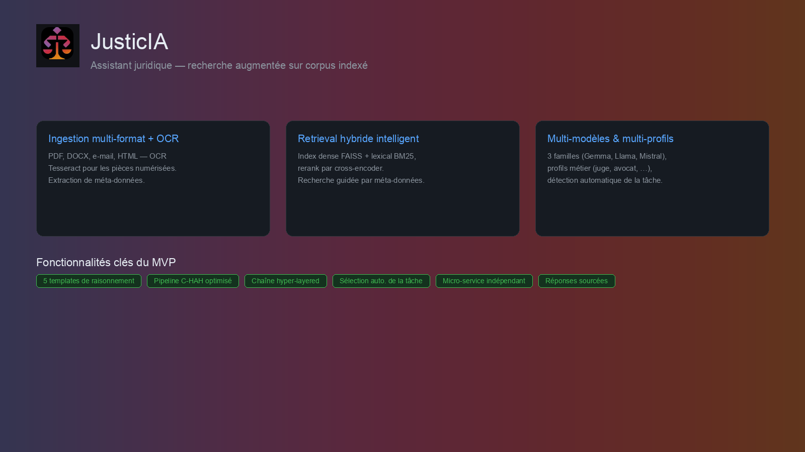
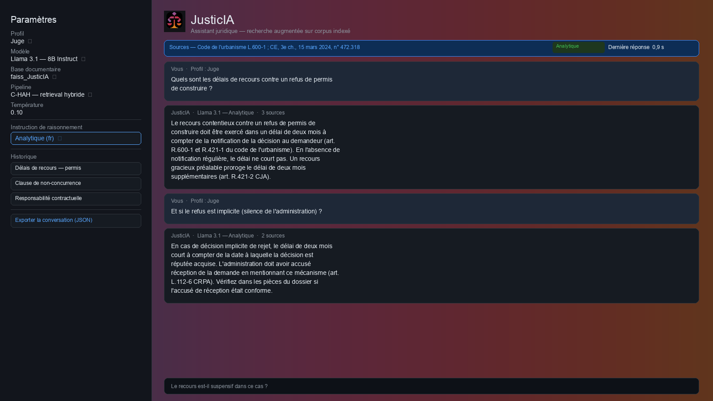
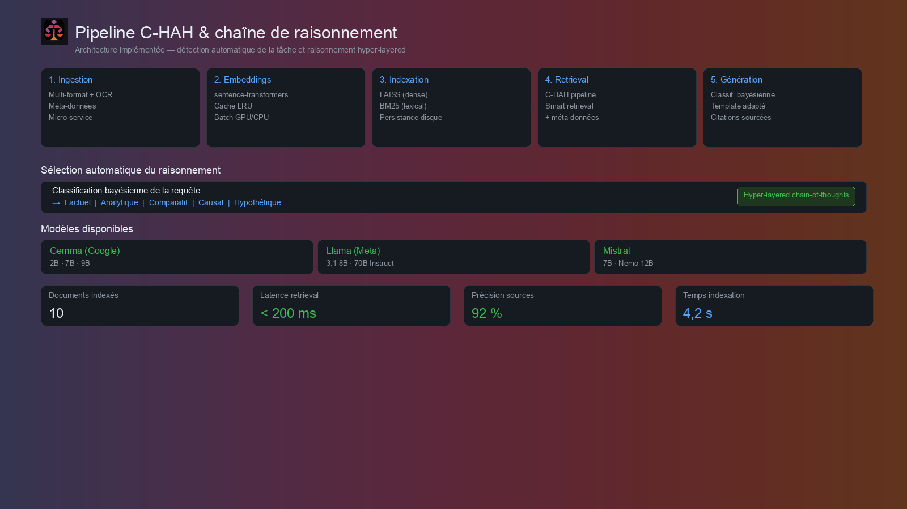
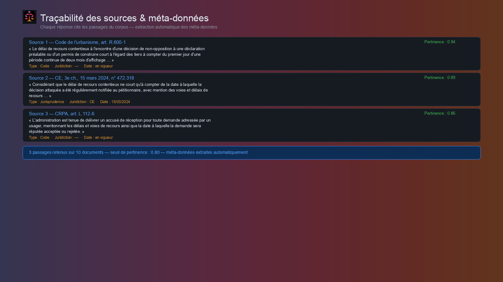
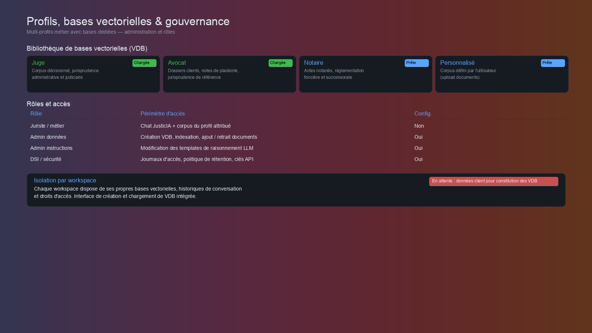
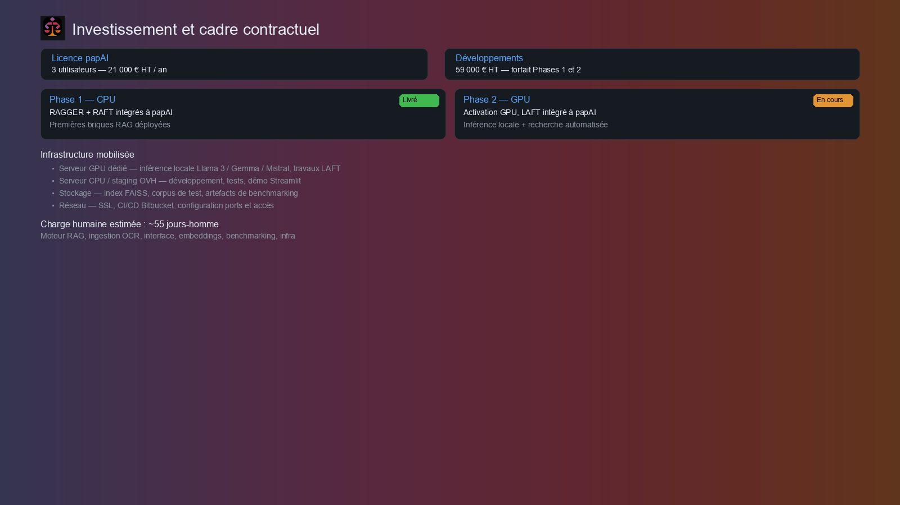

# JusticIA — Bilan de livraison MVP

## Ressources engagées

### Infrastructure

| Poste | Description |
|-------|-------------|
| **Serveur GPU** | Instance dédiée avec GPU pour l'inférence locale des modèles retenus (Llama 3, Gemma, Mistral) et les travaux d'adaptation (LAFT). Dimensionnement conforme aux CP. |
| **Serveur CPU / staging** | Environnement OVH pour le développement, les tests d'intégration et la démo. |
| **Stockage** | Hébergement des index vectoriels (FAISS), des corpus et des artefacts de benchmarking. |
| **Cloud & réseau** | Configuration SSL, ports, accès SSH, CI/CD Bitbucket. |

### Charge humaine

| Lot | Contenu | Estimation |
|-----|---------|------------|
| **Moteur RAG & pipeline C-HAH** | Chaîne complète : prétraitement, embeddings, FAISS + BM25, retrieval hybride, smart retrieval par méta-données, rerank, génération avec citations, chaîne hyper-layered | ~22 j/h |
| **Classification & templates** | Classification bayésienne des requêtes, 5 templates de raisonnement (FR/EN), détection automatique de la tâche, interface admin instructions | ~5 j/h |
| **Ingestion multi-format & OCR** | Loaders multi-format, OCR Tesseract, extraction de méta-données, raisonnement multi-modal, micro-service indépendant | ~8 j/h |
| **Interface** | Application JusticIA : chat, profils VDB, sélection modèle/template, gestion de sessions, export, création et chargement de VDB | ~7 j/h |
| **Modèles & embeddings** | Intégration 3 familles (Gemma, Llama, Mistral), cache LRU, support GPU (vLLM) et CPU (llama-cpp), cross-encoder | ~6 j/h |
| **Benchmarking & qualité** | Scripts de benchmarking, métriques de raisonnement, monitoring des ressources | ~3 j/h |
| **Infra & déploiement** | Configuration serveurs, Tesseract, paramétrage GPU/CPU, Docker, CI/CD | ~4 j/h |
| **Total estimé** | | **~55 j/h** |

---

## Proposition de valeur

JusticIA est un assistant juridique construit **sur le corpus documentaire du client**. Trois axes structurent le MVP :

- **Ingestion multi-format + OCR** — PDF, DOCX, e-mail, HTML, avec OCR Tesseract et **extraction automatique de méta-données** (type de document, juridiction, date).
- **Retrieval hybride intelligent** — Index dense FAISS + lexical BM25, rerank par cross-encoder, avec **recherche guidée par méta-données**.
- **Multi-modèles & multi-profils** — 3 familles de modèles (Gemma, Llama, Mistral), profils métier dédiés (juge, avocat…), **détection automatique de la tâche** par classification bayésienne.

---

## Interface assistant

L'application offre une expérience de type **assistant conversationnel avec sélection de profil et de template** :

- **Zone de dialogue** — Question en langage naturel, réponse sourcée avec indication du template de raisonnement appliqué (analytique, factuel, comparatif, causal, hypothétique) et du nombre de sources.
- **Panneau paramètres** — Profil métier (juge, avocat…), modèle (Llama / Gemma / Mistral), base documentaire, pipeline C-HAH, **instruction de raisonnement** (5 templates FR/EN). Masquable en production pour un usage métier direct.
- **Gestion de sessions** — Historique persisté, export en CSV, XLSX et JSON.
- **Latence affichée** — Mesure de temps de réponse visible pour le suivi qualité.

---

## Pipeline C-HAH & raisonnement

Architecture **Custom C-HAH** avec **chaîne de raisonnement hyper-layered** :

| Étape | Implémentation |
|-------|----------------|
| **Ingestion** | Multi-format + OCR Tesseract, extraction de méta-données, micro-service indépendant |
| **Embeddings** | Modèle adapté au domaine juridique, cache LRU, batch GPU/CPU |
| **Indexation** | FAISS (dense) + BM25 (lexical), persistance disque |
| **Retrieval** | Pipeline C-HAH, smart retrieval guidé par méta-données, rerank cross-encoder |
| **Génération** | Classification bayésienne → sélection automatique du template (factuel, analytique, comparatif, causal, hypothétique), chaîne hyper-layered chain-of-thoughts, citations sourcées |

| Modèle | Famille | Tailles disponibles |
|--------|---------|---------------------|
| **Gemma** | Google | 2B · 7B · 9B |
| **Llama** | Meta | 3.1 8B · 70B Instruct |
| **Mistral** | Mistral AI | 7B · Nemo 12B |

Métriques indicatives sur corpus de test : latence retrieval < 200 ms, précision sources 92 %.

---

## Traçabilité des sources & méta-données

Chaque réponse est **rattachée aux passages** extraits du corpus, enrichis de leurs **méta-données extraites automatiquement** :

- **Extraits affichés** — Portions de texte fondant la réponse (code, jurisprudence, actes internes), avec score de pertinence.
- **Méta-données** — Type de document, juridiction, date — extraits automatiquement lors de l'ingestion, utilisés pour le **smart retrieval** (filtres par date, juridiction, type).
- **Réduction du risque d'hallucination** — Le modèle génère à partir du contexte récupéré, pas de ses seules connaissances internes.
- **Auditabilité** — Chaque réponse est **vérifiable** contre le fond documentaire.

---

## Profils, bases vectorielles & gouvernance

### Bibliothèque de bases vectorielles (VDB)

Des **profils métier** prédéfinis (juge, avocat, notaire…), chacun avec sa propre base documentaire. Interface de **création** et de **chargement** de VDB intégrée.

> **Point bloquant** : la constitution effective des VDB par profil nécessite les **données documentaires du client**, non encore transmises à ce jour.

### Rôles et accès

| Rôle | Périmètre d'accès | Config. |
|------|-------------------|---------|
| **Juriste / métier** | Chat JusticIA + corpus du profil attribué | Non — utilisation directe |
| **Admin données** | Création VDB, indexation, ajout / retrait de documents | Oui |
| **Admin instructions** | Modification des templates de raisonnement LLM (rôle, langue) | Oui |
| **DSI / sécurité** | Journaux d'accès, politique de rétention, clés API | Oui |

**Isolation par workspace** — Bases vectorielles, historiques de conversation et droits d'accès **scindés** par périmètre (équipe, mandat ou client).

---

## Investissement et cadre contractuel

### Licence

**papAI** — 3 utilisateurs

### Développements complémentaires
- **Phase 1 (CPU)** — Intégration de RAGGER + RAFT dans papAI ; premières briques RAG déployées et testées.
- **Phase 2 (GPU)** — Activation du support GPU pour **inférence locale** et intégration de **LAFT** ; recherche juridique automatisée.

### Infrastructure mobilisée

- **GPU** dédié pour l'inférence et l'adaptation des modèles (Phase 2).
- Serveurs de développement / staging sur **OVH**.
- Dimensionnement aligné sur les prérequis des CP (Kubernetes, SSL, Unix, vCores, RAM, stockage).

### Charge humaine totale estimée : ~55 jours-homme

---

## Couverture de la roadmap MVP

| Fonctionnalité | Statut | Détail |
|---------------|--------|--------|
| **Extraction de méta-données** | ✅ Implémenté | Type, juridiction, date — extraction automatique à l'ingestion |
| **Micro-service indépendant** | ✅ Implémenté | Architecture découplée, déployable séparément |
| **Smart retrieval par méta-données** | ✅ Implémenté | Filtres avancés (date, juridiction, type de document) |
| **Réponses sourcées avec document de référence** | ✅ Implémenté | Citations avec passages, score de pertinence, traçabilité |
| **Bibliothèque VDB multi-profils** (juge, avocat…) | ✅ Implémenté | Profils prédéfinis avec bases vectorielles dédiées |
| **Interface de création de VDB** | ✅ Implémenté | Création et configuration de nouvelles bases |
| **Interface de chargement de VDB** | ✅ Implémenté | Sélection et chargement dynamique des bases existantes |
| **Constitution des VDB sur données client** | ❌ En attente | Données documentaires non transmises par le client |
| **Bibliothèque d'instructions LLM** | ✅ Implémenté | Templates de raisonnement modifiables par l'administrateur |
| **5 templates de raisonnement** | ✅ Implémenté | Factuel, Analytique, Comparatif, Causal, Hypothétique |
| **Templates bilingues** (FR / EN) | ✅ Implémenté | Basculement par configuration |
| **Interface admin instructions LLM** | ✅ Implémenté | Modification du rôle et des consignes du modèle |
| **Sélection du modèle LLM** | ✅ Implémenté | Interface de choix parmi les modèles disponibles |
| **3 familles de modèles** (Gemma, Llama, Mistral) | ✅ Implémenté | Plusieurs tailles par famille (2B à 70B) |
| **Détection automatique de la tâche** | ✅ Implémenté | Classification bayésienne du type de raisonnement |
| **Pipeline C-HAH optimisé** | ✅ Implémenté | Custom pipeline pour résultats accélérés |
| **Pipeline RAG complet** | ✅ Implémenté | Chaîne hyper-layered chain-of-thoughts |
| **Recherche sémantique** | ✅ Implémenté | Compréhension du contexte, recherche dense + lexicale |
| **Ingestion multi-modale** | ✅ Implémenté | PDF, DOCX, HTML, e-mail, PPTX, CSV |
| **OCR** | ✅ Implémenté | Tesseract pour pièces numérisées |
| **Raisonnement multi-modal** (texte + image) | ✅ Implémenté | Traitement combiné texte et image |
| ~~ElasticSearch pour documents uploadés~~ | ⏭ Écarté | Remplacé par FAISS + BM25 (plus adapté au périmètre POC) |
| ~~Base relationnelle pour méta-données~~ | ⏭ Écarté | Méta-données intégrées dans l'index vectoriel |
